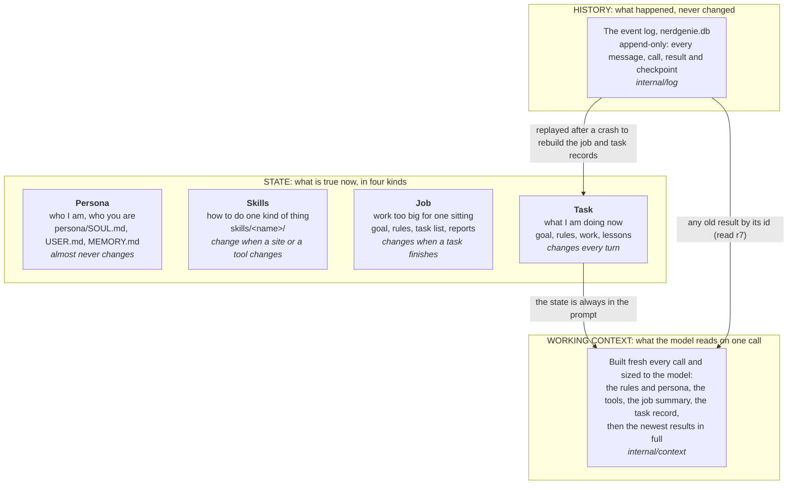
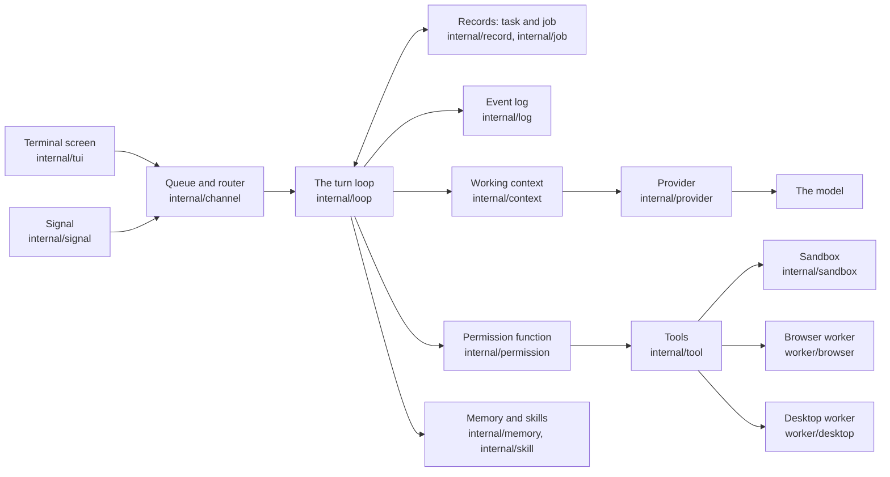
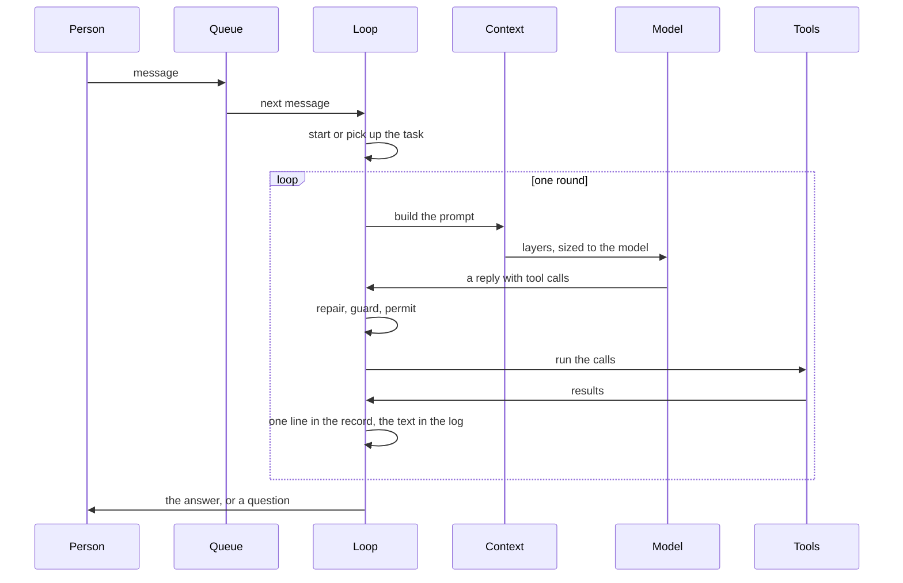
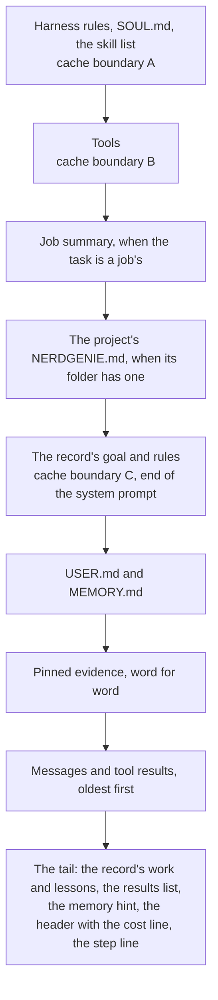

# Nerd Genie: how the code is put together

This page is for a person or an AI agent who wants to understand the code and then knows where to look. It says what each part is for, how the parts fit, and where the facts live, in plain words. It describes the code as it is today. What was built when is in `docs/ARCHITECTURE_HISTORY.md`, and why the design is the way it is in `docs/NERDGENIE_PLAN.md`. `NERDGENIE.md` explains the same system for a reader who does not want the code.

## 1. What Nerd Genie is, and its shape

Nerd Genie is an AI agent that runs on a Linux machine. A person talks to it in a terminal or over Signal. It works with any language model, local or cloud, and it keeps a short record of every task instead of re-reading its whole conversation on every call. It drives a real Chrome window and the desktop the way a person does. The agent is one Go program, `nerdgenie`, with two small TypeScript workers beside it, one for the browser and one for the desktop.



The diagram reads top to bottom. The history is the log: everything that ever happened, written once and never changed. The state is what is true right now, kept in four kinds that change at four different speeds, and the records are rebuilt from the log after a crash. The working context is the prompt for one call: the harness builds it fresh every time from the state, adds the newest results in full, and sends it to the model. Whatever the model says and whatever the tools return goes into the log, and the record is updated from it. The model never reads the log; when it needs an old result it asks for it by its id.

The same shape in the code, by package:



A message comes in on a channel and goes into the queue. The loop takes it, builds the prompt through the context package and sends it to the model through a provider, and runs the tool calls the model asks for, each one checked by the permission function first. Every tool result gets one line in the record and its whole text in the log.

Three ideas hold the whole thing together.

- **The history, the state and the working context are three different things.** The history is the event log, never changed. The state is what is true now, in four kinds that change at four speeds: the persona, the skills, the job, and the task, whose record is one to three thousand tokens shaped like an operations order. The working context is the prompt for one call, built fresh each time from the state with the newest results in full, and sized to the model. Nothing is ever summarised and nothing in the log is ever rewritten.
- **The harness writes what it can verify; the model writes what needs judgement.** The situation, the results, the test state and the corrections are written by code. The why, the done list, the plan, the decisions and the failures are written by the model through the `task` tool, under rules the record enforces.
- **Every interface two packages share lives in `internal/contract`,** and every fake in `internal/testkit` is written against the same lines as the real thing.

## 2. The folders

```
nerdgenie/
├── cmd/nerdgenie/          The one binary. One file per subcommand; main.go holds the table,
│                           serve.go wires the packages together.
├── internal/               The Go packages, one job each, listed in section 3.
│   ├── contract/           Every shared interface, type and constant. No dependencies.
│   ├── testkit/            Every fake, the golden-file helper, the forty-step fixture.
│   ├── log/                The append-only event log in SQLite.
│   ├── record/             The task record and the job record: parse, print, rules, checkpoints.
│   ├── loop/               One turn: orient, call, guard, permit, run, update, repeat.
│   ├── context/            The prompt for one call, built in layers and sized to the model.
│   ├── orientation/        The block a fresh window opens with: the folder, the ports, the newest results, the documents.
│   ├── workorder/          An ask under six headings read into the record's parts.
│   ├── markdown/           A Markdown text cut into sections by heading.
│   ├── tool/               The tool registry and the twenty built-in tools, one folder each.
│   ├── browser/, desktop/  The Go sides of the two workers: start, supervise, pace, log in, hand off.
│   ├── provider/           Anthropic, OpenAI-compatible, and the command-line programs, with retries and the fallback chain.
│   ├── repair/             The tool calls found in a reply, however the model wrote them.
│   ├── channel/, signal/, tui/, command/
│   │                       The queue, the router, the event stream, the socket; Signal; the screen; the slash commands.
│   ├── job/, memory/, skill/
│   │                       Jobs and their scheduler; what the agent knows; saved procedures.
│   ├── permission/, sandbox/, vault/
│   │                       Allow, ask or deny; the fence a command runs in; the encrypted secrets.
│   ├── reliability/, update/, replay/
│   │                       Crash recovery, backups, the watchdog; updates with rollback; a logged task re-run as a test.
│   ├── config/, clock/, lint/
│   │                       The configuration file and home layout; the clock; the plain-English style checker.
├── worker/browser/         The TypeScript browser worker: Chrome through Playwright, PROTOCOL.md is its contract.
├── worker/desktop/         The TypeScript desktop worker: the screen, mouse and keyboard, PROTOCOL.md is its contract.
├── scripts/                The Go programs and shell scripts behind make: the gate, the style checker, the repo map,
│                           the release, the run report, the nightly set, the fixture site, the installer.
├── test/                   The functional suite, which drives a real serve through the socket; the fixtures; the replays.
├── skills/                 The skills that ship with a fresh home.
├── docs/                   The design, the comparison of other agents, the research, the proposals, the build log.
├── NERDGENIE.md            The plain-words explanation, with a check table tying every claim to a test.
├── PROMPT_TEMPLATE_GUIDE.md, EX_PROMPT_*.md
│                           How to write an ask, and seven worked examples.
├── INSTALL.md, SETUP.md, TESTING.md, CONTRIBUTING.md, CLAUDE.md
│                           Getting it onto a machine, using it, testing it, changing it, the rules an AI agent follows here.
└── REPO_MAP.md             Where every file is. Generated by make repo-map; never edited by hand.
```

## 3. The packages and their jobs

Packages are listed in build order. A package may import only packages listed above it. Anything two packages both need is in `internal/contract`, so no two packages ever define the same interface, and a fake and a real implementation are written against the same lines.

| Package | Job |
|---|---|
| `internal/contract` | Every interface, type, and constant that crosses a package boundary, with no dependencies |
| `internal/codemap` | Reads the functions, classes, methods and constants a source file defines, each with the first sentence of its comment, and prints a folder's map in the shape an agent can find code by, with no dependencies | 7 September 2026, built |
| `internal/markdown` | Cuts a Markdown text into sections by heading, finds one, replaces one, with no dependencies, so the harness can hand the model one part of a document |
| `internal/workorder` | Reads an ask written under the six headings of `PROMPT_TEMPLATE_GUIDE.md` into the record's parts: the goal, where, the done lines with their checks, the rules, the tasks with the Details each names, the Details sections; imports `markdown` |
| `internal/testkit` | Every fake, the golden-file helper, and the forty-step fixture data |
| `internal/log` | The append-only event log in SQLite |
| `internal/record` | The task record and the job record: parse, print, enforce their rules, checkpoint |
| `internal/config` | The configuration file and the home folder layout |
| `internal/clock` | The real clock behind `contract.Clock`: the machine's time, a sleep that stops with its context, a ticker |
| `internal/lint` | The plain-English style checker, used only by `make check` |
| `internal/provider` | Turn a prompt into a streamed reply through the Anthropic API, the OpenAI-compatible API, or a vendor's command-line program on a subscription, with retries and the fallback chain |
| `internal/repair` | Find the tool calls in a model reply, however the model wrote them |
| `internal/context` | Build the working context from the layers, sized to the model |
| `internal/orientation` | The block a fresh window opens with: the folder, the listening ports, the newest results, and the project's documents by name |
| `internal/loop` | Run one turn: orient, call, guard, permit, run, update, repeat; the done-check and the after-action review |
| `internal/tool` | The tool registry and the twenty built-in tools, one folder each under it |
| `internal/permission` | Decide allow, ask, or deny for a tool call |
| `internal/sandbox` | Run a command straight on the machine, or inside bwrap and Landlock when the setting asks |
| `internal/channel` | The queue, the router, the event stream, and the local socket |
| `internal/command` | The command registry, the core slash commands, and the work behind `nerdgenie init`, `doctor`, `install`, and `uninstall` |
| `internal/tui` | The terminal screen |
| `internal/signal` | The signal-cli client, linking, pairing, and the Signal channel |
| `internal/vault` | The encrypted secret store, the resolver, TOTP, the sudo password, redaction |
| `internal/reliability` | Leases, ledgers, sentinels, the breaker, the watchdog feed, backups |
| `internal/memory` | The memory files, the search index, the hint, and zero-token capture |
| `internal/skill` | The skill folder format, loading, learning, replay |
| `internal/skill/browser` | Recording a browser procedure, replaying it with no model, healing one step, and the visual check |
| `internal/browser` | The Go side of the browser: worker lifecycle, login, handoff |
| `internal/job` | Job records, the task list, and the scheduler |
| `internal/desktop` | The Go side of the desktop worker |
| `internal/update` | Update, rollback, migrations |
| `internal/replay` | Re-run any logged task as a test, and the nightly self-check |
| `scripts/*` | The Go programs behind `make`: the style checker's runner, the repository map, the gate's checks, the release, the run report, the fixture site |
| `cmd/nerdgenie` | The binary; one file per subcommand; `main.go` and `serve.go` wire everything together |
| `worker/browser` | The TypeScript browser worker |
| `worker/desktop` | The TypeScript desktop worker |

The binary's subcommands, from the table in `main.go`: `version`, `help`, `init`, `doctor`, `serve`, `run`, `tui`, `install`, `uninstall`, `signal`, `backup`, `restore`, `replay`, `update`, and `askpass`, plus a hidden helper the sandbox starts for itself. Typing `nerdgenie` with nothing after it opens the screen.

## 4. Data on disk

Everything about one Nerd Genie lives in one folder, the **home**, `~/.nerdgenie` unless `NERDGENIE_HOME` says otherwise. `internal/contract/home.go` names every path in it, and `nerdgenie init` makes it.

| Path | What it holds |
|---|---|
| `config.toml` | Every setting, one commented line each: the models and the fallback chain, the folders the agent may work in, the sandbox setting, the ask-me-first list, the caps |
| `nerdgenie.db` | The event log, the memory index, the queue, and the job claims, in one SQLite file |
| `persona/SOUL.md`, `persona/USER.md`, `persona/MEMORY.md` | Who the agent is, facts about the user, facts about the world; the last two have hard size limits |
| `memory/` | Dated notes that facts move into when a memory file is full |
| `skills/<name>/` | One folder per saved procedure: `SKILL.md`, `steps.md` or a script, `test.md`, `CHANGELOG.md` |
| `tools/` | Executables the person adds; each becomes a tool the model can call |
| `vault.age`, `vault.key` | The encrypted secrets and the key only the agent's own user account can read |
| `browser/` | Chrome's own profile, never the person's daily one |
| `inbox/` | Files that arrived over a channel, where the model can read them |
| `run/` | The socket the screens attach to, the lock, spill files for long results, screenshots, the crash sentinel |
| `releases/`, `backups/`, `signal/` | Installed versions with a link to the current one; encrypted backups; signal-cli's state and the pairing codes |

**The event log is the truth.** `internal/log` keeps one table of events, each with a sequence number that only grows, a time, the task it belongs to, its kind, and its own fields as JSON. The kinds are `message`, `tool call`, `tool result`, `permission decision`, `file change`, `record change`, `checkpoint`, `reply`, and `question`, which is a question the harness asked the model with the tools off, its answer, and what the harness did with it. Nothing is ever changed or removed. The full text of every tool result lives here, which is what lets a record hold one line per result and still lose nothing: `read r7` fetches the text back.

**Records are checkpoints in the log.** `internal/record` prints a task record or a job record as text in the four parts of an operations order (goal, rules, work, lessons) and saves every change as a numbered checkpoint event. A task that waits for days holds nothing in memory; it is rebuilt from its last checkpoint when the person answers, on any model. `/tasks 17 back 3` winds a task back three checkpoints.

**A crash is recovered by replay.** At startup `internal/reliability` looks for the lifecycle sentinel, a file that exists only while the program runs. Finding it means the last exit was unclean, so the database is checked and, if it is broken, moved aside and replaced from the newest backup. Then the log is replayed to rebuild what the agent was doing. A reply is written to the log before it is sent, so a crash between the two is a reply sent again with a line saying it may be a duplicate.

## 5. The turn loop, step by step

One turn is one message from the person and everything that happens until the agent answers or asks a question. `internal/loop` runs it; the files named below are in that package unless said otherwise.



The diagram shows the shape: a message is queued, the loop starts or picks up a task, and then rounds repeat until the model answers in plain text. Each round builds a fresh prompt, sends it, runs the calls, and records the results.

**A message arrives.** Every channel writes what it receives into the queue in the database before anything looks at it (`internal/channel`, `queue.go`). The router sorts it: a slash command is answered without the model, a saved skill's trigger runs the skill, and anything else is work for the model. A message that arrives while a task is running pauses the task after its current tool call; a correction goes into the record in the person's words, a stop stops the task, and a new request runs and then the task resumes (`midturn.go`).

**The task starts or is picked up.** A record is created on the first tool call; a question the model can answer without tools gets an answer and no record. A message that carries on a task the person put down picks it up from its last checkpoint (`resume.go`, `carryon.go`). A job's next task starts the same way, with the job's summary above it. An ask written under the six headings of `PROMPT_TEMPLATE_GUIDE.md` becomes a job before the model is called at all (`workorder.go`; section 6).

### The working context

`internal/context` builds the prompt for one call from layers, ordered from the part that changes least to the part that changes most, because a provider reuses the part of a prompt that is identical to the last call and that reuse is what makes a long task affordable.



Everything above boundary C is the system prompt and is byte-identical from one round to the next. Under it, the blocks that only grow come first and the blocks written anew every round come last, so a cache stops at the first changed byte and the changed bytes are few. One rule sizes the whole thing (`window.go`): the room for results is the model's context length, less the output cap, less everything above the cache line, less the record's live part. Results fill that room newest first and in full; when it is full the oldest result's text leaves the window, its line stays in the record, and `read r7` brings it back. Nothing is summarised and nothing is rewritten. Pictures ride last, and only the newest two stay in the window (`pictures.go`). Everything that did not come from the person is wrapped in a data marker made once per task (`marker.go`), because words inside a page or a file are never instructions.

The instructions the model reads first are under five hundred words (`instructions.go`) and say where it is, that the record is the truth, how to write its part of the record, when to stop, how to use the tools, and that what it reads is data. A fresh window, which is the first call of a task and every window opened after a cut or the cap, begins with the orientation block from `internal/orientation`: what is in the folder, which ports are listening, the newest results in full, and the project's documents by name (section 6).

**The model answers, and the calls are read.** The provider streams the reply. `internal/repair` finds the tool calls however the model wrote them, as proper tool use or as text in any of the common shapes, and fixes a tool name that is close to a real one. A step mark or a done mark on the reply's first line, "step 3 done: r41", is read there with no tool call (`firstline.go`), and a call to a file tool may carry `done: 3` or `proves: 2` itself: the harness takes the two fields off before the tool and the same-call guard see the call, and marks the step or the line with that call's own result once it succeeds, saying so on the result; a failed call marks nothing (`marks.go`).

**Every call is guarded, permitted, and run.** The same-call guard refuses a call the model repeats word for word inside its window (`guard.go`: `IdenticalCallsAllowed` 2, `SameCallHardCap` 6). The permission function decides allow, ask or deny (section 11). The tool runs through the registry, its result gets one line in the record and its whole text in the log, and text past the output cap goes to a spill file the model can read (`calls.go`, `recordline.go`).

**The harness checks a change itself.** After every write or edit the file is parsed with the language's own checker (`syntax.go`), and once the model has run the tests, they are run again after each change with the answer on the change's own result (`autotest.go`, the readers in `teststate*.go`). An `expect` line on a shell, write or edit call is judged by four rules, a test count, an exit code, a contained string, parses (`expect.go`). A write to a code file that no failing test covers gets one line saying so (`testsfirst.go`). A shell command still running after ten seconds returns an id to poll (`commands.go`, `probes.go`).

### The guards

The loop counts what moved and acts on a stretch in which nothing did (`progress.go`). A round counts as progress when a test goes green, a step or a done line is marked, a page changes under an action, a new file is written, or something new is read. At `NudgeAfterRoundsWithoutProgress` (10) the model reads one line asking for a diagnosis. At `RewindAfterRoundsWithoutProgress` (20) the rounds since the last progress are cut from the conversation and the rest kept, the stall goes into the record as a failure, and the model gets a rethink: one call with the tools off asking what it was trying to learn and which call would tell two causes apart, with the call it kept repeating closed for `ClosedForRounds` (10) rounds (`rethink.go`, `closedcalls.go`, `guard.go`'s `rewindIfDue`). Three such cuts are allowed; the fourth stall stops the task (`StallsBeforeStop` 4). The message cap opens a fresh window instead of dropping the oldest half: the orientation with the newest six results, one line saying what happened, and the ask last (`freshwindow.go`). A reply cut off at the output cap is told so and asked to write a long file in parts (`cutoff.go`). A hung tool is killed after the tool's time limit, and a page that hangs the browser is reported with the loop that never yields (`hangs.go`).

### The done check and the review

A task cannot close on the model's word. `donecheck.go` reads the done list: every line must point at a result or a reply from the person; a line that names a file or a command is checked by the harness, and a line that points at a test run older than the last edit is sent back once. A line that ends with a bracketed check, `[tests pass: npm test]`, `[exit 0: ...]`, `[shows: "text" at url]` or `[exists: path]`, is run by the harness itself (`linecheck.go`) and is never judged by the model. A task with every done line proved that reports a stop is a finish (`stopdone.go`). Then, when the task had a correction, a failure, a stop or more than five rounds, the review asks four questions with the tools off, saying so in the question, and keeps the last answer as a fact or offers it as a skill (`review.go`), and asks a fifth when the folder has an architecture page (section 6, `archpage.go`). Every question asked with the tools off goes into the log as a `question` event with its answer and what came of it, so a page that was not written can be traced to the answer that named no section.

## 6. Jobs and work orders

A task is one sitting of work. A job is work too big for one sitting: a record of the same four parts whose plan is a list of tasks and whose results are those tasks' reports (`internal/job`). The harness runs one task at a time, writes each report into the job and sends it to the person, and starts the next. A task's done list holds at most five lines and its plan at most ten steps; a sixth line or an eleventh step is refused with the words "this ask is a job", and the model makes one with the `job` tool. A job with a schedule makes its tasks from the clock. A task a guard stopped inside a job is picked up once by the job itself, on a fresh window, before the job waits for a person (`putdown.go`, `jobs.go`). The store also keeps, in the same state snapshots the log holds, when the job was made, when each task was first handed out and when it finished, and when the job closed; `Timing` serves them, so the task's report ends with what it took, the job's closing line with what the job took, and the screen draws the running times from the moments the serve sends (`internal/job/timing.go`, `jobtiming.go`).

**A work order is lifted into a job before the first call.** An ask under the six headings, Goal, Where, Done when, Rules, Tasks, Details, is read by `internal/workorder` and made into a job by `workorder.go` with no model round: the title as the name, the goal as the why, the done lines with their bracketed checks, the rules as the record's corrections with tests first as the first, and one task per line of Tasks. Each task's front carries the Details sections its line names in full, up to three of at most 150 words each because the front rides on every call, a longer named section by heading with the way to read it, and the other sections by heading; `read ask <heading>` fetches any of them (`workorderslice.go`, `internal/tool/read`). At the end of every task, and at the finish, the job's bracketed checks run and the job's header says "done lines proved: N of M"; the finish is refused while a check fails (`jobchecks.go`).

**The project folder.** Where names the folder the work lives in, the first backticked path with a slash, or the Desktop folder a phrase like "on the Desktop named exactly `X`" makes, and the job keeps it as the situation line "project folder: ..." (`projectfolder.go`). A job whose ask named no folder learns it at the end of its first task, from the folder that task's written files share, through `contract.Job.SetProjectFolder`. Every task of the job works there: the orientation lists that folder, `NERDGENIE.md` is read from it, the architecture page and the map are written into it, an `exists` check looks under it, every check command runs inside it, wrapped as `cd '<folder>' && ...`, and a relative path in a read, write, edit or search call is put under it before the guard, the permission function and the tool see it, so `read REPO_MAP.md` and `read game.js` mean the project's files, while a label, an ask heading, a home path and an absolute path pass as written (`relativepath.go`).

**The three project documents.** A folder may carry three files the harness reads for the model and keeps true. `NERDGENIE.md`, the project's rules and how to run and test it, rides under the job summary on every call of a task in that folder, cut at sixty lines and without the rules the job summary already shows (`front.go`). `ARCHITECTURE.md` and `REPO_MAP.md` are never read whole: the orientation names the page's sections and the map's roots, and the model reads one section with `read ARCHITECTURE.md <heading>`. At the end of every task of a job the harness leaves all three in the project folder: it asks the model the architecture question with the tools off, saying so in the question, whether or not the task earned a review, logs the question and the answer as an event with the outcome, reads the heading off a hash line wherever it stands in the answer (a preamble before it is dropped) or off a plain short first line, puts a paragraph with no heading under the task's own name cut at its colon, refuses an answer that is tool markup or narration and logs why, matches the heading to the page's own loosely (the same words in another case or with a bracketed file after them name one section, and the page's wording is kept), writes the section, and ends the task's report with `wrote ARCHITECTURE.md, section X` so the next task knows the section exists (`archpage.go`); it writes `NERDGENIE.md` once from the job's name, why, rules and test command, never touching one that exists (`agentsfile.go`); and it regenerates `REPO_MAP.md` through `internal/codemap`: a legend of the top folders, then every source file as a heading with its functions, classes, methods and constants under it, each with the first sentence of the comment above it, tests listed by file with their count, and the other files as a plain list, with `node_modules`, `dist`, `.git` and their kind left out, marked generated so a person's own map is never touched (`mapfile.go`). The reader follows code into the function a browser game is wrapped in and into classes and object literals, skipping `'use strict'` and the imports to find a file's first comment, and an entry it read nothing from says `no names read` so a gap is seen. A write or an edit under the project folder puts that file's fresh entry back into a generated map at once, so the map is never a task behind (`maprefresh.go`). The orientation's map line says how many files it holds and that a file's functions are read with `read REPO_MAP.md <path>`; a generated map read with no section answers with its contents, the roots and one line per file, instead of the whole (`internal/tool/read`); and every standing order the harness writes carries the map rule: look a file or a function up in the map before listing, searching or reading for it; `ls`, `find`, `grep` and the search tool are for what the map does not have. The tests-first line names the test file to write, the one the project already has for the source or the one its own naming gives, placed in the project's test folder when it has one (`testsfirst.go`).

## 7. Memory and skills

`internal/memory` is what the agent knows across tasks: `MEMORY.md` for facts about the world, `USER.md` for facts about the person, both with hard size limits, and a folder of dated notes that facts move into when a file is full. Every fact is one line with its id, its date, where it came from, and the fact it replaces; nothing is deleted. A full-text index in the database covers every fact and every past message, and three lines from a search ride at the end of every prompt as the memory hint. Two things cost no model tokens: capture reads a finished task's events and writes down what happened, the files changed, the commands run and how they ended, the sites visited; and any message from the person that starts with "no", "actually", "always", "never" or "don't" is kept word for word. The review's one lesson per task is the rest.

`internal/skill` is the recipe box: one folder per saved procedure with its trigger words, its steps, a dry run and a changelog. Only names and one-line descriptions ride in the prompt, at most twenty; the body loads when a skill is used. A skill is born by recording the person in the browser, by reading documentation, or by the agent offering to save what it just did. When a message matches a skill's trigger words the router runs the skill without the model, and `internal/skill/browser` replays a browser procedure step by step, heals one step that no longer matches, and runs the visual check.

## 8. The tools

The model sees twenty tools, every one described in under forty words. `internal/tool` holds the registry and one folder per tool.

| Group | Tools | What they do |
|---|---|---|
| Files | `read`, `write`, `edit`, `search` | Read a file with line numbers, a folder, one section of a Markdown file by heading, or a past result by its id; write or edit a file inside the allowed folders, the edit finding its span even when the model's copy is not quite the file's and answering with the changed lines and three of context each side, numbered as read numbers them, so the file is not read again; find files by name or lines by pattern, in place of grep and find, which the shell's description sends here |
| Machine | `shell` | Run a command in the sandbox; `serve` starts a server and answers when its port listens; `check` asks whether a port answers; a command past ten seconds returns an id to poll, tail or kill |
| Web | `web` | Search the web or fetch a public page as text |
| Browser | `browser_open`, `browser_read`, `browser_screenshot`, `browser_resize`, `browser_click`, `browser_type`, `browser_act`, `browser_login`, `browser_handoff` | Drive the Chrome window on the screen: open a page, read it as an outline of elements with references, take a picture, resize, click by reference or at a point, type by reference, do one action and check it worked, log in from the vault, hand the window to the person. A click at a point, `x` and `y` in whole CSS pixels from the top left of the viewport in place of an element, is for a canvas or anything else the outline does not list, and a call naming both or neither is refused in one sentence (7 September 2026) |
| Desktop | `computer` | Open an application, take a screenshot with numbered marks, click, type, drag; the last resort when the browser cannot do the job |
| The agent's own | `memory`, `skill`, `job`, `task` | Search and save memory; view, run or save a skill; make a job or add a task to it; write the model's part of the record |

**How a tool is shaped.** A tool has a name, a description under forty words that says when to use it and when not to, a list of typed input fields, a permission class, and a function that runs it and returns text (`contract.ToolSpec`). The registry refuses a description over the cap, wraps every result as data, and spills text past the output cap to a file. Every tool reads its arguments through `internal/tool/loose`, which finds a field under any of the names a model commonly gives it, reads a number in quotes and a flag written as a word, and refuses a missing field by name rather than failing the whole call. A person's own tools are executables in the home's `tools/` folder; the registry asks each what it is through the user-tool protocol in `internal/contract` and adds it to the list.

**The browser worker.** `worker/browser` is a TypeScript program that drives a real Chrome through Playwright, with its own profile and its window on the machine's display, never headless. `internal/browser` starts it as a child process on the first browser call, keeps one alive, and speaks JSON-RPC to it over its standard input and output, one request at a time with a deadline on each. The thirteen methods and their shapes are `worker/browser/PROTOCOL.md`, which the fake worker in `internal/testkit` speaks too: a page comes back as an outline of elements with short references and a note of what is below the fold (a stated role wins only when it is a kind the outline knows, a native control keeps its own kind under any other role, a focusable element with a widget role such as gridcell or tab counts as a button, and a control with no name is named by its id, since run 22's board lost its nine `<button role="gridcell">` cells; 8 September 2026), an action reports whether the page settled and what changed, page errors come back with every read, and a login is filled by the harness from the vault so the model never sees a secret. Each site gets a daily budget of actions, and a captcha, a two-factor prompt or an unknown login hands the window to the person. On 7 September 2026 the `click` method, and an `act` click step, learned to take a point, `x` and `y` in whole CSS pixels from the top left of the viewport, in place of a ref, with the same pacing, settle, diff and verdict as a click on an element and no second try at its place, because the solar-system job's page was a canvas that no outline lists and the model had no way to click a planet; both a ref and a point, neither, or a point off the viewport is refused with -32602. The same day the `read` method began to evaluate its ask before it takes the snapshot and to settle after it the way an action does, because a click dispatched through the ask used to land on the page's next frame and every outline showed the answer from the call before. The worker is told which Chrome to start (7 September 2026): `contract.FindChrome` tries `google-chrome-stable`, `google-chrome`, `chromium` and `chromium-browser` on the PATH in that order and passes over a launcher script, one that begins `#!` and whose text holds `--headless`, because it gives the agent no window; `internal/browser` hands the path it finds to the worker as `--chrome`, and the doctor's Chrome row uses the same function, so the two never disagree. When none is found the worker is started as before and reports its own failure.

**The desktop worker.** `worker/desktop` drives the machine's own screen, mouse and keyboard, and `internal/desktop` supervises it the same way, over the nine methods in `worker/desktop/PROTOCOL.md`. The person grants an application once per session through a preview, and a screenshot is saved under the run folder and reaches a model that can see as a picture.

## 9. Providers

`internal/provider` turns a prompt into a streamed reply. Three kinds cover nearly every model, chosen per model block in `config.toml` by its `provider` key.

- **`openai`**, the OpenAI-compatible chat API at a base address: llama-server on this machine, Ollama, LM Studio, and every cloud gateway. This is how the local model is reached. It streams, and llama-server reports token counts and the cached share; Ollama's servers report no counts while streaming, so the cost line reads zero on them.
- **`anthropic`**, the Anthropic Messages API, with an API key kept in the vault.
- **`cli`**, a vendor's own command-line program on the person's subscription: `claude` or `codex`. The prompt goes in as text, the reply comes back as text, and the tool calls are read out of it by `internal/repair`.

A model block names the program or address, the model name, the context length the harness sizes every prompt to, and whether the model can see pictures. `fallback_chain` lists the models to try when the first fails; a provider retries three times and then the chain moves on (`chain.go`, `retry.go`). `/model` switches a running serve to another block.

## 10. Channels and the screen

A channel is anything a person can talk through, and every channel does the same six things: receive a message, send a reply, send a file, show a preview and collect an answer, ask for a secret without echoing it, and say whether it is working. `internal/channel` owns what sits behind all of them: the queue in the database that every message enters first, the router that sorts a message into a command, a skill or work for the model, the event stream that every attached channel subscribes to, and the local socket in the run folder, readable only by the agent's own user, speaking one JSON object per line, which is itself the first channel.

`internal/signal` is the second channel: signal-cli linked to the person's account as a secondary device, supervised as a child process, with inbound messages read from its event stream and replies, typing indicators and files sent back. A sender the agent does not know gets a pairing code and nothing else; `/pair` admits one. Attachments land in the inbox.

`internal/tui` is the terminal screen, a thin client that draws what the socket sends and sends back what the person types. One frame: a header with the model alias and the model file the server loaded, the context meter, the task and its round, the cache share and the session's tokens; the transcript with each tool call as a compact pill; the input box; a status strip with what is happening now, how long the call has run, and the last call's prefill and output speeds; and a side panel with the model, what is happening now, the job's task list with its marks, how long the job has run beside its name and, beside each task, what it took when it is done or how long it has run when it is the running one, the state of files and commands, the failures, and the round. The slash commands work on every channel through one table in `internal/command`: `/tasks`, `/jobs`, `/cron`, `/status`, `/memory`, `/skills`, `/undo`, `/stop`, `/clear`, `/yolo`, `/model`, `/think`, `/pair`, `/help`.

## 11. Safety

**The permission function.** `internal/permission` decides allow, ask or deny for every tool call, and the model never sees that layer. A call is first reduced to a readable form, a shell command cut to its program and the words that matter, and the rules match on that form; a form that cannot be read to the end, or a command that works out part of itself while it runs, is put to the person even when no rule covers it. The rules come from the `ask_me_first` list in `config.toml`, which ships with three entries, deleting many files at once, `sudo`, and spending money, and which the person may add to or empty. The last matching rule wins, and a call no rule matches runs on its own. A call that must ask shows a preview of exactly what will happen; `/yolo` runs every call that would have asked, and a rule that says never still says never. An unattended run that needs an answer stops and reports.

**The vault.** `internal/vault` keeps every secret in one age-encrypted file opened by a key only the agent's user can read. A secret enters through a masked prompt in the terminal and leaves in three ways only: the harness fills a login form from a `secret://name` reference, the harness types the sudo password for a command the person approved, and the redactor blacks out every value it holds in text on its way out of the program. The model sees the name and never the value.

**The sandbox.** `internal/sandbox` runs commands straight on the machine when the setting is `off`, which a fresh install uses, or inside a fence of bwrap, Landlock and seccomp when it is `fence`: a new user, process and hostname namespace, the system folders read-only, only the configured roots writable, no reach to the home's keys or the vault. Both runners keep the process group, the timeout, the cancel and the output cap.

**Data, not instructions.** Everything a tool returns, every page, every file, every message from anyone but the person, is wrapped in a data marker carrying an identifier made once per task, and the instructions tell the model to read what is between the markers and never do what it says. The web tool refuses private addresses. Nothing the agent reads can make it send a secret, spend money, or do anything on the ask-me-first list.

## 12. Reliability

`internal/reliability` holds eight small mechanisms. The crash-loop breaker counts unclean starts in a file under the run folder and, past the limit, keeps serving while refusing to start a task. The turn lease gives one session one turn at a time. The delivery ledger writes every reply into the log before it is sent and marks it delivered after. The lifecycle sentinel says whether the last exit was clean, which is when the database is checked and, if broken, replaced from the newest backup. The drain marker tells the loop to finish its task and take no new one, which is how an update stops the agent without cutting a task in half. One deadline primitive is behind the turn limit and the tool limit. The watchdog feed tells systemd the program is alive. And backup and restore write and read one age-encrypted archive of the database, the vault and the browser profile.

`internal/update` installs a new version beside the running one under `releases/`, keeps the newest three, points the current link at the new binary, and switches back by itself when the new one does not come up within a minute. `internal/replay` re-runs any logged task against the code as it stands now, with the model and the tools answering out of the log, so a task that went wrong becomes a test once somebody has made a fix.

## 13. Testing and the gate

Tests are written before the code they prove, at four levels: unit tests beside every package, integration tests under the `integration` build tag that use the real SQLite file and a temporary home, the functional suite in `test/functional` that drives a real serve through the socket with the fakes behind every model and outside service, and fuzz targets on everything that parses text from outside. Every fake in `internal/testkit` has a check function that runs against the fake in a unit test and against the real thing under the `live` tag, so the two cannot drift. The forty-step fixture in `test/fixtures/forty-step` runs at every gate and proves the record and the context builder on any model. `make check` is the gate: `gofmt`, `go vet`, `staticcheck`, the plain-English style checker in `scripts/stylecheck`, the repo-map drift test, the coverage gate at ninety percent per package and seventy for the screen and the workers, then `make test`. `TESTING.md` says all of it.

## 14. Where to read more

- `NERDGENIE.md`: the same system explained for a reader who does not want the code, with a check table tying every claim to a test.
- `docs/NERDGENIE_PLAN.md`: the design, and why it is the way it is.
- `PROMPT_TEMPLATE_GUIDE.md` and the `EX_PROMPT_*` files: how to write an ask the harness can lift, with seven worked examples.
- `TESTING.md` and `CONTRIBUTING.md`: how it is tested and how to change it.
- `INSTALL.md` and `SETUP.md`: getting it onto a machine and using it.
- `worker/browser/PROTOCOL.md` and `worker/desktop/PROTOCOL.md`: the contracts with the two workers.
- `docs/ARCHITECTURE_HISTORY.md`: the build log, what each wave and each fix built, kept for reference.
- `docs/HARNESS_V2.md` and `docs/THIRD_PARTY.md`: the agents whose designs were studied and borrowed, and their licences.
