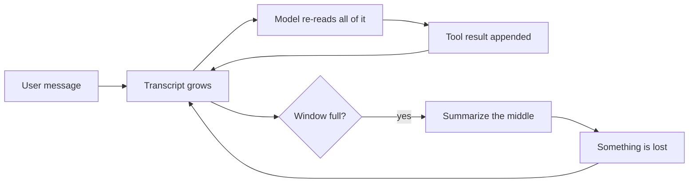
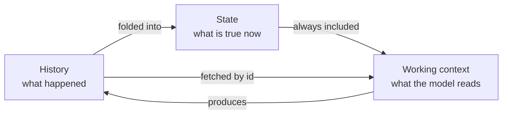
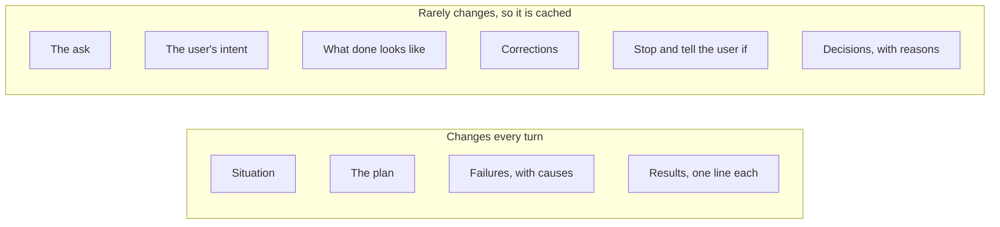
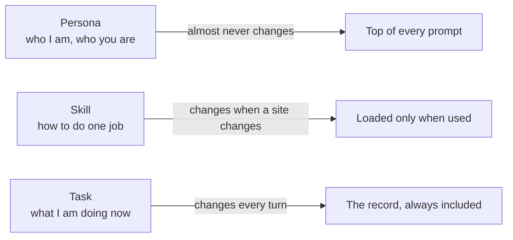
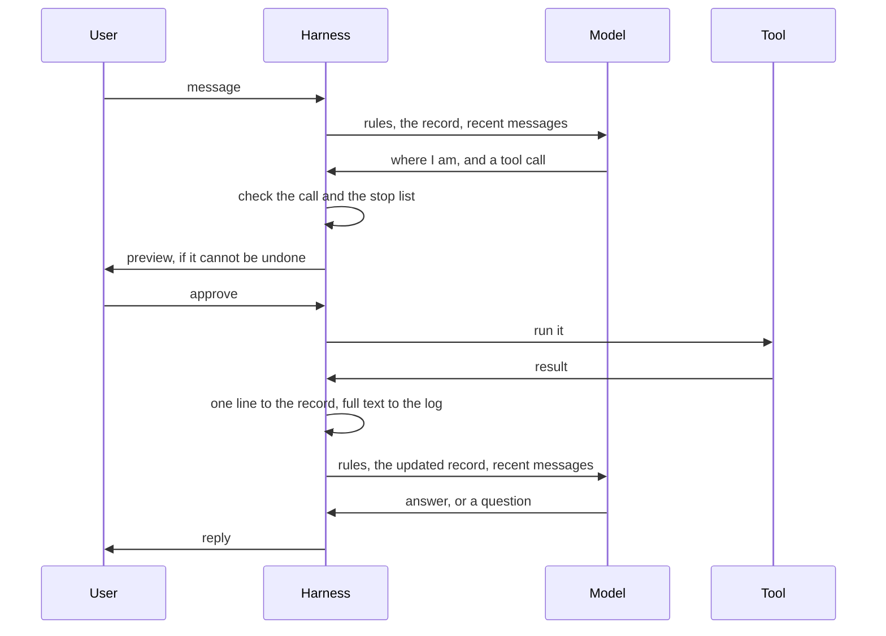
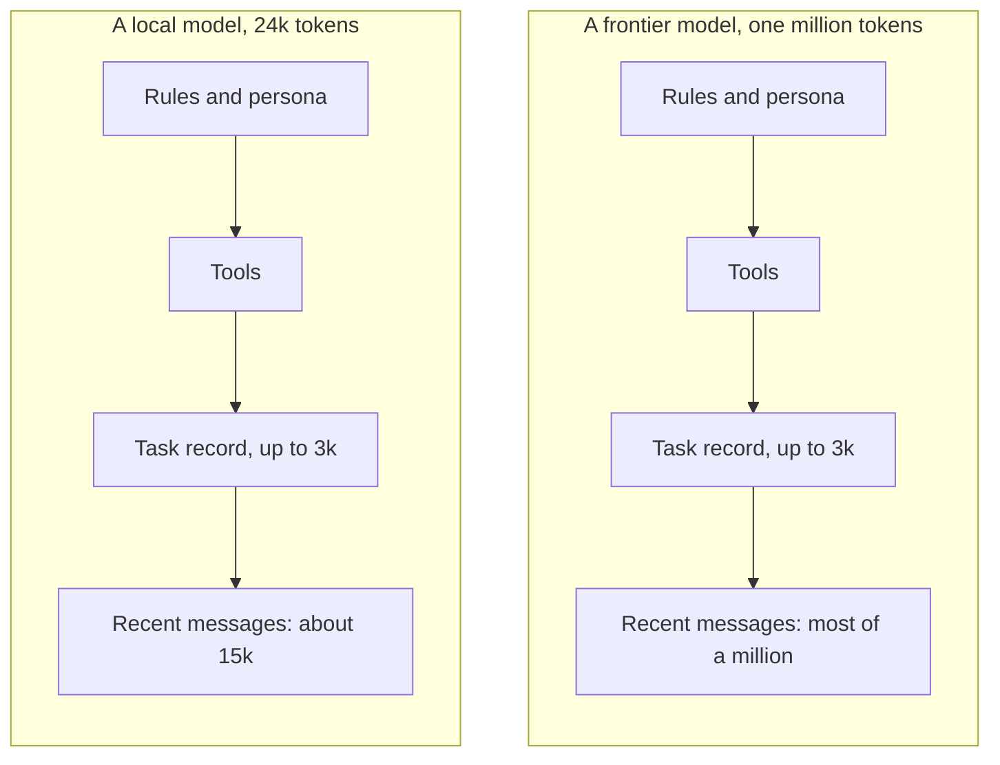
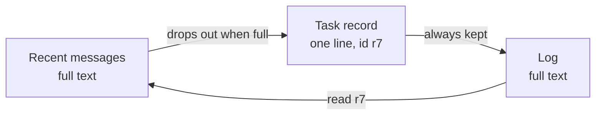
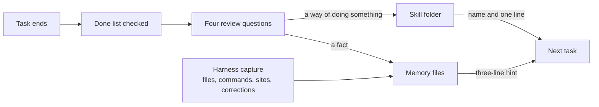

# COEUS: how it works and why it is better

This document explains Coeus in plain words. It is for people and for the AI agents that will build it. The full design is in `docs/COEUS_PLAN.md`. The build plan is in `docs/WORK_PLAN.md`. The code layout is in `ARCHITECTURE.md`. The last section of this document is a table that ties each idea to the part of the design that describes it, the part of the build plan that builds it, and the test that proves it works.

## 1. The problem every agent has

A language model is a program that turns text into text. You send it some text, and it sends text back. That is one call. The model remembers nothing between calls. It also cannot do anything on its own. It cannot open a file, run a command, or visit a web page.

An agent is a model plus a second program wrapped around it. That second program is called the harness. The harness does two jobs. It decides what text to send the model on each call, which is how the model remembers anything. And it runs tools for the model, which is how the model does anything. A tool is one thing the harness can do, such as read a file or click a button on a web page. Everyone can use the same models. The harness is what makes one agent better than another.

We read the code of eight agents: OpenClaw, Hermes, Prime, OpenCode, Atomic, ZeroClaw, Codex, and Claude Code. They all work the same way. They keep the whole conversation in one long transcript. The transcript is everything the user said, everything the model said, and everything every tool returned. On every call, the model reads the whole transcript again to figure out where it is.



That works until the transcript no longer fits in the model's window. The window is the most text a model can read in one call. When the transcript is too long, the harness asks the model to write a summary and throws the old text away. The model decides what to keep. Whatever it leaves out is gone.

Think of a video game that loads your saved game by replaying every button you ever pressed since you started. That is what re-reading the transcript costs on every call. And a summary is the game guessing which of your button presses did not matter.

Here is what each agent does when its window fills up. This comes from reading the code. The full comparison is in `docs/HARNESS_V2.md`.

| Agent | When the window fills |
|---|---|
| OpenClaw | Tells the model to save its notes, then summarizes and keeps the most recent 20,000 tokens |
| Hermes | At half the window, throws out old tool output and summarizes the middle. The user's own messages are kept word for word |
| Prime | Summarizes, but keeps a notes file with a history, and the next call reads it |
| OpenCode | Summarizes, but reads its project file from disk again on every step, so that file cannot be lost |
| ZeroClaw | Never summarizes. Drops whole old turns that no longer fit |
| Claude Code and Codex | Summarize the conversation and keep their instruction files on disk |

Two of these agents have a good idea. Hermes never summarizes the user's own words. Prime and OpenCode keep some state in a file that the model reads again on every step, so it cannot be lost. Coeus takes both ideas as far as they go.

## 2. The Coeus answer: keep three things apart

Coeus separates three things that other agents mix together in one transcript.

The first is the history. This is what happened: every message, every tool call, and every result, in order. It is written to a log and never changed. The model does not read the log.

The second is the state. This is what is true right now. It is a short document called the task record. It says what the user asked for, what done looks like, what the plan is, what has been decided, what has failed, and what the tools have found. It is one to three thousand tokens long. A token is a piece of text about the size of a short word. The model reads the record on every call.

The third is the working context. This is the text that is actually sent to the model on one call. It holds the rules, the record, and the most recent messages and results. The harness builds it fresh for every call and throws it away afterward. Its size depends on the model.



Think of a writer at work. The library holds every book ever written. That is the history. The desk holds the few books that are open for today's chapter. That is the state. The page in front of the writer is the working context. The writer does not re-read the whole library to remember what the chapter is about.

This is an old idea in computer science. A database keeps a log of every change and, beside it, a table of what is true now. An operating system can pause a program and start it again days later from one small record. Coeus does the same thing for an agent. The hard part is not the idea. The hard part is giving the record a fixed shape with rules, so the model cannot write whatever it likes into it. That shape is next.

## 3. The task record

Here is a task record, shortened. The full example is in section 4 of the design.

```
# task 17   running   from Signal   budget left: 14 rounds, 41k tokens, 9 minutes
this turn: 6.1k tokens in, 5.2k of them cached, 0.4k out

## The ask
Post a tweet about the DigiByte anniversary. Use the product notes and keep it under 280 characters.

## The user's intent
Mark the anniversary publicly today.

## What done looks like
- one tweet is posted from the DigiByte account
- it is under 280 characters and mentions the date
- the user saw a preview before it was posted

## Corrections
- C1 "no, lead with the date not the features"

## Stop and tell the user if
- the account shows a login page or a captcha
- the tweet is still over 280 characters after two tries
- the budget runs out

## Situation
- browser tab t1: x.com/compose, "Compose post"
- files changed in this task: none
- last command: none

## Plan
- [x] 1 read the product notes -> r3
- [x] 2 draft the tweet -> r6
- [ ] 3 show the user a preview, then post

## Decisions
- D1 Lead with the date. Reason: correction C1.

## Failures
- F1 Draft 1 was 312 characters. Cause: it had three facts in it. One fact per post.

## Results (read any of them in full with `read r7`)
- r3 read memory/product.md: 2,100 characters
- r6 draft tweet: 236 characters
```

Each part has one job.

- **The ask** is what the user asked for, in the user's own words. It is never edited.
- **The user's intent** is why the user wants it. When the plan breaks, this is what lets the model make the right call instead of guessing.
- **What done looks like** is a checklist. The task cannot end until every line on it has been checked off with proof.
- **Corrections** are anything the user said while the task was running, in the user's own words. They are only ever added to, never changed.
- **Stop and tell the user if** is a short list of things that should stop the task at once. The harness checks it before every tool call.
- **Situation** is what the tools say the world looks like right now: the page the browser is on, the files changed so far, the last command and whether it worked. The harness writes it. The model never has to remember it.
- **The plan** is the list of steps and which of them are done.
- **Decisions** are choices the model made, each with its reason, so it does not argue with itself three steps later.
- **Failures** are things that went wrong, each with its cause, so they are not repeated.
- **Results** are one line for each thing a tool returned, with a short id like r7. The full text is in the log, and `read r7` brings it back.



Where the shape comes from. The U.S. Army writes every order in the same fixed format, called the five-paragraph operations order. It works because anyone can write one and anyone can check one, even when the radio is dead and the plan has fallen apart. We borrowed five ideas from it. The order states the situation first. It states the mission in the words of the person who gave it, which is our ask. It states the commander's intent, the reason behind the mission, so that people can still act correctly when the plan breaks. Ours is the user's intent. Before the operation, the commander lists the facts that must be reported the moment they happen. Ours is the stop list. When the plan changes during the operation, the change goes out as a short note that changes one part of the order without rewriting the rest. Ours are the corrections. And after the operation, the unit holds an after-action review with four questions: what was supposed to happen, what actually happened, why was there a difference, and what should we keep or change. Coeus asks the same four questions at the end of any task that was worth reviewing.

Three rules keep the record honest. First, it holds only what the tools cannot tell you. Which files changed, what is on the page, and whether a job ran are all looked up, never remembered. Second, the harness writes everything that ordinary code can verify: the header, the corrections, the situation, the results, and whether each step finished. That costs no model tokens. The model writes only the parts that need judgment: the intent, the done list, the stop list, the plan, the decisions, and the failures. Third, the model can write to the record only through one tool, called `task`. That tool refuses a decision with no reason, a failure with no cause, and any change to the ask, the intent, or the corrections.

Every change to the record is saved as a numbered checkpoint. A checkpoint is like a saved game. A task that is waiting for the user holds nothing in the model's memory. It picks up from its last checkpoint when the user replies, even days later, even on a different model. The command `/tasks 17 back 3` goes back three checkpoints and lets the model try a different path.

A task ends in two steps. When the model says it is done, the harness checks the done list. Each line must point at a result or at an approval from the user. If any line has no proof, the task is not done and the model keeps working. This is what stops the model from declaring victory early. Then, if the task had a correction, a failure, a stop, or more than a few rounds, the after-action review runs. The four questions are answered in one line each. Only the last answer is saved. If it is a fact, it goes into memory. If it is a way of doing something, it becomes a skill. A quick question that needed no tools gets no record and no review. It is just answered.

## 4. The three kinds of state

Coeus keeps three kinds of state, because they change at three different speeds.

The persona is who the agent is and who the user is. It holds the standing rules and two small memory files. It almost never changes.

A skill is how to do one kind of job. It holds the steps, what to expect at each step, and what it is allowed to do. It changes only when a website or a tool changes.

The task is what the agent is working on right now. It is the task record from the last section. It changes every turn.



Think of a carpenter. The persona is who the carpenter is. A skill is a joint the carpenter has learned to cut and can cut again without thinking. The task is the one cabinet on the workbench today. Only the cabinet changes from day to day.

Keeping the three apart is also what makes each call cheap. Model providers charge much less for text they already read on the previous call, because they can reuse their work. That reused text is called the cache. The persona never changes, so it is cached on every call. A skill loads only when it is used, so it costs nothing the rest of the time. The task changes every turn, so it comes last, after everything that is cached.

## 5. What happens on one turn

A turn starts when the user sends a message and ends when the agent replies or asks a question.



The message is saved to a queue on disk first, so it cannot be lost. If it is a slash command like `/status`, or it matches a saved skill, the harness handles it without calling the model. Otherwise it is a task. The harness sends the model the rules, the record, and the recent messages. The model writes one line saying where the work stands, then either answers or asks for a tool. Before any tool runs, the harness checks the call. Is it the same call as last time? Is it badly written? Has the model hit the limit of twenty tool rounds for this turn? Does anything on the stop list apply? If the tool would do something that cannot be undone, the user sees a preview first. Then the tool runs, the result gets one line in the record and its full text in the log, and the model is called again with the updated record. When the model answers in plain text, the turn is over. When it asks the user a question, the turn is over too, and the task waits.

A few rules make this loop safe on any model. The same tool call with the same arguments is never run twice. A badly written tool call is repaired if the tool name is close to a real one, and otherwise the model gets the list of real tools back. Neither one ever crashes the agent. After twenty tool rounds, the model gets one last call with the tools switched off and must say what it did and what is left. A message from the user in the middle of a turn is added to the record as a correction and never interrupts a tool that is already running. And if the model's provider fails, the harness retries three times and then moves to the next model on the list, all outside the loop.

The stop list works like a smoke detector. You decide what counts as an alarm before there is a fire. Because the harness checks the list before every tool call, a login page, a spent budget, or anything the model listed at the start stops the task and tells the user. The model does not get to decide in the moment whether to push on.

## 6. Small models and big models

Coeus has one rule for the working context. It is never smaller than the task needs and never bigger than the model can hold.



The first three parts are the same on every model. The rules, the persona, the tool list, and the record add up to about six thousand tokens, and the record never grows past three thousand. Whatever room is left is filled with the most recent messages and tool results, in full. On a small model on your own machine, that room is about fifteen thousand tokens. On a frontier model, it is most of a million. A big model is never held back to suit a small one. A small model is never asked to hold more than it can.

The order of the prompt matters more than its size. Text that is identical to the last call costs about a tenth as much, because the provider reuses it. So the parts that never change come first: the rules, the persona, the tools, and the parts of the record that rarely change. The parts that change every turn come last. Nothing above the last cached part is ever rewritten during a task. An agent that summarizes its transcript rewrites the front of its prompt every time it summarizes, and loses the whole cache right when the prompt is biggest.

When the window is full, the oldest tool result drops out of the recent messages. It does not get summarized. It is still one line in the record, and its full text is still in the log. If the model needs it again, it calls `read r7` and gets it back in full.



Think of packing for a trip. Today's clothes are on the chair. That is the recent messages. This week's clothes are in the closet. That is the record. Everything else is in the suitcase. That is the log. Nothing gets thrown away. A big model rarely has to move anything to the closet. A small model does it all the time and loses nothing.

Small models also write their tool calls badly, as loose text instead of the proper form. The harness reads every common shape and fixes tool names that are close. So a small model drives the same eighteen tools as a big one.

Working on any model is a test, not a promise. The build plan has a fixed task with forty tool rounds, a correction at step twelve, and a stop condition at step thirty. It runs on the fake model, on the local Qwen, on Opus 4.8, and on GPT-5.5 at every stage of the build. It checks that the ask and the corrections are still identical to the last character, that the done list passed, and that every result can still be read.

## 7. Why it costs fewer tokens

A transcript agent pays to re-read everything on every call. Coeus pays for a record of three thousand tokens plus a window, and most of that is cached. Here is a rough picture for one task of forty tool rounds where each result is about fifteen hundred tokens. These are estimates to show the shape. The real numbers come from the cost line the harness writes every turn.

| At tool round | A transcript agent sends | Coeus sends |
|---|---|---|
| 10 | about 20,000 tokens | about 20,000 tokens, mostly cached |
| 20 | about 35,000 tokens, or a summary and a cold cache | about 20,000 tokens, mostly cached |
| 40 | about 65,000 tokens, after two summaries | about 20,000 tokens, mostly cached |

The transcript grows with every round, and each summary wipes the cache. The Coeus prompt stays about the same size for the whole task, because the record stays small and the window slides. On a big model the window is wider, so each call costs more, but the cost still does not grow with the length of the task.

## 8. Why it remembers better

Inside a task, the record is the memory, and its rules are what make it reliable. The user's words are never rewritten. Every decision keeps its reason. Every failure keeps its cause. Every result keeps its id. Every change has a checkpoint. Nothing is summarized, and nothing is thrown away.

Across tasks, memory lives in two small files and a folder. `MEMORY.md` holds facts about the world and `USER.md` holds facts about the user. Both have hard size limits, which is the Hermes idea. A folder of plain text files holds anything bigger. All of it is searchable, along with every past message.



Most of what goes into memory is written by the harness, with no model call. It records files changed, commands run, websites visited, and jobs created. It also keeps, word for word, any message from the user that starts with "no," "actually," "always," "never," or "don't." The after-action review writes the rest, and only its last answer is saved. Every fact has a source and a date. Nothing is deleted. A new fact replaces an old one, and the old one stays searchable. On every call, three lines from memory search ride along at the end of the prompt, and a `memory` tool searches the rest when the model asks.

Other agents have memory files too. The difference is what gets written and who writes it. OpenClaw pushes recall into every prompt and rewrites its memory file on a schedule, and its memory index caused two of its worst bugs in the week we looked. Coeus writes facts from the log for free, saves one reviewed lesson per task, and keeps the hint to three lines.

## 9. Why it is safer and more reliable

The loop cannot run away. There are twenty tool rounds per turn, a forced answer at the cap, no repeated calls, no crashes on bad tool calls, and a budget of rounds, tokens, and minutes on every long task.

The finish is defined before the work starts. The done list and the stop list are written before the first tool call, and the harness enforces both.

Nothing that cannot be undone happens without a preview. One permission function decides every tool call from a short list of rules, and when no rule matches, it asks. Commands run inside a sandbox, which is a fenced-off part of the machine that cannot reach your keys or the vault. Think of a workbench with a raised edge. Whatever rolls away stays on the bench instead of falling to the floor.

The model never sees a password. Passwords live in an encrypted vault. You type them once in the terminal, through a prompt that shows stars. When the agent needs to log in to a site, it points at the login boxes, and the harness types the password itself.

The log is the truth. A reply is written to the log before it is sent. After a crash, the agent replays the log and rebuilds its state. A message that had to be sent again says it might be a duplicate. If the agent keeps crashing, a breaker stops the loop. The service manager restarts it, a watchdog restarts it if it stops checking in, and an update that does not come up within a minute rolls itself back.

Any failed task becomes a test. Because the log holds every tool result, a failed task can be run again against new code with the same results. A bug fixed once stays fixed.

## 10. What we took from the others, and what is new

From OpenClaw we took a clean loop with hooks around it, a way for a message that arrives mid-turn to steer the next step, a repair layer for badly written tool calls, scheduled jobs that back off after failures, Signal support with pairing for unknown senders, a delivery queue on disk, and a real Chrome browser with its own profile that reads the page as a tree with short tags. We left behind the summarizing, the memory index, and the separate screen process joined by a pipe.

From Hermes we took the rule that the user's words are never summarized, memory files with hard size limits, the crash-loop breaker, the delivery ledger, the masked password prompt, and one redaction function applied to everything that leaves the program. We extended the user's-words rule to the whole record.

From Prime we took notes with a history and a rollback that the next call actually reads, and budgets with a checker at the end. We turned the notes into a fixed-format record with rules the harness enforces.

From OpenCode we took one core with every screen as a thin client, streaming replies, one command table for every screen, approvals shown inline with once, always, and reject, a permission engine built from rules, plain-text tool descriptions, and the rule that a bad tool call is an error the model can fix rather than a crash.

From ZeroClaw we took the cap on tool rounds with a forced final answer, the parser for messy tool calls, a job store where two processes cannot claim the same job, and an updater that rolls back.

From Codex and Claude Code we took the rule that the operating system sandbox is the real security boundary, that asking for more permission is a field on the tool call with a written reason, and that the model decides what to do while the harness decides what is allowed.

From the browser agents browser-use and Stagehand we took marks on elements that just appeared, hints about what is below the fold, and a finish step that must say whether it succeeded.

What is new in Coeus is the combination and five things none of them do. The task record is the state, kept beside the log instead of a summary in place of it. The record has a fixed shape with rules the harness enforces, so the user's words cannot be edited, decisions carry reasons, and done is a checklist with proof. The harness does the bookkeeping for free, writing the situation, the results, and the corrections with no model call. One rule sizes the working context to the model, and nothing is ever summarized, only moved out of the window and kept. And a task cannot end until the done list is proven, after which four fixed questions decide what is worth remembering.

## 11. The tools

There are eighteen tools. Every model sees all of them. Each one is described in under forty words. The harness builds every result, so the model cannot invent one.

| Group | Tools | What they do |
|---|---|---|
| Files | `read`, `write`, `edit`, `search` | Read a file, a folder, or a past result by its id. Write or edit a file inside the allowed folders. Find files or lines |
| Machine | `shell` | Run a command in the sandbox. If it takes more than ten seconds, it returns a job id you can check on or stop. Asking for sudo needs a written reason and a preview |
| Web | `web` | Search the web, or fetch a public page as text. Anything behind a login belongs to the browser |
| Browser | `browser_open`, `browser_read`, `browser_click`, `browser_type`, `browser_act`, `browser_login`, `browser_handoff` | Use a real Chrome like a person. Open a page, read it, click, type, do one action and check it worked, log in from the vault, or hand the window to the user |
| Desktop | `computer` | Open an app, take a screenshot with numbered marks, click, type, drag. The last resort when the browser cannot do the job |
| The agent's own | `memory`, `skill`, `schedule`, `task` | Search and save memory. View, run, or save a skill. Create a scheduled job. Update the record |

Three things tie the tools to the record. Every result gets one line in the record and its full text in the log, which is how the record stays small and nothing is lost. The `task` tool is the only way the model writes to the record, and it enforces the record's rules. And `read r7` brings any old result back in full, which is what makes it safe to drop results out of the window. Asking the user a question is not a tool. The model just asks, and the turn ends.

## 12. The check table

This table is how a person or an agent checks that the design, the build plan, and this explanation agree. For each row, the design section should say what this document says, the brief in the build plan should own the work, and the test should exist in that brief. If any of the three is missing, that is a gap, and it should be reported rather than patched in the wrong place.

| What Coeus does | Design | Built in | Proved by |
|---|---|---|---|
| Keeps the history, the record, and the working context as three separate things | §1, §4 | Log 1.1, record 1.2, context 2.1 | Log replay test; record round-trip; golden prompts for a 24k model and a 200k model |
| Never edits the ask, the intent, or the corrections | §4 | 1.2 | Each rule rejects a bad edit; the forty-round task checks them to the last character |
| Requires a reason on every decision and a cause on every failure | §4 | 1.2, and the `task` tool in 2.5 | Rule tests; every `task` operation checked against the rules |
| Gives every result an id and returns its full text with `read r7` | §4, §7 | 1.2, `read` in 2.5 | Every dropped result still readable by id |
| Drops old results out of the window without summarizing or losing them | §4 | 1.2, 2.1 | Folding keeps every exchange readable by id |
| Keeps the record under three thousand tokens | §4 | 1.2 | Fold tests at the cap |
| Saves a checkpoint on every change and can go back | §4, §12 | 1.2, 3.1 | Rewind test; `/tasks` through the fake channel |
| Writes the situation, the results, and the corrections without a model call | §4 | 3.1 | Scripted conversations; the situation filled from tool results |
| Checks the stop list before every tool call | §3, §4 | 3.1 | The forty-round task stops at step thirty |
| Turns a mid-turn message into a correction without interrupting a tool | §3 | 3.1 | The forty-round task's correction at step twelve |
| Caps a turn at twenty tool rounds, never runs the same call twice, repairs bad calls | §3 | 3.1, 1.5 | Cap test; detector test; a golden file per bad-call shape; a fuzz test that never crashes |
| Sizes the working context to the model with one rule | §4 | 2.1 | Golden prompts for two sizes; the live test on three models within each window |
| Puts the unchanging parts first and never rewrites them during a task | §4 | 2.1 | Nothing above the cache line changes across ten turns |
| Writes a cost line every turn | §4 | 2.1 | The cost line matches the fake provider's counts |
| Refuses to end a task with an unproven done line | §4 | 3.1 | The done-check fails on one line |
| Asks the four review questions and saves only the last answer | §4 | 3.1, 4.2, 4.3 | The review hands off; a procedure answer produces a skill offer |
| Captures memory from the log for free and keeps corrections word for word | §10 | 4.2 | Each capture rule; a correction retrievable the same turn |
| Replays a skill without calling the model | §8 | 4.3, 5.3 | A trigger runs a skill with the fake model never called |
| Works on the local Qwen, Opus 4.8, and GPT-5.5 | §4 | Every wave gate, `make live` | The live forty-round task from wave 2 onward |
| Previews anything that cannot be undone | §11 | 2.2, 3.1 | Escalation previews and does not run until approved |
| Never shows the model a password | §11 | 2.4, 5.2 | The vault never returns a value to the model; the login tool never returns what it typed |
