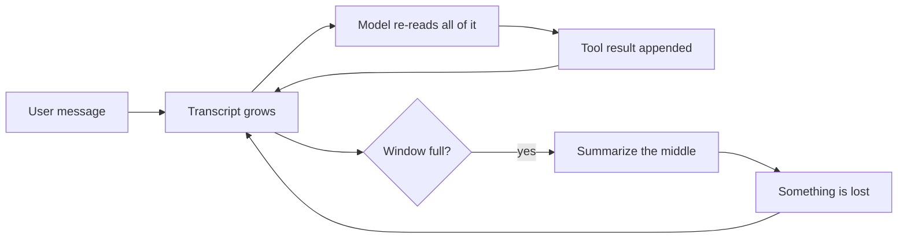
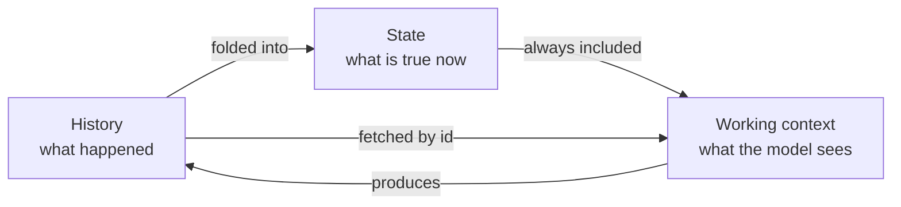
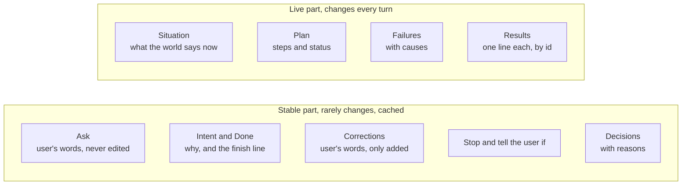
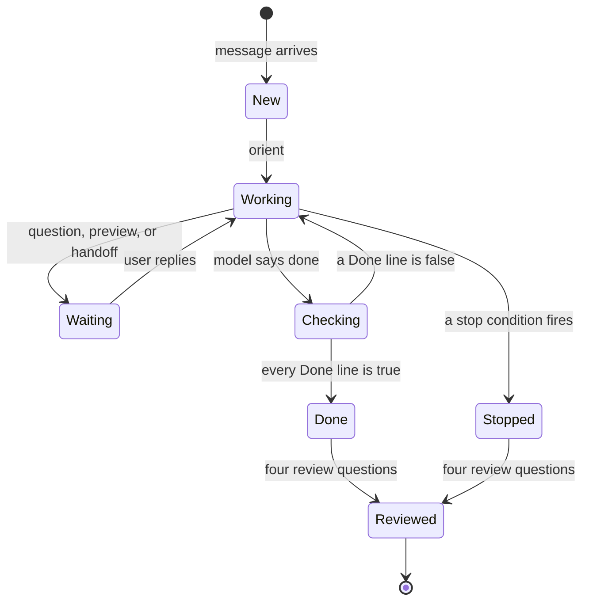
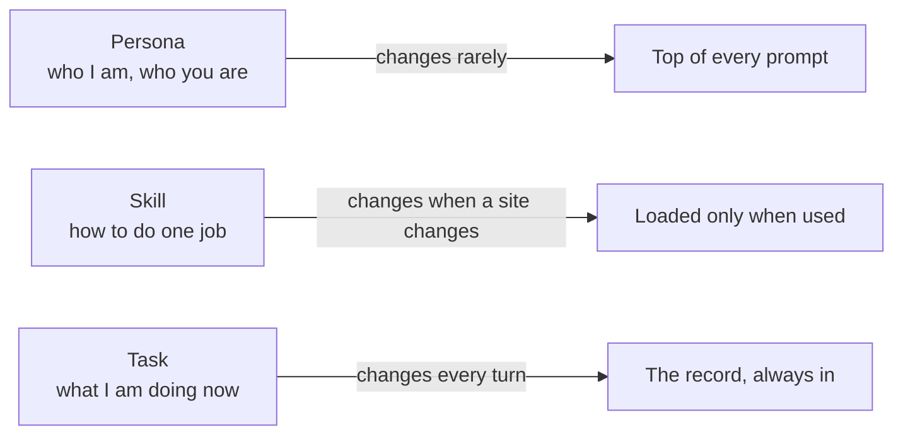
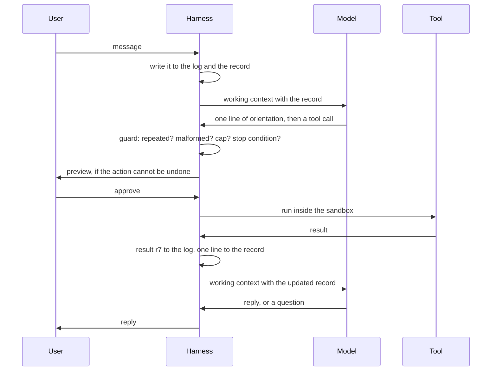
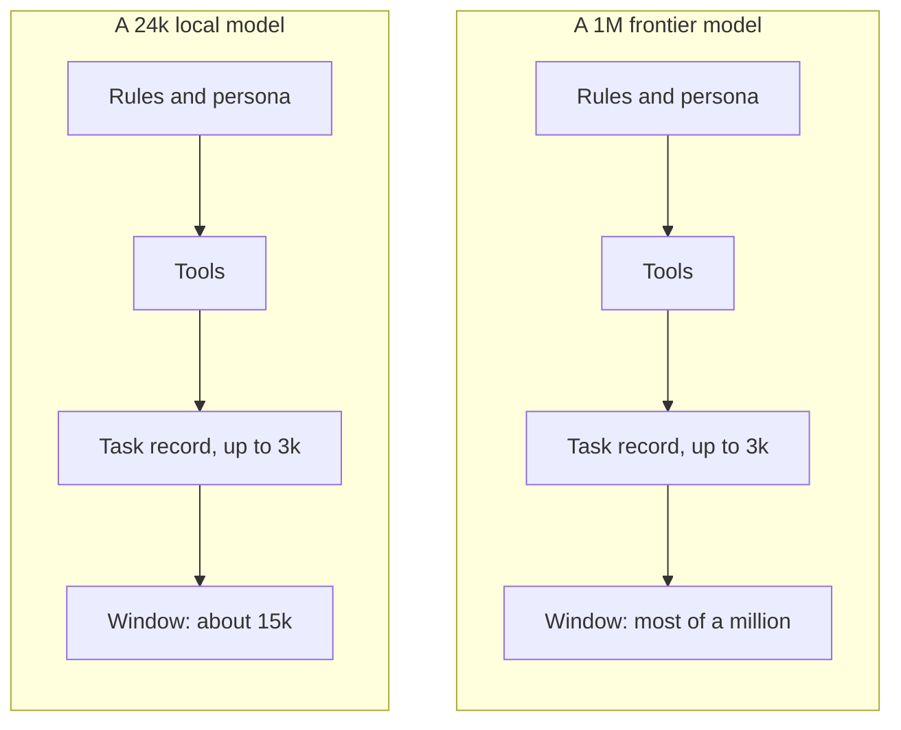
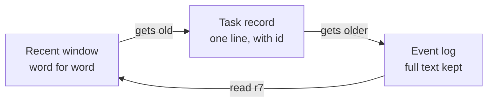
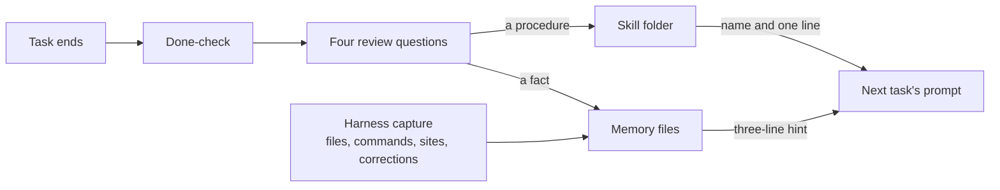

# COEUS: what it is, how it works, and why it is better

**This is the plain-words explanation of Coeus.** It is for people who want to understand what we are building, and for the AI agents who will build it. It explains the state design, which is the heart of Coeus, and it explains what we took from other agents and what we do differently. The full design is `docs/COEUS_PLAN.md`. The build plan is `docs/WORK_PLAN.md`. The code layout is `ARCHITECTURE.md`. Wherever this document points into those files it gives the section or the brief number. If this document and the design ever disagree, the design is right, and the disagreement should be reported to the orchestrator.

Every section opens with one line in bold. Read only the bold lines and you have the pitch. Read the section headings in order and you have the outline of a video. Read the whole thing and you have the technical explanation. Section 12 is a table that ties every claim to the place it is designed, the brief that builds it, and the test that proves it.

## 0. Coeus in ten lines

1. An AI agent is a language model plus a program around it. The program is called the harness, and the harness is what makes one agent different from another.
2. Every harness we studied keeps the task inside the conversation transcript and re-reads the whole transcript on every turn. When the transcript gets too long, they summarize it and hope.
3. Coeus keeps three things apart: what happened, what is true now, and what the model is looking at this turn.
4. "What is true now" is a task record of one to three thousand tokens, shaped like the U.S. Army's five-paragraph operations order.
5. The record holds the user's words unchanged, what done looks like, the plan, every decision with its reason, every failure with its cause, and the conditions that mean stop and tell the user.
6. The record is the same size on every model. Only the window around it changes, so a small local model and a frontier model run the same agent.
7. Nothing is summarized and nothing is thrown away. Old results fold down to one line and then to the log, and any of them comes back word for word by its id.
8. The parts of the prompt that never change come first, so the provider reuses most of every call from its cache, and most tokens cost a tenth of the price.
9. A task cannot close until every line of "done" is proven true, and every task ends with the four questions of an after-action review, whose answers become memory and skills.
10. The browser is used like a human, in a real Chrome with its own profile, and what the agent learns to do there becomes a skill it can replay without the model.

## 1. What an agent is, and the problem every agent has

**In one line: the model forgets everything between calls, so the program around it has to remember, and every agent today remembers by re-reading its whole conversation.**

A language model is a machine for text. Text goes in, and text comes out. One request with its reply is called a call. The model keeps nothing from one call to the next. It cannot read a file, run a command, or open a web page. The harness is the program wrapped around the model, and it supplies both missing pieces. It supplies memory by deciding what text to put in front of the model on each call. It supplies hands by running tools on the model's behalf. A tool is one thing the harness knows how to do, such as reading a file. When the model wants a tool run, it writes a request, and that request is called a tool call. Everyone can rent the same models, so the harness is the whole difference between one agent and another.

We read the source code of OpenClaw, Hermes, Prime, OpenCode, Atomic, ZeroClaw, Codex, and Claude Code. All of them keep long-term memory outside the conversation, in files or a database, and that part they do reasonably well. But every one of them uses the conversation transcript as the record of the task in progress. The transcript is the full text of everything said so far by the user, the model, and the tools. On each turn, the model reads the whole thing again to work out where it is.



The diagram shows the loop. Every tool result is appended to the transcript, and the model reads the whole transcript on the next call. When the transcript no longer fits in the model's window, the harness squeezes it into a summary. A window is the most text a model can read in one call. It is measured in tokens, and a token is a piece of text about the size of a short word. The summary is written by the model, and the model decides what to keep. Anything it drops is gone.

Picture a video game that loads your saved game by replaying every button you ever pressed since you started playing. That replay is what re-reading the transcript costs on every turn. The summary is the game deciding on its own which of your button presses did not matter.

Here is what each harness does when its window fills. This comes from the code, not the marketing, and the full comparison is `docs/HARNESS_V2.md`.

| Harness | When the window fills |
|---|---|
| OpenClaw | Runs a silent turn that tells the model to save notes, then summarizes and keeps the most recent 20,000 tokens |
| Hermes | At half the window, prunes old tool output and summarizes the middle. The user's own messages are kept word for word |
| Prime | Summarizes, but its notes file with a history survives, and the next prompt reads it |
| OpenCode | Summarizes, and reads its project file from disk again on every step so that file cannot be lost |
| ZeroClaw | Never summarizes. Drops whole old turns that no longer fit |
| Claude Code and Codex | Compact the conversation into a summary and keep their instruction files on disk |

Two of these are good ideas, and Coeus keeps both. The Hermes rule that the user's words are never summarized is the sharpest idea in the field. The Prime and OpenCode habit of keeping state in a file that is read again each step is the second. Coeus takes those two ideas all the way.

## 2. The Coeus idea: keep three things apart

**In one line: history is what happened, state is what is true now, the working context is what the model sees this turn, and Coeus never confuses the three.**

This is an old idea from computer science called state. State is the small amount of information about the past that you need in order to act correctly next. A counter does not remember every time it was bumped. It remembers the current count. A database keeps a log of everything that ever happened, and beside it a snapshot of what is true right now, and those are two different things. An operating system can pause a program and resume it days later from one small record. Coeus applies the same separation to an agent.



| | What it holds | Who writes it | How big | Where it lives |
|---|---|---|---|---|
| **History** | Every message, tool call, result, decision, and permission answer, in order | The harness | Grows without limit | One SQLite database file, called the event log |
| **State** | The task record: what was asked, what done looks like, the plan, decisions, failures, results by id | The harness for facts, the model for judgment | One to three thousand tokens | The event log, as numbered checkpoints |
| **Working context** | The text sent to the model on one call: rules, persona, tools, the record, pinned evidence, recent messages | The harness, fresh each turn | Sized to the model | Nowhere. It is rebuilt every turn |

Picture a writer at work. The library holds everything ever written, and that is the history. The desk holds the few books open for today's chapter, and that is the state. The page in front of the writer is the working context. The writer never re-reads the library to remember what the chapter is about.

The history is append-only, which means new lines are added at the end and old lines are never changed or removed. It is never placed in front of the model by default. The state is always in front of the model. The working context is built from the state and a window of recent messages, sized to fit the model, and it is thrown away after the call. Nothing carries from one call to the next except what the harness puts back, and what the harness puts back is the record.

Why has nobody built an agent this way? Partly because the transcript is the easy default, since the model's own interface is shaped as a list of messages. Partly because a summary looks like it works until the day it drops something. And partly because the record needs a fixed shape with rules, or the model will write whatever it likes into it. The next section is that shape.

## 3. The task record: a save file shaped like an Army order

**In one line: the task record is a small, fixed-format document that says what was asked, what done looks like, what is true now, what was decided and why, and when to stop, and the harness enforces its rules.**

The U.S. Army has the same problem as an agent. Headquarters cannot see every unit, radios fail, and people rotate out in the middle of a mission. The Army's answer is the five-paragraph operations order, a fixed document that anyone can write and anyone can check. Its mission paragraph carries the commander's intent, which is the purpose behind the mission, and the end state, which is what things should look like when it is over. Those two let a unit act correctly when the plan breaks. Before the operation, the commander lists the facts that would change a decision, called the critical information requirements. A change to the plan is sent as a fragmentary order, a short message that changes one part without restating the rest. After the operation comes the after-action review. Coeus borrows all of it, with the user in the commander's seat.



| Section | Army name | Who writes it | Rule |
|---|---|---|---|
| Ask | Mission: who and what | The user, word for word | Never edited by anyone |
| Intent and Done | Commander's intent and end state | The model drafts it, the user can correct it | Done is a checklist, and each line must be provable |
| Corrections | Fragmentary orders | The user, word for word | Only ever added to |
| Stop and tell the user if | Critical information requirements | The model drafts the list, the harness adds the budget and login walls | Checked by the harness before every tool call |
| Situation | Situation | The harness, from the last tool results | Refreshed every turn, never assumed |
| Plan, Decisions, Failures | Execution | The model, through the `task` tool | A decision carries a reason, a failure carries a cause, a fact carries a source |
| Results | Sustainment | The harness | One line each with an id like `r7`, and the full text is always in the log |

Here is a short example record, cut down from the full one in section 4 of the design.

```
# t17  status: executing  from: signal  budget: 6 of 20 rounds, 41k tokens, 9 min
this turn: 6.1k in, 5.2k of it cached, 0.4k out
## Ask (word for word, never edited)
Post a tweet about the DigiByte anniversary. Use the product notes and keep it under 280 characters.
## Intent (why, and what done looks like)
Why: mark the anniversary publicly today.
Done when: one tweet is posted from the DigiByte account, under 280 characters,
mentioning the date, and the user has seen a preview.
## Corrections (word for word, only added to)
- C1 "no, lead with the date not the features"
## Stop and tell the user if
- the account shows a login wall or a captcha
- the tweet would exceed 280 characters after two tries
- the harness budget runs out
## Situation (what the world says now)
- browser tab t1 is on the compose page, logged in as @DigiByte
## Plan
- [x] 1 read the product notes -> r3
- [x] 2 draft the tweet -> r6
- [ ] 3 preview to the user, then post
## Decisions (with the reason)
- D1 Lead with the date. Reason: correction C1.
## Failures (so they are not repeated)
- F1 Draft 1 was 312 characters. Cause: three facts. Do not put three facts in one post.
## Results (one line each; read any of them with `read r7`)
- r3 read memory/product.md: 2,100 characters
- r6 draft tweet: 236 characters
```

A pilot straps a small card to one knee during a flight. The card holds the mission, the current leg, and the rules for when to abort. That card is the task record. The full flight log stays on the ground, and that log is the history.

Three rules keep the record honest. First, it holds only what the world cannot answer on its own. Which files changed is answered by `git diff`, and what is on the page is answered by the browser, so those things are looked up and never remembered. The record holds what only the conversation knows. Second, the harness writes everything it can verify, using ordinary code and no model tokens: the header, the corrections, the situation, the results, and the status of each step. The model writes only what needs judgment: the intent, the stop conditions, the plan, the decisions, and the failures it understands. Third, the model writes the record only through the `task` tool, which refuses a decision without a reason, a failure without a cause, a fact without a source, and any edit to the ask, the intent, or the corrections.

Every change to the record saves a numbered checkpoint in the log, like a saved game. A task waiting on the user holds nothing in any window. It resumes from its last checkpoint, even days later, even on a different model. The command `/tasks 17 back 3` reloads the checkpoint from three saves ago so the model can try another path. Any failed task can be replayed from a checkpoint as a test after a fix.

A task moves through a small set of states, and the harness, not the model, moves it.



A task cannot reach Done until every line under "Done" is answered true with evidence, the way a pilot checks the landing gear, the flaps, and the tower one at a time instead of landing because the flight feels finished. Then come the four questions of the after-action review: what was supposed to happen, what actually happened, why was there a difference, and what do we keep and what do we change. The answer to the fourth question is the only lesson that gets saved, and it goes into memory or becomes a skill. That replaces the vague "save what you learned" step every other harness uses.

## 4. The three kinds of state: persona, skill, task

**In one line: who the agent is, how it does one kind of job, and what it is working on right now change at three different speeds, so Coeus keeps them in three different places.**



| Kind | What it holds | Changes | Where it sits |
|---|---|---|---|
| **Persona** | Who the agent is, who the user is, the standing rules, and the two memory files with hard size limits | Rarely | At the top of every prompt, where it is cheapest |
| **Skill** | The steps for one kind of job, what to expect at each step, its permissions, and its known failures | When a website or a tool changes | In a folder on disk. Only the name and one line sit in the prompt. The body loads when the skill is used |
| **Task** | What is true right now about the one thing being worked on | Every turn | In the task record, always in the prompt |

A carpenter makes this easy to picture. The persona is who the carpenter is. A skill is a joint the carpenter has learned to cut and can cut again without thinking. The task is the one cabinet sitting on the workbench today. Only the cabinet changes from day to day.

Keeping the three apart is also what makes each turn cheap. Model providers charge much less for the part of a prompt they already read on the previous call, because they reuse their work. That reused part is the cache. The persona almost never changes, so it is cached on every call. A skill is loaded only when it is used, so it costs nothing the rest of the time. The task changes every turn, so it comes last, after the cache line.

## 5. One turn, step by step

**In one line: orient, call the model, check the tool call, get permission, run the tool, write the result into the record, repeat, and stop when the model answers or asks.**



The message goes into a queue on disk so it cannot be lost. The router looks at it. If it is a slash command or the trigger for a saved skill, the harness runs it directly without calling the model. If it is a task, the loop starts.

The loop follows ten rules, which section 3 of the design states in full. In plain words:

1. A message that arrives in the middle of a turn is a fragmentary order. It is written into the record as a correction and the model re-plans from there. It never interrupts a running tool. It is like texting a driver "take the next exit" without re-sending the whole route.
2. The model orients before it acts. It writes one line on where the work stands and what comes next. If the situation does not match the plan, the plan is fixed first.
3. There are twenty tool rounds per turn, on every model. At the cap, the model gets one last call with tools turned off and must say what it did and what is left.
4. The same call with the same arguments is never run twice. The second time, the harness tells the model to do something different. A third time ends the turn.
5. A badly formed tool call is repaired if the name is close to a real one. Otherwise the model gets the list of real tools. The loop never crashes because of something the model wrote.
6. Every error ends with the same three options: answer the user, ask one question, or try different arguments.
7. Every tool has a time limit, its own process group, and a cap on its output. Anything over the cap goes to a file that the result names.
8. A turn that read a web page is tainted, meaning it took in words that did not come from the user, and nothing irreversible can happen until the user speaks again.
9. Retries live outside the loop. A failed model call is tried three times with a growing wait, then the next model in the chain is used.
10. A question ends the turn. The task is marked waiting and resumes on the user's next message, even days later.

The stop conditions work like a smoke detector. You decide what counts as an alarm before there is a fire. The harness checks the list before every tool call. So a login wall, a spent budget, or a condition the model wrote at the start stops the task and tells the user, instead of the model deciding in the moment whether to push on.

## 6. Small model, big model: one rule

**In one line: the working context is never smaller than the task needs and never bigger than the model can hold, so the record is the same on every model and only the window around it changes.**



The fixed parts are identical on both. The task record is one to three thousand tokens whether the model is a Qwen running on your own machine or the largest model Anthropic or OpenAI sells. The window is what is left after the fixed parts, and the harness fills it with the most recent messages and results, word for word, up to the model's limit. A big model is never held back to suit a small one, and a small model is never asked to hold more than it can.

"Works on any model" is a test, not a claim. The forty-step fixture in the build plan runs the same task on the fake model, on the local Qwen, on Opus 4.8, and on GPT-5.5 at every gate. It checks that the ask and the corrections are byte-for-byte identical at the end, that the done-check passes, and that every result is still readable.

The prompt is built in layers, from what changes least to what changes most, with three cache points.

| Layer | Changes | Cache point |
|---|---|---|
| Harness rules and persona | Rarely | A |
| Tools | When the software updates | B |
| Record, stable part: ask, intent, corrections, stop conditions, decisions | Rarely during a task | C |
| Record, live part: situation, plan status, failures, results | Every turn | |
| Pinned evidence, word for word | When something is pinned | |
| Recent messages and results, appended, never rewritten | Every turn | |
| Memory hint, three lines from search | Every turn | |

Everything above a cache point is reused from the provider's cache when it is unchanged. Two facts about tokens make the order matter more than the size. Text identical to the previous call costs about a tenth as much as new text. And adding to the end of a prompt is cheap, while rewriting the middle throws the cache away. An agent that summarizes its transcript rewrites its entire history every time it compacts. Coeus only adds to its history, and the only thing it ever rewrites is a record of one to three thousand tokens below the cache line.

When something leaves the recent window, it does not vanish and it is not summarized. It drops one tier.



It is like packing for a trip. Today's clothes are on the chair, and the chair is the recent window. This week's clothes are in the closet, and the closet is the task record. The rest are in the suitcase, and the suitcase is the log. Nothing is thrown away. When the model needs an old result it calls `read r7` and gets the full text back into the window. A large model rarely folds anything. A small model folds constantly and loses nothing.

Small models write their tool calls badly, as JSON in a code fence or inside a made-up tag instead of the structured form. The repair layer reads all of those shapes and fixes a tool name that is close to a real one, so a small model can drive the same eighteen tools as a big one. The harness also writes one cost line into the record header on every turn, such as "this turn: 6.1k in, 5.2k of it cached, 0.4k out," so the user can always see what a task cost and where the tokens went.

Why not just use the million tokens when you have them? Because a model reasons worse over a million tokens of noise than over thirty thousand tokens of signal, and the leaders on every public test of long tasks use explicit plans and memory for exactly that reason. A million-token window is a bigger window. It is not a save file.

## 7. Why it uses fewer tokens

**In one line: a transcript agent pays to re-read everything on every turn and pays again to summarize it, while Coeus pays for a three-thousand-token record plus a window, and most of that is cached.**

Here is an estimate for one task of forty tool rounds, where each tool result is about fifteen hundred tokens. These are rough figures to show the shape, not measurements. The real numbers come from the cost line and from the forty-step fixture, which the build plan measures at every gate.

| At tool round | A transcript agent sends | Coeus sends | Of which cached |
|---|---|---|---|
| 10 | about 20,000 tokens | about 20,000 tokens | most of it |
| 20 | about 35,000, or a summary and a cold cache | about 20,000 tokens | most of it |
| 40 | about 65,000, after two summaries | about 20,000 tokens | most of it |

The transcript agent's prompt grows with every round, and every summary rewrites the front of the prompt, so the cache is lost right when the prompt is largest. The Coeus prompt stays roughly the same size for the whole task, because the record folds and the window slides. On a big model the window is wider and each call costs more, but the cost still does not grow with the length of the task, and the stable layers above the cache line are still reused.

## 8. Why it remembers better

**In one line: the user's words are never rewritten, every decision keeps its reason, nothing is thrown away, and what is worth keeping is chosen by a review instead of by a summary.**

Inside a task, the record is the memory, and its rules are what make it reliable. The ask and the corrections are the user's exact words and cannot be edited. A decision carries its reason, so it is not argued again three turns later. A failure carries its cause, so it is not repeated. Every result keeps its id, so the model can re-read the exact text of anything it did. A checkpoint exists for every change, so a task can be rewound.

Across tasks, memory lives in the persona and in a folder, and most of it is written by the harness without spending a token.



The two persona files, `MEMORY.md` for facts about the world and `USER.md` for facts about the user, have hard size limits, which is the Hermes idea. A folder of plain-text files holds anything larger. All of it, plus every past message, is indexed by full-text search. The harness records what it can verify: files changed, commands run, websites visited, jobs created, and any user message that begins with "no," "actually," "always," "never," or "don't," which is kept word for word as a correction. The after-action review writes the rest, and only its fourth answer is saved. Every fact has a source and a date. Nothing is deleted. A new fact replaces the old one and the old one stays searchable. A three-line hint from search rides below the cache line on every turn, and the `memory` tool searches the rest on demand.

The difference from the others is not that Coeus has memory files. OpenClaw, Hermes, and Prime have those. The difference is what gets written and by whom. OpenClaw injects recall into every prompt and rewrites its memory file on a schedule, and its memory index caused two of its worst bugs in the week we looked. Coeus writes facts from the log without a model call, saves one reviewed lesson per task, and keeps the hint to three lines.

## 9. Why it is more reliable

**In one line: every loop is bounded, every action that cannot be undone is previewed, nothing secret reaches the model, and the log is the ledger that rebuilds the state after a crash.**

- **The loop cannot run away.** Twenty rounds per turn, a forced final answer at the cap, a repeated call never run twice, a malformed call repaired instead of crashing, three tries with a growing wait outside the loop, and a budget of rounds, tokens, and minutes on every long task.
- **The finish is defined before the work starts.** The done-check refuses to close a task on a false line, and the stop conditions are written before the first tool call.
- **Nothing irreversible without a preview.** One permission function decides every call, from rules where the last match wins and the default is to ask. Commands run inside a sandbox built on bwrap and Landlock, which works like a workbench with a raised edge: whatever rolls away stays on the bench instead of falling to the floor. A tainted turn cannot do anything irreversible.
- **The model never sees a secret.** Passwords live in an encrypted vault, entered only through a masked prompt in the terminal. The `browser_login` tool types them into the page itself. Sudo runs only after a previewed request with a written reason.
- **The log is the truth.** A reply is written to the log before it is sent. After a crash the agent replays the log and rebuilds its state. A resent message says it may be a duplicate. A breaker stops crash loops. The service manager restarts the process, a watchdog restarts it if it stops checking in, and an update that fails to come up within sixty seconds rolls itself back.
- **Any failed task becomes a test.** Because the log holds every tool result, a task can be replayed against new code with the recorded results, so a bug fixed once stays fixed.

## 10. What we took, what we changed, and what is new

**In one line: Coeus keeps the best single idea from each harness we studied and puts them on top of one thing none of them has, a task record that is the state.**

| From | What we keep | What we change |
|---|---|---|
| OpenClaw | A pure loop with hooks. Mid-turn messages steer instead of interrupting. Tool-call repair. Scheduled jobs with backoff. Signal through signal-cli with pairing. A cache boundary. A delivery queue on disk. Real Chrome with its own profile, and pages read as a tree with short tags | No summarizing. No recall injected on every turn. No memory index rewrite. One process, instead of a separate screen process joined by a pipe |
| Hermes | The user's words are never summarized. Memory files with hard caps. The crash-loop breaker, the session lease, the delivery ledger. The masked password prompt. One redaction function | The user's-words rule is extended to the whole record. The review runs in the loop as four fixed questions, not as a background fork |
| Prime | Notes with a history and a rollback that the next prompt reads. Budgets with a checker at the end | The notes become a fixed-format record with rules the harness enforces, and the model can only write it through a tool |
| OpenCode | One core with every screen a thin client. Streaming deltas. One command table. Inline approvals with once, always, reject. A rules-based permission engine, last match wins, default ask. Plain-text tool descriptions. A bad tool call is an error the model can fix | The repeated-call detector works across steps, not only inside one response |
| ZeroClaw | The cap on tool rounds with a forced final answer. The parser for messy tool calls. A job store where two processes cannot claim one job. An updater that rolls back | Twenty rounds instead of ten, and nothing is dropped whole when the window fills |
| browser-use and Stagehand | Marks on elements that just appeared. Hints about what is below the fold. Aborting a batch when the page changes. A finish step that must say whether it succeeded | The browser is a real Chrome with a persistent profile, and what it learns is a replayable skill |
| Codex and Claude Code | The operating-system sandbox is the security boundary. Escalation is a field on the tool call with a written reason. The model decides what to do, the harness decides what is allowed | Skills and tools are always shown to the model. Nothing is deferred |
| Systems design | Event sourcing, where the log is the truth and the snapshot is its compact image. Process control blocks. Paging. Save files | Applied to an agent's task |
| The U.S. Army | The five-paragraph order, the commander's intent, fragmentary orders, critical information requirements, the after-action review | The user is the commander, and the harness enforces the format |

What is new in Coeus, meaning what none of the eight harnesses does:

1. **The state is beside the log, not a summary instead of it.** The task record and the event log are two different things, and the model sees the record.
2. **The record has the shape of an operations order, and the shape is enforced.** An ask that cannot be edited, corrections as fragmentary orders, done as a checklist, stop conditions checked by the harness, decisions with reasons, failures with causes.
3. **The harness does the bookkeeping for free.** Situation, results, step status, corrections, and memory capture are written by ordinary code, with no model call.
4. **One context rule sized to the model.** The record is the same size everywhere. Only the window changes. Three cache points, and nothing is ever rewritten above the cache line.
5. **Fold, never summarize.** Three tiers, and everything comes back by id.
6. **The done-check is a gate and the review is four fixed questions.** A task cannot close on a false line, and only the fourth answer becomes memory or a skill.
7. **The harness explains itself to the model.** The first thing in every prompt is a short note, under four hundred words, written from the model's point of view: where you are, what the harness gives you, the record is the truth, which parts are yours, when to stop, how to write. It is the same on every model. Section 5 of the design has the full text.
8. **The browser like a human is the default, and it learns.** Real Chrome, its own profile, human pacing, act and then check, hand off on a login wall, and every procedure recorded as a skill that replays without the model.

## 11. The hands: eighteen tools

**In one line: eighteen tools, all shown to every model, each described in under forty words, and the harness builds every result so the model cannot invent one.**

| Group | Tools | What they do |
|---|---|---|
| Files | `read`, `write`, `edit`, `search` | Read a file, a folder, or a past result by id. Write or edit within the sandbox roots. Find files or lines |
| Machine | `shell` | Run a command in the sandbox. After ten seconds it returns a job id to poll, tail, or kill. An `escalate` field with a written reason asks for sudo, with a preview |
| Web | `web` | Search the web, or fetch a public page as text. Anything behind a login belongs to the browser |
| Browser | `browser_open`, `browser_read`, `browser_click`, `browser_type`, `browser_act`, `browser_login`, `browser_handoff` | Use a real Chrome like a person: open a page, read it as a tree with short tags, click, type, act and check, log in from the vault, hand off to the user |
| Desktop | `computer` | Launch an app, screenshot with numbered marks, click, type, drag, use the clipboard. The last resort when the browser cannot do the job |
| The agent's own | `memory`, `skill`, `schedule`, `task` | Search and save memory. View, run, or save a skill. Create a scheduled job. Write the plan, a fact with its source, a decision or a failure with its reason, or pin a result |

Three things tie the tools to the state. Every result is written to the log with an id, and one line goes into the record, which is how the record stays small and nothing is lost. The `task` tool is the only way the model writes the record, and it enforces the record's rules. And `read r7` fetches any past result back in full, which is what makes folding safe. Asking the user a question is not a tool. The model asks in plain text, and the turn ends waiting.

## 12. The check table: every claim, where it is designed, where it is built, how it is proved

**In one line: this table is how a person or an agent checks that the design, the build plan, and this explanation agree.**

For an agent using this document: for every row, confirm that the design section says what this document says, that the brief owns the work, and that the named test exists in the brief. A row where any of the three is missing is a gap. Report it to the orchestrator. Do not fix it in the wrong document. The design is the intent, the work plan is the build, and this document is the explanation.

| Claim | Design | Built in | Proved by |
|---|---|---|---|
| History, state, and working context are three separate things | §1, §4 | Log 1.1, record 1.2, context 2.1 | Log replay test; record round-trip; golden prompts for 24k and 200k models |
| The ask, intent, and corrections are never edited | §4 rules | 1.2 | Each rule rejects a bad edit; the forty-step fixture asserts byte-for-byte identity |
| A decision needs a reason, a failure a cause, a fact a source | §4 rules | 1.2, and the `task` tool in 2.5 | Rule tests; every `task` operation against the record rules |
| Results keep an id and `read r7` returns the full text | §4, §7 | 1.2, `read` in 2.5 | Every fold tier keeps results readable by id |
| Three fold tiers, nothing summarized | §4 working context | 1.2, 2.1 | Folding keeps every exchange readable by id |
| The record stays between one and three thousand tokens | §4 size | 1.2 | Fold tests at the cap |
| Checkpoints on every change, rewind with `/tasks 17 back 3` | §4 checkpoints, §12 | 1.2, 3.1 | Rewind test; `/tasks` through the fake channel |
| The harness writes situation, results, and step status without model tokens | §4 who writes what | 3.1 | Scripted conversations per rule; the situation filled from tool results |
| Stop conditions checked before every tool call; budget and login walls added by the harness | §3 rule 3, §4 | 3.1 | The forty-step fixture's stop at step thirty |
| Mid-turn messages become corrections and never interrupt a tool | §3 rule 1 | 3.1 | The fixture's correction at step twelve |
| Twenty-round cap with a forced final answer | §3 rule 3 | 3.1 | The cap test |
| An identical call is never run twice, and a third ends the turn | §3 rule 4 | 3.1 | The detector test across steps and inside one response |
| Malformed calls are repaired, never a crash | §3 rule 5 | 1.5 | A golden file per envelope shape; a fuzz test that never panics |
| One rule sizes the context to the model | §4 working context | 2.1 | Golden prompts for two sizes; the live test on three models within each window |
| Three cache points, and nothing above them changes during a task | §4 layers | 2.1 | Nothing above the cache line changes across ten turns |
| A cost line every turn | §4 cost | 2.1 | The cost line matches the fake provider's counts |
| The done-check refuses a false line | §4 done-check | 3.1 | The done-check fails on one line |
| Four review questions, and the fourth answer goes to memory or a skill | §4 review | 3.1, 4.2, 4.3 | The review hands off; a procedure answer produces a skill offer |
| Memory captured from the log without a model call, corrections word for word | §10 | 4.2 | Each capture rule; a correction retrievable the same turn |
| A three-line memory hint | §4 layers, §10 | 4.2 | An empty hint when nothing matches |
| Skills replay without the model | §8 | 4.3, 5.3 | A trigger runs a skill with the fake model never called |
| The model is told how the harness works, in under four hundred words | §5 | 2.1 | The word-count assertion |
| Works on the local Qwen, Opus 4.8, and GPT-5.5 | §4 proof | Every wave gate, `make live` | The live forty-step fixture from wave 2 |
| Any failed task replays as a test | §4 checkpoints, §11 | 6.4 | Replay a failing task, fix it, replay again |
| A preview before anything irreversible, and taint blocks it | §11 | 2.2, 3.1 | The taint rule; an escalation previews and does not run until approved |
| The model never sees a secret | §11 vault | 2.4, 5.2 | The resolver never returns a value; `loginFill` never returns credentials |

## 13. Using this document

The bold lines are the pitch and the thread. The section headings, in order, are the video: the problem, the idea, the record, the three kinds of state, one turn, small and big models, fewer tokens, better memory, more reliable, what we took and what is new, the tools, the check. The tables are the technical reference. The design behind every section is `docs/COEUS_PLAN.md`, the plan that builds it is `docs/WORK_PLAN.md`, and the code that results is described in `ARCHITECTURE.md`.
