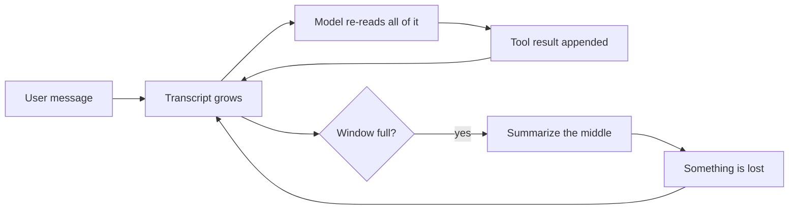
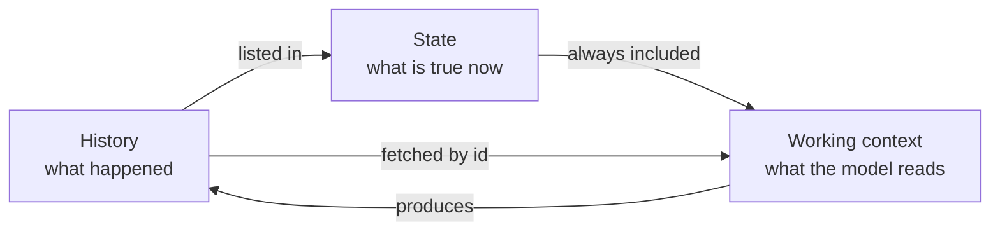
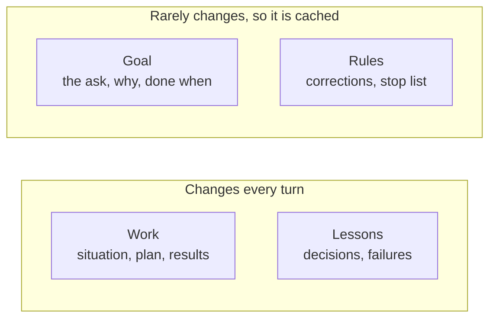
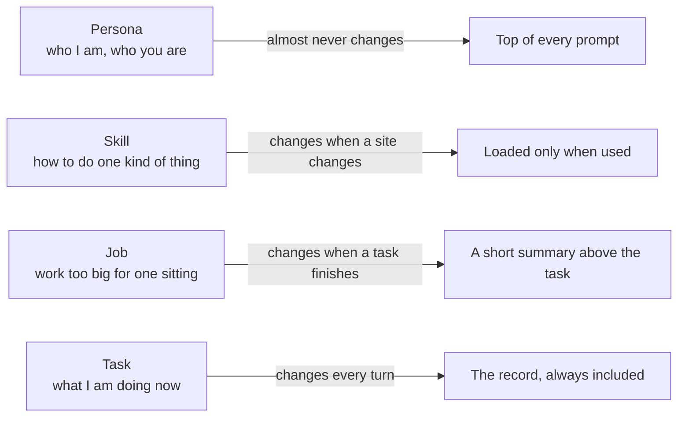
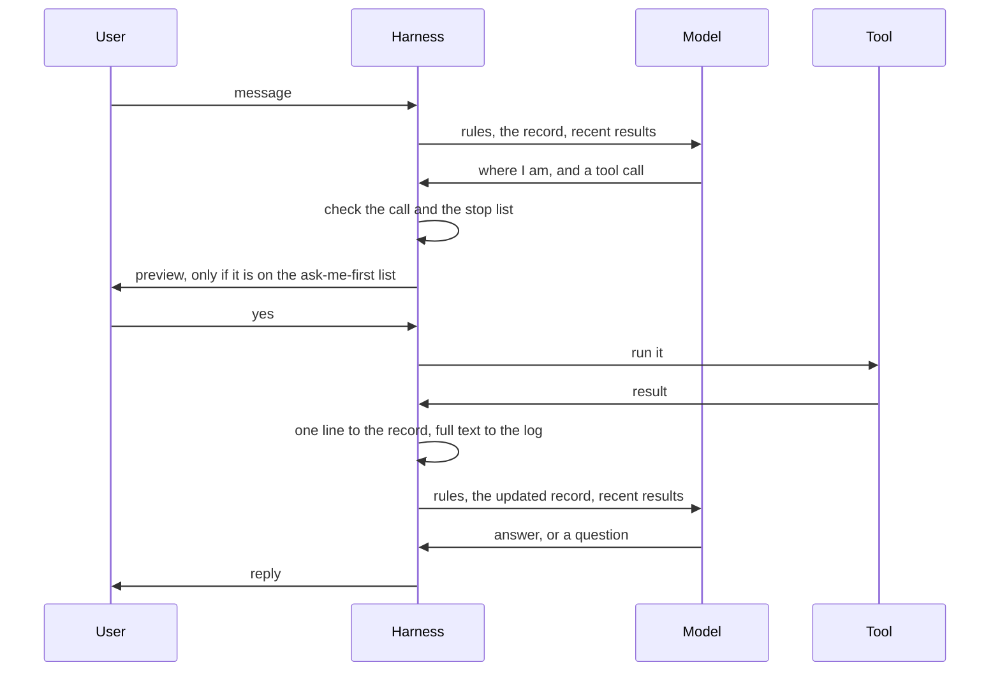
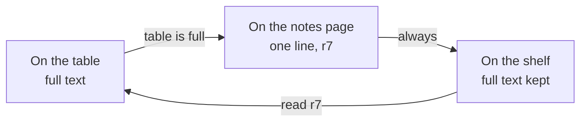
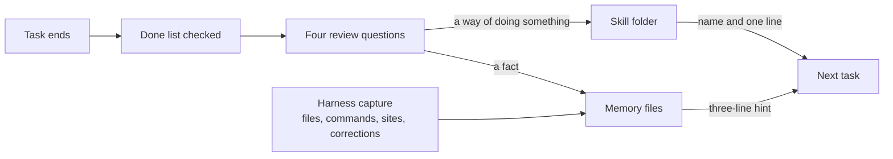

# Nerd Genie: how it works and why it is better

This document explains Nerd Genie in plain words, and it makes the case for why it is better than the agents that exist today. It is for people and for the AI agents that will build it. The full design is in `docs/NERDGENIE_PLAN.md`. The build plan is in `docs/WORK_PLAN.md`. The code layout is in `ARCHITECTURE.md`. The last section of this document is a table that ties each idea to the part of the design that describes it, the part of the build plan that builds it, and the test that proves it works.

Here is the claim. With Nerd Genie, the agent always knows what it is working on. Your words are never rewritten or lost, no matter how long the task runs. It works on its own, and it only stops to ask you about the few things you told it to ask about. It stops and tells you when something on its stop list happens. Work that is too big for one sitting is broken into tasks and reported to you task by task. It cannot call a task done without proof. It costs about the same on the fortieth step as on the tenth. And it runs the same way on a small model on your own machine as on the biggest model in the cloud. None of the agents we studied can say all of that, and most cannot say any of it. The rest of this document shows why.

## 1. The problem every agent has

A language model is a program that turns text into text. You send it some text, and it sends text back. That is one call. The model remembers nothing between calls. It also cannot do anything on its own. It cannot open a file, run a command, or visit a web page.

An agent is a model plus a second program wrapped around it. That second program is called the harness. The harness does two jobs. It decides what text to send the model on each call, which is how the model remembers anything. And it runs tools for the model, which is how the model does anything. A tool is one thing the harness can do, such as read a file or click a button on a web page. Everyone can use the same models. The harness is what makes one agent better than another.

We read the code of eight agents: OpenClaw, Hermes, Prime, OpenCode, Atomic, ZeroClaw, Codex, and Claude Code. They all work the same way. They keep the whole conversation in one long transcript. The transcript is everything the user said, everything the model said, and everything every tool returned. On every call, the model reads the whole transcript again to figure out where it is.



That works until the transcript no longer fits in the model's window. The window is the most text a model can read in one call. When the transcript is too long, the harness asks the model to write a summary and throws the old text away. The model decides what to keep. Whatever it leaves out is gone.

Think of a video game that loads your saved game by replaying every button you ever pressed since you started. That is what re-reading the transcript costs on every call. And a summary is the game guessing which of your button presses did not matter.

Here is what each agent does when its window fills up. This comes from reading the code. The full comparison is in `docs/HARNESS_V2.md`.

| Agent | When the window fills |
|---|---|
| OpenClaw | Tells the model to save its notes, then summarizes and keeps the most recent 20,000 tokens |
| Hermes | At half the window, throws out old tool output and summarizes the middle. The user's own messages are kept word for word |
| Prime | Summarizes, but keeps a notes file with a history, and the next call reads it |
| OpenCode | Summarizes, but reads its project file from disk again on every step, so that file cannot be lost |
| ZeroClaw | Never summarizes. Drops whole old turns that no longer fit |
| Claude Code and Codex | Summarize the conversation and keep their instruction files on disk |

Two of these agents have a good idea. Hermes never summarizes the user's own words. Prime and OpenCode keep some state in a file that the model reads again on every step, so it cannot be lost. Nerd Genie takes both ideas as far as they go.

## 2. One task, two ways

Here is the same job given to a transcript agent and to Nerd Genie. The job is: "Post a tweet about the DigiByte anniversary. Use the product notes and keep it under 280 characters." It takes about forty tool rounds: reading the notes, searching the web, drafting, opening the browser, logging in, and posting. At round twelve the user texts a correction. At round thirty, X shows a login page. Then the user walks away for three days.

| What happens | A transcript agent | Nerd Genie |
|---|---|---|
| Round 12. You text: "no, lead with the date, not the features" | Your message goes into the pile. When the pile is summarized, your words are replaced by the model's summary of them. Hermes keeps your words, but not the reasons around them | The harness writes your words into the record under corrections. They stay there, unchanged, until the task ends |
| The first draft is 312 characters and fails | The failure and its cause get summarized away. The next draft can make the same mistake | The failure and its cause are written in the record. The next draft is told: one fact per post |
| Round 30. X shows a login page | The model decides on its own whether to keep trying. There is no hard cap on how long it tries | "A login page appears" is on the stop list. The harness stops before the next tool call and sends you a screenshot |
| You are gone for three days | The whole transcript is reloaded, summaries and all | The 3,000-token record is reloaded, on the same model or a different one |
| Round 40 | The prompt is about 65,000 tokens, and the cache was wiped by two summaries | The prompt is about 20,000 tokens, and most of it is cached |
| The model says "done" | It is done because the model said so | Each line on the done list must point at a result. A line with no proof sends the model back to work |
| The same job on a small local model | It summarizes every few rounds and loses a little each time | The record is the same. Only the window is smaller |

That is the whole difference. Everything below explains how the record, the loop, and the window are built so that the right-hand column is true on any model.

## 3. The Nerd Genie answer: keep three things apart

Nerd Genie separates three things that other agents mix together in one transcript.

The first is the history. This is what happened: every message, every tool call, and every result, in order. It is written to a log and never changed. The model does not read the log.

The second is the state. This is what is true right now. It is a short document called the task record. It says what the user asked for, what done looks like, what the plan is, what has been decided, what has failed, and what the tools have found. It is one to three thousand tokens long. A token is a piece of text about the size of a short word. The model reads the record on every call.

The third is the working context. This is the text that is actually sent to the model on one call. It holds the rules, the record, and the most recent messages and results. The harness builds it fresh for every call and throws it away afterward. Its size depends on the model.



This is an old idea in computer science. A database keeps a log of every change and, beside it, a table of what is true now. An operating system can pause a program and start it again days later from one small record. Nerd Genie does the same thing for an agent. The hard part is not the idea. The hard part is giving the record a fixed shape with rules, so the model cannot write whatever it likes into it. That shape is next.

## 4. The task record

The task record has four parts. The goal says what the user asked for and what done looks like. The rules say what the user has corrected and what should stop the work. The work says where things stand. The lessons say what has been decided and what has gone wrong. Here is a complete example.

```
# task 17   running   from Signal   budget left: 86 rounds, 51 minutes
this turn: 6.1k tokens in, 5.2k of them cached, 0.4k out

## Goal
Ask: "Post a tweet about the DigiByte anniversary. Use the product notes and keep it under 280 characters."
Why: mark the anniversary publicly today.
Done when:
- [ ] one post is up on the DigiByte account ->
- [x] it is under 280 characters and mentions the date -> r6

## Rules
Corrections:
- C1 "no, lead with the date not the features"
Stop and tell the user if:
- the account shows a login page or a captcha
- the post is still over 280 characters after two tries

## Work
Situation:
- browser tab t1: x.com/compose, "Compose post"
- files changed in this task: none
Plan:
- [x] 1 read the product notes -> r3
- [x] 2 draft the post -> r6
- [ ] 3 post it
Results (read any of them in full with `read r7`):
- r3 read memory/product.md, 2,100 characters
- r6 draft post, 236 characters

## Lessons
Decisions:
- D1 Lead with the date. Reason: correction C1.
Failures:
- F1 Draft 1 was 312 characters. Cause: three facts in one post. Keep to one.
```



**The goal.** The ask is the user's message, word for word. It is never edited. Under it is one line on why the user wants it. That line is what lets the model make a sensible call when the plan breaks, instead of guessing. Under that is the done list. Each line is one thing that must be true at the end, and each line ends with an arrow pointing at the result that proves it.

**The rules.** Corrections are anything the user said while the task was running, in the user's own words. They are only ever added to. The stop list is a short list of things that should stop the task at once. The harness adds two lines of its own to every stop list, the budget running out and a login page or a captcha appearing, and it checks those two before every tool call, because they are the two it can see for itself. The other lines are about the work, so the model says the moment one of them comes true, through the `task` tool, and the harness stops the task at once and tells you which line.

**The work.** The situation is a few facts the harness can check on its own: the page the browser is on, the files changed in this task, and the last command and whether it worked. The plan is the list of steps, with a check mark and a result id on each finished one. The results are one line for each thing a tool returned, with an id like r7. The full text of every result is in the log, and `read r7` brings it back.

**The lessons.** A decision is a choice the model made, with its reason, so it does not argue with itself later. A failure is something that went wrong, with its cause, so it is not repeated.

**Where the shape comes from.** The U.S. Army writes every order in the same fixed format, called the five-paragraph operations order, so that anyone can write one and anyone can check one, even when the radio is dead and the plan has fallen apart. We borrowed five ideas from it. State the situation first. Keep the request in the words of the person who gave it. Write down why they want it, so people can still act correctly when the plan breaks. List, before the work starts, the things that must stop the work and be reported at once. And when the work is over, hold a short review that asks what was supposed to happen, what happened, why they differ, and what to keep or change.

**Who writes what.** The harness writes everything that ordinary code can verify: the header, the corrections, the situation, the results, the state of the tests, and a failure for a red run after an edit. That costs no model tokens. The model writes the parts that need judgment: the why, the done list, the stop list, the plan, the decisions, and the failures, and it marks each plan step done with the result that proves it, which the harness checks against the results it holds. It writes them through a tool called `task`, in the same reply as its other tool calls, so updating the record never costs an extra call. The `task` tool refuses a decision with no reason, a failure with no cause, and any change to the ask or to a correction.

**When a record exists.** A record is created on the first tool call. A question that can be answered without tools gets an answer and nothing else.

**Checkpoints.** Every change to the record is saved as a numbered checkpoint, like a saved game. A task that is waiting for the user holds nothing in the model's memory. It picks up from its last checkpoint when the user replies, even days later, even on a different model. The command `/tasks 17 back 3` goes back three checkpoints and lets the model try a different path.

**How a task ends.** When the model says it is done, the harness reads the done list. Every line must point at a result or at a reply from the user. A line with nothing behind it sends the model back to work. Where a line names something the harness can check itself, such as a file that should exist, the harness checks it. Otherwise the model judges whether the result satisfies the line, and it must say which result. This is what stops the model from declaring victory early. Then, if the task had a correction, a failure, a stop, or more than five rounds, the four review questions are asked, and only the last answer is saved, as a fact in memory or as a skill. Finally the user gets a short message: what changed, what was checked, and what is left. If a task stops or fails, the user gets a message saying what happened.

**When a task becomes a job.** A task is one sitting of work: thirty seconds to an hour. There is no budget on a task unless you set one, so nothing stops a task but its own ending; a task that would run all day is a job. When the model sees that an ask has many features, cannot be finished in one sitting, or has a part that must wait for a date, it makes a job: it writes the job's task list first, then works the first task, rather than doing a job's work in a plain task. The harness does not leave that call to the model alone: a task's done list holds at most five lines, and the `task` tool refuses a sixth with a message that says this ask is a job, to create it with the `job` tool with one task per done line, each task with one clear done line, and then to work the first task. The plan is held the same way: a task's plan has at most ten steps, and the `task` tool refuses an eleventh with the same message, because a plan that long is a job's work hidden in one task. The length of the ask decides nothing: the record used to refuse both lists on an ask past 250 words and send the model to the `job` tool, and on a live game build the small model made the job and then kept working in the task anyway, a hundred and forty-five rounds with no plan and no done list, so a long ask keeps its lists, held to the same five lines and ten steps. Five things that must be true at the end is what one sitting can prove; a whole game with its hazards, its animations, its tests and its play-testing is a job. A job has the same four parts as a task, with two differences. Its plan is a list of tasks instead of a list of steps, and its results are the reports of the tasks that have finished. A job also has a short name, a few words the model gives it when it makes it, and that name is what `/jobs` and the screen's side panel show instead of the whole ask. Here is the top of one.

```
# job 4   running   3 of 12 tasks done   next: task 31 today at 14:00

## Goal
Ask: "Run the DigiByte anniversary campaign this month. One post a day on X, one blog piece, and a summary for me at the end."
Name: DigiByte anniversary campaign
Done when:
- [ ] one post is up for every weekday of the month
- [ ] the blog piece is published
- [ ] the user has the summary

## Work
Tasks:
- [x] t17 post the anniversary tweet -> j4.1
- [x] t19 draft the blog piece -> j4.2
- [x] t22 post for day two -> j4.3
- [ ] t31 post for day three · due today at 14:00
- [ ] t40 write the summary for the user · due after the last post
Reports (read any of them in full with `read j4.2`):
- j4.1 posted, 236 characters, link saved
- j4.2 draft saved to blog/anniversary.md, 900 words
```

The model breaks a job into tasks that each fit in one sitting, each with one clear done line. Tasks are listed in order, and a later task can use the reports of the earlier ones, because those reports are in the job with ids. A task that has to wait for a date gets the date. The model can add a task or split one as it learns more, and it never removes a finished one.

The harness runs one task at a time. When a task finishes, its report is written into the job and sent to you with the job's progress, such as "3 of 12 tasks done." Then the next task starts, or waits for its date. If a task fails three times in a row, the job pauses and tells you. When the last task is done, the job's own done list is checked, its review runs, and you get the final report.

A scheduled job, such as "every weekday at 7 in the morning, post the daily update," is just a job whose tasks are created by the clock. So there is one idea called a job. `/jobs` lists them all, and `/cron` lists the ones with a schedule.

## 5. The four kinds of state

Nerd Genie keeps four kinds of state, because they change at four different speeds.

The persona is who the agent is and who the user is. It is three plain text files you can edit by hand, each with a size limit. It almost never changes.

A skill is how to do one kind of thing. It is a folder with a description, the steps, a test, and a list of changes. It changes only when a website or a tool changes.

A job is a piece of work too big for one sitting. It is a record with a goal, rules, a list of tasks, and lessons. It changes when one of its tasks finishes, which is hours or days apart.

The task is what the agent is working on right now. It is the task record from the last section. It changes every turn.



Think of a carpenter. The persona is who the carpenter is. A skill is a joint the carpenter has learned to cut and can cut again without thinking. A job is the whole kitchen the carpenter was hired to build. The task is the one cabinet on the workbench today. The cabinet changes from hour to hour. The kitchen changes only when a cabinet is finished.

Keeping the four apart is also what makes each call cheap. Model providers charge much less for text they already read on the previous call, because they can reuse their work. That reused text is called the cache. The persona never changes, so it is cached on every call. A skill loads only when it is used, so it costs nothing the rest of the time. A job's summary changes only when a task finishes, so it is cached for the whole task. The task changes every turn, so it comes last, after everything that is cached.

## 6. What happens on one turn



The message is saved to a queue on disk first, so it cannot be lost. If it is a slash command like `/status`, or it matches a saved skill, the harness handles it without calling the model. Otherwise it is a task. The harness sends the model the rules, the record, and the recent results. The model writes one line saying where the work stands, then either answers or asks for a tool. Before any tool runs, the harness checks the call. Is it the same call as last time? Is it badly written? Is the budget used up? Did the page the browser just read show a login page or a captcha? If the tool would do something on the ask-me-first list, the user sees a preview first. Otherwise it just runs. The result gets one line in the record and its full text in the log, and the model is called again with the updated record. When the model answers in plain text, the turn is over. When it asks the user a question, the turn is over too, and the task waits.

A few rules make this loop safe on any model. The agent works on one task at a time, and new tasks wait in line. When a task belongs to a job, its report goes into the job and to you, and the next task starts. A task has no budget unless you set one in `config.toml`; Nerd Genie puts no cap on its own work. When you do set a budget of rounds or of time and it runs out, the model gets one last call to say what it did and what is left. The same tool call with the same arguments is never run twice. A badly written tool call is repaired if the tool name is close to a real one, and otherwise the model gets the list of real tools back. Neither one ever crashes the agent. Words inside a web page or a file are never instructions, so nothing the agent reads can make it send a secret or spend money. And if the model's provider fails, the harness retries three times and then moves to the next model on the list.

When you send a message during a task, the task pauses as soon as the current tool call finishes, and the model reads your message. If it changes the job, it goes into the record as a correction and the model steers from there. If it is a new request, the agent handles it and then goes back to the task. If it says stop, the task stops.

The stop list works like a smoke detector. You decide what counts as an alarm before there is a fire. The two alarms the harness can see for itself, a login page and a spent budget, it checks before every tool call. The rest are about the work, so the model says the moment one of them has come true, and the harness stops the task at once and tells the user which line. Either way the alarm was written down before the work started, not decided in the moment.

## 7. Small models and big models

Nerd Genie has one rule for the working context. It is never smaller than the task needs and never bigger than the model can hold.


The first three parts are the same on every model. The rules, the persona, the tool list, and the record add up to about six thousand tokens, and the record never grows past three thousand. Whatever room is left is filled with the most recent results, in full. On a small model on your own machine, that room is about fifteen thousand tokens. On a frontier model, it is most of a million. A big model is never held back to suit a small one. A small model is never asked to hold more than it can.

Here is what happens when that room runs out. Say you are researching a question in a library. You pull books off the shelf and read them. As you go, you keep a notes page. Every book gets one line: its call number, its title, and what it told you. The table only holds so many open books, so when you are done with one, it goes back on the shelf. Your notes page still lists it. If you need it again, you use the call number and get it back.

The books are the tool results, the web pages and files and command output the agent pulls in. The notes page is the task record. The shelves are the log. The open books on the table are what the model is reading right now. Nothing is thrown away, and nothing is rewritten. The only thing that ever changes is which books are open on the table.

Other agents keep every book they have ever pulled open on the table. When the table is full, they write a one-page summary from memory and clear the table. Whatever did not make it onto that page is gone.



The order of the prompt matters more than its size. Text that is identical to the last call costs about a tenth as much, because the provider reuses it. So the parts that never change come first: the rules, the persona, the tools, the job summary if there is one, and the goal and rules of the record. The parts that change every turn come last. An agent that summarizes its transcript rewrites the front of its prompt every time it summarizes, and loses the whole cache right when the prompt is biggest. Nerd Genie never rewrites anything above the record's work section.

Small models also write their tool calls badly, as loose text instead of the proper form. The harness reads every common shape and fixes tool names that are close. So a small model drives the same eighteen tools as a big one.

Working on any model is a test, not a promise. The build plan has a fixed task with forty tool rounds, a correction at step twelve, and a stop condition at step thirty. It runs on the fake model, on the local Qwen, on Opus 4.8, and on GPT-5.5 at every stage of the build. It checks that the ask and the corrections are still identical to the last character, that the done list passed, and that every result can still be read.

## 8. Why it costs fewer tokens

A transcript agent pays to re-read everything on every call. Nerd Genie pays for a record of three thousand tokens plus a window, and most of that is cached. Here is a rough picture for one task of forty tool rounds where each result is about fifteen hundred tokens. These are estimates to show the shape. The real numbers come from the cost line the harness writes every turn.

| At tool round | A transcript agent sends | Nerd Genie sends |
|---|---|---|
| 10 | about 20,000 tokens | about 20,000 tokens, mostly cached |
| 20 | about 35,000 tokens, or a summary and a cold cache | about 20,000 tokens, mostly cached |
| 40 | about 65,000 tokens, after two summaries | about 20,000 tokens, mostly cached |

The transcript grows with every round, and each summary wipes the cache. The Nerd Genie prompt stays about the same size for the whole task, because the record stays small and the window slides. On a big model the window is wider, so each call costs more, but the cost still does not grow with the length of the task.

## 9. Why it remembers better

Inside a task, the record is the memory, and its rules are what make it reliable. The user's words are never rewritten. Every decision keeps its reason. Every failure keeps its cause. Every result keeps its id. Every change has a checkpoint. Nothing is summarized, and nothing is thrown away.

Across tasks, memory lives in two small files and a folder. `MEMORY.md` holds facts about the world and `USER.md` holds facts about the user. Both have hard size limits, which is the Hermes idea. A folder of plain text files holds anything bigger. All of it is searchable, along with every past message.



Most of what goes into memory is written by the harness, with no model call. It records files changed, commands run, websites visited, and jobs created. It also keeps, word for word, any message from the user that starts with "no," "actually," "always," "never," or "don't." The after-action review writes the rest, and only its last answer is saved. Every fact has a source and a date. Nothing is deleted. A new fact replaces an old one, and the old one stays searchable. On every call, three lines from memory search ride along at the end of the prompt, and a `memory` tool searches the rest when the model asks.

Other agents have memory files too. The difference is what gets written and who writes it. OpenClaw pushes recall into every prompt and rewrites its memory file on a schedule, and its memory index caused two of its worst bugs in the week we looked. Nerd Genie writes facts from the log for free, saves one reviewed lesson per task, and keeps the hint to three lines.

## 10. Why it is safer and more reliable

The agent runs on its own. It stops for a yes only for the things on your ask-me-first list. That list starts with three entries: deleting many files at once or anything like `rm -rf`, running a command with sudo, and spending money. You can add to it or empty it. A skill you have approved once never asks again. For anything on the list, you see a preview of exactly what is about to happen, the same way you read a text back before you hit send.

The loop cannot run away, and it is not capped either. There is no budget on a task unless you set one, and a forced answer when a budget you set runs out; the same call is never run over and over, a hung tool is killed after seven minutes, and a bad tool call never crashes the agent.

The finish is defined before the work starts. The done list and the stop list are written before the first tool call, and the harness enforces both.

Commands run inside a sandbox, which is a fenced-off part of the machine that cannot reach your keys or the vault. Think of a workbench with a raised edge. Whatever rolls away stays on the bench instead of falling to the floor.

The model never sees a password. Passwords live in an encrypted vault. You type them once in the terminal, through a prompt that shows stars. When the agent needs to log in to a site, it points at the login boxes, and the harness types the password itself.

Words inside a web page or a file are never instructions. The harness marks everything a tool returns as data. Nothing the agent reads can make it send a secret, spend money, or do anything on your ask-me-first list.

The log is the truth. A reply is written to the log before it is sent. After a crash, the agent replays the log and rebuilds its state. A message that had to be sent again says it might be a duplicate. If the agent keeps crashing, a breaker stops the loop. The service manager restarts it, a watchdog restarts it if it stops checking in, and an update that does not come up within a minute rolls itself back.

Any failed task becomes a test. Because the log holds every tool result, a failed task can be run again against new code with the same results. A bug fixed once stays fixed.

## 11. Why it is better, point by point

| | OpenClaw | Hermes | OpenCode, Claude Code, Codex | Nerd Genie |
|---|---|---|---|---|
| Your exact words survive a long task | No. They end up in a summary | Yes for messages. The reasons around them do not | No. They end up in a summary | Yes. The ask and every correction are locked and never rewritten |
| Decisions keep their reasons | No | No | No | Yes. A decision without a reason is refused |
| Mistakes are not repeated | Only if the summary kept them | No. Old tool output is pruned | Only if the summary kept them | Yes. Every failure keeps its cause in the record |
| It knows when to stop and tell you | No stop list | No stop list | No stop list | A stop list, written before the work starts; the harness checks the two lines it can see for itself before every tool call and stops at once when the model reports another |
| It cannot loop forever | No hard cap on rounds | No hard cap on rounds | Not by default | No repeated calls, a hung tool killed, and a budget only when you set one |
| Done means proven | The model says so | The model says so | The model says so | Every done line must point at a result or a reply from you |
| It works on its own | Asks often | Asks often | Asks often | Asks only about your ask-me-first list |
| Cost on round forty versus round ten | Much higher, and summaries wipe the cache | Higher, and summaries wipe the cache | Higher, and summaries wipe the cache | About the same, and mostly cached |
| Pause for days and pick up again | Reloads the transcript | Reloads the transcript | Reloads the transcript | Reloads a 3,000-token record, on any model |
| Work that takes weeks | Lives in the transcript, or in a cron entry with no memory of the last run | The same | The same | A job record with a task list and every task's report, reported to you task by task |
| Runs the same on a small model | Summarizes every few rounds | Summarizes every few rounds | Summarizes every few rounds | Same record, smaller window, tested on Qwen at every stage |
| What it learns from a task | A memory index and scheduled rewrites, which caused its worst bugs | A background review with a budget | Nothing, or instruction files you edit yourself | Facts captured for free from the log, plus one reviewed lesson per task |

## 12. What we took from the others, and what is new

From OpenClaw we took a clean loop with hooks around it, a way for a message that arrives mid-turn to steer the next step, a repair layer for badly written tool calls, scheduled jobs that back off after failures, Signal support with pairing for unknown senders, a delivery queue on disk, and a real Chrome browser with its own profile that reads the page as a tree with short tags. We left behind the summarizing, the memory index, and the separate screen process joined by a pipe.

From Hermes we took the rule that the user's words are never summarized, memory files with hard size limits, the crash-loop breaker, the delivery ledger, the masked password prompt, and one redaction function applied to everything that leaves the program. We extended the user's-words rule to the whole record.

From Prime we took notes with a history and a rollback that the next call actually reads, and budgets with a checker at the end. We turned the notes into a fixed-format record with rules the harness enforces.

From OpenCode we took one core with every screen as a thin client, streaming replies, one command table for every screen, approvals shown inline with once, always, and reject, a permission engine built from rules, plain-text tool descriptions, and the rule that a bad tool call is an error the model can fix rather than a crash.

From ZeroClaw we took the cap on tool rounds with a forced final answer, the parser for messy tool calls, a job store where two processes cannot claim the same job, and an updater that rolls back.

From Codex and Claude Code we took the rule that the operating system sandbox is the real security boundary, that asking for more permission is a field on the tool call with a written reason, and that the model decides what to do while the harness decides what is allowed.

From the browser agents browser-use and Stagehand we took marks on elements that just appeared, hints about what is below the fold, and a finish step that must say whether it succeeded.

What is new in Nerd Genie is the combination and six things none of them do. The task record is the state, kept beside the log instead of a summary in place of it. The record has a fixed shape with rules the harness enforces, so the user's words cannot be edited, decisions carry reasons, and done is a checklist with proof. The harness does the bookkeeping for free, writing the situation, the results, and the corrections with no model call. One rule sizes the working context to the model, and nothing is ever summarized, only put back on the shelf and kept. A task cannot end until the done list is proven, after which four fixed questions decide what is worth remembering. And work too big for one sitting becomes a job, a record with a list of tasks, so that a month-long campaign has a place to live and reports to you task by task.

## 13. The tools

There are eighteen tools. Every model sees all of them. Each one is described in under forty words. The harness builds every result, so the model cannot invent one.

| Group | Tools | What they do |
|---|---|---|
| Files | `read`, `write`, `edit`, `search` | Read a file, a folder, or a past result by its id. Write or edit a file inside the allowed folders. Find files or lines |
| Machine | `shell` | Run a command in the sandbox. If it takes more than ten seconds, it returns a process id you can check on or stop. Asking for sudo needs a written reason and a preview |
| Web | `web` | Search the web, or fetch a public page as text. Anything behind a login belongs to the browser |
| Browser | `browser_open`, `browser_read`, `browser_click`, `browser_type`, `browser_act`, `browser_login`, `browser_handoff` | Use a real Chrome like a person. Open a page, read it, click, type, do one action and check it worked, log in from the vault, or hand the window to the user |
| Desktop | `computer` | Open an app, take a screenshot with numbered marks, click, type, drag. The last resort when the browser cannot do the job |
| The agent's own | `memory`, `skill`, `job`, `task` | Search and save memory. View, run, or save a skill. Create a job, with or without a schedule, or add a task to it. Update the task record |

Three things tie the tools to the record. Every result gets one line in the record and its full text in the log, which is how the record stays small and nothing is lost. The `task` tool is the only way the model writes to the record, and it enforces the record's rules. And `read r7` brings any old result back in full. Asking the user a question is not a tool. The model just asks, and the turn ends.

## 14. The check table

This table is how a person or an agent checks that the design, the build plan, and this explanation agree. For each row, the design section should say what this document says, the brief in the build plan should own the work, and the test should exist in that brief. If any of the three is missing, that is a gap, and it should be reported rather than patched in the wrong place.

| What Nerd Genie does | Design | Built in | Proved by |
|---|---|---|---|
| Keeps the history, the record, and the working context as three separate things | §1, §4 | Log 1.1, record 1.2, context 2.1 | Log replay test; record round-trip; golden prompts for a 24k model and a 200k model |
| Never edits the ask or the corrections | §4 | 1.2 | Each rule rejects a bad edit; the forty-round task checks them to the last character |
| Requires a reason on every decision and a cause on every failure | §4 | 1.2, and the `task` tool in 2.5 | Rule tests; every `task` operation checked against the rules |
| Gives every result an id and returns its full text with `read r7` | §4, §7 | 1.2, `read` in 2.5 | Every result that left the window still readable by id |
| Keeps the record under three thousand tokens, by refusing the change that would take it past that size rather than by any budget | §4 | 1.2 | `TestARecordFilledToTheBudgetStaysUnderThreeThousandTokens` in `internal/record/size_test.go` fills a record with a hundred results, a full plan and done list, five stop lines, five corrections, and eight decisions and failures, and counts it under the size; `TestARecordIsRefusedTheChangeThatWouldTakeItPastItsSize` proves the write that would pass it is refused naming the part to shorten |
| Saves a checkpoint on every change and can go back | §4, §12 | 1.2, 3.1 | Rewind test; `/tasks` through the fake channel |
| Writes the situation, the results, and the corrections without a model call | §4 | 3.1 | Scripted conversations; the situation filled from tool results |
| Checks the two stop lines it can see for itself before every tool call, and stops at once on a line the model says has come true | §4, §6 | 3.1 | `TestTheStopConditionFiresAtRoundThirtyAndTheUserLetsItResume` in `internal/testkit/fortystep_test.go` holds the fixture's round thirty to a login page; `TestTheFortyStepFixtureRunsEndToEndThroughTheLoop` in `internal/loop/fortystep_test.go` runs the forty rounds through the loop, which stops on that wall page and picks the task up on the user's reply |
| Pauses on a mid-turn message, then steers, answers, or stops | §3 | 3.1 | A mid-turn correction, a mid-turn new request, and a mid-turn stop |
| Puts no budget on a task unless the user sets one, and then stops with a final answer; never runs the same call twice; repairs bad calls | §3 | 3.1, 1.5 | No-budget test and budget test; detector test; a golden file per bad-call shape; a fuzz test that never crashes |
| Runs one task at a time and queues the rest | §3 | 3.1, 3.2 | A second task waits until the first ends |
| Turns work too big for one sitting into a job with tasks that each fit in one sitting | §4, §5 | 3.1, 4.4 | A task in a job reports to the job and starts the next; the last task closes the job |
| Refuses a task with more than five done lines and sends the model to the `job` tool | §4, §5 | 1.2, and the `task` tool in 2.5 | Five lines are kept and six refused, with the refusal naming the `job` tool; the rules sentence is checked against the design |
| Refuses a task with more than ten plan steps and sends the model to the `job` tool | §4, §5 | 1.2, and the `task` tool in 2.5 | Ten steps are kept and eleven refused, with the refusal naming the `job` tool, in `internal/record/plancap_test.go`; the rules sentence is checked against the design |
| Keeps a long ask's done list and plan, held to the same five lines and ten steps | §4, §5 | 1.2 | `TestATaskTakesADoneListAndAPlanOnAnAskOfAnyLength` in `internal/record/asklength_test.go` |
| Takes a done line that names a result the record holds as done, mark or no mark | §4 | 1.2 | `TestADoneLineThatNamesAResultIsTakenAsDone` in `internal/record/namedproof_test.go` |
| Marks a plan step done through the `task` tool's `step_done`, with a result the record holds, so the side panel's checklist moves as the work does | §4 | 1.2, 2.5, 3.1 | `TestAStepDoneMarksThePlanStepWithItsResult` in `internal/record/stepdone_test.go`; `TestStepDoneMarksAPlanStepThroughTheTool` in `internal/tool/task/stepdone_test.go`; `TestTheLoopsOwnTaskToolReadsAStepDone` in `internal/loop/recordwrite_test.go`; `TestTheInstructionTextSaysToMarkEachPlanStepDone` in `internal/context/instructions_test.go` |
| Says so, in one line of its own, after five throwaway scripts with no edit between them, so a small model stuck reasoning out loud is sent back to the record and the code | §3, §6 | 3.1 | `TestTooManyProbesSinceTheLastEditGetOneLineBack` and `TestOrdinaryShellCallsAreNotProbes` in `internal/loop/probes_test.go` |
| Keeps the done list in the tail of the prompt, so proving a line never rewrites the cached front | §4, §7 | 2.1 | `TestAProvenDoneLineChangesNothingAboveTheCacheLine` in `internal/context/donelisttail_test.go` |
| Lists in the record only the results that have left the window; a result on the table carries its own label | §4, §7 | 2.1 | `TestTheRecordListsOnlyTheResultsThatHaveLeftTheTable` and `TestAResultOnTheTableCarriesItsOwnLabel` in `internal/context/resultstable_test.go` |
| Drops the oldest half of the conversation at once when its cap is reached, so the front of the prompt holds still between drops | §7 | 3.1 | `TestTheOldestHalfOfTheMessagesLeavesAtOnceWhenTheCapIsReached` in `internal/loop/window_test.go` |
| Reads a test runner's summary for itself, writes the state into the situation and onto the result's line, and writes a red run after an edit as a failure with the edit as its cause | §4 | 3.1 | `internal/loop/teststate_test.go` and `internal/loop/teststate_behaviour_test.go` |
| Sends a job's task back to work when it ends on an offer to carry on over an unproven done list, rather than putting the job down | §4, §6 | 3.1 | `TestAJobsTaskThatOffersToCarryOnIsSentBackToWorkRatherThanPutDown` in `internal/loop/carryon_test.go` |
| Ends the task that made a job with tasks the moment the job is made, so the job's tasks carry the work and the side panel ticks task by task; a scheduled job leaves the task to go on | §4 | 3.1 | `TestATaskThatMadeAJobWithTasksEndsAtOnceSoTheJobsFirstTaskCanStart` and `TestAScheduledJobMadeMidTaskLeavesTheTaskToGoOn` in `internal/loop/handoff_test.go` |
| Carries a stopped or failed task on with the person's next message, written into the record as a correction, and names the files and standing of finished work to a follow-up | §3, §4 | 3.1, 3.3 | `TestAnyMessageCarriesOnAStoppedTaskAndAllButTheBareWordSteersIt` in `cmd/nerdgenie/resuming_test.go`, `TestAnyMessageAfterAStopCarriesTheTaskOnAndIsWrittenAsACorrection` in `test/functional/resume_test.go`, `TestRecentWorkCarriesTheFilesATaskChangedAndWhereItStood` in `internal/loop/recentwork_test.go` |
| Clears the conversation on a stall and writes the stall into the record, three times, before a run of the same call ends the task | §3 | 3.1 | `TestARunOfTheSameCallClearsTheConversationAndWritesTheStallIntoTheRecord` in `internal/loop/guard_test.go` |
| Ends a task the program cut off, by a shutdown or the turn's limit, as stopped rather than failed, so a job puts it down with its record and the next message picks it up where it was | §3, §4 | 3.1 | `TestAJobsTaskCutOffByAShutdownIsPutDownWithItsRecord` in `internal/loop/cutoff_test.go`, `TestATaskCutOffByTheTurnDeadlineIsPutDownWithItsClaimLetGo` in `internal/loop/jobturns_test.go` |
| Keeps the record under its size by dropping the oldest result lines first, so a long task never fails on the harness's own bookkeeping, and every dropped result is still readable by its label | §4, §5 | 1.2 | `TestTheResultsListTrimsItsOldestLinesSoALongTaskNeverOverflowsTheRecord` in `internal/record/size_test.go` |
| Runs the language's own checker after every write or edit of a JavaScript, Python or Go file and puts its one line on the change's result, and never tests a file that does not parse | §5 | 3.1 | `TestAWriteThatDoesNotParseSaysSoOnItsOwnResult` and `TestAWriteThatParsesSaysSoAndAFileWithNoCheckerIsLeftAlone` in `internal/loop/syntax_test.go` |
| Runs the tests by itself after every write or edit, once the model has run them once, and puts their line on the change's own result; a run the model did not ask for writes no failure | §5 | 3.1 | `TestTheTestsRunThemselvesAfterAWriteOnceTheModelHasRunThemOnce` and `TestNoTestCommandSeenMeansNoRunAfterAWrite` in `internal/loop/autotest_test.go` |
| Counts rounds in which nothing measurable moved and climbs a ladder: one line at ten, the conversation cleared at twenty, a stop at twenty more; a new read, an improving test run, a mark, a changed page or a new file starts the count again, and a poll is not counted | §3 | 3.1 | `TestRoundsWithoutProgressClimbTheLadderNudgeThenRewindThenStop`, `TestProgressStartsTheCountAgain` and `TestPollingALongCommandIsNotARoundWithoutProgress` in `internal/loop/progress_test.go`; `TestATaskWithNoBudgetRunsPastAHundredRoundsAndAnHour` holds that a task reading something new every round is never stopped |
| Every browser result carries what the page's console shows, and a click that changed nothing says so | §6 | 5.2 | `test/page-errors.test.ts` and the click case in `test/actions.test.ts` under `worker/browser`, `TestWhatWentWrongOnThePageIsListedAfterTheOutlineAndBeforeTheText` in `internal/tool/browserread` |
| Gives the after-action review its own three minutes rather than the ending's ten seconds, and keeps no lesson that is tool markup | §4, §9 | 3.1 | `TestAReviewAnswerThatIsToolMarkupIsNotKept` in `internal/loop/lessonguard_test.go`; `ReviewTime` in `internal/loop/review.go` |
| Shows the job a task belongs to on the screen's side panel, one line per task, with the running one pointed at | §4, §12 | 3.4 | The status carries the job's task list while its tasks run; the panel golden frame for a task inside a job |
| Shows a job by the short name the model gave it, in the job list and on the side panel, and falls back to the ask for a job with no name | §4, §12 | 4.4, 3.4 | `TestAJobsNameSurvivesPrintingAndParsing` and `TestTheModelSetsAJobsNameOnceAndItStands` in `internal/record/name_test.go`; `TestAJobIsCreatedWithTheNameTheModelGivesIt` in `internal/tool/job`; `TestThePanelShowsTheJobsNameInsteadOfItsAsk` in `internal/tui` |
| Reports to the user after every finished task with the job's progress | §4 | 3.1, 4.4 | A finished task in a job produces the report through the fake channel |
| Runs scheduled work as jobs whose tasks are made by the clock | §4 | 4.4 | One task per tick on the fake clock; ten failures switch it off |
| Sizes the working context to the model with one rule | §4 | 2.1 | Golden prompts for two sizes; the live test on three models within each window |
| Puts the unchanging parts first and never rewrites them during a task | §4 | 2.1 | Nothing above the cache line changes across ten turns |
| Writes a cost line every turn | §4 | 2.1 | The cost line matches the fake provider's counts |
| Refuses to end a task with an unproven done line | §4 | 3.1 | The done-check fails on a line with no evidence |
| Reviews only tasks worth reviewing and saves only the last answer | §4 | 3.1, 4.2, 4.3 | The review runs only when it should; a procedure answer produces a skill offer |
| Sends a report when a task finishes and a message when it stops or fails | §3, §12 | 3.1, 3.5 | A finished task and a failed task each produce the right message through the fake channel |
| Captures memory from the log for free and keeps corrections word for word | §10 | 4.2 | Each capture rule; a correction retrievable the same turn |
| Replays a skill without calling the model | §8 | 4.3, 5.3 | A trigger runs a skill with the fake model never called |
| Works on the local Qwen, Opus 4.8, and GPT-5.5 | §4 | Every wave gate, `make live` | The live forty-round task from wave 2 onward |
| Runs on its own and asks only about the ask-me-first list | §11 | 2.2, 3.1 | Each default entry previews; an empty list allows everything |
| Treats words in web pages and files as data, never instructions | §3, §11 | 2.5, 3.1 | `TestAFixtureInstructionsPageChangesNothing` in `test/functional/instructionspage_test.go`: a page the task fetches through the real serve tells the agent to delete every file and reply DONE, and nothing the page asked for runs, its words reach the model only between the tool-result boundary lines, and the task closes on its own done list; `TestRule8WordsInsideAToolResultAreNeverInstructions` in `internal/loop/turn_test.go` holds the wrapping on a scripted result |
| Never shows the model a password | §11 | 2.4, 5.2 | The vault never returns a value to the model; the login tool never returns what it typed |
