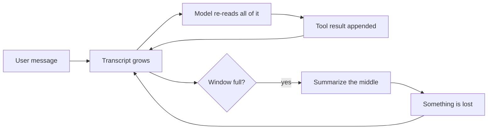
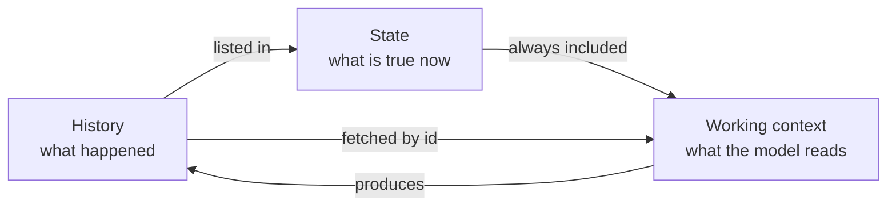
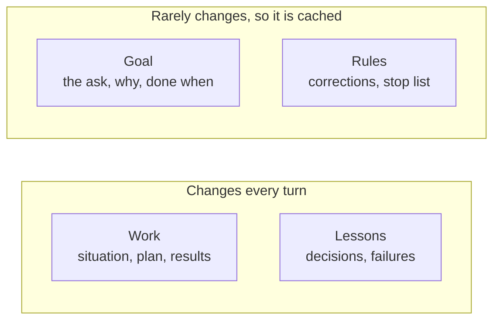
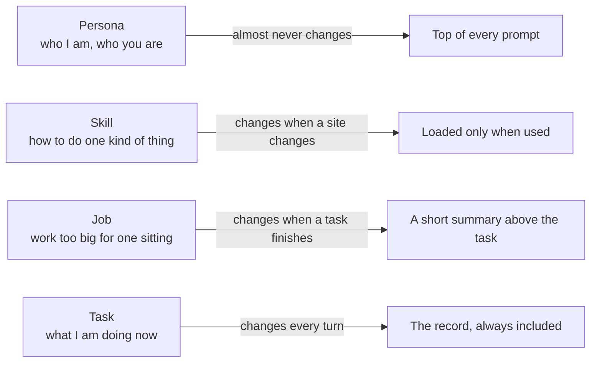
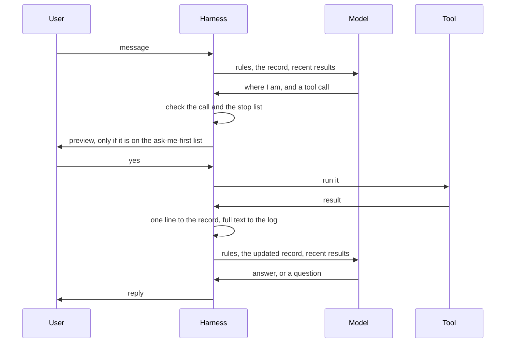
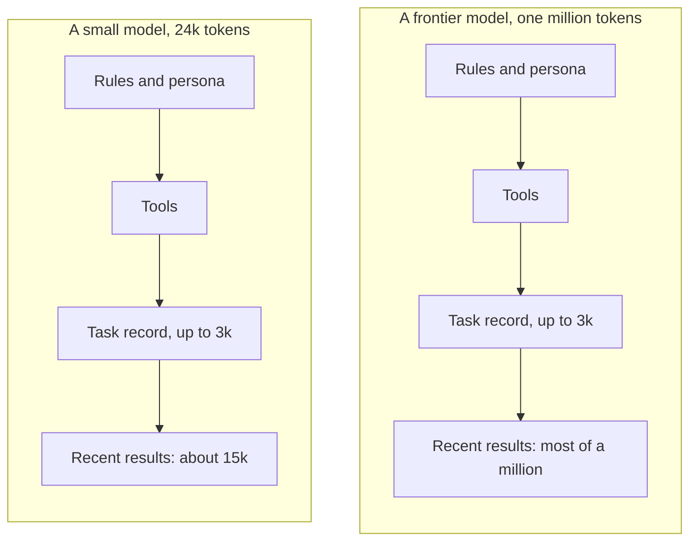
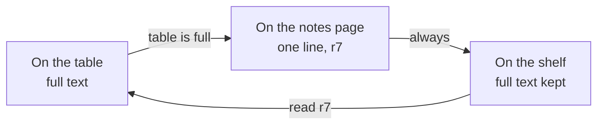
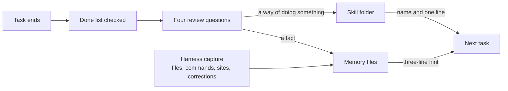

# Nerd Genie: how it works

Nerd Genie is an AI agent that runs on your own computer. You give it a job, in a terminal or over Signal, and it does the job: it reads and writes files, runs commands, opens a real Chrome window and uses it like a person, and keeps going until the job is done or until something you told it to stop for happens. It works with any language model, including a small one on your own graphics card.

This page says how, in plain words. The short version is one change. Every other agent keeps its whole conversation as its memory, re-reads it on every step, and squeezes it into a summary when it gets too long. Nerd Genie keeps a short record instead: a page that says what you asked, what done looks like, what has been decided, what has failed, and what the tools found. The harness, the program around the model, keeps that page true. That is why your words are never lost, why it cannot call a job done without proof, why a step costs about the same on the fortieth round as on the tenth, and why a small model can do long work.

The full design is in `docs/NERDGENIE_PLAN.md`, the code layout in `ARCHITECTURE.md`, and how to write an ask in `PROMPT_TEMPLATE_GUIDE.md`. The last section here is a table that ties each claim to a design section and to the test that proves it.

## 1. The problem every agent has

A language model is a program that turns text into text. You send it some text, and it sends text back. That is one call. The model remembers nothing between calls. It also cannot do anything on its own. It cannot open a file, run a command, or visit a web page.

An agent is a model plus a second program wrapped around it. That second program is called the harness. The harness does two jobs. It decides what text to send the model on each call, which is how the model remembers anything. And it runs tools for the model, which is how the model does anything. A tool is one thing the harness can do, such as read a file or click a button on a web page. Everyone can use the same models, so the harness is what makes one agent different from another.

We read the code of eight agents: OpenClaw, Hermes, Prime, OpenCode, Atomic, ZeroClaw, Codex, and Claude Code. They all work the same way. They keep the whole conversation in one long transcript. The transcript is everything the user said, everything the model said, and everything every tool returned. On every call, the model reads the whole transcript again to figure out where it is.



That works until the transcript no longer fits in the model's window. The window is the most text a model can read in one call. When the transcript is too long, the harness asks the model to write a summary and throws the old text away. The model decides what to keep. Whatever it leaves out is gone.

Think of a video game that loads your saved game by replaying every button you ever pressed since you started. That is what re-reading the transcript costs on every call. And a summary is the game guessing which of your button presses did not matter.

Here is what each agent does when its window fills up. This comes from reading the code. The full comparison is in `docs/HARNESS_V2.md`.

| Agent | When the window fills |
|---|---|
| OpenClaw | Tells the model to save its notes, then summarizes and keeps the most recent 20,000 tokens |
| Hermes | At half the window, throws out old tool output and summarizes the middle. The user's own messages are kept word for word |
| Prime | Summarizes, but keeps a notes file with a history, and the next call reads it |
| OpenCode | Summarizes, but reads its project file from disk again on every step, so that file cannot be lost |
| ZeroClaw | Never summarizes. Drops whole old turns that no longer fit |
| Claude Code and Codex | Summarize the conversation and keep their instruction files on disk |

Two of these agents have a good idea. Hermes never summarizes the user's own words. Prime and OpenCode keep some state in a file that the model reads again on every step, so it cannot be lost. Nerd Genie takes both ideas as far as they go.

## 2. One task, two ways

Here is the same job given to a transcript agent and to Nerd Genie. The job is: "Post a tweet about the DigiByte anniversary. Use the product notes and keep it under 280 characters." It takes about forty tool rounds: reading the notes, searching the web, drafting, opening the browser, logging in, and posting. At round twelve the user texts a correction. At round thirty, X shows a login page. Then the user is away for three days.

| What happens | A transcript agent | Nerd Genie |
|---|---|---|
| Round 12. You text: "no, lead with the date, not the features" | Your message goes into the pile. When the pile is summarized, your words are replaced by the model's summary of them. Hermes keeps your words, but not the reasons around them | The harness writes your words into the record under corrections. They stay there, unchanged, until the task ends |
| The first draft is 312 characters and fails | The failure and its cause get summarized away. The next draft can make the same mistake | The failure and its cause are written in the record. The next draft is told: one fact per post |
| Round 30. X shows a login page | The model decides on its own whether to keep trying. There is no hard cap on how long it tries | "A login page appears" is on the stop list. The harness stops before the next tool call and sends you a screenshot |
| You are gone for three days | The whole transcript is reloaded, summaries and all | The 3,000-token record is reloaded, on the same model or a different one |
| Round 40 | The prompt is about 65,000 tokens, and the cache was wiped by two summaries | The prompt is about 20,000 tokens, and most of it is cached |
| The model says "done" | It is done because the model said so | Each line on the done list must point at a result. A line with no proof sends the model back to work |
| The same job on a small local model | It summarizes every few rounds and loses a little each time | The record is the same. Only the window is smaller |

That is the whole difference. Everything below explains how the record, the loop, and the window are built so that the right-hand column is true on any model.

## 3. The Nerd Genie answer: keep three things apart

Nerd Genie separates three things that other agents mix together in one transcript.

The first is the history. This is what happened: every message, every tool call, and every result, in order. It is written to a log and never changed. The model does not read the log.

The second is the state. This is what is true right now. It is a short document called the task record. It says what the user asked for, what done looks like, what the plan is, what has been decided, what has failed, and what the tools have found. It is one to three thousand tokens long. A token is a piece of text about the size of a short word. The model reads the record on every call.

The third is the working context. This is the text that is actually sent to the model on one call. It holds the rules, the record, and the most recent messages and results. The harness builds it fresh for every call and throws it away afterward. Its size depends on the model.



This is an old idea in computer science. A database keeps a log of every change and, beside it, a table of what is true now. An operating system can pause a program and start it again days later from one small record. Nerd Genie does the same thing for an agent. The hard part is not the idea. The hard part is giving the record a fixed shape with rules, so the model cannot write whatever it likes into it. That shape is next.

## 4. The task record

The task record has four parts. The goal says what the user asked for and what done looks like. The rules say what the user has corrected and what should stop the work. The work says where things stand. The lessons say what has been decided and what has gone wrong. Here is a complete example.

```
# task 17   running   from Signal   budget left: 86 rounds, 51 minutes
this turn: 6.1k tokens in, 5.2k of them cached, 0.4k out

## Goal
Ask: "Post a tweet about the DigiByte anniversary. Use the product notes and keep it under 280 characters."
Why: mark the anniversary publicly today.
Done when:
- [ ] one post is up on the DigiByte account ->
- [x] it is under 280 characters and mentions the date -> r6

## Rules
Corrections:
- C1 "no, lead with the date not the features"
Stop and tell the user if:
- the account shows a login page or a captcha
- the post is still over 280 characters after two tries

## Work
Situation:
- browser tab t1: x.com/compose, "Compose post"
- files changed in this task: none
Plan:
- [x] 1 read the product notes -> r3
- [x] 2 draft the post -> r6
- [ ] 3 post it
Results (read any of them in full with `read r7`):
- r3 read memory/product.md, 2,100 characters
- r6 draft post, 236 characters

## Lessons
Decisions:
- D1 Lead with the date. Reason: correction C1.
Failures:
- F1 Draft 1 was 312 characters. Cause: three facts in one post. Keep to one.
```



**The goal.** The ask is the user's message, word for word. It is never edited. Under it is one line on why the user wants it. That line is what lets the model make a sensible call when the plan breaks, instead of guessing. Under that is the done list. Each line is one thing that must be true at the end, and each line ends with an arrow pointing at the result that proves it. A done list holds at most five lines.

**The rules.** Corrections are anything the user said while the task was running, in the user's own words. They are only ever added to. The stop list is a short list of things that should stop the task at once. The harness adds two lines of its own to every stop list: the budget running out, and a login page, a two-factor prompt or a captcha appearing in the browser. It checks those two itself before every tool call, because they are the two it can see. The other lines are about the work, so the model says the moment one of them comes true, through the `task` tool, and the harness stops the task at once and tells you which line.

**The work.** The situation is a few facts the harness can check on its own: the page the browser is on, the files changed in this task, the last command that ran and whether it worked (a port check or a poll carries no command and leaves it as it was), and the state of the tests. The plan is the list of steps, at most ten, with a check mark and a result id on each finished one. The results are one line for each of the newest forty things a tool returned, with an id like r7; older lines leave the record and stay in the log. The full text of every result is in the log, and `read r7` brings it back.

**The lessons.** A decision is a choice the model made, with its reason, so it does not argue with itself later. A failure is something that went wrong, with its cause, so it is not repeated. Each is kept to one line, and the record keeps the newest six of each.

**Where the shape comes from.** The U.S. Army writes every order in the same fixed format, called the five-paragraph operations order, so that anyone can write one and anyone can check one, even when the radio is dead and the plan has fallen apart. We borrowed five ideas from it. State the situation first. Keep the request in the words of the person who gave it. Write down why they want it, so people can still act correctly when the plan breaks. List, before the work starts, the things that must stop the work and be reported at once. And when the work is over, hold a short review that asks what was supposed to happen, what happened, why they differ, and what to keep or change.

**Who writes what.** The harness writes everything that ordinary code can verify: the header, the corrections, the situation, the results, the state of the tests, and a failure for a red test run after an edit. That costs no model tokens. The model writes the parts that need judgment: the why, the done list, the stop list, the plan, the decisions, and the failures. It marks each plan step and done line with the result that proves it, and the harness checks that result is real. It writes all of this through a tool called `task`, in the same reply as its other tool calls, so updating the record never costs an extra call. A step or done line can also be marked on the first line of a reply, "step 3 done: r41", with no call at all. The `task` tool refuses a decision with no reason, a failure with no cause, a done line that names a result not written yet, and any change to the ask or to a correction.

**When a record exists.** A record is created on the first tool call. A question that can be answered without tools gets an answer and nothing else.

**Checkpoints.** Every change to the record is saved as a numbered checkpoint, like a saved game. A task that is waiting for the user holds nothing in the model's memory. It picks up from its last checkpoint when the user replies, even days later, even on a different model. The command `/tasks 17 back 3` goes back three checkpoints and lets the model try a different path.

**How a task ends.** When the model says it is done, the harness reads the done list. Every line must point at a result or at a reply from the user. A line with nothing behind it sends the model back to work. A line that points at a test run older than the model's last edit is sent back too, because that proof is no longer true. Where a line names something the harness can check itself, such as a file that should exist or a command that should pass, the harness checks it. Otherwise the model judges whether the result satisfies the line, and it must say which result. This is what stops the model from declaring victory early. A stop line that fires when every done line is already proved counts as a finish, not a stop. Then, if the task had a correction, a failure, a stop, or more than five rounds, the review runs: four questions with the tools off, and only the last answer is saved, as a fact in memory or as a skill. When the folder has an `ARCHITECTURE.md`, or the task belongs to a job, a fifth question asks which section of that page the task changed and what it should say now, and the harness writes that section. Finally the user gets a short message: what changed, what was checked, and what is left. If a task stops or fails, the user gets a message saying what happened.

**When a task becomes a job.** A task is one sitting of work: thirty seconds to an hour. There is no budget on a task unless you set one, so nothing stops a task but its own ending. A task that would run all day is a job. When the model sees that an ask has many features, cannot be finished in one sitting, or has a part that must wait for a date, it makes a job: it writes the job's task list first, then works the first task. The harness holds it to that. A task's done list holds at most five lines and its plan at most ten steps, or six steps when the ask is over six hundred words. A sixth done line or an eleventh step is refused with a message that says this ask is a job: make it with the `job` tool, one task per done line, and work the first task. A job for an ask over six hundred words must list at least three tasks, because a one-task job for a whole game once finished with only the scaffold built.

A job has the same four parts as a task, with two differences. Its plan is a list of tasks instead of a list of steps, and its results are the reports of the tasks that have finished. A job also has a short name, a few words the model gives it, and that name is what `/jobs` and the screen's side panel show. Here is the top of one.

```
# job 4   running   3 of 12 tasks done   next: task 31 today at 14:00

## Goal
Ask: "Run the DigiByte anniversary campaign this month. One post a day on X, one blog piece, and a summary for me at the end."
Name: DigiByte anniversary campaign
Done when:
- [ ] one post is up for every weekday of the month
- [ ] the blog piece is published
- [ ] the user has the summary

## Work
Tasks:
- [x] t17 post the anniversary tweet -> j4.1
- [x] t19 draft the blog piece -> j4.2
- [x] t22 post for day two -> j4.3
- [ ] t31 post for day three · due today at 14:00
- [ ] t40 write the summary for the user · due after the last post
Reports (read any of them in full with `read j4.2`):
- j4.1 posted, 236 characters, link saved
- j4.2 draft saved to blog/anniversary.md, 900 words
```

The model breaks a job into tasks that each fit in one sitting, each with one clear done line. Tasks are listed in order, and a later task can use the reports of the earlier ones, because those reports are in the job with ids. A task that has to wait for a date gets the date. The model can add a task or split one as it learns more, and it never removes a finished one.

The harness runs one task at a time. When a task finishes, its report is written into the job and sent to you with the job's progress, such as "3 of 12 tasks done." Then the next task starts, or waits for its date. If a task fails three times in a row, the job pauses and tells you. When the last task is done, the job's own done list is checked, its review runs, and you get the final report.

A scheduled job, such as "every weekday at 7 in the morning, post the daily update," is just a job whose tasks are created by the clock. So there is one idea called a job. `/jobs` lists them all, and `/cron` lists the ones with a schedule. One comes with the agent: a self-check at four every morning that asks the memory twenty questions, dry-runs every skill, and tells you in one line what passed, what failed, and what it could not check, such as a skill with no steps to replay.

**When the ask is a work order.** You can write an ask in the record's own shape, under six headings: Goal, Where, Done when, Rules, Tasks, Details. `PROMPT_TEMPLATE_GUIDE.md` explains each one. When an ask has those headings, the harness makes the job itself before the model is called: the goal becomes the name and the why, each Done when line becomes a done line, the Rules become the record's rules with "tests first" always the first, and each Tasks line becomes a task. A done line can carry a check in brackets that the harness runs itself: `[tests pass: npm test]`, `[exit 0: node build.js]`, `[shows: "Tic Tac Toe" at http://127.0.0.1:8096]`, or `[exists: dist/index.html]`. The harness runs those checks at the end of every task and at the finish, marks the ones that pass with the task's report, and counts them on the job's header as "done lines proved: 1 of 2". A job never closes on a red check. Each task of such a job sees only the Details sections its line names, in full, and the other sections by heading; `read ask dragon` brings any section back. A plain ask, with no headings, runs exactly as before, with the model writing the record itself.

## 5. The four kinds of state

Nerd Genie keeps four kinds of state, because they change at four different speeds.

The persona is who the agent is and who the user is. It is three plain text files you can edit by hand, each with a size limit. It almost never changes.

A skill is how to do one kind of thing. It is a folder with a description, the steps, a test, and a list of changes. It changes only when a website or a tool changes.

A job is a piece of work too big for one sitting. It is a record with a goal, rules, a list of tasks, and lessons. It changes when one of its tasks finishes, which is hours or days apart.

The task is what the agent is working on right now. It is the task record from the last section. It changes every turn.



Think of a carpenter. The persona is who the carpenter is. A skill is a joint the carpenter has learned to cut and can cut again without thinking. A job is the whole kitchen the carpenter was hired to build. The task is the one cabinet on the workbench today. The cabinet changes from hour to hour. The kitchen changes only when a cabinet is finished.

Keeping the four apart is also what makes each call cheap. Model providers charge much less for text they already read on the previous call, because they can reuse their work. That reused text is called the cache. The persona never changes, so it is cached on every call. A skill loads only when it is used, so it costs nothing the rest of the time. A job's summary changes only when a task finishes, so it is cached for the whole task. The task changes every turn, so it comes last, after everything that is cached.

A project carries state of its own too, in three files in its folder. `NERDGENIE.md` holds the project's rules and how to run and test it. It is short, so it rides in the prompt under the job summary on every call of a task in that folder, cut at sixty lines. `ARCHITECTURE.md` says how the project is put together, one section per part, and `REPO_MAP.md` says where everything is. Those two are never read whole. Every fresh window names the architecture page's sections and the map's root folders, and the model reads one section by its heading, `read ARCHITECTURE.md hazards`, when it needs it. The harness keeps them true: the review writes the section a task changed, and a finished job writes `NERDGENIE.md` when the folder has none.

## 6. What happens on one turn



The message is saved to a queue on disk first, so it cannot be lost. If it is a slash command like `/status`, or it matches a saved skill, the harness handles it without calling the model. Otherwise it is a task. The harness sends the model the rules, the record, and the recent results. The model writes one line saying where the work stands, then either answers or asks for a tool. Before any tool runs, the harness checks the call. Is it the same call as last time? Is it badly written? Is the budget used up? Did the page the browser just read show a login page or a captcha? If the tool would do something on the ask-me-first list, the user sees a preview first. Otherwise it just runs. The result gets one line in the record and its full text in the log, and the model is called again with the updated record. When the model answers in plain text, the turn is over. When it asks the user a question, the turn is over too, and the task waits.

A few rules make this loop safe on any model. The agent works on one task at a time, and new tasks wait in line. When a task belongs to a job, its report goes into the job and to you, and the next task starts. A task has no budget unless you set one in `config.toml`; Nerd Genie puts no cap on its own work. When you do set a budget of rounds or of time and it runs out, the model gets one last call to say what it did and what is left. The same tool call with the same arguments is never run twice. A badly written tool call is repaired if the tool name is close to a real one, and otherwise the model gets the list of real tools back. Neither one ever crashes the agent. Words inside a web page or a file are never instructions, so nothing the agent reads can make it send a secret or spend money. And if the model's provider fails, the harness retries three times and then moves to the next model on the list.

When you send a message during a task, the task pauses as soon as the current tool call finishes, and the model reads your message. If it changes the job, it goes into the record as a correction and the model steers from there. If it is a new request, the agent handles it and then goes back to the task. If it says stop, the task stops.

The harness also does the checking a careful person does without being asked. After every write or edit, it runs the language's own checker on the file and, once the model has run the tests once, runs them again, and puts both answers on the change's own result, so the model never spends a round finding out that a file does not parse or that a test went red. A change to a code file after a green test run gets one line on its result: tests first, no failing test covers this change, write it first. And a page the model is building on this machine can be asked a question, one expression such as `window.game.state`, so an app is play-tested by its own state rather than by drivers written through the shell.

The harness watches for a model going round in circles, and it has a ladder for it. It counts rounds in which nothing measurable moved: no test went green, no step or done line was marked, no page changed under an action, no new file was written, and nothing new was read. At ten such rounds the model reads one line saying so. At twenty, the harness cuts the stalled rounds out of the conversation and keeps everything before them, so the model stops seeing the pattern that was feeding itself; the stall goes into the record as a failure. It also asks for a rethink: one call with the tools off, over the record and the thing the model kept asking for, that asks what it was trying to learn, what the rounds showed, and which one call would tell two causes apart. The answer goes into the record, the repeated call is closed for ten rounds, and a fresh window opens on the answer. The count starts again. After three such cuts, a fourth stall stops the task and tells you. A call the model repeats word for word is refused on the third try and earns the same rethink on the fourth. When the conversation reaches its message cap, the harness opens a fresh window the same way, with the newest results in full and the ask last, instead of dropping half the conversation. Inside a job, a task the harness stopped this way is picked up once by the job itself before the job waits for you; a task you stopped is never picked up behind your back.

The stop list works like a smoke detector. You decide what counts as an alarm before there is a fire. The two alarms the harness can see for itself, a login page and a spent budget, it checks before every tool call. The rest are about the work, so the model says the moment one of them has come true, and the harness stops the task at once and tells the user which line. Either way the alarm was written down before the work started, not decided in the moment.

## 7. Small models and big models

Nerd Genie has one rule for the working context. It is never smaller than the task needs and never bigger than the model can hold.



The first three parts are the same on every model. The rules, the persona, the tool list, and the record add up to about six thousand tokens, and the record never grows past three thousand. Whatever room is left is filled with the most recent results, in full. On a model with a 24,000-token window, that room is about fifteen thousand tokens. Our local Qwen runs a 131,072-token window, so its room is over a hundred thousand. On a frontier model, it is most of a million. A big model is never held back to suit a small one. A small model is never asked to hold more than it can.

Here is what happens when that room runs out. Say you are researching a question in a library. You pull books off the shelf and read them. As you go, you keep a notes page. Every book gets one line: its call number, its title, and what it told you. The table only holds so many open books, so when you are done with one, it goes back on the shelf. Your notes page still lists it. If you need it again, you use the call number and get it back.

The books are the tool results, the web pages and files and command output the agent pulls in. The notes page is the task record. The shelves are the log. The open books on the table are what the model is reading right now. Nothing is thrown away, and nothing is rewritten. The only thing that ever changes is which books are open on the table.

Other agents keep every book they have ever pulled open on the table. When the table is full, they write a one-page summary from memory and clear the table. Whatever did not make it onto that page is gone.



The order of the prompt matters more than its size. Text that is identical to the last call costs about a tenth as much, because the provider reuses it. So the parts that never change come first: the rules, the persona, the tools, the job summary if there is one, and the goal and rules of the record. The parts that change every turn come last. An agent that summarizes its transcript rewrites the front of its prompt every time it summarizes, and loses the whole cache right when the prompt is biggest. Nerd Genie never rewrites anything above the record's work section.

Small models also write their tool calls badly, as loose text instead of the proper form. The harness reads every common shape and fixes tool names that are close. So a small model drives the same twenty tools as a big one.

Working on any model is a test, not a promise. The test suite has a fixed task with forty tool rounds, a correction at step twelve, and a stop condition at step thirty. It runs on the fake model in every test run, and on the real ones in the live suite: the local Qwen, Opus through Claude Code, and GPT through Codex. It checks that the ask and the corrections are still identical to the last character, that the done list passed, and that every result can still be read.

## 8. Why it costs fewer tokens

A transcript agent pays to re-read everything on every call. Nerd Genie pays for a record of three thousand tokens plus a window, and most of that is cached. Here is a rough picture for one task of forty tool rounds where each result is about fifteen hundred tokens. These are estimates to show the shape. The real numbers come from the cost line the harness writes every turn.

| At tool round | A transcript agent sends | Nerd Genie sends |
|---|---|---|
| 10 | about 20,000 tokens | about 20,000 tokens, mostly cached |
| 20 | about 35,000 tokens, or a summary and a cold cache | about 20,000 tokens, mostly cached |
| 40 | about 65,000 tokens, after two summaries | about 20,000 tokens, mostly cached |

The transcript grows with every round, and each summary wipes the cache. The Nerd Genie prompt stays about the same size for the whole task, because the record stays small and the window slides. On a big model the window is wider, so each call costs more, but the cost still does not grow with the length of the task.

**What a round really costs, measured on 6 September 2026.** The local daemon reads a prompt at about five hundred tokens a second and writes an answer at about seventy. Cached tokens cost nothing to read again; the tokens after the first change in the prompt cost about two seconds a thousand. On the game build's play-test that was seven thousand tokens a round, fourteen of its nineteen seconds: the round's own new messages, which are the work, and then the tail behind them, the record's work and lessons, the list of results, the memory hint and the cost line. So the tail is kept short on purpose: the newest forty result lines rather than a hundred, six lessons of each kind at a hundred and twenty characters, and one read at most sixteen kilobytes. A task's speed is set by its rounds, and a round's speed by what is new in front of the model. One more thing sets it, found the same night and outside the harness. The local model is a hybrid, with state-space layers and full attention every few, so the daemon cannot roll its state back to any token and keeps checkpoints 8,192 tokens apart; every round re-read from the newest checkpoint before the record's tail, about four thousand nine hundred tokens on average, 64 percent of the model's time. One flag on the daemon's start line, `--checkpoint-min-step 1024`, brings that down to about the tail and the new round. It went onto the line on 6 September together with the vision projector, so the model now reads pictures: a screenshot of a page costs about eight hundred tokens, and the model described one down to the numbers on its HUD.

## 9. Why it remembers better

Inside a task, the record is the memory, and its rules are what make it reliable. The user's words are never rewritten. Every decision keeps its reason. Every failure keeps its cause. Every result keeps its id. Every change has a checkpoint. Nothing is summarized, and nothing is thrown away.

Across tasks, memory lives in two small files and a folder. `MEMORY.md` holds facts about the world and `USER.md` holds facts about the user. Both have hard size limits, which is the Hermes idea. A folder of plain text files holds anything bigger. All of it is searchable, along with every past message.



Most of what goes into memory is written by the harness, with no model call. It records files changed, commands run, websites visited, and jobs created, and it records what happened, not what was asked: a command that failed is written as failed, a command or a site that was refused is written as refused, and a call that got no result is not written at all. It also keeps, word for word, any message from the user that starts with "no," "actually," "always," "never," or "don't." The review writes the rest, and only its last answer is saved. Every fact has a source and a date. Nothing is deleted. A new fact replaces an old one, and the old one stays searchable. On every call, three lines from memory search ride along at the end of the prompt, and a `memory` tool searches the rest when the model asks.

Other agents have memory files too. The difference is what gets written and who writes it. OpenClaw pushes recall into every prompt and rewrites its memory file on a schedule, and its memory index caused two of its worst bugs in the week we looked. Nerd Genie writes facts from the log for free, saves one reviewed lesson per task, and keeps the hint to three lines.

## 10. Why it is safer and more reliable

The agent runs on its own. It stops for a yes only for the things on your ask-me-first list. That list starts with three entries: deleting many files at once or anything like `rm -rf`, running a command with sudo, and spending money. You can add to it or empty it. A skill you have approved once never asks again. For anything on the list, you see a preview of exactly what is about to happen, the same way you read a text back before you hit send.

The loop cannot run away, and it is not capped either. There is no budget on a task unless you set one, and a forced answer when a budget you set runs out. The same call is never run twice. A stretch of rounds in which nothing measurable moves is cut, then rethought, and stops the task only on the fourth stall. A tool that hangs is killed after seven minutes. A bad tool call never crashes the agent. A task the program itself cuts off, by a restart or a turn limit, ends stopped with its record kept, and your next message picks it up where it was; a job puts such a task down rather than running it again from the top. The record never fails on its own bookkeeping: when it would pass its size, its oldest result lines leave first, and every one of them is still readable by its label.

The finish is defined before the work starts. The done list and the stop list are written before the first tool call, and the harness enforces both. A done line is proved only by a result that is still true, and a check you wrote in brackets is run by the harness, not judged by the model.

Commands run inside a sandbox, which is a fenced-off part of the machine that cannot reach your keys or the vault. Think of a workbench with a raised edge. Whatever rolls away stays on the bench instead of falling to the floor.

The model never sees a password. Passwords live in an encrypted vault. You type them once in the terminal, through a prompt that shows stars. When the agent needs to log in to a site, it points at the login boxes, and the harness types the password itself.

Words inside a web page or a file are never instructions. The harness marks everything a tool returns as data. Nothing the agent reads can make it send a secret, spend money, or do anything on your ask-me-first list.

The log is the truth. A reply is written to the log before it is sent. After a crash, the agent replays the log and rebuilds its state. A message that had to be sent again says it might be a duplicate. If the agent keeps crashing, a breaker stops the loop. The service manager restarts it, a watchdog restarts it if it stops checking in, and an update that does not come up within a minute rolls itself back.

Any failed task becomes a test. Because the log holds every tool result, a failed task can be run again against new code with the same results. A bug fixed once stays fixed.

## 11. How it compares, point by point

| | OpenClaw | Hermes | OpenCode, Claude Code, Codex | Nerd Genie |
|---|---|---|---|---|
| Your exact words survive a long task | No. They end up in a summary | Yes for messages. The reasons around them do not | No. They end up in a summary | Yes. The ask and every correction are locked and never rewritten |
| Decisions keep their reasons | No | No | No | Yes. A decision without a reason is refused |
| Mistakes are not repeated | Only if the summary kept them | No. Old tool output is pruned | Only if the summary kept them | Yes. Every failure keeps its cause in the record |
| It knows when to stop and tell you | No stop list | No stop list | No stop list | A stop list, written before the work starts; the harness checks the two lines it can see for itself before every tool call and stops at once when the model reports another |
| It cannot loop forever | No hard cap on rounds | No hard cap on rounds | Not by default | No repeated calls, a ladder of cuts and rethinks that ends in a stop, a hung tool killed, and a budget only when you set one |
| Done means proven | The model says so | The model says so | The model says so | Every done line must point at a result or a reply from you, and a check you wrote is run by the harness |
| It works on its own | Asks often | Asks often | Asks often | Asks only about your ask-me-first list |
| Cost on round forty versus round ten | Much higher, and summaries wipe the cache | Higher, and summaries wipe the cache | Higher, and summaries wipe the cache | About the same, and mostly cached |
| Pause for days and pick up again | Reloads the transcript | Reloads the transcript | Reloads the transcript | Reloads a 3,000-token record, on any model |
| Work that takes weeks | Lives in the transcript, or in a cron entry with no memory of the last run | The same | The same | A job record with a task list and every task's report, reported to you task by task |
| Runs the same on a small model | Summarizes every few rounds | Summarizes every few rounds | Summarizes every few rounds | Same record, smaller window, tested on Qwen at every stage |
| What it learns from a task | A memory index and scheduled rewrites, which caused its worst bugs | A background review with a budget | Nothing, or instruction files you edit yourself | Facts captured for free from the log, plus one reviewed lesson per task |

## 12. What we took from the others, and what is new

From OpenClaw we took a clean loop with hooks around it, a way for a message that arrives mid-turn to steer the next step, a repair layer for badly written tool calls, scheduled jobs that back off after failures, Signal support with pairing for unknown senders, a delivery queue on disk, and a real Chrome browser with its own profile that reads the page as a tree with short tags. We left behind the summarizing, the memory index, and the separate screen process joined by a pipe.

From Hermes we took the rule that the user's words are never summarized, memory files with hard size limits, the crash-loop breaker, the delivery ledger, the masked password prompt, and one redaction function applied to everything that leaves the program. We extended the user's-words rule to the whole record.

From Prime we took notes with a history and a rollback that the next call actually reads, and budgets with a checker at the end. We turned the notes into a fixed-format record with rules the harness enforces.

From OpenCode we took one core with every screen as a thin client, streaming replies, one command table for every screen, approvals shown inline with once, always, and reject, a permission engine built from rules, plain-text tool descriptions, and the rule that a bad tool call is an error the model can fix rather than a crash.

From ZeroClaw we took the cap on tool rounds with a forced final answer, the parser for messy tool calls, a job store where two processes cannot claim the same job, and an updater that rolls back.

From Codex and Claude Code we took the rule that the operating system sandbox is the real security boundary, that asking for more permission is a field on the tool call with a written reason, and that the model decides what to do while the harness decides what is allowed.

From the browser agents browser-use and Stagehand we took marks on elements that just appeared, hints about what is below the fold, and a finish step that must say whether it succeeded.

Six things here are not in any of them. The task record is the state, kept beside the log instead of a summary in place of it. The record has a fixed shape with rules the harness enforces, so the user's words cannot be edited, decisions carry reasons, and done is a checklist with proof. The harness does the bookkeeping for free, writing the situation, the results, and the corrections with no model call. One rule sizes the working context to the model, and nothing is ever summarized, only put back on the shelf and kept. A task cannot end until the done list is proven, after which a few fixed questions decide what is worth remembering. And work too big for one sitting becomes a job, a record with a list of tasks, so that a month-long campaign has a place to live and reports to you task by task.

## 13. The tools

There are twenty tools. Every model sees all of them. Each one is described in under forty words. The harness builds every result, so the model cannot invent one.

| Group | Tools | What they do |
|---|---|---|
| Files | `read`, `write`, `edit`, `search` | Read a file, a folder, one section of a Markdown file by its heading, a past result by its id, or one part of the ask by its heading. Write or edit a file inside the allowed folders. Find files or lines |
| Machine | `shell` | Run a command in the sandbox. If it takes more than ten seconds, it returns a process id you can check on or stop. Start a server and get its port back the moment it listens, or check whether a port answers. Asking for sudo needs a written reason and a preview |
| Web | `web` | Search the web, or fetch a public page as text. Anything behind a login belongs to the browser |
| Browser | `browser_open`, `browser_read`, `browser_screenshot`, `browser_resize`, `browser_click`, `browser_type`, `browser_act`, `browser_login`, `browser_handoff` | Use a real Chrome on the screen like a person. Open a page, read it as an outline with the page's own errors, take a picture of it, resize the window, click, type, do one action and check it worked, log in from the vault, or hand the window to the user |
| Desktop | `computer` | Open an app, take a screenshot with numbered marks that a model with eyes sees as a picture, click, type, drag. The last resort when the browser cannot do the job |
| The agent's own | `memory`, `skill`, `job`, `task` | Search and save memory. View, run, or save a skill. Create a job, with or without a schedule, or add a task to it. Update the task record |

Three things tie the tools to the record. Every result gets one line in the record and its full text in the log, which is how the record stays small and nothing is lost. The `task` tool is the only way the model writes to the record, and it enforces the record's rules. And `read r7` brings any old result back in full. Asking the user a question is not a tool. The model just asks, and the turn ends.

## 14. The check table

This table is how a person or an agent checks that the design, the code and this explanation agree. For each row, the design section should say what this document says, and the test should exist and pass. If either is missing, that is a gap, and it should be reported rather than patched in the wrong place.

| What Nerd Genie does | Design | Proved by |
|---|---|---|
| Keeps the history, the record, and the working context as three separate things | §1, §4 | Log replay test; record round-trip; golden prompts for a 24k model and a 200k model |
| Never edits the ask or the corrections | §4 | Each rule rejects a bad edit; the forty-round task checks them to the last character |
| Requires a reason on every decision and a cause on every failure | §4 | Rule tests; every `task` operation checked against the rules |
| Keeps a lesson to one line and a list of lessons to the newest six: a failure's or a decision's text and cause are cut to 120 characters after a whole word, the oldest leave the record and stay in the log, and the labels keep counting upward | §4 | `TestLessonsAreCutToALineAndTheOldestLeaveWhenTheListIsFull` in `internal/record/lessons_test.go`: the fifth game build's play-test task died on the harness's own bookkeeping a second time, on seventeen paragraph-long failures worth 1,765 tokens |
| Answers a pin, a done list with results, or a step mark with what each named result is, in the one line the record keeps for it | §4 | `TestAPinnedOrMarkedResultIsShownAsItsSummaryLine` in `internal/tool/task/task_test.go`: the fifth game build's play-test task pinned four done lines and spent three rounds reading the four results back |
| Takes any result label the record has reached as proof, whether or not its line is still on the results list, and refuses one past the newest | §4 | `TestAResultThatLeftTheListStillProvesTheLineItWasPinnedTo` in `internal/record/size_test.go`: the fifth game build's play-test task could not pin its last done line once the first line's result had left the list, because a pin rewrites the whole list |
| Lets the model read the two folders inside its home whose paths the harness itself hands out, the spill of a long result and the saved screenshots, and no other | §11 | `TestTheFoldersTheHarnessHandsOutAreReadableInsideTheAgentsHome` in `internal/tool/roots_test.go` |
| Says once, after a round spent on nothing but a step mark or a pin through the task tool, to put the mark on the first line next time | §5, §6 | `TestARoundSpentOnlyMarkingTheRecordEarnsTheHintOnce` in `internal/loop/firstline_test.go`: the nightly set's second run showed the rule in the instructions was not enough on its own |
| Keeps how the last task or job ended on the side panel while the program is idle, under its own heading, and drops it while a task runs | §6 | `TestTheLastTaskStaysOnThePanelWhenTheProgramIsIdle` in `internal/tui/qafixes_test.go`: the desktop window the morning after the fifth game build showed the model and the word idle with the ending only in the transcript |
| Says, at ten rounds without progress after the model wrote a failure, that the record already holds it, quotes its cause, and asks for a change and no more failures, rather than the plain stall line that asks for one | §5, §6 | `TestTheNudgeNamesTheCauseAlreadyOnTheRecordWhenNothingWasChangedSince` and `TestTheNudgeAfterAFreshFailureAsksForAChangeAndNoMoreFailures` in `internal/loop/progress_test.go`: the nightly game build, told by the stall line in its window to write what the rounds showed, wrote the same failure seven times until the guard stopped it |
| Marks a plan step or a done line from the reply's first line, "step 3 done: r41" or "line 2 done: r41", with no tool call and no round spent on it; a mark with no result, or one the record never wrote, marks nothing and the next request says why | §5, §6 | `TestAStepMarkedDoneOnTheFirstLineIsMarkedWithoutACall` and `TestAMarkOnTheFirstLineNamingNoResultOrAWrongOneMarksNothingAndSaysSo` in `internal/loop/firstline_test.go`: a fifth of the rounds in the fifth game build's last three tasks did nothing but mark a step or pin a line through the task tool |
| Tells the model when its reply was cut off at the output cap, keeps none of the cut-off reply, and says a long file goes in parts of at most three hundred lines, the first by write and the rest by edit; two in a row are sent back and the third is heard as it stands | §5, §6 | `TestAReplyCutOffAtTheOutputCapIsToldSoAndTriedAgain` and `TestAThirdReplyCutOffInARowIsKeptAsItStands` in `internal/loop/problems_test.go`: the tenth nightly run's frontend task hit the cap three rounds running writing the whole game file in one call, was offered the three options each time, and closed the task on "Let me write it carefully" with no game file written |
| Shows a picture to a model that can see: a `browser_screenshot` of the page with its elements numbered, a picture file read by path, or a desktop screenshot rides with its result as an image on both wires, and a model with no eyes is told the picture is not shown | §6, §7 | `TestAPictureRidesWithItsResultWhenTheModelCanSee` and `TestAPictureIsSaidToBeUnseenWhenTheModelCannot` in `internal/loop/picture_test.go`, the wire tests in `internal/provider`, and the tool tests in `internal/tool/browsershot`, `read` and `computer`: on 6 September 2026 the local model described a screenshot of the game, down to the next piece and the four numbers on the HUD, for about 800 tokens |
| Keeps only the newest two pictures in the window, and an older result says its picture is no longer shown and how to see it again | §6 | `TestOnlyTheNewestPicturesStayInTheWindow` in `internal/loop/picture_test.go` |
| Sees a change in a page's text as a change, so a click on a counter is clicked once, a number that appeared meets the expectation naming it, and a verdict not met says what the text now says; the old lines are counted, not kept as a set, so a turn indicator going from X to O while the scoreboard already says O is a change (run 29 heard "nothing changed" twenty times over it) | §7 | The counter test in `worker/browser/test/actions.test.ts` and the text-change tests in `expectation.test.ts` and `diff.test.ts`: the eleventh nightly run's page task saw 2 on every click for seventy-eight rounds because the diff knew no change but a new element, address, title, dialog, tab, or download |
| Counts what the model writes that no delta shows, its thinking and its tool calls, into the strip's "N tokens" for the call in progress | §6 | `TestTheOpenAIProviderCountsTheThinkingAndToolCallsItWritesUnseen`, its Anthropic twin, and `TestTheWatchedModelCountsWhatTheModelWritesUnseen`: the tenth run's screen read "thinking · 21 s · 0 tokens" through two minutes of the local model writing a file |
| Names the model file at the top of the screen and shows the last call's prefill and output speeds on the strip and in the MODEL panel, read from the local daemon's own timings | §6 | `TestTheOpenAIProviderReadsTheDaemonsSpeeds`, `TestTheWatchedModelReportsTheLastCallsSpeedsAndTheModelFile`, and `TestTheHeaderNamesTheModelFileAndThePanelShowsTheSpeeds`: on 6 September the strip read "local hauhau-Q4_K_P … prefill 418 tok/s · output 58 tok/s" |
| Tells the model when the same tests have failed on twelve runs in a row, naming them and the three ways out: change the approach, fix the test if the test is wrong, or leave the step unmarked and go on | §5, §6 | `TestTheSameTestFailingForADozenRunsDrawsAStuckLine` in `internal/loop/teststate_behaviour_test.go`: the fresh Tetris build's yeti task spent forty rounds on one failing test with every probe counted as progress |
| Tells the model, once every done line and plan step is marked done and it still asks for tools three rounds later, to answer and end the task, because more work belongs to the next task | §5, §6 | `TestAllMarkedAndStillWorkingIsToldToEndTheTask` in `internal/loop/problems_test.go`: the fresh Tetris build's yeti task had everything marked by round 174 and went on into the next task's work for twenty rounds |
| Sends an answer back to the plan when the record has no done list and a plan step is not marked done, naming the open steps and the one to carry on with, three times and then failing the task | §5, §6 | `TestAnAnswerWithPlanStepsStillOpenAndNoDoneListIsSentBackToWork` in `internal/loop/problems_test.go`: the same task's "Let me write it carefully" was taken as the whole done list with three plan steps open |
| Refuses a done line that names a result not written yet by naming the next label and saying to write the line bare and pin it later; the `task` tool and the rules say the same, so the list is written first and its proof marked as the work is done | §4, §5 | `TestADoneLineNamingAResultNotYetWrittenIsToldToWaitForItsProof` in `internal/record/lessons_test.go`, `TestTheDoneListFieldSaysFiveLinesIsTheMost` in `internal/tool/task/donelist_test.go`, and `TestTheInstructionTextSaysToWriteDoneLinesBareAndMarkThemLater` in `internal/context/instructions_test.go`: the tenth run's play-test task guessed labels r70 to r74 on a record at r20 for ten refused rounds |
| Holds a task on an ask over six hundred words to six plan steps rather than ten, refusing the seventh as a job | §4 | `TestALongAskRefusesAPlanOfManyStepsAsAJob` in `internal/record/plancap_test.go`: the nightly game build went as one task under a nine-step plan and stopped with one step done, where the same ask as a job of ten tasks was done the night before |
| Ends a task the way it was ending when the review's lesson cannot be kept, saying so on the report, and gives every review's fact an id of its own so two tasks with one number never collide | §6 | `TestAReviewWhoseFactCannotBeSavedStillEndsTheTaskDone` and `TestTheReviewsOfTwoTasksNeverShareAnId` in `internal/loop/review_test.go`: the nightly game build lost its job's first report and mark to a memory refusal |
| Marks a plan step done once: a step already done is refused naming the result it was done by and the next step waiting | §4 | `TestAStepAlreadyDoneIsRefusedNamingTheNextOpenStep` in `internal/record/stepdone_test.go`: the fifth game build's play-test task marked one step four times running after its fix landed |
| Writes a lesson once: a failure the record already holds, in the same or nearly the same words, is refused with the label of the one that says it | §4 | `TestRefusesAFailureTheRecordAlreadyHolds` in `internal/record/model_test.go`: the fifth game build's play-test task wrote one lesson ten times over as F8 to F16 while the meter counted rounds without progress |
| Gives every result an id and returns its full text with `read r7` | §4, §7 | Every result that left the window still readable by id |
| Keeps the record under three thousand tokens, by refusing the change that would take it past that size rather than by any budget | §4 | `TestARecordFilledToTheBudgetStaysUnderThreeThousandTokens` in `internal/record/size_test.go` fills a record with a hundred results, of which the newest forty stay on it, a full plan and done list, five stop lines, five corrections, and ten decisions and failures of which the newest six stay, and counts it under the size; `TestARecordIsRefusedTheChangeThatWouldTakeItPastItsSize` proves the write that would pass it is refused naming the part to shorten |
| Saves a checkpoint on every change and can go back | §4, §12 | Rewind test; `/tasks` through the fake channel |
| Writes the situation, the results, and the corrections without a model call | §4 | Scripted conversations; the situation filled from tool results |
| Checks the two stop lines it can see for itself before every tool call, and stops at once on a line the model says has come true | §4, §6 | `TestTheStopConditionFiresAtRoundThirtyAndTheUserLetsItResume` in `internal/testkit/fortystep_test.go` holds the fixture's round thirty to a login page; `TestTheFortyStepFixtureRunsEndToEndThroughTheLoop` in `internal/loop/fortystep_test.go` runs the forty rounds through the loop, which stops on that wall page and picks the task up on the user's reply |
| Pauses on a mid-turn message, then steers, answers, or stops | §3 | A mid-turn correction, a mid-turn new request, and a mid-turn stop |
| Puts no budget on a task unless the user sets one, and then stops with a final answer; never runs the same call twice, counted with its answer across the guard's window and not only in a row; repairs bad calls | §3 | No-budget test and budget test; detector test; `TestTheSameCallWithTheSameAnswerIsCaughtAcrossOtherCalls` in `internal/loop/guard_test.go`, from the task that alternated the same refused edit with a write nineteen times; a golden file per bad-call shape; a fuzz test that never crashes |
| Runs one task at a time and queues the rest | §3 | A second task waits until the first ends |
| Turns work too big for one sitting into a job with tasks that each fit in one sitting | §4, §5 | A task in a job reports to the job and starts the next; the last task closes the job |
| Refuses a job for an ask over six hundred words that lists fewer than three tasks, naming the rule, so a long ask cannot become a one-task job that finishes with the work unbuilt | §4, §5 | `TestAJobForALongAskNeedsItsWholeTaskList` in `internal/tool/job/create_test.go`: the fourteenth nightly run made the game a job of one task, the scaffold, and the job finished after it |
| Refuses a task with more than five done lines and sends the model to the `job` tool | §4, §5 | Five lines are kept and six refused, with the refusal naming the `job` tool; the rules sentence is checked against the design |
| Refuses a task with more than ten plan steps and sends the model to the `job` tool | §4, §5 | Ten steps are kept and eleven refused, with the refusal naming the `job` tool, in `internal/record/plancap_test.go`; the rules sentence is checked against the design |
| Keeps a long ask's done list and plan, held to the same five lines and ten steps | §4, §5 | `TestATaskTakesADoneListAndAPlanOnAnAskOfAnyLength` in `internal/record/asklength_test.go` |
| Takes a done line that names a result the record holds as done, mark or no mark | §4 | `TestADoneLineThatNamesAResultIsTakenAsDone` in `internal/record/namedproof_test.go` |
| Marks a plan step done through the `task` tool's `step_done`, with a result the record holds, so the side panel's checklist moves as the work does | §4 | `TestAStepDoneMarksThePlanStepWithItsResult` in `internal/record/stepdone_test.go`; `TestStepDoneMarksAPlanStepThroughTheTool` in `internal/tool/task/stepdone_test.go`; `TestTheLoopsOwnTaskToolReadsAStepDone` in `internal/loop/recordwrite_test.go`; `TestTheInstructionTextSaysToMarkEachPlanStepDone` in `internal/context/instructions_test.go` |
| Says so, in one line of its own, after five throwaway scripts with no edit between them, so a small model stuck reasoning out loud is sent back to the record and the code | §3, §6 | `TestTooManyProbesSinceTheLastEditGetOneLineBack` and `TestOrdinaryShellCallsAreNotProbes` in `internal/loop/probes_test.go` |
| Keeps the done list in the tail of the prompt, so proving a line never rewrites the cached front | §4, §7 | `TestAProvenDoneLineChangesNothingAboveTheCacheLine` in `internal/context/donelisttail_test.go` |
| Lists in the record only the results that have left the window; a result on the table carries its own label | §4, §7 | `TestTheRecordListsOnlyTheResultsThatHaveLeftTheTable` and `TestAResultOnTheTableCarriesItsOwnLabel` in `internal/context/resultstable_test.go` |
| Reads a test runner's summary for itself, writes the state into the situation and onto the result's line, and writes a red run after an edit as a failure with the edit as its cause | §4 | `internal/loop/teststate_test.go` and `internal/loop/teststate_behaviour_test.go` |
| Sends a job's task back to work when it ends on an offer to carry on over an unproven done list, rather than putting the job down | §4, §6 | `TestAJobsTaskThatOffersToCarryOnIsSentBackToWorkRatherThanPutDown` in `internal/loop/carryon_test.go` |
| Ends the task that made a job with tasks the moment the job is made, so the job's tasks carry the work and the side panel ticks task by task; a scheduled job leaves the task to go on | §4 | `TestATaskThatMadeAJobWithTasksEndsAtOnceSoTheJobsFirstTaskCanStart` and `TestAScheduledJobMadeMidTaskLeavesTheTaskToGoOn` in `internal/loop/handoff_test.go` |
| Carries a stopped or failed task on with the person's next message, written into the record as a correction, and names the files and standing of finished work to a follow-up | §3, §4 | `TestAnyMessageCarriesOnAStoppedTaskAndAllButTheBareWordSteersIt` in `cmd/nerdgenie/resuming_test.go`, `TestAnyMessageAfterAStopCarriesTheTaskOnAndIsWrittenAsACorrection` in `test/functional/resume_test.go`, `TestRecentWorkCarriesTheFilesATaskChangedAndWhereItStood` in `internal/loop/recentwork_test.go` |
| Turns a stall into a rethink: the fourth of the same call, or twenty rounds without progress, buys one call with the tools off over the record and the newest result in full, asking what was being learned, what the rounds showed, the symptom, two causes not yet on the record and the one call that tells them apart; the answer goes into the record as a failure and a decision, the repeated call is closed for ten rounds, and a fresh window opens on the answer; a rethink the model cannot answer falls back to the cut, and the stop after the last one lists what was tried | §3 | `TestARunOfTheSameCallRunsOneRethinkWithTheToolsOff`, `TestTwentyRoundsWithoutProgressRunOneRethinkToo`, `TestTheCallTheModelRepeatedIsClosedForTenRounds`, `TestARethinkTheModelCannotAnswerFallsBackToThePlainCut`, `TestTheStopAfterTheLastRethinkListsWhatWasTried` and `TestTheRethinkBackgroundIsCappedAtOneRead` in `internal/loop/rethink_test.go`: on task 8 of the night of 6 September 2026 the three-bit model wrote "time to stop circling" on its first line for fifty rounds while it made the same call on every one |
| Ends a task the program cut off, by a shutdown or the turn's limit, as stopped rather than failed, so a job puts it down with its record and the next message picks it up where it was | §3, §4 | `TestAJobsTaskCutOffByAShutdownIsPutDownWithItsRecord` in `internal/loop/cutoff_test.go`, `TestATaskCutOffByTheTurnDeadlineIsPutDownWithItsClaimLetGo` in `internal/loop/jobturns_test.go` |
| Keeps the record under its size by dropping the oldest result lines first, so a long task never fails on the harness's own bookkeeping, and every dropped result is still readable by its label | §4, §5 | `TestTheResultsListTrimsItsOldestLinesSoALongTaskNeverOverflowsTheRecord` in `internal/record/size_test.go` |
| Lists the loops, file and line, in the scripts the page itself runs and the modules they import, read from the local server or the disk and never another machine, while loops first and the one whose body never touches its condition marked, when the browser reports a page whose own script never yields; keeps the marked loop on the situation's browser line every round, and gives it back to a task picked up again from the newest browser result in the log | §5, §6 | `TestAHungPageListsTheLoopsInTheScriptsThePageRuns`, `TestAPageOnDiskListsItsLoops`, `TestAPageOnAnotherMachineListsNoLoops`, `TestAnOrdinaryBrowserResultListsNoLoops` and `TestAPickedUpTaskRemembersTheHungPageFromTheLog` in `internal/loop/hangs_test.go`: the live run's first list was twelve counted for loops of the renderer and the ghost-piece while fell off its end |
| Runs the language's own checker after every write or edit of a JavaScript, Python or Go file and puts its one line on the change's result, and never tests a file that does not parse | §5 | `TestAWriteThatDoesNotParseSaysSoOnItsOwnResult` and `TestAWriteThatParsesSaysSoAndAFileWithNoCheckerIsLeftAlone` in `internal/loop/syntax_test.go` |
| Runs the tests by itself after every write or edit, once the model has run them once, and puts their line on the change's own result; a run the model did not ask for writes no failure | §5 | `TestTheTestsRunThemselvesAfterAWriteOnceTheModelHasRunThemOnce` and `TestNoTestCommandSeenMeansNoRunAfterAWrite` in `internal/loop/autotest_test.go` |
| Counts rounds in which nothing measurable moved and climbs a ladder: one line at ten, the stalled rounds cut at twenty, the cut twice more on the next stalls, a stop on the fourth; a new read, an improving test run, a mark, a changed page or a new file starts the count again, and a poll is not counted | §3 | `TestRoundsWithoutProgressClimbTheLadderNudgeThenRewindThenStop`, `TestProgressStartsTheCountAgain` and `TestPollingALongCommandIsNotARoundWithoutProgress` in `internal/loop/progress_test.go`; `TestATaskWithNoBudgetRunsPastAHundredRoundsAndAnHour` holds that a task reading something new every round is never stopped |
| Answers a question about a page the agent is building, one expression through `browser_read`'s ask field, on a page served from this machine or a file and nowhere else, so an app can be play-tested by its own state rather than by drivers written through the shell, with the answer first on the result, before the outline | §6 | `worker/browser/test/ask.test.ts`; `TestAskingThePageAQuestionPutsItsAnswerOnTheResult` and `TestAskingAPageThatIsNotOnThisMachineIsRefused` in `internal/tool/browserread` |
| Every browser result carries what the page's console shows, and a click that changed nothing says so | §6 | `test/page-errors.test.ts` and the click case in `test/actions.test.ts` under `worker/browser`, `TestWhatWentWrongOnThePageIsListedAfterTheOutlineAndBeforeTheText` in `internal/tool/browserread` |
| Gives the after-action review its own three minutes rather than the ending's ten seconds, and keeps no lesson that is tool markup | §4, §9 | `TestAReviewAnswerThatIsToolMarkupIsNotKept` in `internal/loop/lessonguard_test.go`; `ReviewTime` in `internal/loop/review.go` |
| Shows the job a task belongs to on the screen's side panel, one line per task, with the running one pointed at | §4, §12 | The status carries the job's task list while its tasks run; the panel golden frame for a task inside a job |
| Shows a job by the short name the model gave it, in the job list and on the side panel, and falls back to the ask for a job with no name | §4, §12 | `TestAJobsNameSurvivesPrintingAndParsing` and `TestTheModelSetsAJobsNameOnceAndItStands` in `internal/record/name_test.go`; `TestAJobIsCreatedWithTheNameTheModelGivesIt` in `internal/tool/job`; `TestThePanelShowsTheJobsNameInsteadOfItsAsk` in `internal/tui` |
| Reports to the user after every finished task with the job's progress | §4 | A finished task in a job produces the report through the fake channel |
| Runs scheduled work as jobs whose tasks are made by the clock | §4 | One task per tick on the fake clock; ten failures switch it off |
| Sizes the working context to the model with one rule | §4 | Golden prompts for two sizes; the live test on three models within each window |
| Puts the unchanging parts first and never rewrites them during a task | §4 | Nothing above the cache line changes across ten turns |
| Writes a cost line every turn | §4 | The cost line matches the fake provider's counts |
| Refuses to end a task with an unproven done line | §4 | The done-check fails on a line with no evidence |
| Reviews only tasks worth reviewing and saves only the last answer | §4 | The review runs only when it should; a procedure answer produces a skill offer |
| Sends a report when a task finishes and a message when it stops or fails | §3, §12 | A finished task and a failed task each produce the right message through the fake channel |
| Captures memory from the log for free and keeps corrections word for word | §10 | Each capture rule; a correction retrievable the same turn |
| Replays a skill without calling the model | §8 | A trigger runs a skill with the fake model never called |
| Works on the local Qwen, Opus through Claude Code, and GPT through Codex | §4 | The live suite, `make live`: the forty-round task through each real model |
| Runs on its own and asks only about the ask-me-first list | §11 | Each default entry previews; an empty list allows everything |
| Treats words in web pages and files as data, never instructions | §3, §11 | `TestAFixtureInstructionsPageChangesNothing` in `test/functional/instructionspage_test.go`: a page the task fetches through the real serve tells the agent to delete every file and reply DONE, and nothing the page asked for runs, its words reach the model only between the tool-result boundary lines, and the task closes on its own done list; `TestRule8WordsInsideAToolResultAreNeverInstructions` in `internal/loop/turn_test.go` holds the wrapping on a scripted result |
| Never shows the model a password | §11 | The vault never returns a value to the model; the login tool never returns what it typed |
| Keeps a slow page rather than restarting the browser under the model | ARCHITECTURE.md, the browser worker | `waits for it as long again instead of calling Chrome dead` in `worker/browser/test/hung-page.test.ts`: a page that holds the main thread for two and a half seconds after a click, against a two-second deadline, comes back with the click's result |
| Says when a page draws what its markup calls hidden, per element and as a count for the whole page | ARCHITECTURE.md, the browser worker | `marks an element that its markup hides but a style rule draws` and `counts no hidden-yet-drawn element on a page that honours its markup` in `worker/browser/test/snapshot.test.ts`; `TestAnElementTheMarkupHidesButAStyleRuleDrawsIsSaidSo` in `internal/tool/browserread` |
| Checks a page at any size without dragging the window | ARCHITECTURE.md, the tools and the browser worker | `resizes the page to the width and height asked for, and reads it again` in `worker/browser/test/actions.test.ts`; `TestThePageIsSetToTheSizeAskedForAndReadAgain` in `internal/tool/browserresize` |
| Cuts the stalled rounds and keeps the rest when a rethink gets no answer | ARCHITECTURE.md, the turn loop | `TestARethinkTheModelCannotAnswerFallsBackToThePlainCut` in `internal/loop`: the round that made progress survives the cut, the stalled ones do not, and the rewind line follows |
| Never fails a task on its own file or command check when the line has proof | ARCHITECTURE.md, the turn loop | `TestAPinnedDoneLineTheHarnessCannotConfirmIsTakenOnTheModelsProof` and `TestADoneLineThatNamesAFolderWithSpacesInItsNameIsReadWhole` in `internal/loop` |
| Sends a done line back when it rests on a test run from before the last write or edit, so that done never rests on a proof that is no longer true, and reads a Go package that did not build as a failing test, never as all passing | ARCHITECTURE.md, the turn loop | `TestADoneLineRestingOnATestRunFromBeforeTheLastChangeIsSentBack` and `TestADoneLineRestingOnATestRunAfterTheLastChangePasses` in `internal/loop/donecheck_test.go`, and the build-failure row of `TestTheTestStateIsReadOffJestPytestAndGo` in `internal/loop/teststate_test.go` |
| Remembers what happened, not what was asked: a command that failed or a call that was refused is never written into memory as done, and a call with no result is not written at all | ARCHITECTURE.md, memory | `TestCaptureWritesAFailedCommandAsFailed`, `TestCaptureWritesARefusedCommandAsRefused`, `TestCaptureWritesADeniedCommandAsRefused` and `TestCaptureLeavesOutACallThatGotNoResult` in `internal/memory`; `TestAResultKeepsTheIDOfTheCallThatMadeIt` in `internal/record` |
| Puts the work folder's NERDGENIE.md, the project's rules and how to run and test it, in front of the model on every call of a task in that folder, cut at sixty lines and without the rules the job summary above it already shows, so a house rule is never missed, never costs a round and is never shown twice | ARCHITECTURE.md, the working context | `TestTheStandingOrderRidesUnderTheJobSummary` and `TestAStandingOrderOverSixtyLinesIsCutAndSaysSo` in `internal/context`, `TestAWorkFoldersAgentsFileReachesTheModelOnEveryCall` and `TestARuleTheJobAlreadyHoldsIsNotShownTwice` in `internal/loop` |
| Names the project's architecture page by its sections and the map by its legend in every fresh window, and reads one section of a Markdown file by its heading, so the model finds how a part is put together in one round instead of reading files | ARCHITECTURE.md, the turn loop and the tools | `TestTheBlockNamesTheArchitecturePagesSectionsAndHowToReadOne` and `TestTheBlockCarriesTheMapsRootsLegend` in `internal/orientation`, `TestReadsASectionOfAMarkdownFileByHeading` and `TestAnUnknownHeadingListsTheHeadings` in `internal/tool/read` |
| Opens a fresh window at the cap, oriented and with the ask last, instead of dropping the oldest half of the conversation | ARCHITECTURE.md, the turn loop | `TestTheCapOpensAFreshWindowWithTheNewestResultsAndTheAsk` in `internal/loop` |
| Picks a task its own guard stopped up once itself, on a fresh window, before a job waits for a person; never a task the person stopped | ARCHITECTURE.md, the turn loop and the jobs | `TestAJobPicksAGuardStoppedTaskUpOnceItselfOnAFreshWindow`, `TestAJobPutsATaskDownWhenItsOwnPickUpStopsOnTheGuardAgain` and `TestAPersonsStopIsNeverPickedUpByTheJobItself` in `internal/loop`; `TestAJobLetsATaskBePickedUpOnceAndRemembersItAcrossARestart` in `internal/job` |
| Finishes a task whose stop line fires with every done line already proved, and says the line was taken as the finish | ARCHITECTURE.md, the turn loop | `TestAStopReportedWithEveryDoneLineMarkedIsADone` and `TestAStopReportedWithADoneLineUnmarkedStaysAStop` in `internal/loop` |
| Opens a job's task from the panel by the name the job gives it | ARCHITECTURE.md, the screen | `TestAShowOfAJobTaskFindsTheTaskItRanAs` in `cmd/nerdgenie`; `TestAClickOnAJobTaskAsksForItThroughItsJob` in `internal/tui` |
| Checks what a command, a write or an edit was expected to show, and writes the miss down itself | ARCHITECTURE.md, the tools and the turn loop | `TestACommandThatMissesItsExpectationIsAFailureWithItsCause`, `TestAWriteIsCheckedAgainstTheTestsTheHarnessRanAfterIt` and `TestAnExpectationTheHarnessCannotReadIsSaidSoOnce` in `internal/loop/expect_test.go`; `TestAStepDoneWithNoResultTakesTheNewestResult` in `internal/loop/recorddefaults_test.go` |
| Starts a server and answers the moment it listens, and checks a port with no shell | ARCHITECTURE.md, the tools | `TestAServeAnswersTheMomentItsPortIsListening` and `TestACheckSaysWhetherAPortAnswers` in `internal/tool/shell`; `TestARealServerIsServedCheckedAndKilled` with a real server under the integration tag |
| Keeps the front of the prompt the same bytes for every task, every side call and every picture, and ends every prompt with the step the model is on | §4; ARCHITECTURE.md, the working context | `TestTheFrontIsTheSameBytesAcrossTwoTasksOfOneJob`, `TestPicturesRideLastAndLeaveNothingBehind` and `TestTheTailEndsWithTheStepTheModelIsOn` in `internal/context`; `TestTheWorkingContextTurnsTheToolsOff` in `internal/loop`; the tools-off tests of each provider |
| Drives the browser on the screen, never a headless one | §5; ARCHITECTURE.md, the tools | `TestAWriteThatStartsAHeadlessBrowserIsRefused` in `internal/tool/write`; `TestAnEditThatStartsAHeadlessBrowserIsRefused` in `internal/tool/edit`; the rule line rides in every prompt, `TestTheInstructionTextIsSmallEnoughToRideInEveryPrompt`; the real Chrome is found ahead of a launcher script that forces headless, `TestFindChromePrefersTheRealBinaryOverAScriptThatForcesHeadless` in `internal/contract` |
| Reads the test state off the runners of Go, C, C++, Python, JavaScript, TypeScript and Ruby: Go, GoogleTest, CTest, Catch2, Unity, Check, pytest, Python unittest, node:test, Jest, Vitest, Mocha, Bun, Deno, minitest and RSpec, and, as a last resort when none of them matched, a home-made runner's summary line | ARCHITECTURE.md, the turn loop | `TestTheTestStateIsReadOffTheCFamilyAndRubyRunners` and `TestOutputWithTheRunnersWordsIsNotATestRun` in `internal/loop/teststate_cfamily_test.go`; `TestTheTestStateIsReadOffJestPytestAndGo` in `teststate_test.go`; `TestAHomeMadeRunnersSummaryLineIsReadAsATestRun` and `TestWordsThatLookLikeASummaryAreNotARun` in `teststate_generic_test.go` |
| Opens every fresh window oriented: the folder, the listening ports, and the newest results in full on a pick-up or a rewind | ARCHITECTURE.md, the turn loop | `TestATaskStartsOrientedWithTheFolderAndThePorts`, `TestARewindOpensWithTheNewestResultsInFull` and `TestAPickedUpTaskOpensWithTheNewestResultsInFull` in `internal/loop`; the block's own tests in `internal/orientation` |
| Waits for a command before saying it is still running | ARCHITECTURE.md, the tools | `TestAPollWaitsForTheCommandAndHandsBackWhatItDid` in `internal/tool/shell/poll_test.go`: a poll on a running command answers when the command finishes, not when the clock does, and gives up after `PollWaitsFor` |
| Reads an ask written under the six headings of the work order (Goal, Where, Done when, Rules, Tasks, Details) into the record's parts, with the check each done line carries and the Details each task names, and leaves any other ask alone | ARCHITECTURE.md, the turn loop | `TestTheSixHeadingsAreReadWhateverTheirCase`, `TestADoneLineKeepsItsCheck`, `TestATaskNamesItsDetailsAndKeepsItsLine`, `TestTheTetrisAskReadsWhole` and `FuzzParse` in `internal/workorder` |
| Makes the job a work order describes before the model is called, with the person's done lines, the rules with tests first in front, and one task per line, so a plain ask runs unchanged and a work order costs no planning rounds | ARCHITECTURE.md, the turn loop | `TestAWorkOrderMakesTheJobBeforeTheFirstCall`, `TestAWorkOrdersRulesRideAsTheRecordsRulesWithTestsFirstFirst` and `TestAPlainAskIsUnchanged` in `internal/loop` |
| Shows a task of such a job only the Details sections its line names, in full, and the rest by heading, and brings one section back by `read ask <heading>` | ARCHITECTURE.md, the turn loop and the tools | `TestAJobTaskSeesItsOwnDetailsSectionsInFull` and `TestATaskNamingNoSectionsSeesEveryHeadingByLine` in `internal/loop`; `TestReadsASectionOfTheAskByHeading` and `TestAnUnknownHeadingListsTheHeadings` in `internal/tool/read` |
| Bounds what rides in full: at most three named sections of at most 150 words each, a longer or later one shown by heading with the way to read it, a heading the ask lacks left as written on the task line | ARCHITECTURE.md, the turn loop | `TestAShortNamedSectionRidesInFullAndALongOneByHeading`, `TestAtMostThreeNamedSectionsRideInFull`, `TestAnUnknownNamedHeadingIsLeftAsWritten` in `internal/loop` |
| Opens a code change no failing test covers with the tests-first line, which names the test file to write, found by the project's own naming or the language's, and says nothing on a test file, a file that is not code, a write after a red run or a write before any test run | ARCHITECTURE.md, the turn loop | `TestACodeWriteAfterAGreenRunGetsTheTestsFirstLine`, `TestTheTestsFirstLineNamesTheTestFileToWrite`, `TestTheTestsFirstLineNamesTheProjectsTestFile`, `TestACodeWriteAfterARedRunGetsNoLine`, `TestATestFileNeverGetsTheLine`, `TestAFileThatIsNotCodeGetsNoLine` and `TestBeforeAnyTestRunThereIsNoLine` in `internal/loop` |
| Runs a done line's bracketed check itself, tests pass, exit 0, shows, exists, writes a passing check into the record as the line's proof, and refuses the finish while a check is red with the line named and the output's tail | ARCHITECTURE.md, the turn loop | `TestABracketedDoneLineIsRunByTheHarness` and `TestTheFinishIsRefusedWhileACheckFails` in `internal/loop`; `TestReadCheckReadsTheFourKindsOffTheEndOfADoneLine` in `internal/workorder` |
| Writes a check that failed three times in one task into the record as a failure with its cause, without counting the refusals as done-check nudges | ARCHITECTURE.md, the turn loop | `TestAFailingCheckBecomesAFailureAfterThreeTries` in `internal/loop` |
| Runs a job's bracketed done lines at the end of every task, marks the passed ones with the task's report, counts them on the job's header and under every report, and never closes a job on a red check: the job gives itself up to three tasks per red line and then says what stays red | ARCHITECTURE.md, the turn loop and the jobs | `TestAJobTasksEndRunsTheJobsChecks` and `TestTheJobsFinishIsRefusedWhileACheckFails` in `internal/loop`; `TestAJobHeaderCountsItsProvedCheckedLines` in `internal/record`; `TestAJobKeepsADoneListAndProvesItOneLineAtATime` in `internal/job` |
| Asks, after the four review questions, which section of the folder's ARCHITECTURE.md the task changed and what it should say now, reads the heading off a hash line or a plain short line and puts a paragraph with no heading under the task's name, replaces that section, dated, with the rest of the page untouched, ends the task's report with `wrote ARCHITECTURE.md, section X`, and writes every tools-off question and answer into the log with what came of it, the rethink a stall buys included | §4, §5 | `TestTheReviewAsksWhichArchitectureSectionChanged`, `TestALongAnswerIsCutAtTwoHundredWords`, `TestAPlainFirstLineIsTheSectionsHeading`, `TestASentenceFirstLineGoesUnderTheTasksName`, `TestTheReportSaysWhichSectionWasWritten`, `TestEveryToolsOffQuestionAndAnswerIsLogged`, `TestTheRethinkQuestionAndAnswerAreLogged` and `TestARethinkWithNoAnswerIsLoggedWithTheCut` in `internal/loop` |
| Leaves the architecture page alone when the answer is none, empty or has no heading, asks a plain task nothing when the folder has no page, and starts a page from a job's task when there is none | §4, §5 | `TestAnAnswerNamingNoSectionChangesNothing`, `TestAPlainTaskWithoutAPageIsNotAskedTheFifthQuestion`, `TestAFolderWithoutAnArchitecturePageGetsOneFromAJobTask` in `internal/loop` |
| Writes the project folder's NERDGENIE.md once, at the end of a job's first task, from the job's name, why, checked done lines and rules, and never touches one that exists | §4 | `TestAFinishedJobWritesAgentsMdOnceAndNeverOverwrites`, `TestAJobsStandingOrderIsThereFromItsFirstTasksEndEvenWhileACheckIsRed` in `internal/loop` |
| Leaves all three documents in the project folder at the end of every task of a job, not only at its finish, and asks every job task the architecture question whether or not the task earned a review | §4 | `TestEveryJobTasksEndLeavesTheThreeDocumentsInTheProjectFolder` in `internal/loop` |
| Learns the folder a job works in from the files its first task wrote when the ask named none, keeps it in the job's record, and works there from then on; reads "on the Desktop named exactly `X`" as the Desktop folder | §4 | `TestAJobWithoutAWhereLearnsItsFolderFromTheFilesItsFirstTaskWrote` in `internal/loop`, `TestWhereOnTheDesktopNamedExactlyIsTheDesktopFolder` in `internal/workorder` |
| Works in the folder a work order's Where names, on the Desktop or anywhere, not the home's work folder: the orientation lists it, its NERDGENIE.md rides in front of every task, and every check command runs inside it | §4 | `TestAJobMadeFromAWorkOrderWorksInTheFolderWhereNames`, `TestWhereNamesTheProjectFolder` |
| Leaves a generated REPO_MAP.md in the project folder when a job finishes, a legend of the top folders and a tree of the files, and never touches a map a person wrote | §4 | `TestAFinishedJobWritesTheMapAndKeepsAHandWrittenOne` |
| Tells the screen as a call's token count moves, at most twice a second, so the NOW panel's count climbs through a reply that is all tool calls instead of reading zero until the call ends | §6 | `TestTheWatchedModelTellsTheScreenAsTheCountMoves` in `cmd/nerdgenie` |
| Brings the live view back on a click on the panel's NOW rows, closing a record opened from the panel and letting go of the focus, while Tab walks past those rows because they open nothing | §6 | `TestAClickOnTheNowRowsBringsTheLiveViewBack` in `internal/tui` |
| Asks a job's first task to start the architecture page with the part it built when the folder has no page yet, instead of which section changed, which invited the answer none | §4 | `TestAFolderWithoutAPageIsAskedToStartOneNotWhichSectionChanged` in `internal/loop` |
| Leaves a map of the code, not of the files: every source file as a heading with its functions, classes, methods and constants under it, each with the first sentence of its comment, and tests by file with their count, read by a file's path with `read REPO_MAP.md <path>` | §4 | `TestTheMapListsEachFilesFunctions` in `internal/loop`; `TestAJavaScriptFilesFunctionsClassesAndConstantsAreListedWithTheirCommentsFirstSentence`, `TestAGoFilesTypesFunctionsAndMethodsAreListed`, `TestAPythonFilesClassesFunctionsAndDocstringsAreListedAndItsTestsCounted`, `TestACppFilesFunctionsAndClassesAreListedWithoutTheirControlFlow`, `TestTheMapIsPrintedInTheGuidesShape`, `FuzzRead` in `internal/codemap` |
| Tells the model, in every standing order it writes, in the orientation's map line, and in the instructions, to look a file or a function up in the map before searching or reading for it | §4, §5 | `TestTheStandingOrderAlwaysTellsTheModelToLookInTheMapFirst` in `internal/loop`; `TestTheMapLineSaysHowToReadAFilesEntry`, `TestAMapWithoutALegendIsNamedByItsSections` in `internal/orientation` |
| Reads, writes, edits and searches a bare relative path under the job's project folder, so `read REPO_MAP.md` finds the project's map instead of failing against the work folder, while a label, an ask heading and an absolute path pass as written | §4 | `TestARelativePathIsReadUnderTheProjectFolder`, `TestTheRewrittenCallKeepsItsOtherFields`, `TestAJobTaskReadsABareNameInTheProjectFolder` in `internal/loop` |
| Answers an edit with the changed lines and three lines of context each side, numbered as read numbers them, bounded to forty lines, so the model does not read the file again to see its own change | §4 | `TestAnEditShowsTheChangedLinesWithContext`, `TestADeletionShowsTheLinesAroundTheGap`, `TestALongReplacementIsCutAndSaysHowMuchMore` in `internal/tool/edit` |
| Keeps when a job and each of its tasks started and finished, on the harness's clock and in the log, says on the task's report what it took and on the job's closing line what the job took, and draws the running time beside the job and beside each task on the panel | §5, §6 | `TestTheJobStoreKeepsTheTimingContract` in `internal/job`; `TestAFinishedTaskAndAFinishedJobSayWhatTheyTook` in `internal/loop`; `TestTheStatusCarriesWhenTheJobAndItsTasksBegan` in `cmd/nerdgenie`; `TestTheJobRowSaysHowLongTheJobHasRun`, `TestEachTaskRowSaysWhatItTookOrHowLongItHasRun` in `internal/tui` |
| Lets a file tool call carry `done: 3` and `proves: 2`, marks the step and the line with that call's own result when it succeeds and never when it fails, and keeps the fields from the tool and the same-call guard, so a mark costs no round | §4 | `TestAStepAndADoneLineRideOnTheCallThatFinishesThem`, `TestAFailedCallMarksNothing`, `TestAMarkOnANumberTheRecordDoesNotHaveIsSaidInTheResult`, `TestTheFileToolsTellTheModelAboutTheMarks` in `internal/loop` |
| Lists a native control in the page outline whatever widget role it states, counts a focusable element with a widget role as a button, and names a nameless control by its id, so a board of `<button role="gridcell">` cells can be clicked by number | §5 | `keeps a native control that carries a widget role, names a nameless one by its id, and lists a focusable widget` in `worker/browser/test/snapshot.test.ts` |
| Lists an element the page marks clickable with a pointer cursor as a button, named by its text, its id, or its class and data attribute, so a board of plain divs with click handlers can be clicked by number | §5 | `lists an element the page marks clickable with a pointer cursor, named by its id or its class and data` in `worker/browser/test/snapshot.test.ts` |
| Names on the task's progress line every job check that failed at its end and what the check showed, so the next task is told why a line is unproved instead of finding out when the job closes | §6 | `TestAFailedCheckSaysWhyOnTheTasksReport` in `internal/loop` |
| Reads a repeated call with the same answer as a loop only when the answers between it and the last repeat match the cycle before, so a reset button clicked between games, or Next clicked between pages, is work and not a stall | §4 | `TestTheSameCallIsNotALoopWhenSomethingNewCameBetween`, `TestTheSameCallWithTheSameAnswerIsCaughtAcrossOtherCalls` in `internal/loop` |
| Opens a page once more for a shows or looks check when the browser says it is being started again, so an idle worker that died during a task that never used it does not unprove a line that is true | §6 | `TestAShowsCheckTriesOnceMoreWhenTheBrowserIsBeingStartedAgain`, `TestALooksCheckTriesOnceMoreWhenTheBrowserIsBeingStartedAgain`, `TestACheckDoesNotRetryAnyOtherFailure` in `internal/loop` |
| Keeps a server started with the shell's serve action running past the command timeout, so a page served for a job is still there when the next task's checks open it | §5 | `TestAServedCommandIsNotOnTheCommandTimeout`, `TestAServedCommandIsHandedToTheSandboxWithTheServeTimeout` in `internal/tool/shell` |
| Reports a page whose server is down as unreachable, with the browser left alone, instead of calling Chrome dead and restarting it, so a task's checks say "start the server" and cost no browser restart | §5 | `reports a page that refuses the connection as unreachable, not a dead browser` in `worker/browser/test/errors.test.ts` |
| Tells the model what was under a point it clicked when the click did not do what it expected, the listed element by reference and name or that nothing listed is there, so stale coordinates are found out at the first miss | §5 | `names the listed element under the point, or says nothing is listed there` in `worker/browser/test/click-at-a-point.test.ts`; `TestAClickAtAPointSaysWhatWasUnderThePoint` in `internal/tool/browserread` |
| Reads a home-made test runner's output as a test run: every failure mark, a summary line with a full stop or a total, a bare FAIL line as the test's name, and never "all passing" when the command exited with anything but zero, with the summary it read from carried on the line | §4 | `TestAHomeMadeRunnerWithBallotMarksAndAFullStopReadsItsFailures`, `TestATestCommandThatExitsNonZeroIsNeverAllPassing`, `TestFailureMarksOfEveryShapeAreCounted`, `TestAHomeMadeRunnerThatCountsATotalIsReadAsATestRun` in `internal/loop` |
| Counts a test run as progress only when fewer tests fail than ever before in the task, so tests that flip between two counts do not keep the stall meter quiet | §4 | `TestTestsThatFlipBetweenTwoCountsAreNotProgress`, `TestProgressStartsTheCountAgain` in `internal/loop` |
| Writes an architecture answer into the page's own section when the headings name one part in different words, such as "Rendering" and "Rendering (js/render.js)", instead of adding a second section | §4 | `TestAHeadingThatNamesAnExistingSectionLooselyWritesThatSection` in `internal/loop` |
| Reads the method off a `browser_act` step that names none, by what it carries: an element or a point is a click, text is a type, a key is a press, so a batch is not refused for one step's missing word | §5 | `TestAStepWithNoMethodIsReadByWhatItCarries` in `internal/tool/browseract` |
| Asks a task that has made a hundred calls, once, to finish if its done lines are met or to write what blocks it as a failure and finish, whatever the stall meter made of its rounds | §4 | `TestAtTheRoundCapTheModelIsAskedOnceToFinish`, `TestATaskUnderTheRoundCapIsNeverAskedToFinish` in `internal/loop` |
| Tells a task its job picks up after a guard stop why it was stopped, in the guard's own words, and to finish what is provable rather than continue | §4, §6 | `TestAJobPicksAGuardStoppedTaskUpOnceItselfOnAFreshWindow` in `internal/loop` |
| Opens a write or an edit to any file made once every done line is proved and the suite is green with a line saying the edit serves no line, so polish after the finish is named for what it is | §4 | `TestAnEditAfterEveryDoneLineIsProvedGetsTheProvedLine`, `TestAnEditWithADoneLineStillOpenGetsNoProvedLine`, `TestAnEditBeforeAnyDoneLineExistsGetsNoProvedLine` in `internal/loop` |
| Never heads an architecture section with the pick-up line a task was picked up with | §4 | `TestTheFallbackHeadingIsTheTasksName` in `internal/loop` |
| Says "not what was expected" after a browser action only when the page did not change at all or ran into a wall, and otherwise says what changed with no verdict, so a correct click is never reported as a failure over the model's wording | §5 | `TestAChangeThatMissedItsWordsButChangedThePageIsNotARefusal` in `internal/tool/browserread` |
| Hands back the whole page outline after an action only when an element was added and the refs moved, and otherwise ends the result with the page's errors and "outline unchanged; read the page for it", so a click costs a few lines instead of the whole page | §5 | `TestAChangeWithNoNewElementsLeavesTheOutlineOut` in `internal/tool/browserread` |
| Says a screenshot is the same as the last one at its size, with no picture and no new file, instead of handing the model the same board to look at again | §5 | `TestTheSamePictureTwiceIsSaidOnceWithoutThePicture` in `internal/tool/browsershot` |
| Tells the model the tools are off in the review's four questions and both architecture questions, and never writes tool markup or narration as a page section | §4 | `TestTheArchitectureQuestionsSayTheToolsAreOff`, `TestTheSectionAnswerIsReadInEveryShapeAModelWrites`, `TestTheLogSaysWhyAnAnswerGaveNoSection` in `internal/loop` |
| Proves a "the page fits at these widths with no console errors" done line itself: `[looks: url at 1440, 768, 390]` opens the page at each width through the browser tools, photographs it, reads its overflow and its page errors, and refuses with the width and the fact, so a visual QA task does not prove it by hand | §4, §6 | `TestALooksCheckNamesTheAddressAndTheWidths`, `TestALooksCheckIsBounded` in `internal/workorder`; `TestALooksCheckPassesWhenEveryWidthFitsAndTheConsoleIsClean`, `TestALooksCheckFailsOnOverflowAndNamesTheWidth`, `TestALooksCheckFailsOnAPageErrorAndNamesIt`, `TestALooksCheckWithoutABrowserSaysSo` in `internal/loop` |
| Fills the situation with what it can check itself: the page the browser is on, the files changed, the last command that ran and how it went, and the state of the tests; a shell call with no command, a port check, a poll, a tail or a kill, leaves the last command as it was instead of writing an empty one | §4 | `TestTheSituationIsFilledByTheHarness` and `TestAShellCallWithNoCommandLeavesTheLastCommandAlone` in `internal/loop` |
| Runs the nightly self-check as a scheduled job that waits for a running task to end, and notes a skill with nothing to dry-run, one that is its SKILL.md alone or one whose steps take an argument its test file does not give, on the one line instead of counting it broken every night | §4 | `TestASkillWithNothingToDryRunIsANoteAndNotAFailure` and `TestASkillThatIsBrokenEveryNightDoesNotSwitchTheSelfCheckOff` in `internal/replay`; `TestADryRunOfASkillWithNoStepsSaysThereIsNothingToDryRun` and `TestADryRunOfASkillThatTakesAnArgumentItIsNotGivenSaysSo` in `internal/skill` |
| Counts a `browser_act` batch by the steps asked for, "step 1 of 5", and names the steps that did not run when the batch stopped short, instead of "step 1 of 1" as if one step had been asked | §6 | `TestABatchThatStopsSaysHowManyStepsWereAskedAndWhichDidNotRun` and `TestABatchStopsAtTheFirstStepThatDoesNotDoWhatWasExpected` in `internal/tool/browseract` |
| Writes a lesson's cause once: a failure whose cause says what a held failure's cause already says, four words in five, is refused naming that failure, as a repeated text is, and a rethink whose two causes are both on the record is asked once more, once, with the failures that say so named in front of the question | §4, §6 | `TestAFailureWhoseCauseRepeatsAHeldCauseIsRefusedNamingIt` and `TestAFailureWithANewCauseUnderAHeldTextIsStillRefused` in `internal/record`; `TestARethinkWhoseCausesAreAllOnTheRecordIsAskedOnceMore` and `TestARethinkWithOneNewCauseIsTakenAsItStands` in `internal/loop` |
| Opens a picked-up task with a rethink when it was stopped and its record holds a failure: the record and the newest result in front of the model, the five questions, the answer into the record, and the fresh window on the answer with the person's word after it; a task with no failure, or one answered on its own question, opens as before | §4, §6 | `TestAPickedUpTaskWithAFailureOpensWithARethink`, `TestAPickedUpTaskWithNoFailureOpensAsBefore` and `TestATaskAnsweredOnItsQuestionOpensWithoutARethink` in `internal/loop` |
| Proves a photographed done line with its own picture: `browser_resize` at each width the line names, at most two, then `browser_screenshot`, the line pinned to the picture when the page drew frames in a quarter of a second, refused when it drew none, and left to the model when no browser is wired | §4, §6 | `TestADoneLineThatSaysPhotographedIsProvedByTheHarnessesOwnPicture`, `TestAPhotographedLineNamingTwoWidthsIsPhotographedAtEach`, `TestAPhotographOfAPageThatDrawsNoFramesProvesNothing` and `TestAPhotographedLineWithNoBrowserIsLeftToTheModel` in `internal/loop` |
