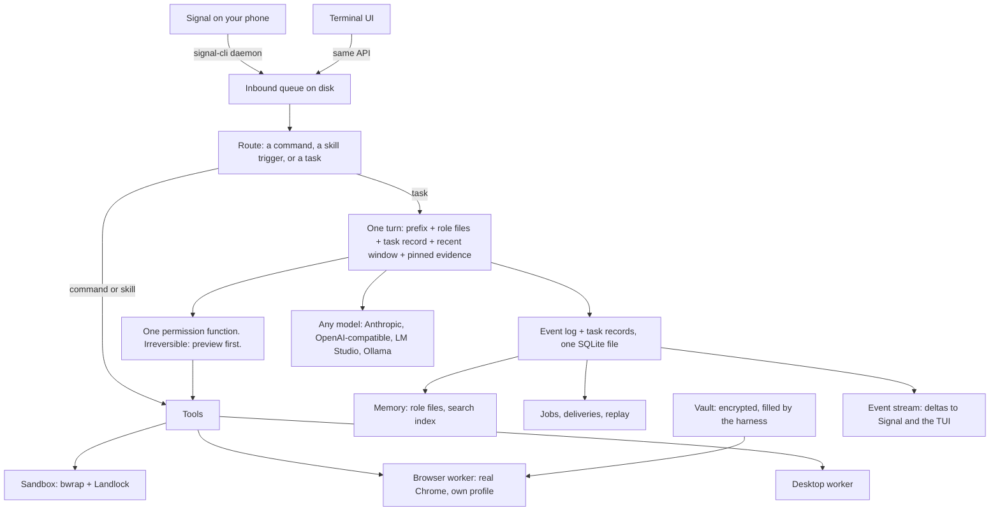
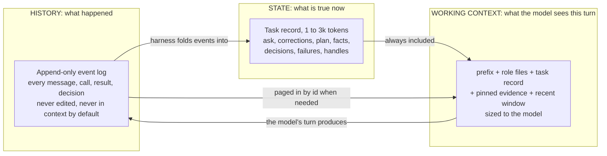
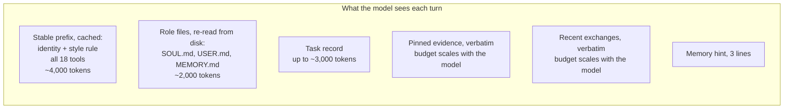
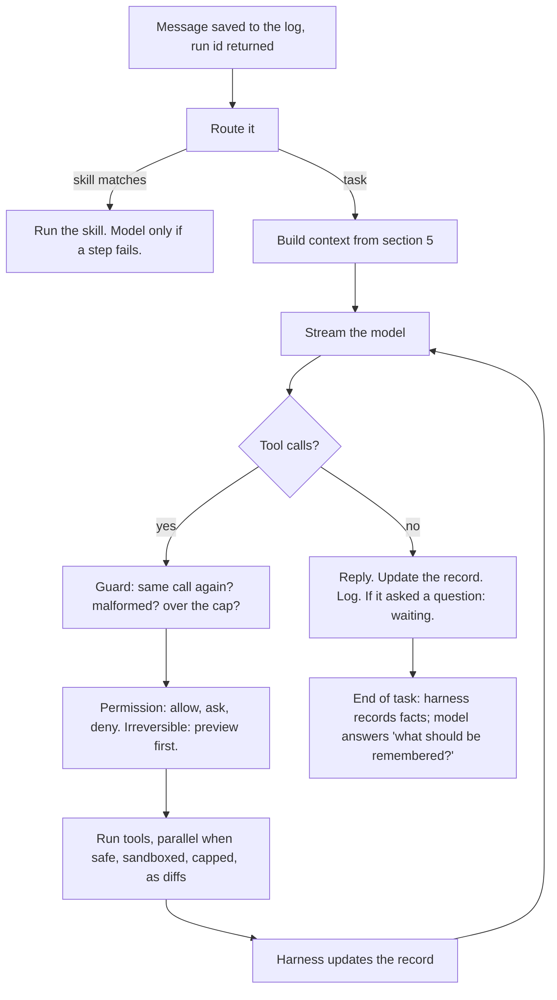
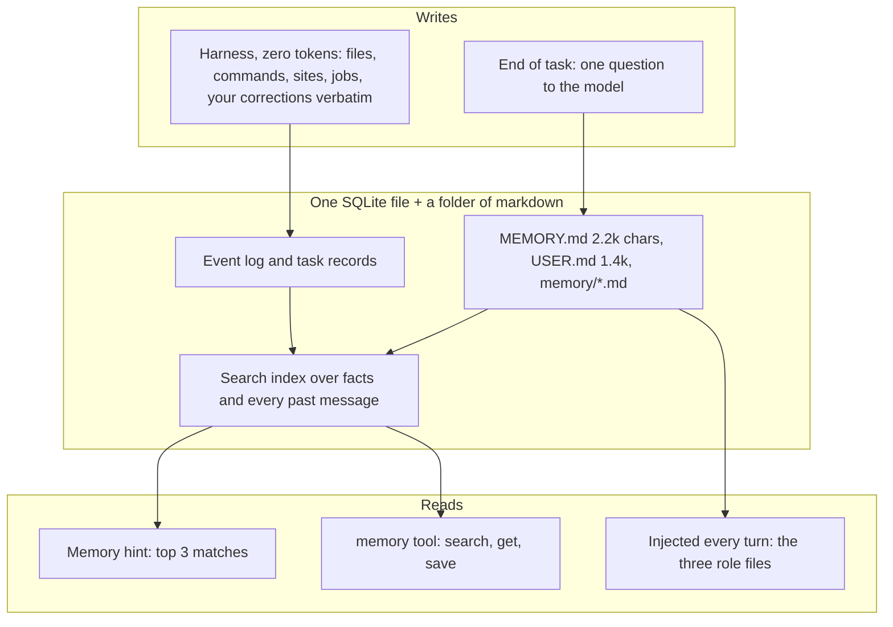
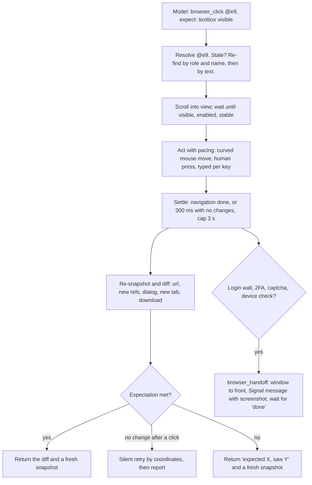

# COEUS_PLAN.md

**Coeus: an agent that uses a computer like a human, learns like a colleague, and stays small.**

Design proposal, 2 September 2026. Nothing is built yet. Every choice names the failure it prevents and the project it was learned from. The evidence is in `HARNESS_V2.md` and the research files in `docs/research/`. This version has been through a fact-check and a simplicity review; what those cut is listed in section 17.

---

## 0. What it is

One small program on rosie. You talk to it on Signal or in a terminal. It has its own Chrome, logged into your accounts, and uses it the way you would. It can use the Linux desktop. It runs any command-line tool you give it. Show it something once, or point it at the docs, and it writes the procedure down as a skill and keeps it. It holds a vault of passwords it fills in itself without ever seeing them. It runs jobs on a schedule. It remembers what matters for months. It restarts, repairs, and rolls back by itself.

**Your rules:** simple; Linux only; English; Signal or a TUI; the browser, like a human, always; works with any model, local or cloud, without handicapping the big ones; minimal tokens; plain short answers.

---

## 1. The architecture in one picture



Three sentences. **One Go program** owns everything: the queue, the loop, the permissions, the memory, the jobs, and one SQLite file. **Two helpers** it starts when needed: a browser worker (real Chrome with its own profile) and a desktop worker; they are separate so a hung Chrome can never take Signal down. **Two thin screens**, Signal and a terminal, that own no state and share one command table.

It runs on rosie (Linux Mint, 32 cores, 60 GB, an RTX 5070 Ti, a display, Chrome, Ollama). Local or cloud model makes no difference to the design.

---

## 2. What is new

Seven decisions. Pieces of some exist elsewhere; the combination does not. Each one is simple to build.

**1. Three layers of state: history, state, and working context.**
Every agent studied is trace-driven: the transcript is the state, and each turn the model re-reads the trace to work out where it is. Coeus separates what happened (an append-only log), what is true now (a small task record with the ask and corrections verbatim, the plan, facts, decisions, and failures), and what the model sees this turn (built fresh, sized to the model). The harness writes the parts it can verify; the model writes the judgment parts. Section 4 has the model and the format.

**2. Evidence is paged, never deleted.**
Recent exchanges stay in context verbatim, in a window sized to the model. Tool results the model or the harness pins stay in verbatim too. Older results fall out of the window but keep a one-line entry in the record and can be read back by id at any time. Tool results arrive as what changed, not whole dumps. Nothing is summarized away. A 260k model gets a big window; a 24k model gets a smaller one; both keep everything.

**3. Act and assert.**
Every browser action carries an expected result. The worker waits for the page to settle, diffs the snapshot, and checks the expectation before the next step. This is how test frameworks get reliable.

**4. One event log, and any run can be replayed as a test.**
Everyone keeps a transcript. Nobody records tool results, permission decisions, and state as events that can be fed back in. Coeus does, so a failed task can be re-run after a code fix, against the recorded tool outputs, as a test. Crash recovery is "replay the log."

**5. Preview first.**
Nothing irreversible happens without a preview you saw: the composed post, the email, the command, on Signal with one-tap approve. A skill can carry a standing approval, but only after you reviewed its dry run and set its limits, and it expires.

**6. Learn once, run as code.**
When Coeus finishes a multi-step task, it can save the steps as a script with a test. Next time the script runs and the model only wakes up if a step fails. A replayed skill costs almost no tokens and cannot drift. The skill carries its own permissions: profile, domains, daily cap, which steps are irreversible.

**7. The harness writes memory; the model curates it.**
Facts the harness can verify are recorded with zero model tokens: files changed, commands run, sites visited, jobs created, and any message of yours that starts with "no," "actually," "always," "never," or "don't," kept word for word as a correction. At the end of a task the model answers one question, "what from this should be remembered?", into a capped memory file. Cheap, and it never forgets a correction.

---

## 3. What we take, and from where

| From | We take | Because it worked |
|---|---|---|
| **OpenClaw** | A pure loop with hooks around it; steering at tool boundaries; text-to-tool-call repair; the cron backoff ladder with auto-disable; signal-cli with pairing by default; a cache boundary in the prompt; capped role files; a "save your notes" step before anything leaves the window; a delivery queue on disk; launching real Chrome with its own profile and reading the page as a tree with refs | These are the parts we would keep; the operations code around them is what breaks |
| **Hermes** | The crash-loop breaker; one lease per session; a delivery ledger that admits "may be a duplicate"; one deadline primitive; MEMORY.md and USER.md with hard caps; your messages kept word for word; cron incidents keyed by error; the masked sudo and password prompt; one redaction function on every output | Each one is a file written after an outage. Hermes paid the tuition |
| **Prime** | Notes with history and rollback that the next prompt reads; cron as heartbeat; budgets with verifier gates; `bash()` that returns a handle; variables that outlive the chat, which became the task record | One of three learning loops in the field whose read path is real |
| **A ChatGPT conversation of yours** | History, state, and working context as three separate things; decisions and failures as first-class records with reasons; "do not make the model remember what the environment can tell it"; checkpoints | The clearest statement of the split, which the plan builds out |
| **OpenCode** | One core with an API inside it and every screen a client; streaming as field deltas; one command table; inline approvals with once, always, reject; the permission engine (rules, last match wins, default ask); tool descriptions as plain text; output caps with spill files; the `invalid` handling that turns a bad call into a fixable error; re-reading role files every step | The interface you like is these decisions, not the codebase around them |
| **ZeroClaw** | The designs of its Signal channel, cron store with claim locks, tool-call parser for messy local models, ten-round cap with a forced final answer, skill creator, updater with rollback, and Landlock wrapper, ported to Go | The Rust project closest to your spec. Too big to fork; these designs are clean |
| **browser-use, Stagehand, agent-browser** | `[new]` marks on elements that just appeared; "pages below" scroll hints; abort a batch when the page changes; a finish that must say whether it succeeded; cache the selector that worked so the next run is deterministic | What the top live-site scorers share, once you subtract their frontier models and cloud captcha solving |
| **Codex, Claude Code** | The kernel sandbox as the real boundary; escalation as a field on the call with a written reason; the model decides, the harness allows, never the same layer | The two labs settled the safety question the same way |
| **Systems design, 1960s to now** | Event sourcing: the log is truth, a snapshot is the compact image. Process control blocks: suspend and resume from a small record. Working sets and paging: keep what is touched recently, page the rest in on demand | Fifty years of proof |

---

## 4. State: the three-layer model

**The question you asked.** What is the state of a task, and where does it live? In every agent studied the answer is the same: in the transcript, implicitly. The model re-reads how it got here to work out where it is. That is a video game loading your save by replaying every button you ever pressed. Coeus separates three things that the others keep in one pile.



| Layer | Question it answers | Who writes it | Size | In context? |
|---|---|---|---|---|
| **History** | What happened, in order | The harness, from every event | Unbounded, on disk | No. Paged in by id, or searched |
| **State** | What is true now | The harness for facts it can verify; the model for judgment | 1 to 3k tokens, capped | Always |
| **Working context** | What does the model need right now | The harness, built fresh every turn | Sized to the model, 8k to 100k+ | It is the context |

**The one rule that sorts everything:** history is a fact about the past, state is a fact about the present, working context is a choice about attention. A test that failed at 14:02 is history. "Tests: 47 passing, 3 failing" is state. The three failing test names and their output are working context while the model is fixing them, and history again once it has.

### The record

One per task, in the database, readable as text. Eight parts, each with one job:

```
# t17   status: executing   from: signal   budget: 6/20 rounds, 41k tokens, 9 min
## Ask (verbatim, immutable)
"Write a tweet for DigiByte's anniversary and post it from the marketing account."
## Corrections (verbatim, append only)
- 17:05 "no, don't mention the price"
## Plan
1. [done] gather facts on DigiByte history and the date  -> r3, r4
2. [doing] draft a tweet under 280 chars, no price
3. [ ] preview to JT, wait for approve
4. [ ] post with skill post-to-x
## Facts (each with a source)
- Launched 10 Jan 2014 by Jared Tate  (r3: memory/digibyte.md)
- Five mining algorithms, 15-second blocks  (r4: digibyte.org/about)
## Decisions (with the reason, so they are not re-argued)
- D1 Lead with the anniversary date, not the tech. Reason: JT's ask says anniversary.
## Failures (so they are not repeated)
- F1 Draft 1 was 312 chars. Cause: two facts too many. Do not: three facts in one tweet.
## Handles
- tab t1: x.com/compose   pinned: r3, r4
## Results (one line each; read any with `read r7`)
- r1 memory search "digibyte anniversary": 3 hits
- r3 read memory/digibyte.md: 2,100 chars
- r4 web fetch digibyte.org/about: 1,800 chars
- r5 browser_open x.com/compose: ok, tab t1
```

**Who writes what.** The harness writes the header, corrections, handles, the results list, step status from tool outcomes, and the budget, with zero model tokens. It also writes a failure line itself whenever a tool call errors or a browser expectation misses. The model writes the plan, facts, decisions, and the reasons through the `task` tool. The ask and the corrections are never edited. Decisions and failures are the two parts that matter most for hard tasks: they are why the agent does not re-argue a settled choice or walk into the same wall twice. The record is capped; when it grows, the harness folds finished steps and old result lines into single lines, and nothing is deleted.

### What the environment can tell it, it does not remember

The record does not hold what the world can answer. Which files changed is `git diff`. Whether the code compiles is the compiler. What is on the page is the snapshot. Whether a job ran is the jobs table. Only things the world cannot answer go in state: what you asked, what you corrected, what was decided and why, what failed and why. This keeps the record small and, more important, keeps it true, because the world is re-checked instead of trusted.

### Checkpoints

Every time the record changes, the harness saves a numbered checkpoint: the record plus the list of pinned result ids. A task that is waiting on your `/approve` for three days resumes from its last checkpoint with nothing in any context window. `/tasks 17` shows the record; `/tasks 17 back 3` rewinds three checkpoints and lets the model try a different path from there, the way you would reload a save. Because every checkpoint is tied to the log, a failed task can be replayed from any checkpoint as a test after a fix.

### Why nobody built it this way

Agents grew out of chat, and chat is a transcript. The transcript looks like state, users like reading it, cloud caching rewards appending to it, and bigger context windows made the problem look solved. Fragments exist: Prime keeps variables and notes, OpenClaw keeps goals, browser-use keeps a per-step memory field, Claude Code keeps a todo list. None makes the record the primary thing, none lets the harness co-write it from verified events, and none can suspend a task and resume it from the record days later. The three-layer split is how databases (log plus snapshot), operating systems (process control block), and CPUs (registers versus the instruction trace) have worked for fifty years. It has not been applied to agents because nobody had to make one run for a week on a phone.

### Why it cannot be worse than a transcript

The windows are knobs. Turn the recent window up to the model's full context and pin everything, and Coeus degrades to "the whole transcript in context," which is exactly what every other agent does. Every setting below that keeps more, not less: the ask and corrections verbatim, the evidence paged rather than summarized, the decisions and failures written down instead of buried in 100k tokens of history. On your 260k local models the windows are large. On a 24k model they are small. The record is the same size on both, and that is the point.

---

## 5. Context, sized to the model



**What context really means.** It is the model's working memory for one call; nothing carries over except what the harness puts back. On cloud it costs money, on local it costs time, and in both cases a cached prefix is nearly free, so the *order* matters more than the size: stable things first, changing things last. Attention dilutes, so 20k of relevant material beats 100k of noise, for big models too.

**The budgets** come from the model's context length, never from the smallest model you own:

| Model context | Pinned evidence | Recent window | Typical turn |
|---|---|---|---|
| 24k | 6k | 6k | 8 to 12k |
| 64k | 16k | 20k | 10 to 20k |
| 128k and up | 32k | 48k | 10 to 30k |

When the recent window is full, the oldest unpinned exchange is folded into the record as one line, and stays readable by id. On your 260k Qwen 3.8 that means tens of thousands of tokens of verbatim history before anything folds. The DigiByte facts fetched in step 1 are pinned and sit in front of the model while it drafts. Nothing above the cache line changes during a session; the date goes below it; on local servers the context length is fixed so the prefix cache holds.

The style rule, in the prefix:

> You are Coeus, JT's assistant. Write plain, short English. Match length to the ask: one-line question, one-line answer. No filler, no restating the request, no narrating tool calls. State facts; say "not sure" when unsure. Use a tool only when needed, and never repeat a call with the same arguments. When work is done, report three things: what changed, what you checked, what is left. Ask at most one question at a time.

---

## 6. The loop



Ten rules:

1. A message mid-turn **steers**: injected at the next tool boundary (OpenClaw). Never interrupt.
2. **Cap: 20 tool rounds per turn** on any model. At the cap, one last call with tools off: "Say what you did and what is left" (ZeroClaw). Long tasks get a budget of rounds, tokens, and minutes (Prime).
3. **Same call twice with the same arguments:** do not run it; return "Same call as the last two. Do something different or answer." Third time: end the turn. Counted across steps, which catches what OpenCode's detector misses.
4. **Malformed call:** fix the name if it is close, otherwise "Tool x does not exist. Available: a, b, c." Never crash the loop.
5. **Text that looks like a tool call** is parsed as one; after two failures the text is the answer (ZeroClaw). This is what makes a model without native tool calls work; big models never hit it.
6. **Every error ends the same way:** answer the user, ask one question, or try different arguments.
7. **Every tool has a timeout, a process group, and an output cap.** Overflow goes to a file and the result says where.
8. **A turn that read a web page or a feed is tainted:** nothing irreversible until you speak again. Unattended runs that hit an ask fail closed with a Signal message. A skill whose steps read a page and then act must declare that, and you approve it once.
9. **Retries live outside the loop:** three tries with backoff, never on context overflow; then the next model in the chain.
10. **A question ends the turn.** The model asks in plain text; the harness marks the task waiting; your next message resumes it.

---

## 7. Memory



- **Every fact has a source and a date.** You said it, a tool found it, or a web page claimed it. The model sees the tag.
- **Nothing is deleted.** A new fact supersedes the old one; the old one stays searchable, marked. You can always ask "what did you used to think?"
- **Corrections are automatic and verbatim.** "No, the gate code is 4321" is captured the moment you say it.
- **Recall is nearly free.** The hint costs nothing when nothing matches; the model searches for more.
- **Grep first.** Full-text search finds what you look for with the words you used. An embedding model can be added later without changing anything else.
- **A memory test.** Twenty questions about past sessions, run monthly, so you can see if it is getting better or worse.

---

## 8. The browser, like a human

The centerpiece. The top scorers on live-site benchmarks share a frontier model, text for targeting plus a screenshot for checking, an explicit "did that work?" step, a different strategy on retry, and a plan for long tasks. Coeus builds the last four into the harness so any model gets them.



**The profile is the login.** Real Chrome, launched by Coeus with its own profile folder, never your daily profile. You log in once by hand, or Coeus fills the vault entry. After that the cookies are the login. One profile in v1, plus a throwaway headless context for public pages; a second profile when you have a second identity to keep separate. Profiles are never copied. You can open the window yourself any time; Coeus sees the result on its next look.

**What the model sees**, a few hundred tokens:

```
tab t2/3  linkedin.com/messaging  "Messaging | LinkedIn"
viewport 1400x900  scroll 0.0 above / 2.3 below  dialogs: none  changed: +3 new
- link "Home" @e1     link "Messaging" @e3 [current]
- textbox "Search messages" @e5
- list "Conversations" (12 items, 4 shown)
  - link "Dana Ortiz — Re: coffee next week · 2h" @e6 [new]
- textbox "Write a message…" @e9 [multiline] [new]
- button "Send" @e10 [disabled]
- iframe "Ads" @f1 (collapsed)
… 14 more controls below the fold
```

Refs resolve by themselves on the same page. `[new]` marks what appeared since the last look. Long lists collapse to a count. A screenshot with numbered marks is one call away. A stale ref is re-found by role and name, then by text; if that fails, the model gets a fresh snapshot instead of a wrong click.

**Like a human.** Headed on rosie's display, the real Chrome so the fingerprint matches, your home IP, curved mouse moves, a human press, typing per key with jitter, scrolling in steps, pauses between actions, a daily action budget per site. No proxies, no headless for logged-in accounts, no cookie copying, no captcha solving. This is about account safety, not benchmark scores.

**Everything a human can do.** Tabs and popups, frames, shadow DOM, upload and download, dialogs, PDFs as text, keyboard chords, drag and drop, hover, back and forward, scroll by pages.

**Seven tools.** Each returns what changed plus a fresh snapshot.

| Tool | Does |
|---|---|
| `browser_open` | Open a URL in the current or a new tab, wait, return the snapshot |
| `browser_read` | Text with refs (default), full text, an article, lines matching a query, a labeled screenshot, or a zoomed region |
| `browser_click` | Click a ref, or coordinates from a screenshot, with an optional expectation |
| `browser_type` | Type into a ref like a person; never a password |
| `browser_act` | Press keys, scroll, select, hover, drag, upload, download, answer a dialog, wait for text or a URL, back, forward, reload, switch or close a tab |
| `browser_login` | The harness fills the vault's username, password, and 2FA code into the fields the model pointed at; the model never sees them; only on the entry's domains |
| `browser_handoff` | Pause for a captcha, a code, an unknown login, or a risky action; Signal message with a screenshot; resumes when you reply |

**Visual QA.** A `qa` skill: open the app, walk a checklist, take a labeled screenshot at each step, compare to the expected state in plain words, send a report with images. Any web app, and the desktop with the same act-and-assert loop.

**Browser skills.** Record once. The harness logs each step's intent, the element it used (role and name, then visible text), and what was expected. Replay runs with no model. When a site changes, the model finds the element for the recorded intent and proposes a one-line patch you approve.

**Engine.** One long-lived `playwright-core` worker (Node, installed with npm) attached to the Chrome Coeus launched. Runner-up: Vercel's `agent-browser`, one Rust binary. browser-use is a whole agent loop and would duplicate Coeus's own.

---

## 9. Desktop, CLI tools, skills

**Desktop.** One `computer` tool through a worker on `@trycua/cua-driver` (MIT, Linux, used by OpenClaw and Hermes): launch or focus an app, screenshot with numbered marks, click, type, key, drag, clipboard. Background input that does not steal your cursor, with the same pacing profile as the browser. You grant an app for the session once; irreversible actions inside it still preview. Same act-and-assert loop: every action carries an expectation checked against the next screenshot. Last resort: if the browser can do it, the browser does it. A `/screen` command sends you a screenshot any time.

**Any CLI.** `shell` plus a skill. Hand Coeus a tool: it reads `--help` and the docs, writes a skill with the five commands it will actually use and one example each, runs a smoke test, saves it. Long commands return a job id after ten seconds. Sandboxed children keep network access, because `gh`, `curl`, and package managers need it; the sandbox is about your files, not the internet.

**A skill is a folder:**

```
~/.coeus/skills/post-to-x/
  SKILL.md      name, one-line description, triggers, permissions (profile, domains, daily cap, irreversible steps)
  steps.yaml    recorded steps: intent, element descriptor, expectation (browser skills)
  run.sh        the script (CLI skills)
  test.yaml     dry run to the irreversible step
  CHANGELOG.md  every change, with rollback
```

Three ways a skill is born: you demonstrate once; you point at docs; or Coeus finishes a task and offers to save it. Only names and one-liners sit in the prompt; the body loads on use. Nothing edits a skill on its own.

---

## 10. Vault, sudo, secrets

- `~/.coeus/vault.age`, encrypted with a 0600 key file. Entries: site, domains, username, password, TOTP secret.
- **Enter secrets only in the terminal:** `/vault add x.com` opens a masked prompt that shows asterisks (Hermes' sudo prompt). Never over Signal. Never in the transcript or logs.
- **The model never sees a secret.** It points at the fields; `browser_login` types them and the 2FA code itself. API keys are `secret://name` references resolved at call time.
- **sudo has its own path.** A sandboxed command cannot escalate, by design. A `shell` call with `escalate: true` and a reason shows you a preview; on approval the harness runs it outside the sandbox with `sudo -A`, the password coming from the vault's `sudo` entry through `SUDO_ASKPASS`, cached for the session. Every escalated command is its own audit entry.
- **One redaction function** runs on every reply, log line, and tool result: secret-shaped strings become `[redacted]` (Hermes' browser-output redaction, generalized).
- **Backups.** Nightly encrypted tar of the database, the vault, and the browser profile to a path you choose. The profile is the login, so it is treated like a key.
- 1Password and Bitwarden through their CLIs as optional sources. Unknown site, no TOTP secret, captcha, or a new-device check: hand off to you.

---

## 11. Tools

Eighteen. R read, W write, X execute, N network, I irreversible. Every model sees all of them; there is no deferral, because eighteen is under the accuracy cliff and big models should not be slowed to accommodate small ones.

| Tool | Does | Class |
|---|---|---|
| `read` | A file, a directory, or a past result by id, with line numbers and offset | R |
| `write` | Create or overwrite | W |
| `edit` | Replace one exact span, with fallback matchers | W |
| `search` | Files by glob or lines by regex | R |
| `shell` | Run a command; job id after 10 s; poll, tail, kill; `escalate` with a reason for sudo | X |
| `web` | Search, or fetch a public page as text; no logins, no clicking; anything interactive is the browser | N |
| `memory` | Search, get, save | R W |
| `task` | Update the plan; add a fact with its source; record a decision or a failure with its reason; pin or unpin a result | W |
| `skill` | View, run, or save a skill | R X W |
| `schedule` | One job object: at, every, or cron | I |
| `browser_open`, `browser_read`, `browser_click`, `browser_type`, `browser_act` | Section 8 | N X |
| `browser_login`, `browser_handoff` | Section 8 | N I |
| `computer` | Section 9 | X I |

About 150 to 220 tokens per tool, roughly 4,000 for the set. Tool results are built by the harness, never parsed from the model's text, so a model cannot fake one. Asking you a question is not a tool: the model asks in plain text and the turn ends waiting. Sending you something is not a tool either: a reply can carry files and screenshots, and the harness sends progress notes and job results itself.

---

## 12. Signal, TUI, commands

One command table; the terminal prints the result, Signal sends it.

| Command | Does |
|---|---|
| `/new`, `/sessions` | Fresh session; list and switch |
| `/tasks` | What is running, waiting, or done today; `/tasks 17` shows a record; `/tasks 17 back 3` rewinds to a checkpoint |
| `/model` | `/model local` (Qwen 3.8 27B on rosie), `/model claude` |
| `/status` | Model, tokens, jobs, pending approvals, health |
| `/stop` | Cancel the current turn |
| `/pause`, `/resume` | All scheduled work |
| `/jobs` | List; `/jobs run 3`; `/jobs off 3` |
| `/approve 3`, `/approve 3 1h`, `/deny 3` | Answer a pending preview or ask |
| `/screen` | A screenshot of the browser or the desktop, now |
| `/memory` | Show; `/memory forget <text>`; `/memory rollback` |
| `/skills` | List; `/skills teach <name>`; `/skills learn <name> <url>` |
| `/vault` | Terminal only |
| `/undo` | Revert the last turn's file changes |
| `/help` | This list |

**Signal.** signal-cli as an external daemon Coeus starts and supervises, linked as a secondary device, never a registered number. Events in over SSE with reconnect; sends over JSON-RPC in 4,000-character chunks. Unknown senders get a pairing code. Photos and files you send are saved to an inbox and are readable by the model, including by vision. One message per reply; "still working" once after five idle minutes. A preview arrives as the actual post or email text; a handoff arrives with a screenshot; you reply `approve`, `done`, `code 123456`, or `abort`.

**TUI.** `coeus tui`, a thin client of the running daemon over a local socket. First frame at once, spinner only after 500 ms, streaming as deltas, inline approvals, screenshots shown inline where the terminal supports it, a masked prompt for the vault. It owns no state.

---

## 13. Safety in five rules

1. **One permission function on every tool.** Rules of tool, pattern, and action; last match wins; default ask. Irreversible actions show a preview and ask every time, unless a skill holds a standing approval you granted after its dry run, with a numeric limit and an expiry.
2. **Every shell and file-writing tool runs in a sandbox.** `bwrap` plus Landlock plus a seccomp filter; the vault, the browser profile, and `~/.ssh` are always outside it. Not a setting: if `bwrap` is missing, `shell` is off and the daemon says so. Escalation is the one deliberate exit, previewed and logged.
3. **A tainted turn cannot do anything irreversible.** Read a page or a feed, and posting, sending, and deleting wait until you speak.
4. **Secrets are references, never values,** and one redaction pass runs on everything that leaves the daemon.
5. **Everything is logged:** every message, tool call, permission decision with its rule, approval, and irreversible action with a hash.

Hermes' sentence is the principle: "The only security boundary against an adversarial LLM is the operating system."

---

## 14. Reliability, self-fixing, updates

Go has no event loop that can freeze the way Python's can, so the machinery is small:

1. **systemd with a watchdog line.** `Restart=always`, `WatchdogSec=60` fed from the main loop, exit 75 means restart me, 78 means bad config, stop.
2. **Caps everywhere:** 20 tool rounds, 15 minutes per turn, 7 per tool, 100 queued messages, one deadline primitive.
3. **The event log is the ledger.** A reply is logged before it is sent; a crash replays; a resend says "may be a duplicate." A crash-loop breaker skips auto-resume but keeps serving.
4. **`/readyz` before anything trusts the process:** database opens, config parses, disk has room, signal-cli answers.
5. **The browser and desktop workers are separate processes** with their own timeouts; a hung one is killed and restarted without touching the daemon.

| Self-fixing tier | Who | When |
|---|---|---|
| Restart a dead process | systemd | automatic |
| Repair state: integrity check, stale locks, orphans, replay the log | Coeus at boot | automatic |
| Roll back to the previous binary after a bad update or a crash loop | a supervisor script, no model | automatic |
| Replay a failed task from the log as a test, after a fix | you, with one command | on demand |
| Read its own logs and propose one of a fixed menu of repairs | the model | asks you first |
| Edit its own code | the model, in a branch, with tests and a canary | never unattended |

**Updates.** Coeus is built on rosie. `coeus update` builds the new binary into `releases/<version>`, keeps the previous one, flips a symlink, restarts, and must pass `/readyz` in 60 seconds or the supervisor flips back. The service unit is written once and never edited. Every line of your `openclaw update` screenshot becomes impossible.

---

## 15. Language

Measured on this Mac with the real dependency set:

| | Rust | **Go** | Bun |
|---|---|---|---|
| Daemon start | 2.9 ms | 8 ms | 11 ms |
| Idle memory | 9.7 MB | 19 MB | 22 MB, 107 MB with Playwright |
| Static Linux binary | 6 MB | 23 MB | 103 MB |
| Clean build | 25 s | 10 s | 0.3 s |
| Fix loop for Claude | slowest | one round | one round |

**Go for the daemon** (official Anthropic, OpenAI, MCP, and Gmail libraries; pure-Go SQLite; Bubble Tea for the TUI). **TypeScript for the browser worker** (Playwright is TypeScript-first). Rust saves 10 MB and costs fix rounds. No embedded scripting runtime.

**Models.** Two API shapes cover everything: Anthropic native, and OpenAI-compatible with a base URL, which is LM Studio, Ollama, llama.cpp, and every cloud gateway. Aliases in config with a fallback chain: `default = "claude"`, `fallbacks = ["local"]`. `/model local` is your Qwen 3.8 27B on rosie with a fixed context length so the prefix cache holds. The same prompt, tools, and record go to every model.

---

## 16. Tests first

| Layer | The test that defines done |
|---|---|
| Loop | A fake model that emits identical calls, malformed calls, text calls, and 30 tool calls; the guard handles each without crashing |
| State | A 40-step recorded task: the ask and corrections are byte-identical at the end; every result is readable by id; a suspended task resumes from its last checkpoint; a recorded failure is not repeated; a rewind resumes from an earlier checkpoint |
| Tools | A golden input and output per tool; caps and timeouts asserted |
| Permissions | A table of rules and calls; every row has an expected allow, ask, or deny; every irreversible call produced a preview |
| Sandbox | A shell command that tries to read `~/.ssh` or the vault must fail; an escalated one must not run without approval |
| Memory | Twenty questions about a recorded session; the answers must come from the store |
| Browser | Recorded page fixtures; the act loop must settle, diff, verify, and re-find a stale ref; every skill's dry run stops at its irreversible step |
| Signal | A fake signal-cli; pairing, chunking, reconnect, attachments, and duplicates asserted |
| Reliability | Kill the process mid-turn; the log replays and the reply is not lost |
| Update | Install a bad binary; the supervisor flips back within 60 seconds |
| Replay | Any logged failure re-runs as a test after a fix |

Coeus follows the same rule: when a task has a test, it runs the test before saying done. When it does not, it says so. No nagging.

---

## 17. What we leave out, and what the review cut

Left out on purpose: 27 channels, 76 providers, a web UI, plugins in the process, a Python kernel, API shortcuts for social media, cookie copying, captcha solving, cloud browsers, macOS, i18n, a UI framework fork, and a model that updates itself.

Cut by the simplicity review, and why: tool deferral (eighteen tools need none); receipts on tool results (the harness builds every result, so there is nothing to fake); a background review fork (one end-of-task question does the job); a second model as an architectural piece (using a cheaper model for summaries is a config knob); three browser profiles on day one (one, plus a throwaway context); thread watchdogs (a Python problem); a signed download manifest (the binary is built on the same box); a nightly login check of every site (a bot signature; check on use); delegation to sub-agents (the task record and paging cover long tasks; revisit if a task ever outgrows one record); vector memory (later, without changing anything).

---

## 18. Size and build order

About **12,000 to 16,000 lines** of your own code, under one percent of OpenClaw.

| Stage | Adds | You get |
|---|---|---|
| v0 | Daemon, loop, guard, five tools, one provider, TUI, event log, task record | A terminal agent in days |
| v1 | Signal with pairing and attachments, permissions, preview first, sandbox with escalation, role files, reliability rules | A phone assistant that does not get stuck or lose messages |
| v2 | Browser worker, profile, vault, `browser_login`, handoff, act-and-assert, human pacing, `/screen` | It uses Chrome like you |
| v3 | Skills by demo and by docs, memory hint, end-of-task memory, backups | It learns and remembers |
| v4 | Cron, desktop worker, visual QA, updater with rollback, replay-as-test | Always on and self-fixing |
| v5 | Text protocol for models without tool calls, the memory test, an embedding score if search ever falls short | Best in class on any model |

---

## 19. Open questions

| Question | Where it stands |
|---|---|
| Go plus a TypeScript worker, or Bun for everything | Go is measured and boring. Bun-for-everything is valid if one language matters more; the daemon still must not import Playwright |
| A headed window when your desktop is locked | Overnight browser jobs may need a virtual display on rosie. Untested |
| How much the model should write into the record | Start with plan, facts, questions. Measure with the 40-step test before adding more |
| Second browser profile | When a second identity needs to stay separate |
| Social-site bans | Real Chrome, a persistent profile, human pacing, per-site budgets. A platform can still act |
