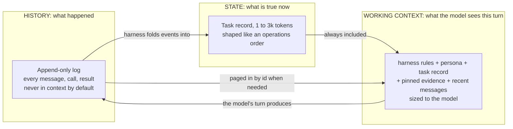
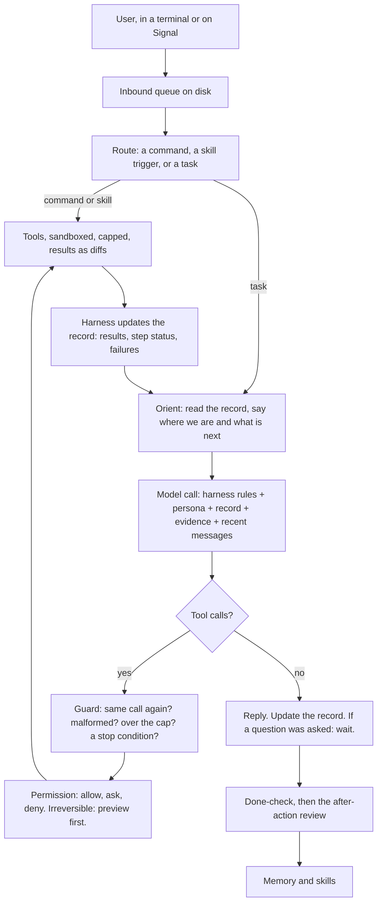
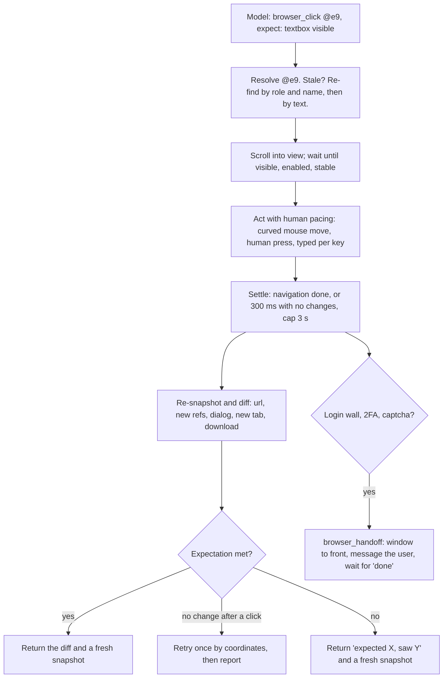

# COEUS

**An open-source agent that runs on any Linux machine, talks to you in a terminal or on Signal, works with any model, and does not forget what it is doing.**

Design document for the MVP. Nothing is built yet. The comparison it grew out of is in `HARNESS_V2.md`; the research behind that is in `docs/research/`.

Coeus is named for the Titan of intellect, the axis the heavens turn on.

---

## 1. The idea in one page

Every AI agent today is built the same way. A model is a function: text in, text out. It has no memory and no hands. The **harness** is the program around the model that gives it both. Same models everywhere; the harness is the whole difference.

We studied the harnesses people run today: OpenClaw, Hermes, Prime, OpenCode, Atomic, ZeroClaw, plus Codex and Claude Code from the labs. All of them keep long-term memory outside the conversation, in files or a database. But every one of them uses the conversation transcript as the record of the task itself: each turn, the model re-reads what happened to work out where it is. When the transcript gets too long, most of them summarize it and hope nothing important was lost (ZeroClaw drops old turns instead; Prime keeps its working data in Python variables, the closest anyone comes to real state). That is like a video game that never saves, and instead replays every button you ever pressed each time you want to take the next step.

Coeus is built on a different idea, and it is an old one.

**State.** In computer science, state is the small amount of information about the past that you need to act correctly next. A counter does not remember every increment; it remembers `7`. A database keeps a log of everything that happened, and a snapshot of what is true now, and they are not the same thing. An operating system can pause a program and resume it days later from one small record. Coeus keeps three things separate: what happened (history), what is true now (state), and what the model is looking at this turn (working context).

**The operations order.** The U.S. Army has a bigger version of the same problem: a headquarters that cannot see every unit, radios that fail, people who rotate out mid-mission. Its answer is a fixed document format anyone can write and check, the five-paragraph operations order, plus a rule for what to do when the plan breaks. We borrow its parts directly: the situation, the mission with the user's intent and what done looks like, the plan, the list of things to stop and report, small changes as fragmentary orders, and the after-action review when it is over.

**The result** is an agent that always knows what it is working on, keeps working until it is done, tells you when it should, and spends tokens on the task instead of on re-reading its own past. It works the same on a small local model and a million-token frontier model; only the size of the working context changes, and it never shrinks a big model to fit a small one.



---

## 2. What we learned from the others

We read the source code, not the marketing. The full comparison is `HARNESS_V2.md`. The short version:

**What went wrong.** The two most popular harnesses are 2.9 million and 1.5 million lines of hand-written code. One merged 10,574 commits in a month, 63 percent from one person at 223 a day; nobody reviews code at that pace, and it breaks on every update. Neither has a hard limit on how many times the model can call tools in a turn, so "it got stuck" is a design outcome. One keeps its screen and its brain in different processes joined by a pipe, and the pipe breaks. The loops themselves are small, one to seven thousand lines; the code around them is fifty to seventy-five times bigger, and that is where everything fails.

**What worked, and what we keep:**

| From | We keep |
|---|---|
| **OpenClaw** | A pure loop with hooks around it. A message that arrives mid-turn steers the next step instead of interrupting. Repair for models that write tool calls as text. Cron with backoff. Signal through the signal-cli daemon with pairing for unknown senders. A cache boundary in the prompt. A delivery queue on disk. Launching a real Chrome with its own profile and reading the page as a tree with short refs |
| **Hermes** | Your own words are never summarized. Memory files with hard size caps. A crash-loop breaker. One lease per session. A delivery ledger that admits "this may be a duplicate." A masked password prompt. One redaction function on everything that leaves the daemon |
| **Prime** | Notes with history and rollback that the next prompt actually reads. Cron as a heartbeat. Budgets with a checker at the end |
| **OpenCode** | One core with an API inside it; every screen is a thin client. Streaming as small deltas. One command table for every surface. Approvals inline: once, always, reject. A permission engine: rules, last match wins, default ask. Tool descriptions as plain text. A bad tool call becomes a fixable error, never a crash |
| **ZeroClaw** | A ten-round cap with a forced final answer. A parser for messy tool calls. A cron store where two processes cannot run the same job. An updater that keeps the old binary and rolls back |
| **browser-use, Stagehand, agent-browser** | Marks on page elements that just appeared. Scroll hints. Abort a batch of actions when the page changes. A finish that must say whether it succeeded |
| **Codex, Claude Code** | The kernel sandbox is the real boundary. Escalation is a field on the call with a written reason. The model decides what to do; the harness decides what is allowed; never the same layer |
| **Systems design** | Event sourcing: the log is truth, the snapshot is the compact image. Process control blocks: pause and resume from a small record. Paging: keep what was touched recently, fetch the rest on demand. Save files: checkpoints you can reload |
| **The U.S. Army** | The five-paragraph order, commander's intent, fragmentary orders, critical information requirements, and the after-action review |

---

## 3. How the agent works



One process owns everything: the queue, the loop, the permissions, the record, the memory, the jobs, one SQLite file. Two helpers it starts when needed: a browser worker (a real Chrome with its own profile) and a desktop worker. They are separate so a hung browser can never take the agent down. Two thin screens, the terminal and Signal, that own no state and share one command table.

### The turn, in ten rules

1. A message that arrives mid-turn is a **fragmentary order**: it changes only what it changes. The harness writes it into the record as a correction and the model re-plans from it. It never interrupts a running tool.
2. **Orient first.** Before any tool call the model writes one line: where we are, what is next. If the situation does not match the plan, the plan changes first.
3. **Cap: 20 tool rounds per turn** on any model. At the cap, one last call with tools off: "Say what you did and what is left." A long task gets a budget of rounds, tokens, and minutes.
4. **Same call twice with the same arguments** is not run; the model is told to do something different or answer. A third time ends the turn.
5. **A malformed call** is fixed if the name is close, otherwise answered with the list of real tools. Text that looks like a tool call is parsed as one. The loop never crashes on the model's output.
6. **Every error ends the same way:** answer the user, ask one question, or try different arguments.
7. **Every tool has a timeout, its own process group, and an output cap.** Overflow goes to a file and the result says where.
8. **A turn that read a web page or a feed is tainted:** nothing irreversible until the user speaks again. Unattended runs that hit an ask stop and report.
9. **Retries live outside the loop:** three tries with backoff, then the next model in the chain.
10. **A question ends the turn.** The model asks in plain text; the task is marked waiting; the user's next message resumes it, even days later.

---

## 4. State: three kinds, one format

### Three kinds of state

| Kind | Holds | Changes | Where it sits |
|---|---|---|---|
| **Persona** | Who the agent is, who the user is, standing rules, durable memory | Rarely | The cached prefix of every prompt |
| **Skill** | How we do one kind of thing: steps, expectations, permissions, known failures | When a site or tool changes | Loaded when the skill is used |
| **Task** | What is true right now about the thing being worked on | Every turn | The record, always in context |

Only the task is volatile. Splitting the three keeps the prompt cache warm and the record small.

### The task record, shaped like an operations order

An Army order has five paragraphs: Situation, Mission, Execution, Sustainment, and Command and Signal. The mission answers who, what, when, where, and why, and it carries the commander's intent and the end state so that when the plan breaks, the unit still acts correctly. The commander also lists in advance the facts that would change the decision. Our record uses the same shape, with the user in the commander's place.

| Record section | Order paragraph | Written by |
|---|---|---|
| Ask | Mission: who, what | The user, verbatim, never edited |
| Intent and Done | Mission: why, end state | The model drafts; the user can correct |
| Corrections | Fragmentary orders | The user, verbatim, append only |
| Stop and tell the user if | Critical information requirements | The model drafts; the harness adds budget and login walls |
| Situation | Situation | The harness, from the world as it is now |
| Plan, Decisions, Failures | Execution | The model, through the `task` tool |
| Results, budget, source | Sustainment, Command and Signal | The harness |

```
# t17  status: executing  from: signal  budget: 6/20 rounds, 41k tokens, 9 min
## Ask (verbatim, never edited)
"Write a tweet for our product anniversary and post it from the company account."
## Intent (why, and what done looks like)
Why: a timely, accurate post in the company's voice.
Done: a tweet under 280 characters, previewed and approved, live on the site.
## Corrections (verbatim, append only)
- 17:05 "don't mention pricing"
## Stop and tell the user if
- the post would mention pricing, a person, or a date I cannot source
- the site shows a login wall, a captcha, or a bot check
- the task passes 15 rounds or 30 minutes
## Situation (what the world says now; re-checked, not trusted)
- tab t1: compose page, logged in as company, box empty
- facts on hand: r3 (memory/product.md), r4 (about page)
## Plan
1. [done] gather facts -> r3, r4
2. [doing] draft under 280 chars, no pricing
3. [ ] preview to the user, wait
4. [ ] post with skill post-update, then verify it is live
## Decisions (with the reason, so they are not re-argued)
- D1 lead with the date, not the features. Reason: the ask says anniversary.
## Failures (so they are not repeated)
- F1 draft 1 was 312 chars. Cause: three facts. Do not: three facts in one post.
## Results (one line each; read any with `read r7`)
- r3 read memory/product.md: 2,100 chars
- r4 web fetch the about page: 1,800 chars
- r5 browser_open compose page: ok, tab t1
```

### The rules for the record

**What goes in.** Only what the world cannot answer. Which files changed is `git diff`. What is on the page is the snapshot. Whether a job ran is the jobs table. Those are looked up, never remembered. The record holds what only the conversation knows: what was asked, why, what was corrected, what was decided and why, what failed and why.

**Who writes what.** The harness writes everything it can verify, with zero model tokens: the header, corrections, situation, results, step status from tool outcomes, and a failure line whenever a tool errors or an expectation misses. The model writes judgment: intent, stop conditions, plan, decisions, failures it understands. The ask, the intent, and the corrections are never edited.

**Size.** One to three thousand tokens. When it grows, the harness folds finished steps and old result lines into single lines. Nothing is deleted; every result stays readable by id.

**Cache.** The parts that rarely change (ask, intent, corrections, stop conditions, decisions) sit above the cache line. The parts that change every turn (situation, plan status, results) sit below it.

**Checkpoints.** Every change to the record saves a numbered checkpoint tied to the log. A task waiting on the user resumes from its last checkpoint with nothing in any context window. `/tasks 17 back 3` reloads an earlier one and lets the model try another path, like reloading a save. Any failed task can be replayed from a checkpoint as a test after a fix.

### The done-check and the after-action review

A task cannot close until each line of "Done" is answered true, with the evidence. This is how the agent keeps working until it is finished: the finish was defined before the work started, and the harness will not let the model declare victory otherwise.

Then the four questions of the Army's after-action review, one line each: What was supposed to happen? What happened? Why the difference? What do we keep, and what do we change? The last answer is what goes into memory or into a skill. This replaces the vague "save what you learned" step every other harness uses.

### Working context: one rule, sized to the model

Context is the model's working memory for one call. Nothing carries over except what the harness puts back. Coeus has one rule for it: **the working context is never smaller than the task needs and never bigger than the model can hold.** The record is the same size on every model. The window around it is the only thing that changes, from a few thousand tokens on a small local model to most of a million on a frontier model. A big model is never held back to suit a small one.

Two facts about tokens decide the layout. A cached prefix costs about a tenth of a fresh one, so the order of the prompt matters more than its size: stable things first. And appending is cheap while rewriting is expensive, because a rewrite breaks the cache. Agents that summarize their transcript rewrite their whole history every time they compact. Coeus appends to history and only rewrites a record of one to three thousand tokens.

```
harness rules + persona      changes weekly              cache point A
tools                        changes on deploy           cache point B
record, stable part          ask, intent, corrections, stop conditions, decisions   cache point C
record, live part            situation, plan status, results
pinned evidence              what the model or the harness pinned, verbatim
recent messages              appended, never rewritten, folded from the oldest end
memory hint                  three lines from search
```

**Tiered folding.** When a message or a result leaves the recent window it does not vanish and it is not summarized. It drops one tier: from verbatim in the window, to a one-line entry in the record, to the log, where `read r7` brings it back in full. A large model rarely folds anything. A small model folds constantly and loses nothing.

**Cost on every turn.** The harness knows the token count of each layer and the cache hit rate, and writes one line into the record header: `this turn: 6.1k in (5.2k cached), 0.4k out`. `/status` totals it per task. The user can always see what a task cost and where.

**The proof.** The forty-step test task runs on every supported model size at build time and asserts the same three things: the ask and corrections are byte-identical at the end, the done-check passes, and no result became unreadable. "Works on any model" is a test, not a claim.

**Why not just use the million tokens.** Attention dilutes: a model reasons worse over a million tokens of noise than over thirty thousand of signal, and the leaders on long-task benchmarks all use explicit plans and memory for that reason. And the record is what lets a task be paused for three days and resumed, on a different model, with nothing in any window. A million-token context is a bigger window. It is not a save file.

---

## 5. What the model is told

The model must understand the harness it is working inside. This goes in the cached prefix of every prompt, under 200 words, and it is the same on every model:

> **How this works.** You are Coeus, an assistant. You work inside a harness that keeps a record of the task. The record is the truth about the task; the conversation is not. Before you act, read the record and write one line: where we are, what is next. If the situation does not match the plan, fix the plan first.
>
> **The record.** Never edit the ask, the intent, or a correction. Change only what changed. Write a decision with its reason. Write a failure with its cause and a "do not." Add a fact only with its source. Keep lines short.
>
> **Stopping.** If any "stop and tell the user" condition is true, stop and say which one. Otherwise do not stop until every line of "done" is true or the budget is spent. A question ends your turn; you will be resumed with the answer.
>
> **Tools.** Use a tool only when needed. Never repeat a call with the same arguments. If a result is truncated, read the file it names. Never type a password; use the login tool. Nothing irreversible happens without a preview.
>
> **Writing.** Plain, short English that a high-school student could follow. Avoid jargon; when a technical term is needed, say it simply. Match length to the ask. State facts; say "not sure" when unsure. When work is done, report three things: what changed, what you checked, what is left.

The harness checks what it can: the ask and intent unchanged byte for byte; every fact line has a source; every failure line has a cause; every step marked done has a result behind it; the done-check was written before the task closed. If a check fails, the turn does not close, and the model gets one line back naming the rule.

---

## 6. Tools

Eighteen, always all shown, to every model. R read, W write, X execute, N network, I irreversible. Descriptions are plain text under forty words and say when not to use the tool.

| Tool | Does | Class |
|---|---|---|
| `read` | A file, a directory, or a past result by id | R |
| `write` | Create or overwrite a file | W |
| `edit` | Replace one exact span | W |
| `search` | Files by glob or lines by regex | R |
| `shell` | Run a command; a job id after 10 seconds; poll, tail, kill; `escalate` with a reason for sudo | X |
| `web` | Search, or fetch a public page as text; anything interactive is the browser | N |
| `memory` | Search, get, save | R W |
| `task` | Update the plan; add a fact with its source; record a decision or a failure with its reason; pin a result | W |
| `skill` | View, run, or save a skill | R X W |
| `schedule` | One job: at, every, or cron | I |
| `browser_open`, `browser_read`, `browser_click`, `browser_type`, `browser_act` | The browser, section 7 | N X |
| `browser_login`, `browser_handoff` | The browser, section 7 | N I |
| `computer` | The desktop, section 8 | X I |

Tool results are built by the harness, never parsed from the model's text. Asking the user is not a tool; the model asks in plain text and the turn ends waiting.

---

## 7. The browser, like a human

The browser is the centerpiece. The agent gets a real Chrome, launched with its own profile folder, never the user's daily one. The user logs in once by hand, or the agent fills a vault entry. After that the cookies are the login.



**What the model sees.** A compact tree of the page with short refs, a few hundred tokens: every link, button, and field with a name and a ref; marks on what just appeared; a count of what is below the fold. A screenshot with numbered marks is one call away.

**Act and assert.** Every action carries an expected result. The worker waits for the page to settle, diffs the snapshot, and checks the expectation before the next step. This is how test frameworks get reliable.

**Like a human.** A real Chrome so the fingerprint matches, headed on the machine's display, the user's own network, curved mouse moves, typing per key with jitter, scrolling in steps, pauses between actions, a daily action budget per site. No proxies, no headless for logged-in accounts, no cookie copying, no captcha solving. This is about account safety.

**Everything a human can do.** Tabs and popups, frames, upload and download, dialogs, PDFs as text, keyboard chords, drag and drop, hover, back and forward.

**Skills.** Record once. The harness logs each step's intent, the element it used, and what was expected. Replay runs with no model. When a site changes, the model finds the element for the recorded intent and proposes a one-line patch the user approves.

**Engine.** One long-lived Playwright worker per profile, attached to the Chrome the agent launched. Runner-up: Vercel's agent-browser, one Rust binary.

---

## 8. Desktop, CLI tools, skills, memory

**Desktop.** One `computer` tool through a worker: launch or focus an app, screenshot with numbered marks, click, type, key, drag, clipboard. Same pacing, same act-and-assert loop. The user grants an app for the session once; irreversible actions still preview. Last resort: if the browser can do it, the browser does it.

**Any CLI.** `shell` plus a skill. Hand the agent a tool: it reads `--help` and the docs, writes a skill with the commands it will actually use and one example each, runs a smoke test, saves it.

**A skill is a folder:** a `SKILL.md` with the name, one-line description, triggers, and permissions (profile, domains, daily cap, which steps are irreversible); the recorded steps or the script; a dry-run test that stops at the irreversible step; a changelog with rollback. Three ways a skill is born: the user demonstrates once; the user points at docs; the agent finishes a task and offers to save it. Only names and one-liners sit in the prompt; the body loads on use.

**Memory.** Two capped files in the persona, `MEMORY.md` and `USER.md`, plus a folder of markdown, all indexed by full-text search along with every past message. The harness records what it can verify with zero model tokens: files changed, commands run, sites visited, and any user message that starts with "no," "actually," "always," "never," or "don't," kept word for word as a correction. The after-action review writes the rest. Every fact has a source and a date. Nothing is deleted; a new fact supersedes the old one, which stays searchable. A memory hint of three lines rides below the cache line; the model searches for more.

---

## 9. Safety, vault, reliability

**Five safety rules.** One permission function on every tool: rules of tool, pattern, and action, last match wins, default ask. Every shell and file-writing tool runs in a sandbox (`bwrap` plus Landlock); the vault, the browser profile, and `~/.ssh` are always outside it, and if the sandbox is missing, `shell` is off. A tainted turn cannot do anything irreversible. Secrets are references, never values, and one redaction pass runs on everything that leaves the daemon. Everything is logged.

**Vault.** An encrypted file with a 0600 key. Secrets are entered only in the terminal through a masked prompt, never over Signal. The model never sees a secret: it points at the fields and `browser_login` types them and the 2FA code. Sudo has its own path: a `shell` call with `escalate` and a reason shows a preview; on approval the harness runs it outside the sandbox with the vault's sudo entry. Nightly encrypted backups of the database, the vault, and the browser profile.

**Reliability.** systemd with a watchdog line; exit codes that mean "restart me" or "bad config, stop." Caps everywhere: 20 tool rounds, 15 minutes per turn, 7 per tool, 100 queued messages. The event log is the ledger: a reply is logged before it is sent, a crash replays, a resend says "may be a duplicate," a crash-loop breaker skips auto-resume but keeps serving. `/readyz` before anything trusts the process. Updates keep the previous binary, flip a symlink, and flip back if the new one is not ready in 60 seconds.

| Self-fixing tier | Who | When |
|---|---|---|
| Restart a dead process | systemd | automatic |
| Repair state and replay the log | the agent at boot | automatic |
| Roll back a bad update | a supervisor script | automatic |
| Replay a failed task as a test after a fix | the user, one command | on demand |
| Propose a repair from its own logs | the model | asks first |
| Edit its own code | the model, in a branch, with tests | never unattended |

---

## 10. Interfaces

One command table; the terminal prints the result, Signal sends it.

| Command | Does |
|---|---|
| `/new`, `/sessions` | Fresh session; list and switch |
| `/tasks` | Running, waiting, done; `/tasks 17` shows a record; `/tasks 17 back 3` rewinds |
| `/model` | Show or set the model |
| `/status` | Model, tokens, jobs, pending approvals, health |
| `/stop`, `/pause`, `/resume` | This turn; all scheduled work |
| `/jobs` | List, run, disable |
| `/approve 3`, `/deny 3` | Answer a preview or an ask |
| `/screen` | A screenshot of the browser or desktop, now |
| `/memory`, `/skills`, `/vault` | Show and manage; vault is terminal only |
| `/undo`, `/help` | Revert the last turn's file changes; this list |

**Signal.** signal-cli as an external daemon the agent supervises, linked as a secondary device. Unknown senders get a pairing code. Photos and files the user sends are saved and readable. One message per reply. A preview arrives as the actual post or command; a handoff arrives with a screenshot; the user replies `approve`, `done`, `code 123456`, or `abort`.

**Terminal.** A thin client of the running daemon. First frame at once, streaming as deltas, inline approvals, screenshots inline where the terminal supports it, a masked prompt for the vault. It owns no state.

---

## 11. Build

**Language.** Go for the daemon: measured at 8 ms to start and 19 MB idle with every library needed, one static binary, a ten-second build, and a compile-fix loop that stays at one round. TypeScript for the browser worker, because Playwright is TypeScript-first. Two API shapes cover every model: Anthropic native, and OpenAI-compatible with a base URL, which is LM Studio, Ollama, llama.cpp, and every cloud gateway. A fallback chain in config.

**Size.** About twelve to sixteen thousand lines, under one percent of OpenClaw.

**Tests first.** Every layer has the test that defines done before the code exists: a fake model that emits identical, malformed, and text-shaped calls; a forty-step task whose ask and corrections are byte-identical at the end and whose every result is readable by id; a suspended task that resumes from its checkpoint; a sandboxed command that cannot read `~/.ssh`; twenty memory questions; recorded page fixtures for the browser loop; a fake signal-cli; a kill mid-turn that loses no reply; a bad update that rolls back in 60 seconds; any logged failure re-run as a test.

| Stage | Adds | You get |
|---|---|---|
| v0 | Daemon, loop, guard, five tools, one provider, terminal, event log, the record | A terminal agent |
| v1 | Signal with pairing, permissions, preview first, sandbox with escalation, persona files | A phone assistant that does not get stuck or lose messages |
| v2 | Browser worker, profile, vault, login, handoff, act-and-assert, pacing | It uses Chrome like you |
| v3 | Skills by demo and docs, memory, the after-action review | It learns and remembers |
| v4 | Cron, desktop worker, visual QA, updater with rollback, replay-as-test | Always on and self-fixing |

**Left out on purpose.** Dozens of chat channels and model providers, a web UI, plugins in the process, a Python kernel, API shortcuts that bypass the browser, cookie copying, captcha solving, cloud browsers, vector memory in v1, a reviewer that must "be active," and a model that updates itself.

---

## Sources

The operations order and its five paragraphs: [FM 5-0, The Operations Process](https://armypubs.army.mil/epubs/DR_pubs/DR_a/ARN35403-FM_5-0-000-WEB-1.pdf). Fragmentary orders: [Operation, Warning, and Fragmentary Orders](https://www.globalsecurity.org/military/library/policy/army/accp/in0541/ch1.htm). Commander's intent: [Marine Corps Gazette](https://www.mca-marines.org/gazette/commanders-intent-defined/). Critical information requirements: [CCIR](https://www.thefivecoatconsultinggroup.com/tfcg/ccir). Boyd's loop and why orientation is its center: [Chet Richards, Boyd's OODA Loop](https://ooda.de/media/chet_richards_-_boyds_ooda_loop.pdf). The after-action review's four questions: [Nick Milton](http://www.nickmilton.com/2009/10/after-action-review-4-questions.html). The harness comparison and its seventeen source studies: `HARNESS_V2.md` and `docs/research/`.
