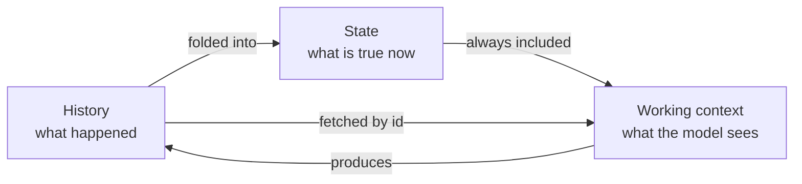
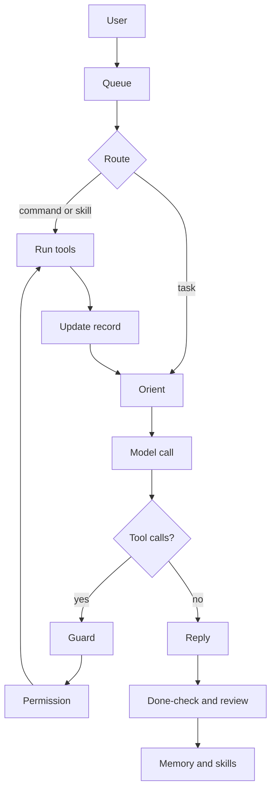
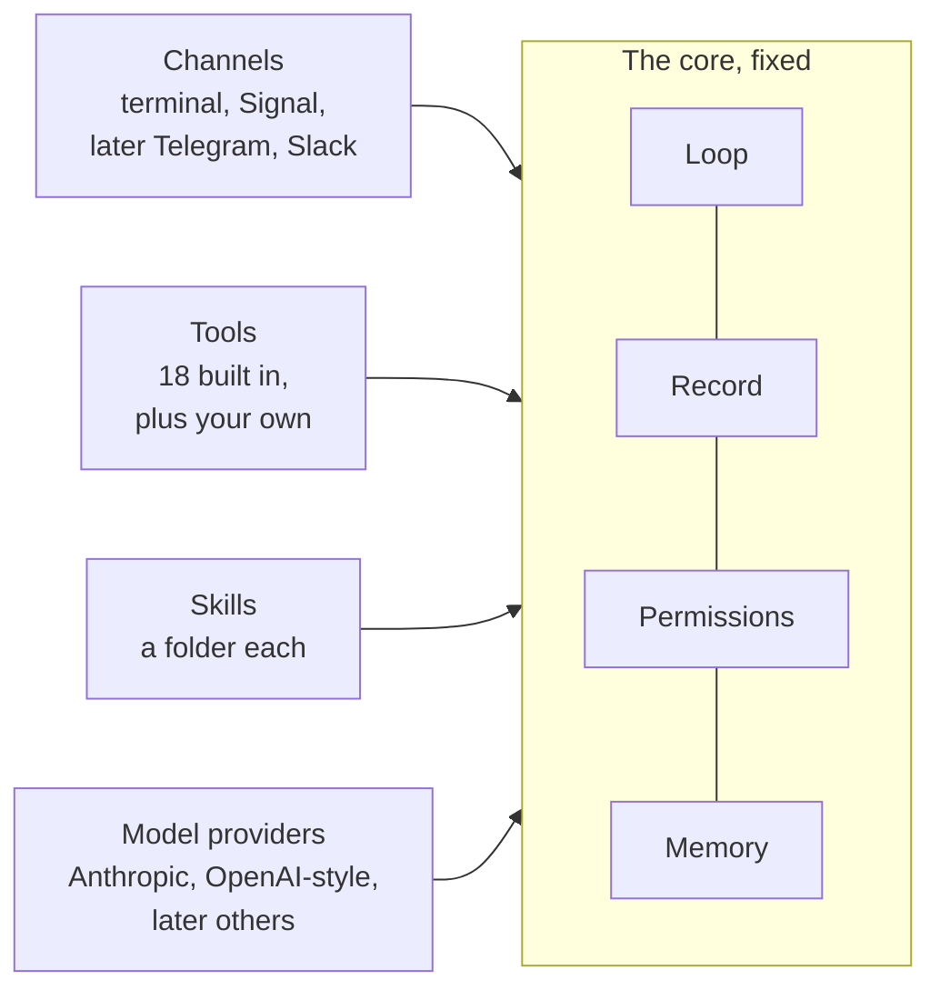
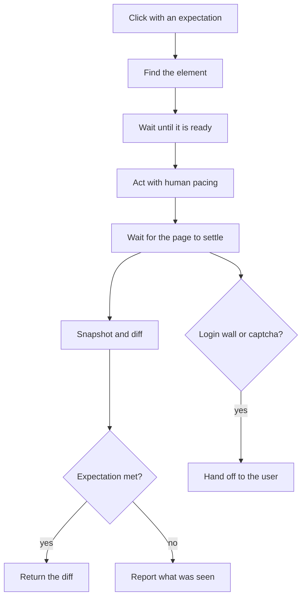

# COEUS

**Coeus is an open-source AI agent that runs on any Linux machine. You talk to it in a terminal or through the Signal messaging app. It works with any language model, large or small, running on your own machine or in the cloud. And it does not forget what it is doing.**

This is the design overview for the first version. Nothing is built yet. The next document will be the work plan for building it. The comparison of other agents that this design grew out of is in `HARNESS_V2.md`, and the research behind that comparison is in `docs/research/`.

Coeus is named for the Titan of intellect, the axis the heavens turn on.

---

## 1. The idea in one page

Every AI agent today is built the same way. A language model is a function. Text goes in and text comes out. The model has no memory of previous calls and no way to act on the world. The **harness** is the program wrapped around the model that gives it both memory and the ability to act. The same models are available to everyone, so the harness is where one agent differs from another.

We studied the harnesses people run today: OpenClaw, Hermes, Prime, OpenCode, Atomic, ZeroClaw, and the two built by the model companies themselves, Codex and Claude Code. All of them keep long-term memory outside the conversation, in files or in a database. But every one of them uses the conversation transcript as the record of the task the agent is working on. On each turn, the model re-reads the whole transcript in order to work out where it is. When the transcript grows too long to fit, most of them summarize it and hope that nothing important was lost. That is like a video game loading your save by replaying every button you ever pressed.

Coeus is built on a different idea, and it is an old one.

**State.** In computer science, state is the small amount of information about the past that you need in order to act correctly next. A counter does not remember every increment that ever happened to it. It remembers the number seven. A database keeps a log of everything that happened, and it also keeps a snapshot of what is true right now, and those two things are not the same. An operating system can pause a program and resume it days later from one small record. Coeus keeps three things separate: the history of what happened, the state of what is true now, and the working context, which is what the model is looking at during this one turn. Think of a library, a desk, and the page in front of you. Nobody reads the whole library to write the next sentence.

**The operations order.** The United States Army faces a larger version of the same problem. A headquarters cannot see every unit, radios fail, and people rotate out in the middle of a mission. The Army's answer is a fixed document format that anyone can write and anyone can check, called the five-paragraph operations order, together with rules for what to do when the plan breaks. We borrow its parts directly. The situation. The mission, including the user's intent and a description of what "done" looks like. The plan. A list of conditions that should make the agent stop and report. Small changes delivered as fragmentary orders. And an after-action review when the work is over.

**The result** is an agent that always knows what it is working on, keeps working until the job is done, tells you when it should, and spends its tokens on the task instead of on re-reading its own past. It works the same way on a small local model and on a million-token frontier model. Only the size of the working context changes, and a big model is never shrunk to fit a small one.



History is the append-only log of every message, every tool call, and every result. It is never placed in the model's context by default. State is the task record, which is one to three thousand tokens long and is shaped like an operations order. The working context is what the model actually sees on a turn: the harness rules, the persona, the task record, any pinned evidence, and the recent messages, with the size chosen to fit the model.

---

## 2. What we learned from the others

We read the source code, not the marketing. The full comparison is in `HARNESS_V2.md`. This is the short version.

**What went wrong.** The two most popular harnesses are 2.9 million and 1.5 million lines of hand-written code. One of them merged 10,574 commits in a single month, and 63 percent of those commits came from one person at a rate of 223 commits a day. Nobody reviews code at that pace, and the result is software that breaks on every update. Neither of them puts a hard limit on how many times the model can call tools in one turn, so "it got stuck" is a built-in outcome rather than a bug. One of them keeps its screen and its reasoning in two different processes joined by a pipe, and the pipe breaks. The agent loops themselves are small, between one and seven thousand lines. The code wrapped around them is fifty to seventy-five times bigger, and that wrapper is where everything fails.

**What worked, and what we keep from each:**

| From | What we keep |
|---|---|
| **OpenClaw** | A pure agent loop with hooks around it. A message that arrives in the middle of a turn steers the next step instead of interrupting the current one. A repair layer for models that write their tool calls as plain text instead of structured data. Scheduled jobs with backoff after failures. Signal support through the signal-cli program, with pairing required for unknown senders. A cache boundary in the prompt. A delivery queue stored on disk. Launching a real Chrome web browser with its own user profile and reading the web page as a tree with short reference tags |
| **Hermes** | The user's own words are never summarized. Memory files with hard size limits. A breaker that stops crash loops. One lease per session, so two turns cannot run at once. A delivery ledger that admits when a message may be a duplicate. A masked prompt for entering passwords. One redaction function applied to everything that leaves the program |
| **Prime** | Notes with a history and a rollback that the next prompt actually reads. Scheduled jobs used as a heartbeat. Budgets with a checker at the end |
| **OpenCode** | One core with an API inside it, so that every screen is a thin client. Streaming replies as small deltas. One command table shared by every surface. Approvals shown inline, with the choices once, always, and reject. A permission engine built from rules, where the last matching rule wins and the default is to ask. Tool descriptions written as plain text. A bad tool call becomes an error the model can fix, never a crash |
| **ZeroClaw** | A cap of ten tool rounds followed by a forced final answer. A parser for messy tool calls. A job store where two processes cannot run the same job. An updater that keeps the old program and rolls back if the new one fails |
| **browser-use, Stagehand, agent-browser** | Marks on the web page elements that just appeared. Hints about how much of the page is below the fold. Aborting a batch of actions when the page changes underneath it. A finish step that must state whether it succeeded |
| **Codex and Claude Code** | The operating-system sandbox is the real security boundary. Escalation is a field on the tool call with a written reason. The model decides what to do, the harness decides what is allowed, and the two never share a layer |
| **Systems design** | Event sourcing, where the log is the truth and the snapshot is the compact image of it. Process control blocks, which let a program pause and resume from a small record. Paging, which keeps what was touched recently and fetches the rest on demand. Save files, which are checkpoints you can reload |
| **The U.S. Army** | The five-paragraph order, the commander's intent, fragmentary orders, critical information requirements, and the after-action review |

---

## 3. How the agent works



A message from the user goes into a queue on disk. The router decides whether the message is a command, a trigger for a saved skill, or a real task. A command or a skill runs its tools directly, without calling the model. A task goes through the loop. First the agent orients, which means the harness places the task record in front of the model and the model states where the work stands and what comes next. Then the harness calls the model with the harness rules, the persona, the record, any pinned evidence, and the recent messages. If the model asks for tools, the guard checks the request for repeated calls, malformed calls, the round cap, and the stop conditions. The permission function then decides to allow the call, ask the user, or deny it, and anything irreversible is shown to the user as a preview first. The tools run inside the sandbox, with timeouts and output caps, and they return only what changed. The harness updates the record with the results, and the loop goes back to orient. When the model replies without asking for tools, the turn ends. When the task ends, the done-check runs, then the after-action review, and what was learned goes into memory and skills.

One process owns everything: the queue, the loop, the permissions, the record, the memory, the scheduled jobs, and one SQLite database file. The process starts two helper programs when it needs them. One is a browser worker that runs a real Chrome web browser with its own user profile. The other is a desktop worker that controls the screen, mouse, and keyboard. They are separate processes so that a hung browser can never take the agent down. There are two screens, the terminal and Signal. Neither screen owns any state, and both use the same command table.

### The turn, in ten rules

1. A message that arrives in the middle of a turn is treated as a fragmentary order. It changes only what it changes, the way you might text a driver "take the next exit" without re-sending the whole route. The harness writes the message into the record as a correction, and the model re-plans from there. The message never interrupts a tool that is already running.
2. The model orients before it acts. Before any tool call, it writes one line stating where the work stands and what comes next. If the situation does not match the plan, the plan is fixed first.
3. There is a cap of twenty tool rounds per turn on every model. When the cap is reached, the model gets one last call with tools turned off and is asked to say what it did and what is left. A long task also gets a budget of rounds, tokens, and minutes.
4. If the model makes the same call twice with the same arguments, the harness does not run it a second time. It tells the model to do something different or to answer. A third identical call ends the turn.
5. A malformed tool call is repaired if the name is close to a real tool. Otherwise the model gets back the list of real tools. Text that looks like a tool call is parsed as one. The loop never crashes because of something the model wrote.
6. Every error message ends the same way, with three options: answer the user, ask one question, or try different arguments.
7. Every tool has a timeout, its own process group, and a cap on its output. Anything over the cap goes to a file, and the result tells the model where the file is.
8. A turn that has read a web page or a feed is marked as tainted. Nothing irreversible can happen in a tainted turn until the user speaks again. An unattended run that hits a question stops and reports.
9. Retries live outside the loop. The harness tries three times with backoff, then moves to the next model in the chain.
10. A question ends the turn. The model asks in plain text, the task is marked as waiting, and the user's next message resumes it, even if that message comes days later.

---

## 4. State: three kinds, one format

### Three kinds of state

| Kind | What it holds | How often it changes | Where it sits |
|---|---|---|---|
| **Persona** | Who the agent is, who the user is, the standing rules, and durable memory | Rarely | In the cached prefix of every prompt |
| **Skill** | How to do one kind of thing: the steps, what to expect at each step, the permissions, and the known failures | When a website or a tool changes | Loaded only when the skill is used |
| **Task** | What is true right now about the thing being worked on | Every turn | In the task record, which is always in context |

Think of a carpenter, the way that carpenter cuts a joint, and the cabinet on the bench today. Only the task changes from turn to turn. Keeping the three separate keeps the prompt cache warm and keeps the record small.

### The task record, shaped like an operations order

An Army order has five paragraphs: situation, mission, execution, sustainment, and command and signal. The mission paragraph answers who, what, when, where, and why. It also carries the commander's intent and the desired end state, so that when the plan breaks, the unit can still act correctly. Before the operation, the commander also lists the facts that would change a decision, called the critical information requirements. Our record uses the same shape, with the user in the commander's place. It is the pilot's kneeboard: one card that holds the mission, the current leg, and the abort rules, while the full flight log stays on the ground.

| Section of the record | Paragraph of the order | Who writes it |
|---|---|---|
| Ask | Mission: who and what | The user, word for word. It is never edited |
| Intent and Done | Mission: why, and the end state | The model drafts it, and the user can correct it |
| Corrections | Fragmentary orders | The user, word for word. They are only ever added to |
| Stop and tell the user if | Critical information requirements | The model drafts the list, and the harness adds the budget and login walls |
| Situation | Situation | The harness, from the world as it is right now |
| Plan, Decisions, Failures | Execution | The model, through the `task` tool |
| Results, budget, and source | Sustainment, and command and signal | The harness |

Here is a complete example:

```
# t17  status: executing  from: signal  budget: 6 of 20 rounds, 41k tokens, 9 min
## Ask (word for word, never edited)
"Write a tweet for our product anniversary and post it from the company account."
## Intent (why, and what done looks like)
Why: a timely, accurate post in the company's voice.
Done: a tweet under 280 characters, previewed and approved, live on the site.
## Corrections (word for word, only added to)
- 17:05 "don't mention pricing"
## Stop and tell the user if
- the post would mention pricing, a person, or a date I cannot source
- the site shows a login wall, a captcha, or a bot check
- the task passes 15 rounds or 30 minutes
## Situation (what the world says now; checked again each time, never assumed)
- tab t1: the compose page, logged in as the company, box empty
- facts on hand: r3 (memory/product.md), r4 (the about page)
## Plan
1. [done] gather facts -> r3, r4
2. [doing] draft under 280 characters, no pricing
3. [ ] preview to the user and wait
4. [ ] post with the skill post-update, then verify it is live
## Decisions (with the reason, so they are not argued again)
- D1 Lead with the date, not the features. Reason: the ask says anniversary.
## Failures (so they are not repeated)
- F1 Draft 1 was 312 characters. Cause: three facts. Do not put three facts in one post.
## Results (one line each; read any of them with `read r7`)
- r3 read memory/product.md: 2,100 characters
- r4 web fetch of the about page: 1,800 characters
- r5 browser_open of the compose page: ok, tab t1
```

### The rules for the record

**What goes in.** The record holds only what the world cannot answer on its own. Which files changed is answered by `git diff`. What is on the web page is answered by the snapshot. Whether a job ran is answered by the jobs table. Those things are looked up, never remembered. The record holds what only the conversation knows: what was asked, why it was asked, what was corrected, what was decided and why, and what failed and why.

**Who writes what.** The harness writes everything it can verify, and it does so with zero model tokens: the header, the corrections, the situation, the results, the status of each step based on tool outcomes, and a failure line whenever a tool errors or an expectation is not met. The model writes the parts that require judgment: the intent, the stop conditions, the plan, the decisions, and the failures it understands. The stop conditions work like a smoke detector. You decide what counts as an alarm before the kitchen is on fire. The ask, the intent, and the corrections are never edited by anyone.

**Size.** The record stays between one and three thousand tokens. When it grows past that, the harness folds finished steps and old result lines into single lines. Nothing is deleted, and every result stays readable by its id.

**Cache.** The parts of the record that rarely change sit above the cache line: the ask, the intent, the corrections, the stop conditions, and the decisions. The parts that change every turn sit below it: the situation, the plan status, and the results.

**Checkpoints.** Every change to the record saves a numbered checkpoint tied to the log. A task that is waiting on the user resumes from its last checkpoint, with nothing held in any context window in the meantime. The command `/tasks 17 back 3` reloads an earlier checkpoint and lets the model try a different path, the way you would reload a saved game. Any failed task can be replayed from a checkpoint as a test after a fix.

### The done-check and the after-action review

A task cannot close until every line under "Done" has been answered true, with evidence. A plane does not land because the pilot feels done. The landing gear, the flaps, and the clearance are each checked in turn. The finish was defined before the work started, and the harness will not let the model declare victory otherwise.

Then come the four questions of the Army's after-action review, answered in one line each, the way a coach runs the film after a game. What was supposed to happen? What actually happened? Why was there a difference? What do we keep, and what do we change? The answer to the last question is what goes into memory or into a skill. This replaces the vague "save what you learned" step that every other harness uses.

### Working context: one rule, sized to the model

Context is the model's working memory for a single call. Nothing carries over from one call to the next except what the harness puts back. Coeus has one rule for it. **The working context is never smaller than the task needs and never bigger than the model can hold.** The record is the same size on every model. The window around it is the only thing that changes, from a few thousand tokens on a small local model to most of a million on a frontier model. A big model is never held back to suit a small one.

Two facts about tokens decide the layout. First, a cached prefix costs about a tenth of a fresh one, so the order of the prompt matters more than its size, and stable things must come first. Second, appending is cheap while rewriting is expensive, because a rewrite breaks the cache. Agents that summarize their transcript rewrite their entire history every time they compact it. Coeus only appends to history, and the only thing it rewrites is a record of one to three thousand tokens.

The prompt is built in layers, ordered from the part that changes least to the part that changes most:

| Layer | How often it changes | Cache point |
|---|---|---|
| Harness rules and persona | Weekly | A |
| Tools | When the software is updated | B |
| Record, stable part: ask, intent, corrections, stop conditions, decisions | Rarely during a task | C |
| Record, live part: situation, plan status, results | Every turn | |
| Pinned evidence, kept word for word | When something is pinned | |
| Recent messages, appended and never rewritten | Every turn | |
| Memory hint, three lines from search | Every turn | |

**Tiered folding.** When a message or a result leaves the recent window, it does not vanish and it is not summarized. It drops one tier. It goes from being in the window word for word, to a one-line entry in the record, to the log, where `read r7` brings it back in full. Today's clothes are on the chair, this week's clothes are in the closet, the rest are in the suitcase, and nothing was thrown away. A large model rarely folds anything. A small model folds constantly and loses nothing.

**Cost on every turn.** The harness knows the token count of each layer and the cache hit rate. It writes one line into the record header, such as "this turn: 6.1k in, 5.2k of it cached, 0.4k out." The `/status` command totals the cost per task. The user can always see what a task cost and where the tokens went.

**The proof.** The forty-step test task runs on every supported model size when the software is built, and it checks the same three things every time: the ask and the corrections are byte-for-byte identical at the end, the done-check passes, and no result has become unreadable. "Works on any model" is a test, not a claim.

**Why not just use the million tokens.** Attention dilutes. A model reasons worse over a million tokens of noise than over thirty thousand tokens of signal, and the leaders on long-task benchmarks all use explicit plans and memory for exactly that reason. The record is also what lets a task be paused for three days and resumed, possibly on a different model, with nothing held in any window. A million-token context is a bigger window. It is not a save file.

---

## 5. What the model is told

The model works inside a harness, and it cannot do its job well unless it understands what the harness does for it and what the harness expects from it. So the first thing in every prompt, before the persona and before the tools, is a short explanation of the harness written for the model. It is the same on every model and it is under three hundred words. Here it is in full.

> **Where you are.** You are the reasoning engine inside Coeus, an assistant that runs on the user's computer. You do not remember earlier calls. The harness around you does. On every call it gives you, in this order: these rules, your persona, your tools, the record of the current task, any evidence that has been pinned, the most recent messages, and a short memory hint. Everything else that ever happened is stored on disk, and you can fetch any past result by its id.
>
> **The task record is the truth.** The record tells you what the user asked, why, what they corrected, what has been decided, what has failed, and where the work stands. Trust the record over your own recollection of the conversation. Your first line on every turn states where the work stands and what you will do next. If what you see does not match the plan, update the plan before you act.
>
> **Your part of the record.** Use the `task` tool to update the plan, add a fact with its source, record a decision with its reason, or record a failure with its cause and what not to do again. The harness fills in the rest. You cannot change the ask, the intent, or a correction, and you should not try.
>
> **When to stop.** Stop when any "stop and tell the user" condition is true, and say which one. Otherwise keep going until every line of "done" is true or the budget runs out. To ask the user something, ask in plain text and end your reply. The harness will resume you when the answer arrives.
>
> **Tools.** Call a tool only when you need it. Never make the same call twice with the same arguments. If a result was cut short, read the file the result names. Never type a password into anything. Use the login tool. Nothing irreversible will run without the user seeing a preview first.
>
> **How to write.** Use plain, short English that a high-school student could follow. Avoid jargon. When a technical term is needed, explain it simply. Match the length of your reply to the question. State facts, and say "not sure" when you are not sure. When work is done, report three things: what changed, what you checked, and what is left.

The harness enforces what it can, so the model does not have to be trusted on those points. The ask and the intent are compared byte for byte after every turn. Every fact line must name a source and every failure line must name a cause, or the `task` tool rejects the update. Every step marked done must have a result behind it. A task cannot close until the done-check has been written. If any check fails, the turn does not close, and the model receives one line naming the rule.

---

## 6. Built to grow: the four extension points

The first version has exactly two screens, the terminal and Signal, and a small set of tools. But other people will want Telegram, Slack, iMessage, or a web page, and every user will want to add tools and skills of their own. So the core is built around four shapes that stay fixed while the things that fit them multiply. Adding a Telegram connection later is a new file that fits the channel shape. It does not touch the loop, the record, the permissions, or the memory.



**Channels.** A channel is anything a user can talk through. Every channel does the same six things: receive a message, send a message, send a file, show a preview and collect approve or reject, show a masked prompt for a secret if it can, and report whether it is healthy. The terminal and Signal are the first two. Telegram, Slack, or iMessage would each be one new file that does those six things. Everything a channel receives goes into the same queue, and everything it sends comes from the same event stream, so the loop never knows which channel it is talking to.

**Tools.** A tool has a name, a plain-English description under forty words that says when to use it and when not to, a list of input fields with their types, a permission class, and a function that runs it and returns text. That is the whole contract. The eighteen built-in tools follow it, and a user's own tool is a small program in a `tools/` folder that follows it too. The harness reads the folder at startup, adds the tools to the list the model sees, and puts them through the same permission function as everything else. The industry's shared tool protocol, MCP, fits the same shape, so a later version can load MCP servers as tools without changing the core.

**Skills.** A skill is a folder with a description file, the recorded steps or a script, a dry-run test, and a changelog. Section 8 describes it. Because a skill is just a folder, people can share skills by sharing folders.

**Model providers.** A provider turns a prompt into a streamed reply and reports how many tokens it used. Two providers cover nearly every model in existence: the Anthropic API, and the OpenAI-compatible API with a base address, which is how LM Studio, Ollama, llama.cpp, and every cloud gateway present themselves. A third provider would be one new file. The model's name and the fallback chain are set in the configuration.

**What stays fixed.** The loop, the record format, the permission function, the memory layers, and the event log do not have extension points. They are the core, and keeping them closed is what keeps the agent simple.

---

## 7. Tools

There are eighteen tools built in, and all of them are shown to every model. In the class column, R means the tool reads, W means it writes, X means it executes a program, N means it uses the network, and I means it does something that cannot be undone. Every description is plain text under forty words, and it says when not to use the tool.

| Tool | What it does | Class |
|---|---|---|
| `read` | Reads a file, a directory listing, or a past result by its id | R |
| `write` | Creates a file or overwrites an existing one | W |
| `edit` | Replaces one exact span of text in a file | W |
| `search` | Finds files by name pattern, or finds lines by regular expression | R |
| `shell` | Runs a command. After ten seconds it returns a job id that can be polled, tailed, or killed. An `escalate` field with a written reason requests sudo | X |
| `web` | Searches the web, or fetches a public web page as text. Anything that needs a login or a click belongs to the browser tools | N |
| `memory` | Searches, gets, or saves a memory | R and W |
| `task` | Updates the plan, adds a fact with its source, records a decision or a failure with its reason, or pins a result | W |
| `skill` | Views, runs, or saves a skill | R, X, and W |
| `schedule` | Creates one scheduled job that runs at a time, on an interval, or on a cron expression | I |
| `browser_open`, `browser_read`, `browser_click`, `browser_type`, `browser_act` | The web browser tools, described in section 9 | N and X |
| `browser_login`, `browser_handoff` | The web browser tools that involve credentials or the user, described in section 9 | N and I |
| `computer` | The desktop tool, described in section 10 | X and I |

Tool results are built by the harness. They are never parsed out of the model's own text, so a model cannot invent a result. Asking the user a question is not a tool. The model simply asks in plain text, and the turn ends in a waiting state.

---

## 8. Skills

A skill is a recipe card. The first time you cook the dish, you think hard. After that, you follow the card and only think when something looks wrong.

On disk, a skill is a folder that contains four things. A file named `SKILL.md` holds the skill's name, a one-line description, the words that trigger it, and its permissions, which cover the browser profile it may use, the websites it may visit, its daily limit, and which of its steps cannot be undone. A file of recorded steps, or a script, holds the procedure itself. A dry-run test runs the procedure up to the first step that cannot be undone and then stops. And a changelog records every change with a way to roll it back.

A skill is born in one of three ways. The user demonstrates the task once while the harness records it. The user points the agent at documentation and the agent writes the skill from it. Or the agent finishes a task and offers to save the procedure it just used. Only the names and one-line descriptions of skills sit in the prompt. The body of a skill loads when the skill is used. When a skill's trigger words match a message, the router runs the skill directly, without calling the model, and the model is only called if a step fails.

---

## 9. The web browser, used like a human

The web browser is the centerpiece of the design. The agent gets a real Chrome web browser, launched with its own user profile folder, and never the user's daily Chrome profile. The user logs in to each website once by hand, or the agent fills in the credentials from the vault. After that, the saved cookies are the login, and the agent uses the site the way the user would.



Every browser action works the same way. The model asks for an action and states what it expects to happen. For example, it asks for a click on the compose button and expects that a text box will appear. The browser worker finds the element by its reference tag. If the tag has gone stale because the page changed, the worker finds the element again by its role and its name, and then by its visible text. The worker scrolls the element into view and waits until it is visible, enabled, and no longer moving. It performs the action with human pacing. It waits for the page to settle, which means either that navigation has finished or that nothing on the page has changed for three hundred milliseconds, with a limit of three seconds. It takes a new snapshot of the page and compares it with the old one, noting any change of address, any new elements, any dialog box, any new tab, and any download. If the expectation was met, it returns the difference and a fresh snapshot. If a click produced no visible change, it retries once by screen coordinates and then reports. If the expectation was not met, it reports what it expected and what it saw instead. If at any point it hits a login wall, a two-factor prompt, or a captcha, it hands off to the user by bringing the browser window to the front and sending a message, and it waits for the user to say "done."

**What the model sees.** The model sees a compact tree of the web page with short reference tags, a few hundred tokens in all. Every link, button, and text field appears with its name and its tag. Elements that just appeared are marked as new. A count shows how much of the page is below the fold. A screenshot with numbered marks on the clickable elements is available with one call.

**Act and assert.** Every action carries an expected result, and the worker checks that result before the next step. A mechanic tightens the bolt and then tries to turn it. This is how automated testing frameworks get reliable, and it is why the agent will not click the wrong thing three times in a row.

**Like a human.** The agent uses a real Chrome web browser so its fingerprint matches a real browser. It runs with the window visible on the machine's own display, on the user's own network connection. It moves the mouse along a curve, holds a click for a human length of time, types one key at a time with small variations in speed, scrolls in steps, and pauses between actions. Each website gets a daily budget of actions. There are no proxy servers, no invisible headless mode for logged-in accounts, no copying of cookies from one browser to another, and no captcha solving. All of this is about keeping the user's accounts safe.

**Everything a human can do.** Tabs and popup windows, frames inside pages, uploads and downloads, dialog boxes, PDF files read as text, keyboard shortcuts, drag and drop, hovering, and the back and forward buttons.

**Skills in the browser.** The user records a procedure once. The harness logs each step's intent, the element it used, and what was expected to happen. Replaying the skill needs no model at all. When a website changes and a step fails, the model finds the element that matches the recorded intent and proposes a one-line patch, which the user approves.

**The engine.** One long-lived Playwright worker per browser profile, attached to the Chrome that the agent launched. Playwright is a browser automation library from Microsoft. The runner-up choice is Vercel's agent-browser, which is a single program written in Rust.

---

## 10. The desktop, command-line tools, and memory

**The desktop.** There is one `computer` tool, and it runs through the desktop worker. It can launch or focus an application, take a screenshot with numbered marks on the clickable elements, click, type, press keys, drag, and use the clipboard. It uses the same human pacing and the same act-and-assert loop as the browser. The user grants the agent access to an application once per session, and actions inside that application that cannot be undone still get a preview. The desktop is the last resort. If the browser can do the job, the browser does it.

**Any command-line tool.** The `shell` tool plus a skill covers this. When the user hands the agent a new command-line tool, the agent reads the tool's help text and documentation, writes a skill containing the commands it will actually use with one example of each, runs a smoke test, and saves the skill.

**Memory.** The persona holds two files with hard size limits, `MEMORY.md` for facts about the world and `USER.md` for facts about the user, plus a folder of markdown files for anything larger. All of it is indexed by full-text search, along with every past message. The harness records what it can verify with zero model tokens: files changed, commands run, websites visited, and any user message that starts with "no," "actually," "always," "never," or "don't," which is kept word for word as a correction. The after-action review writes the rest. Every fact has a source and a date. Nothing is deleted. A new fact supersedes the old one, and the old one stays searchable. A three-line memory hint rides below the cache line on every turn, and the model can search for more.

---

## 11. Safety, the vault, and reliability

**Five safety rules.** First, one permission function checks every tool call. It is built from rules that name a tool, a pattern, and an action. The last matching rule wins, and the default is to ask the user. Second, every shell command and every file-writing tool runs inside a sandbox built on the Linux tools bwrap and Landlock. The vault, the browser profile, and the user's SSH keys are always outside the sandbox. If the sandbox is missing from the machine, the shell tool is turned off. Third, a tainted turn cannot do anything that cannot be undone. Fourth, nothing that cannot be undone runs without a preview, the way you read a text message back before you hit send. The sandbox itself is a workbench with a lip, so that whatever rolls off stays on the bench. Fifth, secrets are references and never values, one redaction pass runs on everything that leaves the program, and everything is logged.

**The vault.** The vault is an encrypted file with a key that only the agent's own user account can read. Secrets are entered only in the terminal, through a masked prompt that shows asterisks, and never over Signal. The model never sees a secret. It points at the login fields on the page, and the `browser_login` tool types the username, the password, and the two-factor code itself. Sudo has its own path. A shell call with the `escalate` field and a written reason produces a preview. When the user approves it, the harness runs the command outside the sandbox with the sudo password from the vault. The database, the vault, and the browser profile are backed up every night in encrypted form.

**Reliability.** The agent runs under systemd, the Linux service manager, with a watchdog line, and it uses exit codes that mean "restart me" or "bad configuration, stop." There are caps everywhere: twenty tool rounds per turn, fifteen minutes per turn, seven minutes per tool, and one hundred queued messages. The event log is the ledger. A reply is logged before it is sent, a crash replays the log, a resent message says that it may be a duplicate, and a breaker stops crash loops while keeping the agent serving. A readiness check runs before anything trusts the process. Updates keep the previous program, switch a link to the new one, and switch it back if the new one is not ready within sixty seconds.

| Self-fixing tier | Who does it | When |
|---|---|---|
| Restart a dead process | systemd | Automatically |
| Repair state and replay the log | The agent, at startup | Automatically |
| Roll back a bad update | A supervisor script | Automatically |
| Replay a failed task as a test after a fix | The user, with one command | On demand |
| Propose a repair from its own logs | The model | Only after asking |
| Edit its own code | The model, in a branch, with tests | Never unattended |

---

## 12. Interfaces

There is one command table. The terminal prints the result, and Signal sends it.

| Command | What it does |
|---|---|
| `/new` and `/sessions` | Starts a fresh session, or lists sessions and switches between them |
| `/tasks` | Shows what is running, waiting, or done. `/tasks 17` shows one record, and `/tasks 17 back 3` rewinds it three checkpoints |
| `/model` | Shows or sets the model |
| `/status` | Shows the model, the token cost, the jobs, the pending approvals, and the health |
| `/stop`, `/pause`, and `/resume` | Stops this turn, or pauses and resumes all scheduled work |
| `/jobs` | Lists, runs, or disables scheduled jobs |
| `/approve 3` and `/deny 3` | Answers a preview or a question |
| `/screen` | Sends a screenshot of the browser or the desktop right now |
| `/memory`, `/skills`, and `/vault` | Show and manage each. The vault works only in the terminal |
| `/undo` and `/help` | Reverts the last turn's file changes, and shows this list |

**Signal.** The agent supervises signal-cli, an external program that connects to Signal, linked as a secondary device to the user's phone. Unknown senders receive a pairing code. Photos and files the user sends are saved and can be read by the model. The agent sends one message per reply. A preview arrives as the actual post or command. A handoff arrives with a screenshot. The user replies with `approve`, `done`, a code, or `abort`.

**Terminal.** The terminal is a thin client of the running agent. It draws its first frame at once, streams the reply as it arrives, shows approvals inline, shows screenshots inline where the terminal supports it, and uses a masked prompt for the vault. It owns no state.

---

## 13. Building it

**Language.** The agent itself is written in Go. We measured a Go daemon with every library it needs at eight milliseconds to start and nineteen megabytes of idle memory, shipped as one static binary, with a ten-second build, and with a compile-and-fix loop that usually takes one round. The browser worker is written in TypeScript, because Playwright is built for TypeScript. Two API shapes cover every model: the Anthropic API, and the OpenAI-compatible API with a base address, which covers LM Studio, Ollama, llama.cpp, and every cloud gateway.

**Size.** The whole thing is about twelve to sixteen thousand lines, which is under one percent of OpenClaw.

**Order of work.** The terminal comes first, then Signal, then the browser, then skills and memory, then scheduled jobs and the desktop. The next document is the work plan, which will use test-driven development: the tests that define "done" are written before the code, at four levels, which are unit tests, integration tests, functional tests, and fuzz tests. The work will be done in waves of five sub-agents at a time, with a more capable orchestrator directing them.

| Stage | What it adds | What you get |
|---|---|---|
| v0 | The agent process, the loop, the guard, five tools, one model provider, the terminal, the event log, and the record | A terminal agent |
| v1 | Signal with pairing, permissions, preview first, the sandbox with escalation, and the persona files | A phone assistant that does not get stuck and does not lose messages |
| v2 | The browser worker, the profile, the vault, login, handoff, act and assert, and human pacing | An agent that uses Chrome the way you do |
| v3 | Skills from demonstrations and documentation, memory, and the after-action review | An agent that learns and remembers |
| v4 | Scheduled jobs, the desktop worker, visual QA, the updater with rollback, and replay as test | An agent that is always on and fixes itself |

**Left out on purpose.** Dozens of chat channels and model providers, a web interface, plugins that run inside the process, a Python kernel, API shortcuts that bypass the browser, cookie copying, captcha solving, cloud browsers, vector memory in the first version, a reviewer that must always write something, and a model that updates its own code.

**Code that can be studied while building.** These are on disk or were cloned during the research, and each has a study file in `docs/research/` with line-level citations.

| Project | Where | What to look at |
|---|---|---|
| OpenClaw | `~/Code/openclaw` | The agent loop in `packages/agent-core`, the tool-call repair package, the Signal extension, the cron service, the prompt cache boundary, the browser extension |
| Hermes | `~/Code/hermes-agent` | The context compressor, the memory tool, the gateway reliability files, the sudo prompt in the CLI, the Signal platform |
| Prime | `~/Code/prime-agent` | The cron jobs file, the goals file, the harness state and refinement code, the provider types |
| OpenCode | `~/Code/opencode` | The permission engine, the tool registry and its plain-text descriptions, the command registry in the terminal client, the session loop |
| ZeroClaw | `~/Code/zeroclaw` | The Signal channel, the cron store and scheduler, the tool-call parser crate, the updater, the Landlock wrapper, the skill creator |
| Moltis, Codex, Atomic, browser-use | The research scratch folder, cloned read-only | Moltis's browser manager, Codex's sandbox and tool specifications, browser-use's page representation and action set |

---

## Sources

The operations order and its five paragraphs are described in [FM 5-0, The Operations Process](https://armypubs.army.mil/epubs/DR_pubs/DR_a/ARN35403-FM_5-0-000-WEB-1.pdf). Fragmentary orders are covered in [Operation, Warning, and Fragmentary Orders](https://www.globalsecurity.org/military/library/policy/army/accp/in0541/ch1.htm). Commander's intent is explained in the [Marine Corps Gazette](https://www.mca-marines.org/gazette/commanders-intent-defined/), and critical information requirements are explained at [The Fivecoat Consulting Group](https://www.thefivecoatconsultinggroup.com/tfcg/ccir). Boyd's decision loop, and why orientation is its center, is covered in [Chet Richards, Boyd's OODA Loop](https://ooda.de/media/chet_richards_-_boyds_ooda_loop.pdf). The four questions of the after-action review are described by [Nick Milton](http://www.nickmilton.com/2009/10/after-action-review-4-questions.html). The harness comparison and its seventeen source studies are in `HARNESS_V2.md` and `docs/research/`.
