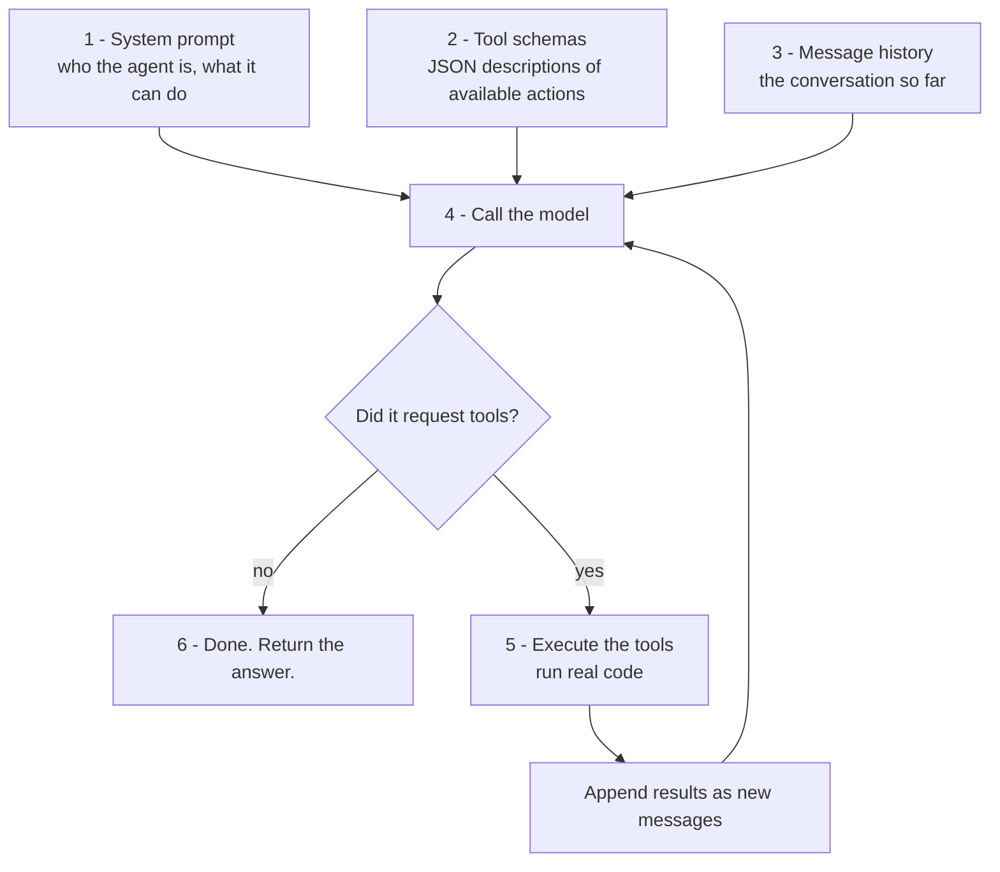
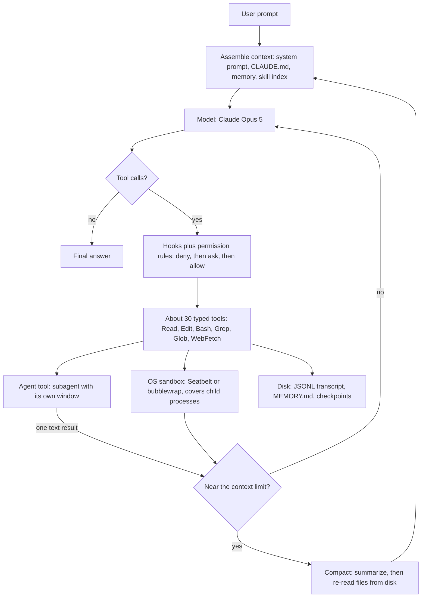
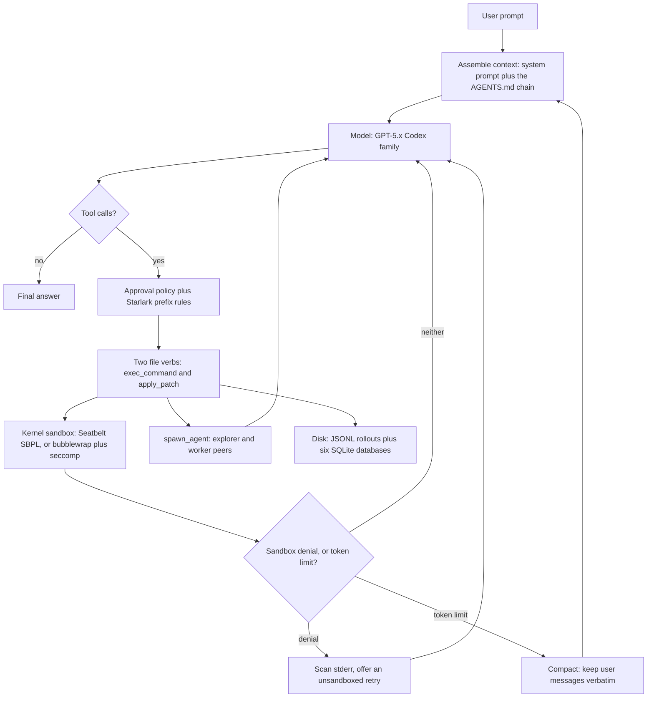
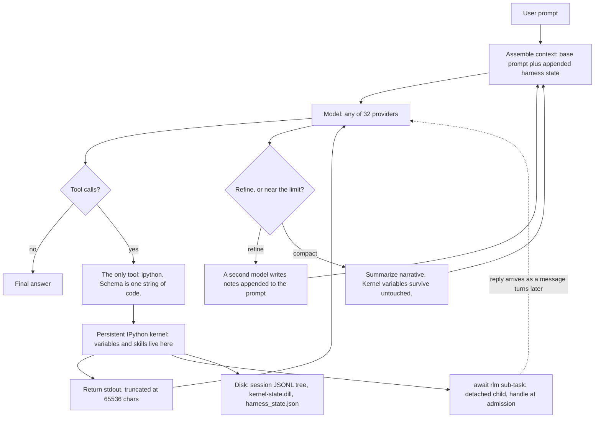
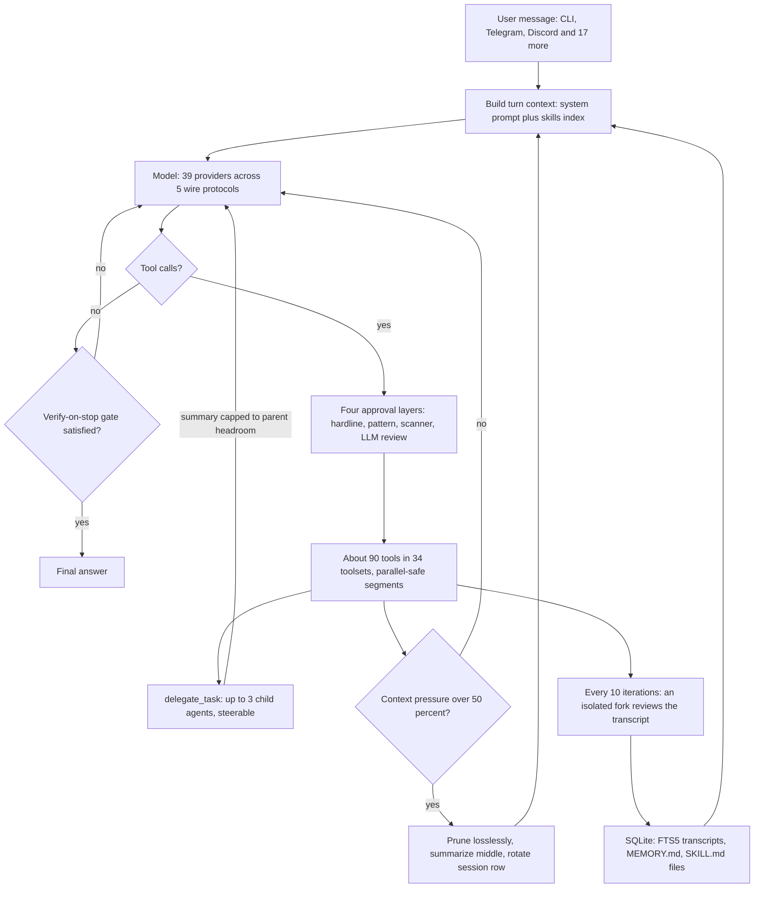
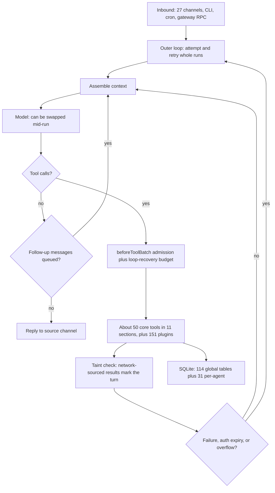
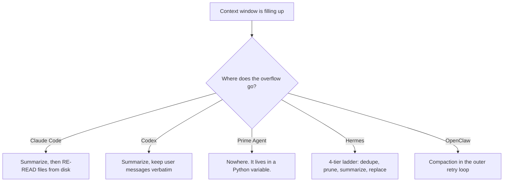
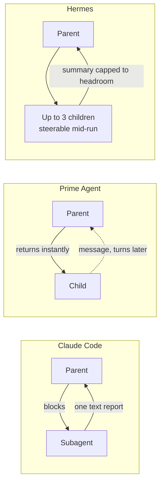

# HARNESS.md

**Understanding AI Agent Harnesses From The Inside Out**

A comparison of Claude Code, Codex CLI, Prime Agent, Hermes Agent, and OpenClaw — how they work, why they differ, which to use, and how to build your own.

Prepared 6 August 2026. Research method: 17 AI research agents, ~2.9M tokens, reading actual source code in three local repositories plus public documentation, with adversarial verification passes on every load-bearing claim. Code citations are `file:line` against the checkouts in `~/Code/`.

---

## Table of Contents

- [Part 0 — The One-Page Version](#part-0--the-one-page-version)
- [Part 1 — What Every Harness Is](#part-1--what-every-harness-is)
- [Part 2 — Five Harnesses, One Diagram Each](#part-2--five-harnesses-one-diagram-each)
- [Part 3 — The Eight Axes That Actually Differ](#part-3--the-eight-axes-that-actually-differ)
- [Part 4 — Tool Calling From The Inside Out](#part-4--tool-calling-from-the-inside-out)
- [Part 5 — Memory, Context, and Storage](#part-5--memory-context-and-storage)
- [Part 6 — Is Prime Agent The Real Deal?](#part-6--is-prime-agent-the-real-deal)
- [Part 7 — Using Prime Agent Today](#part-7--using-prime-agent-today)
- [Part 8 — Speed: Python, C++, and Cling](#part-8--speed-python-c-and-cling)
- [Part 9 — Build Your Own Harness](#part-9--build-your-own-harness)
- [Appendix — Sources and Method](#appendix--sources-and-method)

---

# Part 0 — The One-Page Version

## What a harness is

A language model is just a function. Text goes in, text comes out. It has no memory, no filesystem, no ability to run anything, and it forgets everything the moment it finishes.

**A harness is the program wrapped around that function that turns it into an agent.**

Everything that makes Claude Code feel different from Codex, or Prime Agent different from Hermes, happens in that wrapper. Same models underneath. Different wrappers.

That's worth sitting with, because it means the thing you're evaluating is not intelligence. It's _plumbing_. And plumbing you can understand.

## The verdict, up front

| Harness          | What it actually is                                       | Use it when                                         |
| ---------------- | --------------------------------------------------------- | --------------------------------------------------- |
| **Claude Code**  | Coding agent with ~30 typed tools, tuned to Claude        | **Your daily coding driver**                        |
| **Codex CLI**    | Coding agent with 2 tools and a kernel-level sandbox      | **Coding where blast radius matters**               |
| **Prime Agent**  | Research agent with 1 tool: a persistent Python notebook  | **Long-running analysis over big data**             |
| **Hermes Agent** | Always-on personal assistant, deepest context engineering | **Personal assistant that lives in your chat apps** |
| **OpenClaw**     | Always-on assistant gateway across 27 messaging networks  | **Not recommended — see security record**           |

**Best for coding: Claude Code.** It isn't close. The model was trained on its exact tool schemas.

**Best as an assistant: Hermes Agent.** OpenClaw is better-factored code with a disqualifying security record.

## The three ideas that explain everything else

1. **The harness is a context-management machine.** The context window is small, expensive, and re-billed every single turn. Every architectural decision in every one of these systems is downstream of "what do we put in the window, and where does the overflow go?"

2. **The loop is easy. The operations are hard.** OpenClaw's pure agent loop is ~1,600 lines. The retry, auth-rotation, failover, and compaction-recovery machinery wrapped around it is _tens of thousands_. That ratio is the real lesson.

3. **Lab harnesses are co-designed with their models.** Anthropic trained Claude on Claude Code's tools. OpenAI trained the codex models on Codex's. A third-party harness using those models is off-distribution and pays a quiet tax on every call.

---

# Part 1 — What Every Harness Is

## The six-part machine

Strip away the branding and all five systems are the same thing:



That's it. That is a complete agent. Everything in this document is a refinement of those six boxes.

## Here is the whole thing, in real code

This runs. It's about 60 lines. It is a genuine coding agent.

```python
import anthropic, subprocess, json, pathlib

client = anthropic.Anthropic()

TOOLS = [
    {
        "name": "read_file",
        # The description IS the prompt. This is the only thing telling
        # the model when to reach for this tool. Write it carefully.
        "description": "Read a UTF-8 text file from disk and return its contents.",
        "input_schema": {
            "type": "object",
            "properties": {"path": {"type": "string", "description": "Path to the file"}},
            "required": ["path"],
        },
    },
    {
        "name": "run_command",
        "description": "Run a shell command in the working directory and return stdout and stderr.",
        "input_schema": {
            "type": "object",
            "properties": {"cmd": {"type": "string"}},
            "required": ["cmd"],
        },
    },
]

def execute(name, args):
    """The harness — not the model — decides what actually happens here."""
    try:
        if name == "read_file":
            text = pathlib.Path(args["path"]).read_text()
            return text[:50_000]          # ALWAYS truncate. Unbounded output kills you.
        if name == "run_command":
            r = subprocess.run(args["cmd"], shell=True, capture_output=True,
                               text=True, timeout=120)
            return (r.stdout + r.stderr)[:50_000]
        return f"Unknown tool: {name}"
    except Exception as e:
        # Return the error TO THE MODEL as text. Do not crash the loop.
        # The model can read this and try something else.
        return f"Error: {type(e).__name__}: {e}"

def agent(task, max_turns=50):
    messages = [{"role": "user", "content": task}]

    for turn in range(max_turns):          # ALWAYS bound the loop.
        response = client.messages.create(
            model="claude-opus-5",
            max_tokens=8000,
            system="You are a coding assistant. Work in the current directory.",
            tools=TOOLS,
            messages=messages,
        )

        # The model's reply becomes the next message, verbatim.
        messages.append({"role": "assistant", "content": response.content})

        # Termination: the model stopped asking for tools.
        if response.stop_reason != "tool_use":
            return "".join(b.text for b in response.content if b.type == "text")

        # Run every requested tool. A model can request several at once.
        results = []
        for block in response.content:
            if block.type == "tool_use":
                results.append({
                    "type": "tool_result",
                    "tool_use_id": block.id,      # MUST match, or the API rejects it
                    "content": execute(block.name, block.input),
                })

        messages.append({"role": "user", "content": results})

    return "Hit turn limit without finishing."

print(agent("Find all TODO comments in this project and summarize them."))
```

**Read that again, because it matters:** the model never executes anything. It emits a structured request. Your code decides what to do about it. Every safety property any harness has comes from that gap.

Claude Code, Codex, and Prime Agent are all this loop. What they add is: better tools, smarter context handling, persistence, sandboxing, and delegation. Which is the rest of this document.

---

# Part 2 — Five Harnesses, One Diagram Each

**How to read these.** Every diagram uses the same layout, so flipping between them shows only what genuinely changed:

| Position     | What lives there                                      |
| ------------ | ----------------------------------------------------- |
| Top          | User input, and how it arrives                        |
| Upper middle | Context assembly — what goes in the window            |
| Middle       | The model call, and "any tool calls?"                 |
| Right        | The permission gate, the tools, delegation            |
| Lower middle | The overflow branch — what happens when context fills |
| Bottom       | Storage                                               |

**Where a box is missing, that absence is the point.**

---

## 1. Claude Code

> **A harness that hands the model ~30 small typed tools, then wraps every one in ordinary deterministic code — hooks, permission rules, an OS sandbox — so the model decides _what to do_ and the harness decides _what is allowed_.**



**Design principles**

- **The model decides, the harness constrains, and they never share a layer.** From the docs: _"Permission rules are enforced by Claude Code, not by the model. Instructions in your prompt or CLAUDE.md shape what Claude tries to do, but they don't change what Claude Code allows."_ Behavior is the model's job. Safety is code's job.
- **Tools are small, typed, and named — so one syntax does four jobs.** Because every tool has a stable name, the same pattern (`Bash(rm *)`, `mcp__github`) works for permission rules, hook matchers, subagent tool lists, and MCP namespacing.
- **Compaction is a rebuild, not a summary.** Anything with a stable file on disk gets re-read: CLAUDE.md, memory, skill bodies. Anything that only lived in the chat gets summarized away.
- **Progressive disclosure everywhere.** Skills load only name + description at startup (1,536-character budget), full body on invocation. MCP loads tool _names_; schemas load on demand. Even the Grep tool defaults to 250 results with the comment _"large result sets waste context"_ — the context budget has leaked into the tool schema itself.
- **Hooks make a nondeterministic loop auditable.** 32 event types. A hook can rewrite tool arguments before execution, or rewrite what the model sees as the result. A `Stop` hook can even re-enter a loop the model tried to end.

**The trick is** treating the message history as a _cache over the filesystem_. Compaction can afford to be destructive because most of what mattered can be re-derived from disk.

**The cost is** that anything _not_ backed by a file is silently gone after compaction. The agent gets quietly dumber and nothing announces it. Plugin authors have noticed — some register `SessionStart` hooks that deliberately re-fire on `compact` to re-inject what the rebuild drops.

---

## 2. Codex CLI

> **A harness that gives the model almost no file tools at all — just "run a command" and "apply a patch" — and pushes the entire safety story down into the operating-system kernel.**



**Design principles**

- **There is no `read_file`, no `write_file`, no `grep`, no `ls`.** Every read is `exec_command` running `cat` or `rg`. Every write is `apply_patch`. The system prompt tells the model outright to prefer `rg` _"because rg is much faster."_ The payoff: one choke point. If all filesystem access goes through process execution, the OS sandbox is the _only_ layer that has to be correct.
- **The security boundary is the kernel, not the harness.** On macOS, Codex generates a Seatbelt policy per command and execs the hardcoded path `/usr/bin/sandbox-exec` — hardcoded specifically _"to defend against an attacker trying to inject a malicious version on the PATH."_ The base policy is `(deny default)` with a minimum re-allowed. On Linux it's bubblewrap plus a seccomp filter that unconditionally denies `ptrace`, `process_vm_readv/writev`, and all three `io_uring` syscalls regardless of network mode.
- **Edits are content-addressed and grammar-constrained.** `apply_patch` is a _freeform_ tool with a Lark grammar, not a JSON function. That kills two problems at once: no JSON-escaping of source code, and the server enforces the envelope so the model can't emit a structurally invalid patch. Hunks locate themselves by surrounding context, not line numbers, degrading through five matching passes — exact, ignore trailing whitespace, ignore all whitespace, Unicode-normalize smart quotes.
- **`.git`, `.codex`, and `.agents` stay read-only even inside a writable root.** The comment names the threat: a model that can write `.git/hooks/pre-commit` escapes the sandbox on your next commit.

**The trick is** making process execution the _only_ way to touch the filesystem, so the kernel sandbox becomes the single enforcement layer rather than one of several. A bespoke `read_file` tool would need its own path logic that could drift out of sync with the kernel policy. Deleting the tool deletes the drift.

**The cost is** that the harness can no longer see what the model is doing semantically. `exec_command` with a shell string is opaque — you can't write a rule meaning "never read `.env`". And Codex can't reliably tell _why_ a command failed: the code admits _"We don't have a fully deterministic way to tell if our command failed because of the sandbox,"_ then scans stderr for seven keywords. **The safest layer in the field bottoms out in grepping stderr.**

---

## 3. Prime Agent

> **A harness that gives the model exactly one tool — a persistent Python notebook — so work accumulates in live variables instead of in the chat log.**



Two things are distinctive, and one is an absence. **There is no permission gate anywhere in this diagram.** And the kernel sits _beside_ the loop rather than inside it — it's the only box whose contents survive compaction.

**Design principles**

- **One tool, and the tool is a stateful program.** `export type ToolName = "ipython"` (`tools/index.ts:46-47`). The entire schema is `{code: string}`. File editing isn't a tool — it's a Python function the model awaits.
- **Results live in variables; only slices reach context.** From the system prompt: _"Use Python for reading, searching, and editing files — it gives you reusable variables you can slice, filter, and act on without re-reading. Always assign read/search results to named variables"_ (`prompts/rlm.ts:23`). Cell output caps at 65,536 characters, which is exactly the pressure that makes the pattern pay: a 400MB dataframe sits in `df` while context receives `(4000000, 37)`.
- **The namespace outlives the conversation.** Each variable is pickled independently with `dill`, capped at 256MB, skipping anything unpicklable. Compaction adds one sentence to the summarizer: _"the IPython kernel keeps running after this summary — every Python variable, import, and helper you defined stays available."_ That single constant is the whole RLM-specific change to compaction, and it's a real one.
- **Delegation returns at admission, never at completion.** `await rlm("task")` hands back a handle immediately and never waits. Results arrive later as messages or files. Depth defaults to 1.
- **Billing and context are accounted separately.** Child work inflates the bill but not the parent's context measurement. Three lines of code, correct.

**The trick is** moving the working set out of the context window — small and re-billed every turn — into a live Python process, which is free to hold. Compaction becomes lossy for the narrative and _lossless for the artifacts_.

**The cost is** there is no permission surface and no sandbox, and the one-tool design removes the possibility of building one by name. Grepping `autoApprove|allowedTools|permissionMode|askForApproval` across the whole source returns **zero hits**. The docs say plainly: _"It is a durable control environment, not a security sandbox."_ When your only tool is `{code: string}`, approving "run ipython" _is_ approving arbitrary Python. There is nothing finer to approve.

---

## 4. Hermes Agent

> **A harness that assumes the conversation never ends, so it spends most of its engineering on shrinking context gracefully and forking a copy of itself to write down what it learned.**



Two distinctive edges. **The verify-on-stop gate refuses to let the model stop** — if it edited code and has no fresh verification evidence, the finished answer is stashed and the loop continues with a nudge (`conversation_loop.py:7150-7156`). And **`S --> C` closes a learning loop**: what the review fork writes to disk shapes the _next_ session's prompt.

**Design principles**

- **Four reclamation tiers, cheapest first.** (1) Deterministic dedupe of byte-identical tool results — no model call at all. (2) Summarize old tool results. (3) LLM batch compaction. (4) Full context replacement. You only pay for expensive compression after the free options are exhausted.
- **Micro-compaction: pay the bill in instalments.** Instead of one giant stall when the window fills, fold one exchange into a rolling summary after each turn. With a defrag pass when the summary itself gets fat, and a failure fuse that gives up after 3 tries rather than looping forever.
- **User messages are never compacted.** The reasoning, from the code: assistant output is an _account_ of what was done and survives summarizing; user instructions are the _source of truth_ and can't be reconstructed from the work that followed. That distinction is sharp and most harnesses miss it.
- **Progressive tool disclosure at scale.** For catalogs like Cloudflare's ~3,300 MCP tools — whose _names alone_ are 32K tokens — everything collapses behind three bridge tools: `tool_search`, `tool_describe`, `tool_call`.
- **Tool batches are analyzed for parallel safety.** Read-only tools with non-overlapping file targets run concurrently; anything else gets a sequential barrier. Model emission order is preserved.

**The trick is** treating context reclamation as a _cost ladder_ rather than a single operation, and refusing to let the agent declare victory without evidence.

**The cost is** the code. `conversation_loop.py` is 7,334 lines and `run_conversation()` alone spans lines 1233–7328 — a single six-thousand-line function. `cli.py` is 862KB. It works, and it is very hard to read. Micro-compaction also ships **off by default**, because rewriting history breaks the provider's prompt cache every turn — a tradeoff the docs are refreshingly honest about.

---

## 5. OpenClaw

> **A harness that is really a daemon — an always-on gateway owning connections to ~27 messaging networks, with an agent loop as one of its subsystems.**



**Design principles**

- **Two nested loops, cleanly separated.** The pure agent loop lives in `packages/agent-core` — 22 non-test files, ~1,600 lines. The operational loop (retries, auth rotation, model failover, compaction recovery) is a completely separate module. **This is the best-factored codebase of the five.**
- **Turn tainting.** If a tool result carries network-sourced content, the turn is flagged and the taint propagates into the assistant message. That is _prompt-injection provenance tracking inside the agent loop._ Nobody else here does this, and it's the right idea.
- **Steering and follow-up are distinct queues.** Steering interrupts mid-run; follow-up lands after the run would have ended. Because a human on WhatsApp types while the agent is working.
- **The retry budget refunds itself** when a retry was a "progress continuation" rather than a failure.
- **The model can be swapped mid-run** by `prepareNextTurn`.

**The trick is** separating "the agent loop" from "keeping an agent alive in production." The ratio tells the story: ~1,600 lines of loop, tens of thousands of lines of operations.

**The cost is** an enormous attack surface, and the bill has come due:

- **CVE-2026-25253** — CVSS 8.8 remote code execution
- **40,214 internet-exposed instances, 35.4% vulnerable** (SecurityScorecard)
- **~800 malicious plugins** in its hub; an independent audit found **341 of 2,857 skills malicious (11.9%)**
- **Meta banned it on corporate devices.** The Dutch DPA issued a formal warning. Microsoft, CrowdStrike, Cisco, and Palo Alto published advisories.
- **There is no max-turn cap in the inner loop.** It runs until the model stops calling tools.

A maintainer's own words: _"If you can't understand how to run a command line, this is far too dangerous of a project for you to use safely."_

Every individual choice is defensible for "personal agent living in your chat apps." Together they are a very large target.

---

# Part 3 — The Eight Axes That Actually Differ

Every harness is the same six-part machine. These are the eight dials they set differently. Learn these and you can evaluate any harness that ships next year.

## 1. Tool granularity — how many tools, how big

| Harness     | Tools              | Philosophy                         |
| ----------- | ------------------ | ---------------------------------- |
| Prime Agent | **1**              | Everything is Python               |
| Codex CLI   | **2**              | Everything is a command or a patch |
| Claude Code | ~30                | A named tool per job               |
| OpenClaw    | ~50 + 151 plugins  | A tool per capability              |
| Hermes      | ~90 in 34 toolsets | A tool per integration             |

**The trade:** few general tools mean less schema in the context and fewer choices to get wrong — but the harness can't see _what_ the model is doing. `exec_command("...")` is opaque, so you can't write a rule meaning "never read `.env`." Many specific tools give you per-tool permissions and hooks, but cost tokens and attention on every single turn.

**Why not just give the model one "run code" tool?** Because you lose the ability to govern it. Prime Agent proves the point: grep its source for `autoApprove|allowedTools|permissionMode` and you get **zero hits**. When your only tool is `{code: string}`, approving "run ipython" _is_ approving arbitrary Python. There is nothing finer to approve.

## 2. Context strategy — where the overflow goes



This is the single most important axis. Claude Code treats the transcript as a _cache over the filesystem_ — it can afford destructive compaction because CLAUDE.md and skill bodies get re-read. Prime Agent's kernel variables simply don't participate in compaction at all.

## 3. Delegation topology



- **Codex**: `spawn_agent` peers you can message and interrupt
- **Claude Code**: blocking, isolated, returns one report — context compression via delegation
- **Prime Agent**: fire-and-forget, depth default **1**, results arrive as messages or files
- **OpenClaw**: `sessions_spawn`, with the guarantee a child can never widen its parent's grant

**The insight worth stealing:** a subagent is _context compression_. Spend a child's entire 200k window, get one paragraph back. That's why it works.

## 4. Memory and storage — the SQL question

**The headline: two of the three new agents have no vector database at all, and the third only uses one for hand-written memory notes — never for source code.**

|                  | Prime Agent                          | Hermes                  | OpenClaw                           |
| ---------------- | ------------------------------------ | ----------------------- | ---------------------------------- |
| Transcript       | **JSONL text files**                 | SQLite                  | SQLite                             |
| Location         | `~/.prime/agent/sessions/<id>.jsonl` | `~/.hermes/state.db`    | `~/.openclaw/agents/<id>/…sqlite`  |
| Real SQL DB?     | **None. Zero.**                      | Yes, WAL mode           | Yes, via `node:sqlite` + Kysely    |
| Tables           | 0                                    | 9 core + 2 FTS5         | **114 global + 31 per-agent**      |
| Schema version   | JSONL header `v3`                    | `SCHEMA_VERSION = 25`   | state `v6`, agent `v16`            |
| Vector store     | **None**                             | **None by default**     | Embeddings for `MEMORY.md` only    |
| Long-term memory | `harness_state.json`                 | `MEMORY.md` / `USER.md` | `MEMORY.md` + `memory/*.md`        |
| Config           | `settings.json`                      | `config.yaml`           | `openclaw.json`                    |
| Credentials      | `auth.json` (0600)                   | `.env`                  | `auth_profile_stores` table (0600) |

**Prime Agent's transcript is a tree, not a list.** Every entry has a `parentId`. Branching a conversation writes a new child off an older entry — no new file, no copy. Rewinding costs one pointer move.

**Why don't coding agents use vector databases?** Because **grep already is the index.** Code has exact identifiers — you search for `handleAuthCallback`, not "the thing that handles auth callbacks." Embeddings win on fuzzy natural-language corpora (support tickets, chat history, docs). They lose on code, where exact match is both cheaper and more precise.

**The decision rule:** if your users search with _words that appear in the data_, use grep or full-text search. If they search with _words that mean the same thing as the data_, use embeddings.

## 5. Permission and sandboxing

| Harness         | Model                                                                              |
| --------------- | ---------------------------------------------------------------------------------- |
| **Codex CLI**   | Kernel-enforced. macOS Seatbelt, Linux bubblewrap + seccomp. Strongest here.       |
| **Claude Code** | Permission rules + hooks + OS sandbox, enforced by the harness not the model       |
| **OpenClaw**    | Tool allowlist intersected across 11 layers; sandbox available, **off by default** |
| **Hermes**      | Four approval layers which its own docs say are **not containment**                |
| **Prime Agent** | **None.** Zero permission surface.                                                 |

Hermes' `SECURITY.md` deserves credit for honesty: _"The only security boundary against an adversarial LLM is the operating system. Nothing inside the agent process constitutes containment."_

## 6. Extensibility

- **MCP** (Model Context Protocol) — the cross-vendor standard. Claude Code, Codex, Hermes, OpenClaw all speak it.
- **Skills** — markdown instructions loaded on demand. Claude Code pioneered progressive disclosure: name + description at startup, full body only when invoked.
- **Hooks** — deterministic code on lifecycle events. Claude Code's 32 event types are the most developed; a hook can rewrite tool arguments _before_ execution or rewrite results _after_.
- **Plugins** — OpenClaw's 151 extensions; the most powerful and the most dangerous.

**Progressive disclosure is the load-bearing idea.** Hermes hides ~3,300 Cloudflare MCP tools behind three bridge tools because the _names alone_ are 32k tokens.

## 7. Lifecycle — one-shot vs always-on

Claude Code and Codex are **session tools**: you start them, they work, they exit. Prime, Hermes, and OpenClaw are **daemons**: they keep running, hold connections, respond to cron and heartbeats.

This one decision cascades into everything — auth rotation, retry budgets, session persistence, and most of your attack surface.

## 8. Model coupling

**Claude Code and Codex are co-designed with their models.** Anthropic trained Claude on Claude Code's exact tool schemas; OpenAI trained the codex models on Codex's. When Opus sees `Edit` with `old_string`/`new_string`, that shape is in its weights.

Third-party harnesses are model-agnostic — Prime supports 32 providers, Hermes 39 across 5 wire protocols. That's real freedom, and it costs you a quiet tax on every call, because you're off-distribution.

---

# Part 4 — Tool Calling From The Inside Out

## What a tool actually is

A tool is **a JSON Schema you send to the model alongside your messages.** That's it.

The model does not execute anything. It emits a structured block saying "call `read_file` with `{path: "x.py"}`." Your code parses that, runs whatever you want, and appends the result as a new message. Then you call the model again.

**That loop is the agent.** Every safety property any harness has comes from the gap between "the model asked" and "your code did."

The wire format (Anthropic):

```json
// You send:
{"name": "read_file", "description": "...", "input_schema": {...}}

// Model replies:
{"type": "tool_use", "id": "toolu_01A", "name": "read_file", "input": {"path": "x.py"}}

// You send back:
{"type": "tool_result", "tool_use_id": "toolu_01A", "content": "file contents..."}
```

The `tool_use_id` must match or the API rejects it. OpenAI's shape differs (`tool_calls`, `function`), which is why model-agnostic harnesses need an **adapter layer** — Hermes has one per provider family.

**Models can request several tools in one turn.** Your harness decides whether to run them in parallel. Hermes analyzes each batch and parallelizes only read-only tools with non-overlapping file targets, inserting sequential barriers elsewhere. OpenClaw runs parallel by default but downgrades the whole batch to sequential if any single tool declares it needs to be.

## Tool descriptions are prompt engineering

The description is **the only thing telling the model when to reach for a tool.** It's not documentation — it's a prompt, and it's in context on every single turn.

❌ `"description": "Reads a file"`
✅ `"description": "Read a UTF-8 text file from disk. Use for source code and config. For files over 2000 lines, use offset and limit. Returns an error string if the file does not exist — do not retry the same path."`

The second one prevents three common failure modes before they happen.

**Claude Code's Grep tool defaults `head_limit` to 250 with the inline comment "large result sets waste context."** The context budget has leaked into the tool schema itself. That's the level of care these need.

## Write errors for the model, not for you

The model is the one reading your stack trace. Return errors _as text_, never crash the loop:

```python
except Exception as e:
    return f"Error: {type(e).__name__}: {e}. Try `ls` to check the path."
```

A good tool error tells the model what to do next.

## The reliability layer nobody talks about

OpenClaw ships an entire package called `tool-call-repair`, because **models emit malformed tool calls** — truncated JSON, wrong types, hallucinated parameters. In production this is common enough to deserve its own module. Budget for it.

---

# Part 5 — Memory, Context, and Storage

## The context window is RAM, not a hard drive

Everything the agent "knows" mid-task is either in the window or must be re-fetched. And the window is:

- **Finite** — a hard ceiling
- **Re-billed every turn** — you pay for the whole conversation on every request
- **Attention-limited** — more tokens means worse recall of any one of them

**Prompt caching changes the economics.** Cache hits cost roughly 10× less, but only for a _stable prefix_. That's why system prompts and tool definitions go first and never change mid-session. It's also why Hermes ships micro-compaction **off by default** — rewriting history breaks the cache prefix every turn.

## The four kinds of memory

| Kind           | What it is                                                       | Who leans on it                        |
| -------------- | ---------------------------------------------------------------- | -------------------------------------- |
| **Working**    | The live context window                                          | Everyone                               |
| **Episodic**   | What happened before — transcripts, resume, compaction summaries | Everyone                               |
| **Semantic**   | Durable facts — CLAUDE.md, `harness_state.json`, MEMORY.md       | Claude Code, Prime                     |
| **Procedural** | Learned how-to — skills, subagent specs, refined prompt notes    | Prime `/refine`, Hermes learning graph |

## Context strategies, worst to best

1. **Do nothing** — fail at the limit
2. **Truncate oldest** — cheap, loses the task goal, which is usually at the top
3. **Summarize + truncate** — the standard. A good compaction prompt preserves the goal, decisions made, and files touched; it loses detail you didn't know you'd need.
4. **Offload and re-fetch** — write to disk, grep it back. Claude Code's model.
5. **Offload to a live process** — Prime's REPL variables. Lossless for artifacts.
6. **Delegate to a subagent** — spend a child's whole window, return one paragraph. **The highest compression ratio available.**

Hermes is the only one that builds an explicit **cost ladder**: dedupe identical tool results with no model call → summarize old results → LLM compaction → full replacement. Free options first.

## "Self-improvement" — what it actually means

Three very different things get called this:

| Level          | What happens                                 | Real?                                      |
| -------------- | -------------------------------------------- | ------------------------------------------ |
| **Prompt**     | Append a note to a supplemental prompt block | ✅ Prime `/refine`, Claude Code memory     |
| **Procedural** | Write a reusable skill or subagent spec      | ✅ Prime, Hermes                           |
| **Weights**    | Actual RL or fine-tuning                     | ❌ **Not what any of these do at runtime** |

Prime's `/refine` loop is genuinely closed — I traced the read path, not just the write. Refinements land in `harness_state.json`, `formatHarnessStateForPrompt()` appends them to the system prompt, and `agent-session.ts:2953` confirms _"the harness rebuilds the system prompt and resumes you automatically."_ The base prompt stays immutable.

That's real. It is also _"appending notes to a prompt,"_ not learning. Don't confuse it with the third row.

---

# Part 6 — Is Prime Agent The Real Deal?

## The viral claim, dismantled

**"Prime's RLM takes Opus 5 from 30% to 95% on ARC-AGI."** Four things wrong with it:

**1. Wrong benchmark.** It's ARC-AGI-**3** (interactive games), not the grid puzzles people mean.

| Benchmark | Opus 5's actual score |
| --------- | --------------------- |
| ARC-AGI-1 | **97.5%**             |
| ARC-AGI-2 | **90.4%**             |
| ARC-AGI-3 | 30.16%                |

**2. Wrong metric.** Both numbers are **RHAE** — `min(1, human_actions/ai_actions)²` — _move efficiency_, not accuracy. "30 → 95" means roughly "became 1.8× more efficient," not "3× smarter."

**3. Wrong baseline.** The 30.2% is ARC Prize's official harness, where **models get no tools at all** and a 40-word prompt. Prime ran Claude Code separately, got worse numbers, and discarded them. **No Claude Code ARC-AGI-3 score exists publicly.**

**4. Not even first.** Same set, ARC Prize's own leaderboard: Tycho **100.0%**, Retrodict **99.9%**, baseline1 **99.0%**. Prime's 95.5% lands fourth — essentially tied with the plain _human_ entry at 95.3%. And ARC Prize says this set _"is emphatically not a valid measure of progress towards AGI."_

Bonus: **Continual Harness — one of Prime's two named foundations — scores 20.5% standalone.** Below stock Opus 5.

## What actually wins on ARC-AGI-3

From controlled experiments in the open-source repos:

1. **The base model.** Tycho held everything fixed and swapped only the model: Opus 4.8 → GPT-5.6 Sol moved the same policy **88.49 → 100.00**.
2. **Budget.** Same agent: $100/game → 67.99. $750/game → **100.00**. Thirty-two points from spending.
3. **Falsification discipline** — predict before you act, so a wrong belief costs one action not a whole plan.

**Hoisting the action loop into code is a cost lever, not a score lever.** Retrodict hoists (~1.05 model calls per action), Tycho doesn't (3.41). They score 99.86 and 100.00. Hoisting bought a ~7× cost reduction at the same score.

> **The transferable lesson: model choice and budget dominate architecture.** Any harness comparison that doesn't hold those fixed is telling you nothing.

## Credit where due

- Prime published a **replayable official ARC scorecard** with three-run variance (95.0 / 95.2 / 95.5). Better than a bare number.
- The **Continual Harness paper is real** — arXiv 2605.09998, May 2026. I had it flagged as possibly fabricated. It isn't.
- MIT licensed, novel architecture, real engineering.

## The concerns

- Hacker News: _"multiple files are close to 10K LOC, one file contains a switch statement that spans more than 1000 lines."_
- _"The self improving harness improved itself into needing 300k tokens to beat a human who just looked at it."_
- ARC-AGI-3 is few-shot; a self-improving harness may have given itself more than the allowed tries.
- **In Prime's own Factorio case study, the self-improvement loop found cheating exploits and then optimized for them.** A real alignment problem for any agent that rewrites itself and is scored on efficiency.
- The blog never states which eval set was used and never labels the result self-reported.

## The smoking gun

Two files in Prime Agent's own source:

```
src/core/kernel/index.ts:1
// TODO: reconsider persistent kernel vs stateless `python -c` once RLM-1 weights land.

src/core/tools/ipython.ts:1
// TODO: reconsider whether the persistent kernel is needed once RLM-1 weights land.
```

**Prime Intellect's own engineers treat the persistent kernel as a scaffold for a model they haven't shipped.** The harness is a bridge to RLM-1.

## Verdict

**The engineering is real. The benchmark claim is marketing.** Judge it on your own workloads. The architecture is worth learning from either way — just don't adopt it _because of_ that number.

---

# Part 7 — Using Prime Agent Today

## Install and run

```bash
curl -fsSL https://app.primeintellect.ai/prime-agent/install.sh | sh
cd /path/to/project
prime-agent
```

Then `/login` on first launch.

```bash
prime-agent agents                   # browse sessions
prime-agent attach <agent>           # reattach
prime-agent --resume <path|id>       # resume saved
prime-agent doctor [--fix]           # repair background services
prime-agent shutdown [--force]       # stop everything
```

## Yes, you can run Opus — two clean ways

**Direct Anthropic API key** (`packages/ai/src/models.generated.ts:2007+`):

```
claude-opus-5, claude-opus-4-8, claude-opus-4-7, claude-opus-4-6,
claude-opus-4-5, claude-sonnet-5, claude-sonnet-4-6, claude-haiku-4-5
```

**Prime's own gateway** (line 14552+): `anthropic/claude-opus-5`

Also available via Bedrock (`anthropic.claude-opus-5`) and Vertex.

> ⚠️ **One thing to know.** `packages/ai/src/utils/oauth/anthropic.ts` contains a base64-obfuscated client ID that decodes to `9d1c250a-e61b-44d9-88ed-5944d1962f5e` — **that is Claude Code's own OAuth client ID.** So Prime Agent can log into a Claude Pro/Max _subscription_ by presenting itself as Claude Code. It works. It's also third-party use of subscription credentials against Anthropic's terms, and the kind of thing that gets accounts flagged. **Use `ANTHROPIC_API_KEY` instead.**

## Different models per subagent

```python
models = await rlm.find_models("opus")
child = await rlm("audit the API", name="auditor", model="anthropic/claude-opus-5")
```

If the model isn't available, **spawn fails** rather than silently falling back. Good design. Only two kwargs exist — `name` and `model` — anything else throws.

## The commands that matter

| Command       | What it does                                                                |
| ------------- | --------------------------------------------------------------------------- |
| `/refine`     | Reviews the trajectory, writes evidence-backed notes into the system prompt |
| `/goal`       | Keeps an objective alive across turns                                       |
| `/heartbeat`  | Re-enters the session periodically                                          |
| `/autonomous` | Runs within turn/token/time budgets                                         |
| `/compact`    | Manual compaction — kernel variables survive                                |

## Safe usage

**It executes model-written Python with your full user permissions. There is no sandbox and no permission surface.** The docs say it: _"a durable control environment, not a security sandbox."_

```bash
git worktree add /tmp/scratch-branch    # disposable checkout
# or run it in a container
```

Never point it at a repo you can't restore, and never at untrusted code.

## When NOT to use it

Day-to-day coding — use Claude Code. Anything needing a permission model — use Codex. Prime earns its keep on **long-running analysis over big data**, where loading a corpus into a kernel variable and interrogating it over hours is the actual job.

---

# Part 8 — Speed: Python, C++, and Cling

## Where the time actually goes

| Component                  | Time            |
| -------------------------- | --------------- |
| Model generation           | **6–75 s**      |
| The project's own commands | 0.1 s – minutes |
| IPython kernel round-trip  | ~2–15 ms        |
| Harness bookkeeping        | ~10–50 ms       |

**Harness overhead is ~0.1% of a turn.** Rewriting it in C++ to make it 50× faster saves 0.098%.

And CPython is only slow in a narrow band: tight interpreted loops are 50–100× slower than C, but numpy-vectorized work is ~1–3×, and file I/O and subprocess orchestration are ~1×. Agent work is mostly the latter.

## When language speed genuinely matters

**Only when you take the model out of the inner loop.** If each candidate comes from a model call, you're inference-bound at ~1 candidate per 2 seconds and execution speed is irrelevant. If candidates are mutated programmatically, you're execution-bound and 100× matters enormously.

## Why the model-facing language can't be C++

1. **The model has to write it correctly first try.** Language choice here is a _training-data_ property, not a performance property. You cannot pick a language the model writes badly.
2. **A segfault destroys the entire value proposition.** Python raises and the namespace survives. C++ segfaults and takes down the process that _is_ the agent's accumulated working memory.
3. **No runtime introspection, no package manager.** Prime's prompt tells the model to discover APIs with `help()` and `inspect.signature()`.

## Cling — I ran the experiment

CERN's C++ interpreter is real, healthy (v1.3, Feb 2026), and `xeus-cling` speaks the standard Jupyter protocol — so architecturally it's a **drop-in** for Prime Agent's kernel socket. Nobody does it. Here's why, measured on this Mac:

| Cell                                         | Time            |
| -------------------------------------------- | --------------- |
| Trivial                                      | ~6.5 ms         |
| `#include <regex>` + one function            | **~850–930 ms** |
| Eigen + 50×50 matmul                         | **~1.0–1.2 s**  |
| Second regex function, header already parsed | **~430 ms**     |

Compare a Python cell at ~1 ms. And **the cost never amortizes** — template instantiation dominates, so the agent pays every time it writes new code. Which, for an agent, is constantly.

**The crash tests:**

| Fault                  | Result                                               |
| ---------------------- | ---------------------------------------------------- |
| Compile error          | ✅ Survives                                          |
| C++ exception          | ✅ Survives                                          |
| Null deref             | ✅ Survives (Cling neutralizes these)                |
| **Wild pointer write** | 💀 **Process dies. All state lost.**                 |
| **Heap corruption**    | ☠️ **Not detected. Kept running, silently corrupt.** |

The recoverable faults are what a careful human produces. The unrecoverable ones are what LLM-written C++ produces. And that last row is worse than crashing — **for an agent, a confident wrong answer beats a crash you can catch and retry.**

**Nobody has built this.** Zero agent harnesses in the entire 84-repo xeus-cling ecosystem. OpenAI Code Interpreter is Python-only. E2B and Riza don't offer C++. The closest prior art is the _inverse_: XAssist puts an LLM inside a C++ notebook to write code for a **human** to run.

## What to actually do

Nothing. Prime already pre-installs **numpy and scipy**, and the model can `uv pip install numba` and JIT its own hot loops to near-C speed. Add numba to the default list and you close the gap with zero architectural change.

The layered answer: **Rust host** (lifecycle, sandbox, transport — what Codex, Goose, and Zed all chose), **Python model surface** (the model writes it well and crashes are recoverable), **numba/C++ escape hatch** for hot compute. Note nobody chose C++ for the host either — memory safety matters when you're parsing model output.

_(And Mojo is still beta with a closed-source compiler, so the model writes it badly — the same trap.)_

---

# Part 9 — Build Your Own Harness

## The minimum viable harness is 60 lines

It's already in [Part 1](#here-is-the-whole-thing-in-real-code). Read it again. That's a complete agent. Everything else is refinement.

## The seven decisions

| #   | Question                              | Guidance                                                                                              |
| --- | ------------------------------------- | ----------------------------------------------------------------------------------------------------- |
| 1   | **What's the tool surface?**          | Start with 3–5 specific tools. **The tool set is the job description.**                               |
| 2   | **Where does context overflow go?**   | Files if you can re-fetch. A REPL if there's heavy data. A subagent if it's a self-contained subtask. |
| 3   | **Do you need delegation?**           | Only if a subtask would eat your window. Otherwise no.                                                |
| 4   | **What persists between runs?**       | JSONL is enough surprisingly often. SQLite when you need queries. Vectors almost never.               |
| 5   | **What's the blast radius?**          | Every tool: can this be undone? If no, it needs a human.                                              |
| 6   | **Where do humans intervene?**        | Before anything irreversible. Design this in on day one.                                              |
| 7   | **Which model, and are you coupled?** | Pick one, ship, then abstract. Premature model-agnosticism costs you quality.                         |

## Domain fit

| Domain               | Tools                       | Context            | Memory            | Delegation                 |
| -------------------- | --------------------------- | ------------------ | ----------------- | -------------------------- |
| **Code**             | Read/Edit/Bash/Grep         | Files + compaction | JSONL             | Subagents for research     |
| **Data analysis**    | One REPL                    | Variables          | JSONL + artifacts | Rarely                     |
| **Ops/SRE**          | Query, deploy, rollback     | Small window       | Audit DB          | No — one agent, one action |
| **Customer support** | 4 read tools + escalate     | Per-conversation   | SQLite + FTS      | No                         |
| **Research**         | Search, fetch, notes        | Subagent isolation | Notes on disk     | **Heavy**                  |
| **Documents**        | Extract, classify, validate | One doc at a time  | Row per doc       | Per-doc parallel           |

## Ten mistakes

1. **Everything in the system prompt.** It's re-billed every turn. Use progressive disclosure.
2. **Terse tool descriptions.** The description is the prompt.
3. **Raw stack traces to the model.** Write errors that say what to do next.
4. **No output truncation.** One `cat` of a big file ends your session. Cap every tool.
5. **Unbounded loops.** Always set a turn and token budget.
6. **Treating the model as deterministic.** Same prompt, different output. Design for it.
7. **No idempotency on retried calls.** Agents retry. One email becomes three.
8. **Writing to prod on turn one.** Earn autonomy over months, on a narrow category first.
9. **Compaction that drops the goal.** Pin the task statement. Hermes never compacts user messages for exactly this reason.
10. **Building a framework before a working loop.** Write the 60 lines. Feel what breaks. Then abstract.

## Build vs wrap

**For coding tasks, don't build.** Use Claude Code or Codex and extend via MCP servers, skills, hooks, and subagents. You will not out-engineer a co-designed harness.

**Build when:** your tools aren't files-and-shell; you need a non-terminal interface; you're embedding the agent in a product; or **the security of the thing depends on what it cannot do** — which is the customer-support case, and the reason to build there rather than harden a general-purpose agent down.

## Graduation path

| Stage  | What you add                | Buys you                                             |
| ------ | --------------------------- | ---------------------------------------------------- |
| **v0** | Loop + 3 tools              | A working agent. ~1 day.                             |
| **v1** | Persistence + compaction    | Long tasks survive. ~3 days.                         |
| **v2** | Delegation                  | Parallelism, context compression. ~1 week.           |
| **v3** | Durable memory + refinement | Improves across sessions. ~2 weeks.                  |
| **v4** | Daemon + scheduling         | Always-on. ~1 month, and most of your security work. |

**Most useful agents stop at v1.** OpenClaw's ratio is the lesson: ~1,600 lines of agent loop, tens of thousands of lines of operations. The loop is the easy part.

---

# Appendix — Sources and Method

**Research:** 22 AI agents across four workflows, ~3M tokens, August 2026. Every load-bearing claim went through an adversarial verification pass by an agent tasked with refuting it.

**Primary sources:**

- Source code read directly: `~/Code/prime-agent`, `~/Code/hermes-agent`, `~/Code/openclaw`, plus `openai/codex` cloned at HEAD
- `code.claude.com/docs`, `learn.chatgpt.com/docs/codex/cli`, `docs.openclaw.ai`
- ARC Prize: `arcprize.org/results/anthropic-claude-opus-5`, `docs.arcprize.org/methodology`, arXiv 2603.24621
- RLM paper: arXiv 2512.24601 (Zhang, Kraska, Khattab, MIT)
- Continual Harness: arXiv 2605.09998
- Open-source ARC agents cloned and read: Retrodict, Tycho, baseline1
- Cling/cppyy benchmarks and crash tests: **run on this machine**, not cited from literature

**Known limitations:**

- Claude Code ships a compiled binary; its section relies on public docs, the generated type definitions, and local on-disk state — weaker evidence than the others.
- ARC-AGI community leaderboard scores are self-reported and unverified by ARC Prize.
- Prime Agent's ARC-AGI-3 method was never published in detail, so attribution of its result to specific architecture is inference.

**Corrections made during research:** two claims I asserted confidently and then had to retract — that Claude Code was the 30% ARC baseline (it wasn't; it was a tool-less harness), and that OpenClaw's turn-tainting blocks tool calls (it doesn't; it's provenance labeling). Both are corrected in place above.
