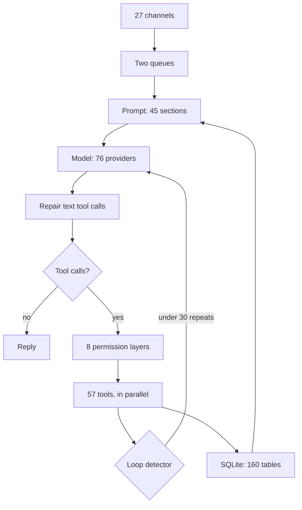
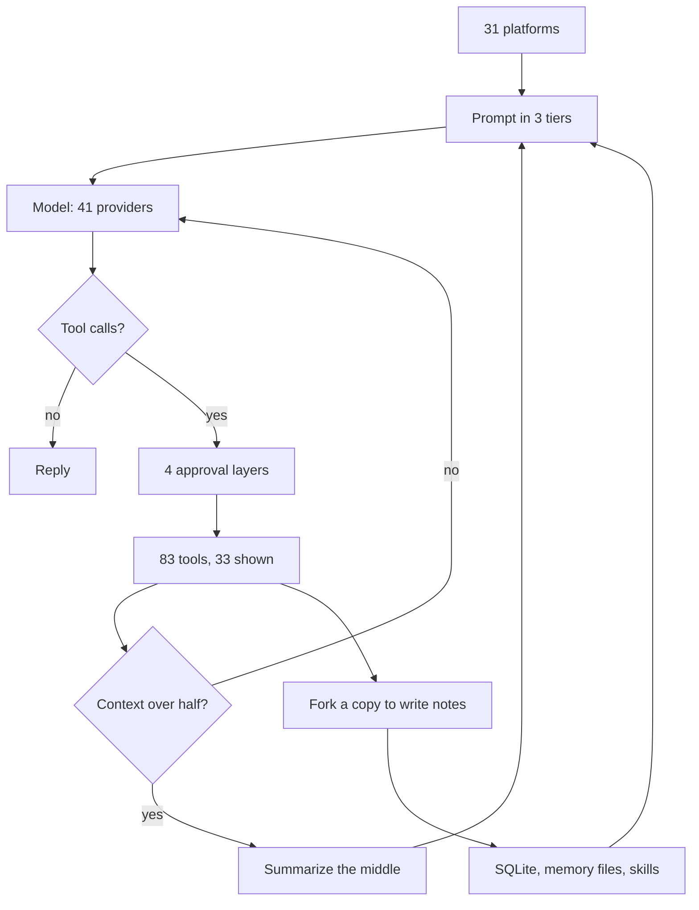
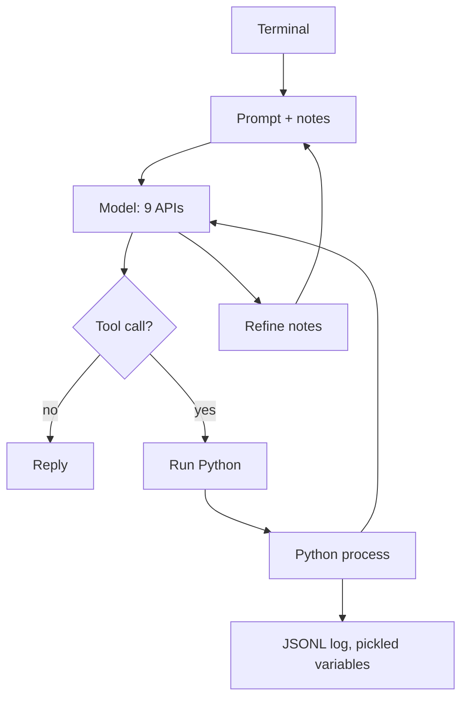
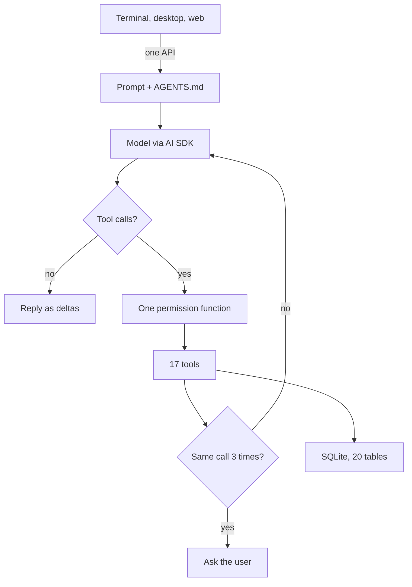
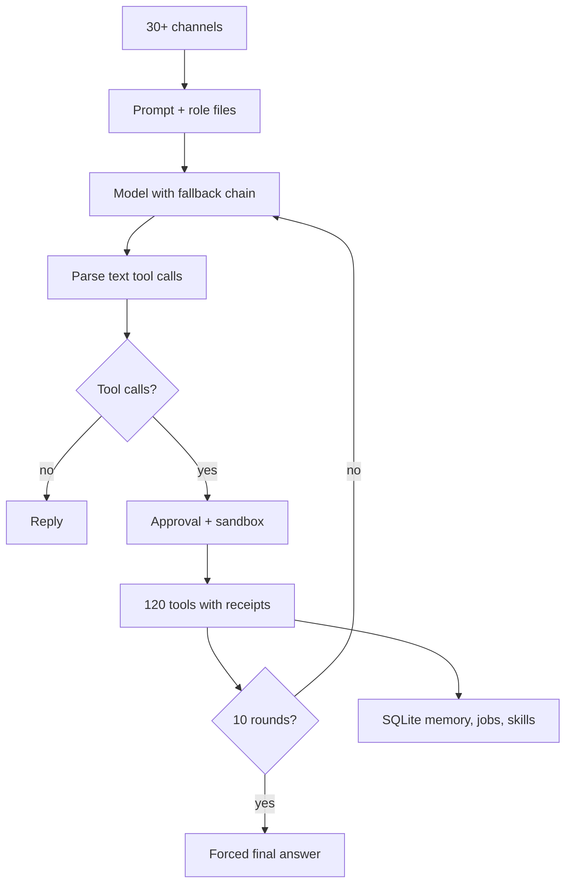
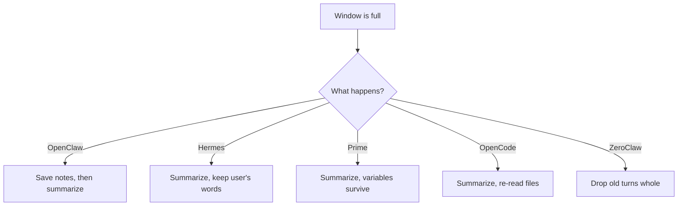
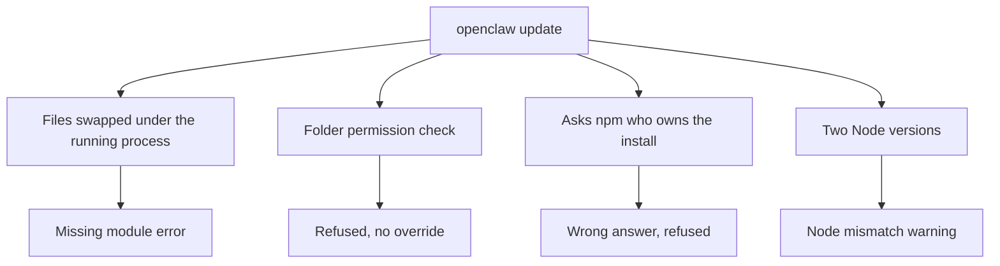

# HARNESS_V2.md

**This report compares six agent harnesses. They are OpenClaw 2.0, Hermes, Prime, OpenCode, Atomic, and ZeroClaw. It also says what actually makes one work.**

This report was written on 2 September 2026. The method was the same as the August report. Research agents did the reading. An agent is an AI program that is given a task and works on it by itself, step by step. Those agents read the real source code of each project, and source code is the human-written text that a program is built from. They also measured a running installation on a Linux computer. They reached that computer over SSH, which is a way to type commands on another computer from your own. And they timed candidate programming languages on a Mac. A second agent then re-checked every number against the studies and the code. Anything that could not be verified says so. The design that comes out of this comparison is called Coeus, and it is written up in `COEUS_PLAN.md`.

---

# Part 0: The one-page version

## What a harness is

A language model is a program that takes in text and gives back text. That is the whole of what it does. It has no memory from one request to the next. And it has no hands, meaning it cannot do anything on its own. **The harness is the program wrapped around the model, and it gives the model memory and hands.** The harness gives memory by saving things and feeding them back in. It gives hands by carrying out actions on the model's behalf. A model with a harness around it is what people call an agent. The same models are available to everyone, so the harness is where one product differs from another. This document is about the harnesses. From here on, "the model" means the language model.

Every harness works the same way at its heart, as a loop. The harness hands the model everything so far. The model either answers or asks for an action. The harness carries out the action and hands the result back to the model. That repeats until the model says it is done. An action the model can ask for is called a tool. Reading a file, running a command, and searching the web are all tools. When the model asks for a tool, that request is called a tool call. One trip around the loop is called a turn, and answering one message can take many turns.

## The verdict

A few words in the table need explaining first. The Language column says which programming language each project is written in. One entry says TypeScript on Bun, and Bun is a program that runs TypeScript. A daemon is a program that runs in the background all the time, even when nobody is looking at it. A chat channel is a messaging app the agent can talk through, and Signal and Telegram are two such apps. A database table is one grid of saved records. A web interface is a screen you open in a web browser. A scheduled job is a task that runs by itself at set times.

A terminal is the plain text window where you type commands, and a terminal interface is the screen a program draws inside it. A process is one running program. A pipe is a one-way channel that carries text from one process to another. A sandbox is a fenced-off area of the computer where a command can run without touching anything outside the fence. A local model is a model that runs on your own machine instead of on a company's servers. A binary is a finished program in one file, and building from source means turning the source code into that file yourself. A compiled binary is that same kind of file, but here it means one whose source code is not published. To fork a project is to copy its code and go your own way with it. To port a design is to rebuild the idea in your own code. The model labs are the companies that make the models.

| Harness | Language | What it is | Verdict |
|---|---|---|---|
| **OpenClaw 2.0** | TypeScript | A daemon with 27 chat channels, 57 tools, and 160 database tables | A great loop, buried under install and update code that breaks on every release. **Not recommended.** |
| **Hermes** | Python | An always-on assistant with the best ideas about memory and reliability | Borrow its ideas. Its terminal interface is two processes joined by a pipe. **Not recommended.** |
| **Prime** | TypeScript and Python | An agent with one tool, which is a Python process the model types into | Good for data analysis. It has no safety gate at all. **Not recommended.** |
| **OpenCode** | TypeScript on Bun | A coding agent with the best interface in the field | Copy the interface design. It has no memory, no Signal, and no sandbox. |
| **Atomic** | TypeScript | A developer preview that supports Telegram only | Too early to judge. |
| **ZeroClaw** | Rust | Signal, scheduled jobs, a web interface, and local models in one binary, if you build it from source | The closest existing project to the goal, at 775,000 lines. Port five of its designs; do not fork it. |
| **Codex and Claude Code** | Rust, and a compiled binary | Coding agents from the model labs | Reference designs for sandboxing and permissions. |

## The five things that decide whether a harness works

1. **The first thing is how big the wrapper is.** The loop at the heart of every agent is small. In every harness here, the loop is between one and seven thousand lines of code. The code wrapped around the loop is fifty to seventy-five times bigger. That wrapper is where things break.
2. **The second thing is whether there is a cap.** A cap is a fixed maximum number of turns, after which the agent must stop and answer. OpenClaw has no maximum number of turns. It has only three brakes. The first brake is a timeout that stops work after 48 hours. The second is a loop detector, which is a check that notices the model asking for the same thing over and over. The third is a retry budget, which is a fixed number of times to try again after a failure. None of those is a cap. When people say OpenClaw "got stuck," this is what they mean.
3. **The third thing is where the conversation goes when the window fills.** The window is the context window, meaning the limited amount of text the model can read at once. Models measure text in tokens, and a token is a piece of text about the size of a short word. A long conversation eventually fills the window. When that happens, a harness has two choices. It can summarize the conversation, which loses things. Or it can keep its working state, which is the facts it needs to carry on, in files that get read again on every turn. The second approach works.
4. **The fourth thing is whether learning has a read path.** A read path means some part of the system reads the notes back later. Writing notes that nobody reads back is logging, not learning.
5. **The fifth thing is whether the screen owns any state.** The screen is the part you look at and type into. The core is the part that runs the loop. State means the facts about what is going on right now, such as which conversation is open and what the agent has done so far. If the screen keeps its own copy of the state and talks to the core over a pipe, it glitches. If the screen is a dumb client of one core, meaning it only shows what the core tells it, it works.

## The one number

A commit is one saved change to a project's code. OpenClaw merged **10,574 commits in the last 30 days, and 63 percent of them came from one person at a rate of 223 a day.** Nobody reviews code at that pace. That is why OpenClaw breaks when you update it.

---

# Part 1: Seven harnesses, one diagram each

Every diagram has the same shape, so you can flip between them and see what changed. Input is at the top, meaning where messages come from. Below the input is the prompt. The prompt is all the text the harness hands to the model on each turn. It holds the instructions, the conversation so far, and the results of any tools. Below the prompt come the model, then the tools, then what happens when the context window fills. Storage is at the bottom, and storage is where things are saved to disk between turns. Most of these projects save things in SQLite, which is a database kept in a single file on disk. **Where a box is missing, that is the point.**

## 1. OpenClaw 2.0

> **OpenClaw is a daemon that does everything, and it is surrounded by more install code than agent code.**

Messages arrive from 27 chat channels, scheduled jobs, a web interface, and native apps, meaning apps built for a particular phone or desktop system. Each message enters one of two queues. A message in the first queue steers the turn that is already running, meaning it changes what the agent does next. A message in the second queue waits until that turn finishes.

The prompt has about 45 sections. Six of those sections are role files, meaning text files that set out who the agent is and who it works for. Together the role files can total 60,000 characters. The model can come from any of 76 providers, and a provider is a company or service that serves a model. The model can even be swapped in the middle of a run.

A weak model sometimes writes a tool call as plain text instead of in the proper form. A repair layer turns those plain-text tool calls into real ones. Before a tool runs, eight permission layers are checked, and a permission layer is one set of rules about what the agent may do. If the turn read anything from the network, it is labeled as having done so. The 57 tools run in parallel, meaning several can run at the same time.

A loop detector watches for the model making the same tool call over and over. It warns after 10 identical calls, blocks after 20, and stops after 30. Apart from that, there is no cap on turns. Everything is stored in SQLite across 160 tables. Memory is indexed, meaning made searchable, in two ways. Full-text search finds every saved record that contains a given word. A vector is a list of numbers that stands for the meaning of a piece of text. Searching by vectors finds things that are similar in meaning rather than identical in wording.

| | |
|---|---|
| Language and speed | OpenClaw is written in TypeScript and runs on Node. TypeScript is a programming language, and Node is the program that runs it outside a web browser. On the machine we measured, OpenClaw uses **504 MB** of memory while doing nothing. On top of that come 288 MB of Java for Signal and 195 MB of helper processes. Java is another programming language, and the helper that talks to Signal is written in it. The gateway is the part of OpenClaw that connects chat apps to the agent. Starting the gateway loads 41 percent of the 8,703 source files, which is about 1.9 million lines. |
| The good | OpenClaw has the purest loop in the field. Around that loop are hooks, which are places where you can plug in your own code to run before or after a step. A message that arrives in the middle of a turn steers the next step. A repair layer fixes models that print tool calls as text. Scheduled jobs wait longer after each failure before trying again, and a job that keeps failing is turned off automatically. On Signal, pairing is on by default, which means a new contact has to be approved before the agent will talk with them. The prompt has a cache boundary, and a cache is a saved copy of the unchanging front part of the prompt. That copy is kept so the model provider does not have to re-read it every turn, and the boundary marks where the unchanging part ends. The delivery queue, which holds outgoing messages, survives restarts. |
| The bad | OpenClaw has 317,000 lines of operations code wrapped around a 67,000-line loop. Operations code means the commands, the infrastructure, the service installation, and the updater. There is no turn cap. There are five separate liveness timers, which are timers that check whether the program is still responding. None of them can kill a running tool. There are 10,175 configuration options. And there is the update failure described in Part 4. |

## 2. Hermes

> **Hermes is an assistant that assumes the conversation never ends. So it spends its effort on shrinking what the model has to read, and on writing down what it learned.**

Messages arrive from a command line, which is the text window where you type commands, and from 31 chat platforms. The prompt is built in three tiers. The stable tier rarely changes. The project tier holds things about the current project. The volatile tier changes often, and it holds a memory file capped at 2,200 characters and a user file capped at 1,375 characters. The model can come from any of 41 providers.

Four approval layers check each tool call. Twelve patterns, meaning shapes of command, can never be approved by anyone. Hermes has 83 tools in all. About 33 of them are always shown to the model. Another 18 sit behind a search tool, so the model has to search for them before it can use them.

When the conversation passes half the size of the context window, Hermes shrinks it. Old tool output is pruned, the middle of the conversation is summarized, and the user's own messages are kept word for word. If the agent makes ten tool calls without writing any notes, Hermes forks a copy of itself. To fork here means to start a second copy of the running agent. That copy can only write memory and skills, and a skill is a written recipe for a task the agent can load later. Everything is stored in SQLite with full-text search, plus memory files and skill files.

| | |
|---|---|
| Language and speed | Hermes is written in Python, a programming language. It has 1.5 million hand-written lines, of which 1.06 million are Python. We did not measure its idle memory, because its gateway was not running on the machine we checked. The gateway is the part that connects chat apps to the agent. The dashboard alone used 88 MB. A package is a bundle of someone else's code that a program depends on. On disk, Hermes needs a 678 MB virtual environment, which is a private folder of Python packages. It also needs a 204 MB bundled copy of Node just for the terminal interface. The main conversation function, meaning the single block of code that handles a conversation, is 7,245 lines long. |
| The good | Hermes has the best compaction rule in the field, and compaction is the shrinking of the conversation when the context window fills. The Hermes rule is that the user's words survive word for word. The learning fork has a budget, meaning a limit on how much it may spend. Hermes has a watchdog, which is a timer that notices when the main program has frozen and restarts it. The watchdog runs on a plain thread, meaning a separate lane of work inside the one program. That watchdog was added after a 30-hour deadlock, which is a freeze where two parts each wait for the other forever. The delivery ledger, which records what was sent, admits when a message may be a duplicate. Each session, which is one open conversation, has one lease, meaning a claim that only one worker can hold at a time. The password prompt for sudo hides what you type, and sudo is the command that runs something with administrator power. |
| The bad | The terminal interface is two programs joined together. The screen is written for Node, the brain is written in Python, and a pipe joins them. Child processes, meaning programs the brain starts, can break that pipe. A recovery hack tries to reconnect, and it gives up after ten tries in a minute. An optional third process works around the Python interpreter lock, which means Python can run only one piece of its own code at a time. 120 bugs in the interface were opened in one month. Of 6,440 commits in 28 days, 57 percent were fixes. |

## 3. Prime

> **Prime has one tool. The model types Python into a process that outlives the chat.**

A terminal attaches to a daemon. The prompt is made of three parts. There is a base prompt, a project file, and the notes the agent wrote for itself. An API is the set of commands one program exposes so that another program can talk to it. The model can be reached through one of nine real API implementations, which here means nine different ways of talking to a model service.

There is exactly one tool, and it runs Python in a process that keeps running between turns. Variables, shell handles, and child agents all live in that process. A variable is a named piece of data the code is holding. A shell handle is an open connection to a running command. A child agent is a smaller agent started by the main one.

After each turn, a refine step writes notes into a state file. The state file keeps a history, and the notes can be rolled back to an earlier version. The next prompt reads those notes. Transcripts are stored as a JSONL tree, and JSONL is a plain-text file with one record per line. The tree shape means a conversation can branch. The Python variables are pickled to disk, which is Python's way of saving live data to a file so it can be loaded back later.

| | |
|---|---|
| Language and speed | Prime is a TypeScript host, meaning the main program, plus one Python child process per session, in 171,000 lines in all. A 33,000-line daemon exists just so a terminal can attach to a session and detach again. |
| The good | Work lives in variables, not in the chat. The notes keep a history and can be rolled back, and the next prompt actually reads them. Scheduled jobs act as a heartbeat, meaning a regular wake-up that keeps the agent going. Each budget has a checker that runs at the end. |
| The bad | **There is no permission gate anywhere.** A permission gate is the check that asks whether an action is allowed. Approving "run Python" means approving everything. There are three processes per session. Prime still ships with Claude Code's OAuth client id, which is the identifier an app shows when it asks to log into a service. It ships that id so that Prime can log into your subscription. |

## 4. OpenCode

> **OpenCode is one process with an HTTP API inside it, meaning other programs talk to it the way a browser talks to a website. Every screen is a client, which is a program that asks another program for things. It never makes you wait.**

An event stream is a single running feed of everything that happens. The terminal, the desktop app, and the web app all talk to one API and one event stream. Every screen listens to that feed. The same interface can also attach to a server on another machine. The prompt includes a project instructions file named `AGENTS.md`, and that file is read again from disk on every step.

The model is called through the Vercel AI SDK, and an SDK is a ready-made library of code for talking to a service. This one is made by the company Vercel. One permission function, meaning one block of code, decides whether to ask, allow, or deny each tool call. When several rules match, the last one wins. Seventeen tools are defined, and 13 or 14 of them are visible to the model. Each tool has a plain-text description and a 50 KB cap on its output. If the same tool call appears three times in one model response, the user is asked what to do. Storage is SQLite with 20 tables. There is no memory system at all.

| | |
|---|---|
| Language and speed | OpenCode is TypeScript running on Bun. Bun is a newer and faster alternative to Node. OpenCode ships as a single 137 MB binary, meaning one program file with everything inside it. It starts in 0.26 seconds and **uses 380 to 400 MB of memory while idle**. |
| The good | Five decisions make the interface feel good. One core owns all the state. Every screen subscribes to one event stream. Streaming, which means the reply showing up while it is still being written, arrives as small pieces called deltas. Permissions are asked as questions right in the flow, with the choices once, always, and reject. And one command table, meaning one list of every command, drives everything. Files are read again every step, so compaction cannot lose them. A malformed tool call becomes an error the model can fix instead of a crash. |
| The bad | OpenCode has no memory, no scheduling, no Signal, and no sandbox. From reading the code rather than running it, the loop detector only sees three identical calls inside one model response. So one bad call per step slips past it. It is not light. It has 341,000 lines and depends on 3,233 packages. |

## 5. Atomic Agent

> **Atomic Agent is a TypeScript developer preview, meaning an early release for programmers to try. It constrains tool calls from local models with a grammar, which is a strict set of rules for the shape the output may take.**

There is no diagram because Atomic Agent uses the standard loop. It supports Telegram only, with no Signal and no web interface. Support for local models through Ollama and LM Studio, two programs that run a model on your own machine, landed between 7 and 31 August. Its own README, which is a project's front-page description file, says that small models produce malformed calls more often. The terminal interface still has two open crashes caused by memory leaks, meaning bugs where a program keeps taking more memory until it falls over. Atomic Agent is worth a look in a few months, not now.

## 6. ZeroClaw, and Moltis

> **ZeroClaw is a Rust binary that already does Signal, scheduled jobs, a web interface, and local models. It is not small.**

Messages arrive from more than 30 channels. Signal is one of them, and it comes in through signal-cli, which is a background helper program that talks to Signal. The prompt includes role files for the agent, for the user, and for memory, plus memories recalled from storage. The model comes from a fallback chain, which is an ordered list of models to try if the first one fails. The chain is set in one line of configuration.

A parser recovers tool calls that models write as plain text, and it gets two retries. Each call passes an approval gate and runs inside a sandbox. On Linux the sandbox is Landlock, which limits what files a program may touch. On macOS the sandbox is Seatbelt, which is the one built into that system. About 120 tools run in parallel. Every tool result carries a cryptographic receipt, which is a stamp made with math proving the result really came from the tool. So the model cannot fake one. After ten rounds, the model is forced to give a final answer.

ZeroClaw stores everything in SQLite. It holds memory with full-text search, and it holds skills the agent can write for itself. It also holds scheduled jobs with claim locks. A claim lock means one worker claims a job, so a second worker cannot run it.

| | |
|---|---|
| Language and speed | ZeroClaw is written in Rust, a programming language. It has 775,000 lines, of which 394,000 are outside tests, spread over 20 crates, and a crate is a Rust package. One of those files is a 43,000-line configuration schema, which is the file that describes every setting. The release is a 27 MB tarball, meaning a compressed bundle of files, but the prebuilt binary you download **leaves out Signal and the sandbox**. Moltis is a similar project in Rust. It has 407,000 lines, one maintainer, and a 63 MB download. It also needs a nightly toolchain, which is the experimental daily build of the Rust compiler. |
| The good | ZeroClaw has a ten-round cap with a bounded final answer, meaning the forced answer has a size limit too. Receipts mean the model cannot fake a tool result. A standalone parser handles messy tool calls. The job store makes sure two processes cannot run the same job. A skill creator turns a successful run into a skill. The updater can roll back to the old version. Moltis has a browser with a persistent profile turned on by default, meaning the browser's logins and settings are kept between runs. |
| The bad | ZeroClaw has 506 open issues, which are reported bugs and requests not yet closed. Its memory subsystem is being redesigned, and there are three proposals for the redesign. There has been no release in a month. It is too big to fork. Five of its designs are worth porting. |

## 7. Codex CLI and Claude Code

These two settle questions that the others argue about. Both are coding agents made by the labs that make the models, and CLI means a program you run from the command line.

The kernel is the core of the operating system, the part that decides what every program may touch. **Codex** treats the kernel as the sandbox, so it lets the operating system itself do the fencing. File access goes only through two tools, "run a command" and "apply a patch," and a patch is an edit to a file. There are about twenty tool specifications in all, and a tool specification is the written description of a tool that the model reads. Most of the twenty are for planning, for images, for asking the user, and for work with several agents at once. Seccomp is a Linux feature that limits which requests a program may make to the kernel. By default, commands run under Seatbelt on macOS, or under Landlock plus seccomp on Linux. Escalation, which means asking for more permission than usual, is a field on the tool call, and it must come with a written justification.

**Claude Code** enforces its permission rules in the harness, not in the model, and its documentation says so plainly. A tool schema is the description of a tool's name and what inputs it takes. Tool schemas and skills are loaded only when needed, so the prompt stays small. Hooks can rewrite a tool's inputs before the tool runs.

---

# Part 2: The nine things that actually differ

## 1. Language, and what it costs

The table counts lines of code written by hand rather than generated, memory used while idle, commits in the last 30 days, and open issues. An open issue is a reported bug or request that has not been closed. A pull request is a proposed change that is waiting for review.

| | OpenClaw | Hermes | Prime | OpenCode | ZeroClaw |
|---|---|---|---|---|---|
| Language | TypeScript | Python | TypeScript and Python | TypeScript on Bun | Rust |
| Hand-written lines | 2,937,809 | 1,485,870 | 171,389 | 341,520 | about 394,000 |
| Idle memory | about 990 MB in total | not measured; the dashboard alone uses 88 MB | not measured | 380 to 400 MB | not verified |
| Commits in the last 30 days | 10,574 | 6,718 | 191 | 354 | 373 |
| Open issues | 3,683 | 12,965 | 78 | about 5,600, including pull requests | 506 |

**What works better is small and slow-changing.** OpenCode shipped ten small releases in three weeks and nothing broke. A library is a bundle of ready-made code that a program uses, and Go is a programming language. For a new daemon, Go starts in 8 milliseconds and uses 19 MB of memory while idle with every library it needs. Rust saves 10 MB but costs extra rounds of fixes. Bun is fine until you load Playwright, which is a library for driving a web browser from code, and that adds 85 MB. The measurements are in Part 6.

## 2. How a turn ends

In the table, a wall-clock budget is a limit on real elapsed time. A token budget is a limit on how much text the model may read and write.

| | Turn cap | What stops a loop |
|---|---|---|
| OpenClaw | **None** | A 48-hour timeout, a detector that warns at 10 identical calls, blocks at 20, and stops at 30, and up to 160 outer retries |
| Hermes | None by default | A wall-clock budget. There is no identical-call detector, only a guard for repeated text |
| Prime | None | A token budget on a goal |
| OpenCode | Optional | Three identical calls in one response become a question to the user |
| ZeroClaw | **10 rounds** | Then a forced final answer. It nudges at 3 identical calls, blocks at 4, and stops at 5 |

**What works better is a hard cap with a bounded final answer, as ZeroClaw does.** That cap should be paired with an identical-call detector that counts across steps and never asks the user.

## 3. What happens when you message it mid-turn

There are three things a harness can do with a message that arrives while it is still working. To steer means the new message is folded into the work already in progress. To interrupt means the current work stops. To queue means the message waits its turn. A tool boundary is the moment between one tool finishing and the next one starting.

| | Default behavior |
|---|---|
| OpenClaw | **Steer.** The message is injected at the next tool boundary, and tools that have not started are skipped |
| Hermes gateway | **Interrupt** |
| Prime | Steer while streaming, otherwise queue |
| OpenCode | Re-reads the message list on each step |

**What works better is steering.** Interrupting throws away work, and queuing makes you wait.

## 4. Where the conversation goes when the window fills

OpenClaw first runs a silent turn that tells the model to save its notes. Then it summarizes the conversation and keeps the most recent 20,000 tokens. Hermes acts when the conversation reaches 50 percent of the window. It prunes old tool output, summarizes the middle, and keeps the user's messages word for word. Prime summarizes, but its Python variables survive untouched. OpenCode summarizes, but it reads its project file from disk again on every step, so that file cannot be lost. ZeroClaw never summarizes, and instead it drops whole old turns that do not fit.

**What works better is anything that lives in a file.** A thing that lives in a file survives, and a thing that lives only in the chat is at risk. The Hermes rule that the user's own words are never summarized is the sharpest single idea here.

## 5. How it learns

A memory index is a searchable list built over everything the agent has saved. Recall means pulling relevant memories out of storage and putting them into the prompt.

| | What it writes | How it is read back | On by default |
|---|---|---|---|
| OpenClaw | Six role files, a memory index, a scheduled rewrite of the memory file, and recall injected before every prompt | Into the next prompt, and through a search tool | Yes, all four |
| Hermes | A memory file capped at 2,200 characters, a user file capped at 1,375, and skills, written by a review fork | Into the next prompt, and through a search tool | Yes |
| Prime | Notes with history and rollback | Appended to every prompt | Yes, gated by a review |
| OpenCode | Nothing | | |
| ZeroClaw | A memory database, and skills written from successful runs | Recalled into the prompt | Skills are off by default |

**What works better is three things together.** The first is small files with a size cap that the model itself keeps tidy. The second is a review that runs in the background with a spending limit. The third is a search tool over the past. OpenClaw's memory index caused two of its worst bugs in the week we looked. Rebuilding the index leaked 19 GB of temporary files, and one reindex pinned a processor core at full load. On top of that index, OpenClaw's every-turn recall and its scheduled rewrites are on by default.

## 6. How tools are gated

A gate is the check that decides whether a tool call may run. An allowlist is a list of what is permitted, and when allowlists are intersected, a call must pass every one of them. A taint label is a mark saying the turn touched untrusted data. In-process means inside the same running program. An unattended run is one with nobody watching, and to fail closed means to refuse when in doubt. Docker runs a program inside its own packaged mini-computer. Bubblewrap is a Linux tool that runs a program inside a small fenced-off area.

| | Gate | Sandbox |
|---|---|---|
| OpenClaw | Eight intersected allowlists, plus a taint label that blocks nothing | Docker, off by default |
| Hermes | Four in-process layers; unattended runs fail closed | None in the process. Its own documentation says the operating system is the only real boundary |
| Prime | **None** | None |
| OpenCode | One rule list, last match wins, default ask | **None** |
| ZeroClaw | An approval gate | Landlock, Seatbelt, and bubblewrap, but not in the prebuilt binaries |
| Codex | An approval policy | **A kernel sandbox by default.** Escalation is a field on the call |

**What works better is OpenCode's gate design combined with Codex's sandbox.** Nobody ships both of them.

## 7. How the screen attaches

A WebSocket is a connection between a screen and a server that stays open, so either side can send at any time. Standard input and output are the plain text channels every program has for reading what comes in and writing what goes out.

| | Design | Result |
|---|---|---|
| OpenCode | The interface is a client of an in-process API, and the same interface can attach remotely | Fast, with few glitches |
| OpenClaw | The interface talks to the gateway over one WebSocket | Fine, but the web app is 338,000 lines |
| Hermes | A Node screen and a Python brain over standard input and output, with an optional third process | 120 interface bugs in a month |
| Prime | The terminal attaches to a supervisor, which attaches to a worker, which attaches to Python | 33,000 lines of attach code |

**What works better is a screen that never owns state.**

## 8. How it updates

A few words in the table need explaining. The host is the computer the program is installed on. Npm is the tool that installs packages for Node programs. Git is the tool that keeps track of every version of a project's code. A git checkout means switching the files back to an older saved version. A git pull means downloading the newest code, and a git rescue reference is a saved pointer to the version you had before an update. Pip is the tool that installs Python packages. A checksum is a fingerprint of a file that shows it was not corrupted or tampered with. A smoke test is a quick check that the new version starts and works. A signature check proves the file really came from its maker.

| | Method | Rollback |
|---|---|---|
| OpenClaw | npm swaps thousands of files under a running process, and the updater inspects the host and refuses if it is unsure | Git checkouts only |
| Hermes | Git pull plus pip, with a pre-update backup and git rescue references | Binary-level rollback not verified |
| ZeroClaw | Download one binary, verify the checksum, back up the old one, swap, and run a smoke test | Yes |
| Moltis | The same, plus a signature check | Not verified |

**What works better is five things together.** The program is one static file, meaning a single program file with everything built in. Each version sits in its own folder. A symlink, which is a shortcut file that points at another file or folder, is flipped to point at the new version. A health check confirms the new version runs. And if the health check fails, the rollback happens automatically. Nobody does all of it. Part 4 shows the cost of not doing it.

## 9. How they drive a browser

Driving a browser means the agent opens web pages, clicks, and types, the way a person would. Three of the columns are separate browser-driving projects rather than harnesses. They are browser-use, Stagehand, and agent-browser. A few words in the table need explaining.

Playwright is a library for driving a browser from code. The DevTools protocol is the channel that Chrome opens so another program can control it. Chromium is the open-source core of Chrome. The DOM is the browser's own internal tree of everything on a page. The accessibility tree is a simpler outline of the page, and it is the one screen readers use. It lists every button, link, and field with its label. A reference tag is a short label stuck on each item in that outline, so the model can say which one to click. A selector is a short address for one element on a page. Stagehand's observe step looks at a page and proposes actions. A stale reference is a tag or address that points at an element that has changed or gone.

A profile is the browser's saved logins and settings, and a user data directory is the folder that holds a profile. A flag is an option you switch on when you start a program. Cloud means running on a company's servers over the internet instead of on your own machine. A captcha is the "prove you are human" puzzle. A two-factor prompt asks for the extra code sent to your phone. A cloud stealth service is a paid online service that runs a browser for you and hides that a program is driving it. A vision tool is a tool that lets the model look at an image.

| | OpenClaw | Hermes | browser-use | Stagehand | agent-browser |
|---|---|---|---|---|---|
| Engine | Playwright over the DevTools protocol, attached to a real Chrome that it launches | Vercel's agent-browser command-line tool. It uses its own Chromium by default and a real Chrome only with a consent flag | The raw DevTools protocol, with its own Chrome or yours | The raw DevTools protocol | A Rust command-line tool over the raw DevTools protocol |
| What the model sees | An accessibility tree with reference tags and marks on new elements, with an 8,000-character efficient mode | The same tree through agent-browser, cut at 15,000 characters and stored | DOM text with an index number on each element, marks on new elements, hints about pages below, and an optional screenshot with boxes | Candidate actions with selectors from its observe step, and an optional screenshot | An accessibility tree with reference tags |
| Waits after an action | A 250 millisecond grace period after navigation | None of its own | A 0.25 second minimum, network idle for 0.5 seconds, and a pending-request check | Not verified | Scroll into view, and dialogs |
| Checks that it worked | No | No | **Yes.** The model must grade its last action on every step, the finish step must say whether it succeeded, and a judge model grades the run | It caches the action that worked, with no verification | No |
| Stale references | A friendly error | An error | Re-index each step | Re-observe | An error |
| Own profile | Yes, managed | It copies your login files into its own directory | A user data directory, kept alive between runs | Through application code | A profile flag |
| Human pacing | Optional typing at 75 milliseconds per key, with no mouse pacing | No, since filling a field is instant | A 50 to 80 millisecond press and 10 milliseconds per key | No | No |
| Captchas and two-factor prompts | Stop and ask | It warns and points at a cloud stealth service, offers a vision tool for captchas, and has no two-factor handling | Its cloud service | | |

**What works better is what the top scorers do.** Online-Mind2Web is a test that scores agents on live websites. The agents that score 90 percent and above on it share six things. They use a frontier model, meaning one of the newest and strongest models, with thinking turned on, which lets the model reason before it acts. They use text to pick the target and a screenshot to check the result. They have an explicit "did that work?" step. They try a different strategy when they retry. They make a plan for long tasks. And they use cloud browsers with captcha solving. Coeus keeps the first five in the harness and gives up the sixth on purpose. That is because the goal is your accounts, on your machine, at human volume.

---

# Part 3: What makes some work better than others

1. **Small wrappers survive updates.** OpenCode's wrapper is 75 times the size of its loop, and it still ships boring releases. That is because the wrapper is a thin API rather than install machinery.
2. **A hard cap beats a timeout.** Ten rounds and a forced answer beat a 48-hour timeout every time.
3. **Files on disk beat summaries.** State that lives on disk and is read again each step cannot be lost to compaction.
4. **The user's words are sacred.** A harness may summarize what the agent did. It must never summarize what the user said.
5. **Learning needs a reader.** Capped files that the prompt includes, and a search tool that the model calls, are the only two things that count.
6. **A harness should expect the model to be wrong.** It should repair malformed tool calls, feed back the allowed alternatives, and never crash the loop. With small local models, this is the difference between working and not working.
7. **The screen is a client.** There is one core, one event stream, and thin screens.
8. **There should be one file to install.** A package manager is the tool that installs and updates programs. Hashed file chunks are the many small files, with generated names, that a Node program is split into. Everything that touches Node versions, package managers, and hashed file chunks is a failure waiting to happen.

---

# Part 4: One failed update, in one diagram

This is what happened when a user ran `openclaw update` on a Linux desktop. Every line of the error output has a cause in the source code.

Four things went wrong at once. First, the updater swapped thousands of files under a process that was still running. So the old code asked for a file chunk that no longer existed. That is the missing module error in the diagram, and a module is one piece of code that a program loads. Second, the updater checked the permissions on the systemd folder, and systemd is the part of Linux that starts and supervises background services. The folder was group-writable, meaning other accounts in the same group may write to it, and that is the default on Ubuntu-family versions of Linux. The updater refused, and there is no flag to override that check. Third, the updater asked npm which package manager owned the installation. It used the user's shell path, which is the list of folders the terminal searches for programs. It got an answer that did not match, so it refused again. Fourth, the service was running one version of Node while the user's shell ran another.

There are four root causes. The first is code swapped under a running process. The second is checks about the host machine that a normal program without administrator power cannot prove. The third is new refusals shipped without an escape hatch, and the update itself installed the rule that refused the next update. The fourth is 317,000 lines of operations code that changes every day. The fix is not better checks. The fix is one static binary with nothing to install.

---

# Part 5: The scoreboard

The scoreboard puts the main numbers side by side. The first row compares the size of each loop with the size of the code wrapped around it.

| | OpenClaw | Hermes | Prime | OpenCode | ZeroClaw |
|---|---|---|---|---|---|
| Loop lines versus wrapper lines | 6,944 versus 404,920 | One 7,245-line function | 2,326 versus 123,871 | About 1,000 versus 75,929 | About 30,000 across the turn module and a 17,898-line loop file |
| Tools | 57 | 83, with 18 hidden behind search | 1 | 17 defined, 13 or 14 visible | About 120 |
| Chat channels | 27 | 31 | 0 | 0 | More than 30 |
| Model providers | 76 | 41 | 9 real implementations | 32 | About 20 |
| Database tables | 160 | Not measured | 0 | 20 | Not counted |
| Configuration options | 10,175 | About 406 | Unknown | About 90 | A 43,000-line schema |
| Turn cap | None | None | None | Optional | 10 |
| Sandbox on by default | No | No | No | None exists | Not in the prebuilt binary |
| Signal | Yes | Yes | No | No | Yes, from a source build |
| Learns by itself | Yes | Yes | Yes | No | Optional |
| Installed size | 898 MB in 35,979 files | 1.4 GB | | 430 MB | |

---

# Part 6: Local models and languages

## Local models

The test here is τ²-bench, which scores how well a model uses tools by giving it a pretend airline booking task. Model names include a size, such as 9B, which means nine billion parameters. A parameter is one of the numbers inside a model, so more parameters means a bigger model.

| Model | Tool-use score on the τ²-bench airline test, 2 September |
|---|---|
| Qwen3.5 9B | **67.5** |
| Qwen3 32B | 42.0 |
| Llama 3.1 8B | 30.9 |
| Qwen2.5 7B | 16.7 |

One step up in model generation beats three times the parameter count, so the newer Qwen3.5 at 9B beats the older Qwen3 at 32B. A GPU is the graphics card that runs a model fast. For a local machine with a GPU, Qwen3.5 at 9B or 4B is the best choice. Gemma 4 at 12B is the backup. Gemma 3 should never be used for tool calling, because it has no built-in format for tool calls. A Raspberry Pi, which is a small cheap computer, cannot host a model, because it reads prompts at about 9 tokens a second.

When a model cannot call tools on its own, the fixes go in this order. First, fix the chat template, which is the wrapper text that puts a conversation into the exact form the model was trained on. Second, try JSON-schema mode, where the model is told the exact shape its answer must take, written in JSON, a plain-text format for structured data. Third, try a prompted text protocol with JSON bodies, meaning the prompt asks the model to write each tool call as JSON inside plain text. Fourth, add repair loops that feed back the allowed options. Repair loops gave a 44-point gain in the published study. Grammar-forced output comes last, because it makes calls valid and wrong at the same time. On one task it dropped accuracy from 91 percent to 48 percent.

## Languages, measured

We built a small daemon in each of three languages and measured it. A static Linux binary is a single program file that runs on Linux without anything else installed. A clean build means building the program from nothing. Imported means loaded into the program. In the last row, crate API drift means the Rust packages we used had changed the commands they expose over time.

| | Rust | Go | Bun |
|---|---|---|---|
| Time to start the daemon | 2.9 ms | 8.2 ms | 11 ms |
| Idle memory with real dependencies | 9.7 MB | 19 MB | 22 MB, or **107 MB if Playwright is imported** |
| Static Linux binary | 6 MB | 23 MB | 103 MB |
| Clean build | 25 s | 10 s | 0.3 s |
| Rebuild on a Raspberry Pi 5 | 5 to 12 minutes | 1 to 2 minutes | None needed |
| Friction we hit | An old compiler and crate API drift | None | None |

Go is the right choice for the daemon. In any language, the browser needs its own separate worker process, because Playwright must not be loaded inside the daemon.

---

# Appendix: Method, sources, and corrections

**Here is the method.** Eighteen research agents ran in three waves, and by their own usage reports they used roughly four million tokens. They read the source code directly, at the current commit on 2 September, for OpenClaw, Hermes, Prime, OpenCode, and ZeroClaw. They cloned Moltis, Codex, Atomic Agent, and browser-use read-only, meaning they downloaded a copy without changing anything. A running Linux installation was measured over SSH without changing anything. The language benchmarks were built and timed on a Mac. Line counts came from tokei and wc, which are two line-counting tools. The papers cited are arXiv 2605.26128, 2607.14167, 2608.06370, and 2608.23552, and arXiv is the site where research papers are posted. The tool-use benchmark is τ²-bench as run on OpenRouter, which is a service that serves many models. Seventeen detailed study files with line-level citations back every claim here. A separate fact-check pass re-verified about 415 claims in this document against those studies and against the repositories. A repository is the place where a project's code is kept.

**Here are the corrections.** Three things I believed at the start turned out to be wrong. OpenCode's interface is not written in Go with Bubble Tea, which is a library for building terminal screens. That code was deleted in November 2025, and the interface is now TypeScript on OpenTUI, a different library for the same job. OpenClaw's pure loop is 6,944 lines, not 1,600. And OpenCode's loop detector is not what makes it work with small models. One recommendation I made and then withdrew was to cut the browser from the first version. The browser is now the centerpiece of `COEUS_PLAN.md`. The fact-check pass found and fixed 44 further slips in an earlier draft, and most of them were overstated wording. The worst were three. Hermes' tool deferral, meaning the way it hides some tools behind search, had been stated backwards. A disk figure had been labeled as memory. And Codex had been described as having two tools.

**Here is what was not verified.** The internals of Claude Code and Codex were not verified, because one is compiled and the other was read only from its tool specifications. OpenClaw's startup time was not verified, because it was not built here. Hermes' idle memory was not verified, because its gateway was not running. The binary size claims made by ZeroClaw and Moltis were not verified. The Raspberry Pi build times are estimates. And the OpenCode loop-detector gap comes from reading the code rather than running it.
