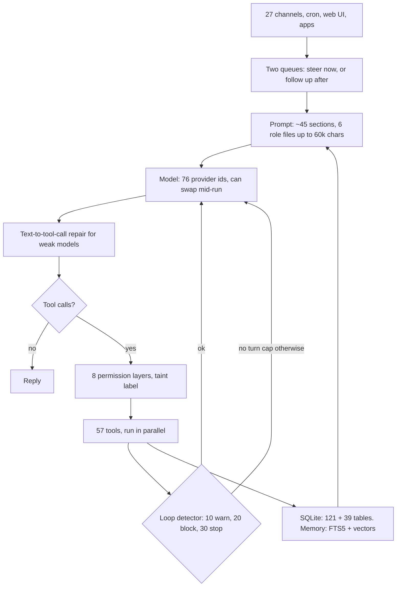
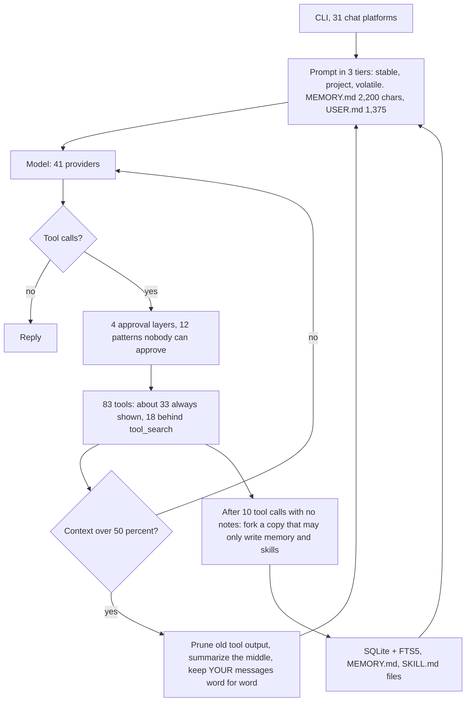
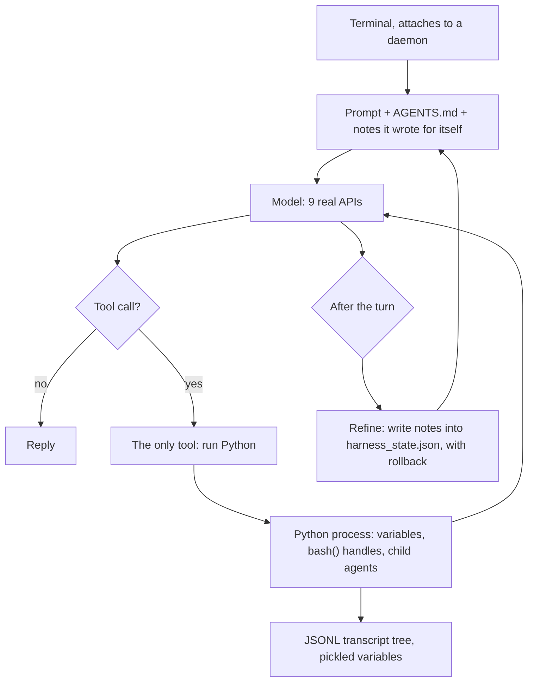
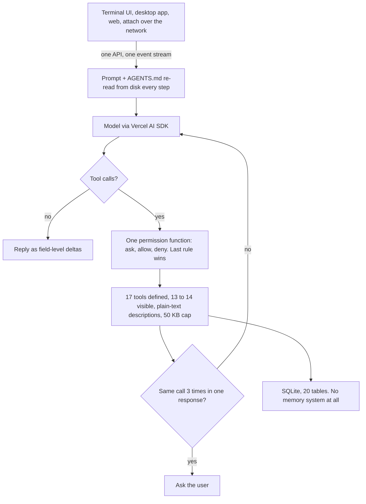
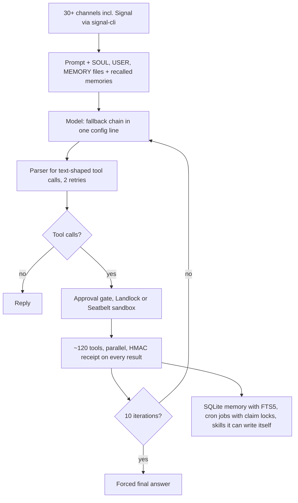
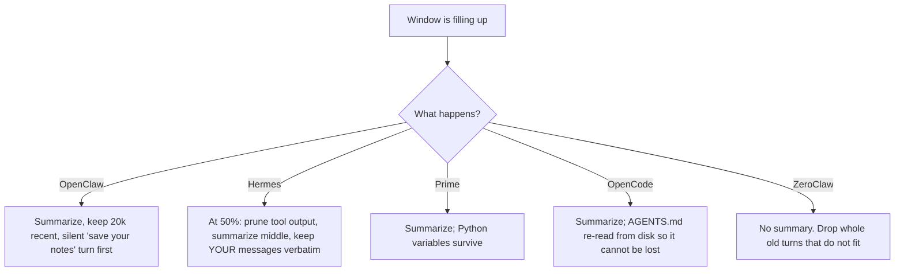
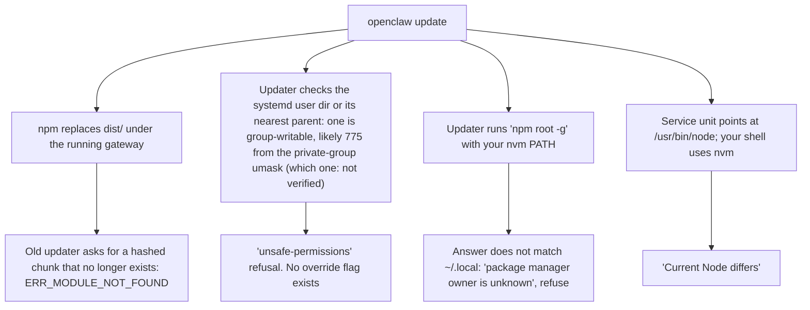

# HARNESS_V2.md

**Agent Harnesses, Compared: OpenClaw 2.0, Hermes, Prime, OpenCode, Atomic, ZeroClaw, and what actually makes one work**

2 September 2026. Same method as the August report: research agents read the real source code on this machine, measured your Linux box over SSH, and benchmarked languages on this Mac. Every number was then re-checked by a second agent against the studies and the repositories; anything unverified says so. The design that comes out of this is in `COEUS_PLAN.md`.

---

# Part 0 — The One-Page Version

## What a harness is

A model is a function: text in, text out, no memory, no hands. **The harness is the program around it that gives it memory and hands.** Same models everywhere. Different wrappers. This document is about the wrappers.

## The verdict

| Harness | Language | What it is | Verdict |
|---|---|---|---|
| **OpenClaw 2.0** | TypeScript | A daemon with 27 chat channels, 57 tools, 160 database tables | Great loop, buried under install and update code that breaks every release. **Not for you** |
| **Hermes** | Python | An always-on assistant with the best memory and reliability ideas | Steal its ideas. Its terminal UI is two processes joined by a pipe. **Not for you** |
| **Prime** | TypeScript + Python | One tool: a Python process the model types into | Good for data analysis. No safety gate at all. **Not for you** |
| **OpenCode** | TypeScript (Bun) | A coding agent with the best interface in the field | Copy the interface design. No memory, no Signal, no sandbox |
| **Atomic** | TypeScript | A developer preview, Telegram only | Too early |
| **ZeroClaw** | Rust | Signal, cron, web UI, local models in one binary, if you build it yourself | Closest to your spec. 775,000 lines. Port five of its designs, do not fork |
| **Codex / Claude Code** | Rust / compiled | Coding agents from the labs | Reference designs for sandboxing and permissions |

## The five things that decide whether a harness works

1. **How big the wrapper is.** Every loop is small (1,000 to 7,000 lines). The code around it is 50 to 75 times bigger. That is where things break.
2. **Whether there is a cap.** OpenClaw has no maximum number of turns. Its brakes are a 48-hour timeout, a loop detector, and a retry budget, and none of them is a cap. That is "gets stuck."
3. **Where the conversation goes when the window fills.** Summarize and lose things, or keep state in files that get re-read. The second one works.
4. **Whether learning has a read path.** Writing notes nobody reads back is logging, not learning.
5. **Whether the screen owns any state.** If the UI holds state and talks to the core over a pipe, it glitches. If it is a dumb client of one core, it works.

## The one number

OpenClaw merged **10,574 commits in the last 30 days, 63 percent of them from one person at 223 a day.** Nobody reviews code at that pace. That is why it breaks when you update.

---

# Part 1 — Seven Harnesses, One Diagram Each

Every diagram has the same shape so you can flip between them: input at the top, context, the model, tools on the right, overflow below, storage at the bottom. **Where a box is missing, that is the point.**

## 1. OpenClaw 2.0

> **A daemon that does everything, surrounded by more install code than agent code.**

| | |
|---|---|
| Language, speed | TypeScript on Node. Idles at **504 MB** on rosie, plus 288 MB of Java for Signal, plus 195 MB of helpers. Starting the gateway statically imports 41 percent of the 8,703 files in `src/`, about 1.9 million lines |
| The good | The purest loop with hooks around it. Steering at tool boundaries. A repair layer for models that print tool calls as text. Cron with backoff and auto-disable. Pairing by default on Signal. A cache boundary in the prompt. A persisted delivery queue |
| The bad | 317,000 lines of operations code (CLI commands, infra, service install, updater) around a 67,000-line loop. No turn cap. Five liveness timers that cannot kill a running tool. 10,175 config options. Your screenshot |

## 2. Hermes

> **An assistant that assumes the conversation never ends, so it spends its effort on shrinking context and writing down what it learned.**

| | |
|---|---|
| Language, speed | Python, 1.5 million hand-written lines, 1.06 million of them Python. Idle memory not measured: the gateway was not running on rosie, only the dashboard at 88 MB. On disk: a 678 MB virtualenv plus a 204 MB bundled Node just for the terminal UI. `run_conversation()` is one 7,245-line function |
| The good | The best compaction rule in the field: your words survive word for word. A budgeted learning fork. A watchdog on a plain thread, added after a 30-hour deadlock. A delivery ledger that admits possible duplicates. One lease per session. A masked password prompt for sudo |
| The bad | The terminal UI: a Node screen and a Python brain joined by a pipe that child processes can break, with a recovery hack that gives up after ten tries a minute, plus an optional third process to dodge the GIL. 120 UI bugs opened in one month. 57 percent of 6,440 commits in 28 days were fixes |

## 3. Prime

> **One tool. The model types Python into a process that outlives the chat.**

| | |
|---|---|
| Language, speed | TypeScript host plus one Python child per session. 171,000 lines. A 33,000-line daemon just to keep sessions attachable |
| The good | Work lives in variables, not in the chat. Notes with history and rollback that the next prompt actually reads. Cron as a heartbeat. Budgets with verifier gates |
| The bad | **No permission gate anywhere.** Approving "run Python" is approving everything. Three processes per session. It still ships Claude Code's OAuth client id to log into your subscription |

## 4. OpenCode

> **One process with an HTTP API inside it. Every screen is a client. It never makes you wait.**

| | |
|---|---|
| Language, speed | TypeScript on Bun. A 137 MB single binary. Starts in 0.26 s. **Idles at 380 to 400 MB** |
| The good | The five decisions you like: one core owns all state; every screen subscribes to one event stream; streaming as small deltas; permissions as inline questions with once, always, reject; one command table for everything. Files re-read every step so compaction cannot lose them. Malformed tool calls become fixable errors instead of crashes |
| The bad | No memory, no scheduling, no Signal, no sandbox. By code reading (not run), the "doom loop" detector only sees three identical calls inside one model response; one bad call per step slips past it because step markers sit between steps. Not light: 341,000 lines, 3,233 packages |

## 5. Atomic Agent

> **A TypeScript developer preview that constrains local-model tool calls with a grammar.**

No diagram; it is the standard loop. Telegram only, no Signal, no web UI. Local model support for Ollama and LM Studio landed between 7 and 31 August, and its own README says small models emit malformed calls more often. Two open memory-leak crashes in the terminal UI. Worth a look in a few months, not now.

## 6. ZeroClaw (and Moltis)

> **A Rust binary that already does Signal, cron, a web UI, and local models. It is not small.**

| | |
|---|---|
| Language, speed | Rust, 775,000 lines (394,000 outside tests), 20 crates, a 43,000-line config schema source file. 27 MB tarball, but the prebuilt binary **leaves out Signal and the sandbox**. Moltis: Rust, 407,000 lines, one maintainer, a nightly toolchain, 63 MB |
| The good | A ten-iteration cap with a bounded final answer. Receipts so the model cannot fake a tool result. A standalone parser for messy tool calls. A cron store where two processes cannot double-run. A skill creator that turns a successful run into a skill. An updater with rollback. Moltis has a browser with a persistent profile on by default |
| The bad | 506 open issues, memory subsystem being redesigned in three RFCs, no release in a month. Too big to fork. Five designs worth porting |

## 7. Codex CLI and Claude Code

Two ideas the others argue about, settled:

- **Codex:** the kernel is the sandbox. File access goes only through "run a command" and "apply a patch" (there are about twenty tool specs in all, most for planning, images, asking the user, and multi-agent work), and commands run under Seatbelt on macOS or Landlock plus seccomp on Linux by default. Escalation is a field on the call with a written justification.
- **Claude Code:** its docs say permission rules are enforced by Claude Code, not by the model. Tool schemas and skills load on demand so the prompt stays small. Hooks can rewrite a tool's arguments before it runs.

---

# Part 2 — The Nine Things That Actually Differ

## 1. Language, and what it costs

| | OpenClaw | Hermes | Prime | OpenCode | ZeroClaw |
|---|---|---|---|---|---|
| Language | TypeScript | Python | TypeScript + Python | TypeScript (Bun) | Rust |
| Hand-written lines | 2,937,809 | 1,485,870 | 171,389 | 341,520 | ~394,000 |
| Idle memory | ~990 MB total | not measured (dashboard alone 88 MB) | not measured | 380 to 400 MB | not verified |
| Commits, last 30 days | 10,574 | 6,718 | 191 | 354 | 373 |
| Open issues | 3,683 | 12,965 | 78 | ~5,600 incl. PRs | 506 |

**What works better:** small and slow-changing. OpenCode ships ten small releases in three weeks and nothing breaks. The measured languages for a new daemon (Part 6): Go starts in 8 ms and idles at 19 MB with every library needed; Rust saves 10 MB and costs extra fix rounds; Bun is fine until you import Playwright, which adds 85 MB.

## 2. How a turn ends

| | Turn cap | What stops a loop |
|---|---|---|
| OpenClaw | **none** | 48-hour timeout; a detector that warns at 10 identical calls, blocks at 20, stops at 30; up to 160 outer retries |
| Hermes | none by default | wall-clock budget; no identical-call detector, only a guard for repeated text |
| Prime | none | token budget on a goal |
| OpenCode | optional | three identical calls in one response become a question |
| ZeroClaw | **10 iterations** | then a forced final answer; nudge at 3 identical, block at 4, stop at 5 |

**What works better:** a hard cap with a bounded final answer (ZeroClaw), plus an identical-call detector that counts across steps and never asks the user.

## 3. What happens when you message it mid-turn

| | Default |
|---|---|
| OpenClaw | **Steer**: inject at the next tool boundary, skip tools that have not started |
| Hermes gateway | **Interrupt** |
| Prime | Steer while streaming, else queue |
| OpenCode | Re-reads the message list each step |

**What works better:** steer. Interrupting throws away work; queuing makes you wait.

## 4. Where the conversation goes when the window fills

**What works better:** anything that lives in a file survives; anything that lives only in the chat is at risk. Hermes' rule that your own words are never summarized is the sharpest single idea here.

## 5. How it learns

| | Writes | Read back by | On by default |
|---|---|---|---|
| OpenClaw | 6 role files; a memory index; a scheduled "Dreaming" rewrite; recall injected before every prompt | the next prompt; a search tool | yes, all four |
| Hermes | MEMORY.md (2,200 chars), USER.md (1,375), skills; a review fork writes them | the next prompt; a search tool | yes |
| Prime | notes with history and rollback | appended to every prompt | yes, review-gated |
| OpenCode | nothing | | |
| ZeroClaw | a memory database; skills written from successful runs | recalled into the prompt | skills off by default |

**What works better:** small capped files the model curates, a budgeted background review, and search over the past by tool. OpenClaw's memory index rebuild caused two of its worst bugs this week (a 19 GB temp-file leak and a CPU-pegging reindex); its every-turn recall and scheduled rewrites are on by default on top of that index.

## 6. How tools are gated

| | Gate | Sandbox |
|---|---|---|
| OpenClaw | 8 intersected allowlists; taint label that blocks nothing | Docker, off by default |
| Hermes | 4 in-process layers; unattended runs fail closed | none in-process; "the only security boundary against an adversarial LLM is the operating system" |
| Prime | **none** | none |
| OpenCode | one rule list, last match wins, default ask | **none** |
| ZeroClaw | approval gate | Landlock, Seatbelt, bubblewrap, not in prebuilt binaries |
| Codex | approval policy | **kernel sandbox by default**; escalation is a field on the call |

**What works better:** OpenCode's gate design plus Codex's sandbox. Nobody ships both.

## 7. How the screen attaches

| | Design | Result |
|---|---|---|
| OpenCode | UI is a client of an in-process API; same UI attaches remotely | fast, few glitches |
| OpenClaw | UI over one WebSocket to the gateway | fine; the web app is 338,000 lines |
| Hermes | Node screen + Python brain over stdin/stdout, optional third process | 120 UI bugs in a month |
| Prime | terminal attaches to a supervisor, then a worker, then Python | 33,000 lines of attach code |

**What works better:** the screen never owns state.

## 8. How it updates

| | Method | Rollback |
|---|---|---|
| OpenClaw | npm swaps thousands of files under a running process; the updater inspects your host and refuses if unsure | git checkouts only |
| Hermes | git pull plus pip, with a pre-update backup and git rescue refs | binary-level rollback not verified |
| ZeroClaw | download one binary, verify checksum, back up, swap, smoke test | yes |
| Moltis | same plus a GPG signature | not verified |

**What works better:** one static file, versioned folders, a symlink flip, a health check, automatic rollback. Nobody does all of it. Your screenshot (Part 4) is the cost of not doing it.

## 9. How they drive a browser

| | OpenClaw | Hermes | browser-use | Stagehand | agent-browser |
|---|---|---|---|---|---|
| Engine | Playwright over DevTools protocol to a real Chrome it launches | Vercel's agent-browser CLI; its own Chromium by default, real Chrome only with `use_real_profile` | Raw DevTools protocol, its own Chrome or yours | Raw DevTools protocol | Rust CLI, raw DevTools protocol |
| What the model sees | Accessibility tree with `[ref=eN]`, `[new]` marks, 8k "efficient" tier | Same tree via agent-browser, cut at 15k chars and stored | DOM text with `[index]` per element, `*[` for new, "pages below" hints, optional screenshot with boxes | Candidate actions with selectors from `observe()`; screenshot optional | Accessibility tree with refs |
| Waits after an action | 250 ms grace after navigation | none of its own | 0.25 s minimum, network idle 0.5 s, pending-request check | not verified | scroll into view, dialogs |
| Checks that it worked | no | no | **yes**: the model must grade its last action every step; `done` must say success or not; a judge model grades the run | caches the action that worked; no verification | no |
| Stale refs | friendly error | error | re-index each step | re-observe | error |
| Own profile | yes, managed | copies your auth files into its own dir | `user_data_dir`, `keep_alive` | via app code | `--profile` |
| Human pacing | optional 75 ms per key typing; no mouse pacing | no (fill is instant) | 50 to 80 ms press, 10 ms per key | no | no |
| Captcha, 2FA | stop and ask | warns and points at cloud stealth; a vision tool for captchas; no 2FA handling | its cloud | | |

**What works better:** the top scorers on live-site benchmarks (90 percent and up on Online-Mind2Web) share six things: a frontier model with thinking on, text for targeting plus a screenshot for checking, an explicit "did that work?" step, a different strategy on retry, a plan for long tasks, and cloud browsers with captcha solving. Coeus keeps the first five in the harness and gives up the sixth on purpose: your accounts, your machine, human volume.

---

# Part 3 — What Makes Some Work Better Than Others

1. **Small wrappers survive updates.** OpenCode's wrapper is 75 times its loop and it still ships boring releases, because the wrapper is a thin API, not install machinery.
2. **Caps beat timeouts.** Ten iterations and a forced answer beat a 48-hour timeout every time.
3. **Files beat summaries.** State that lives on disk and is re-read each step cannot be lost to compaction.
4. **Your words are sacred.** Summarize what the agent did; never summarize what you said.
5. **Learning needs a reader.** Capped files the prompt injects, and a search tool the model calls. Nothing else counts.
6. **Expect the model to be wrong.** Repair malformed tool calls, feed back the allowed alternatives, never crash the loop. With small local models this is the difference between working and not.
7. **The screen is a client.** One core, one event stream, thin screens.
8. **One file to install.** Everything that touches Node versions, package managers, and hashed chunks is a failure waiting to happen.

---

# Part 4 — Your Screenshot, In One Diagram

Four root causes: code swapped under a running process; host checks a user-space tool cannot prove; new refusals shipped without an escape hatch (the 8.2 update installed the rule that refused your second run); and 317,000 lines of operations code that changes daily. The fix is not better checks. It is one static binary with nothing to install.

---

# Part 5 — The Scoreboard

| | OpenClaw | Hermes | Prime | OpenCode | ZeroClaw |
|---|---|---|---|---|---|
| Loop lines vs wrapper lines | 6,944 vs 404,920 | one 7,245-line function | 2,326 vs 123,871 | ~1,000 vs 75,929 | ~30,000 across `agent/turn/*` and a 17,898-line `loop_.rs` |
| Tools | 57 | 83 (18 deferred) | 1 | 17 defined, 13 to 14 visible | ~120 |
| Chat channels | 27 | 31 | 0 | 0 | 30+ |
| Providers | 76 | 41 | 9 real | 32 | ~20 |
| Database tables | 160 | not measured | 0 | 20 | not counted |
| Config options | 10,175 | ~406 | ? | ~90 | 43,000-line schema |
| Turn cap | none | none | none | optional | 10 |
| Sandbox on by default | no | no | no | none exists | not in prebuilt |
| Signal | yes | yes | no | no | yes (source build) |
| Learns by itself | yes | yes | yes | no | optional |
| Install on rosie | 898 MB, 35,979 files | 1.4 GB | | 430 MB | |

---

# Part 6 — Local Models and Languages, One Page Each

## Local models

| Model | Tool-use score (τ²-bench airline, 2 Sept) |
|---|---|
| Qwen3.5 9B | **67.5** |
| Qwen3 32B | 42.0 |
| Llama 3.1 8B | 30.9 |
| Qwen2.5 7B | 16.7 |

One model generation beats three times the size. Run Qwen3.5 9B or 4B on rosie; Gemma 4 12B as backup; never Gemma 3 for tools. The Pi cannot host a model: prompt reading runs about 9 tokens a second.

When a model cannot call tools natively, in this order: fix the chat template, JSON-schema mode, a prompted text protocol with JSON bodies, then repair loops that feed back the allowed options (a 44-point gain in the published study). Grammar-forced output last: it makes calls valid and wrong (91 to 48 percent on one task).

## Languages, measured on this Mac

| | Rust | Go | Bun |
|---|---|---|---|
| Daemon start | 2.9 ms | 8.2 ms | 11 ms |
| Idle memory with real dependencies | 9.7 MB | 19 MB | 22 MB (**107 MB if Playwright is imported**) |
| Static Linux binary | 6 MB | 23 MB | 103 MB |
| Clean build | 25 s | 10 s | 0.3 s |
| Rebuild on a Pi 5 | 5 to 12 min | 1 to 2 min | none |
| Friction today | old cargo, crate API drift | none | none |

Go for the daemon. A separate spawned worker for the browser, in any language, because Playwright must not load inside the daemon.

---

# Appendix — Method, Sources, Corrections

**Method.** 18 research agents in three waves, roughly 4 million tokens by their own usage reports. Source read directly at HEAD on 2 September: `~/Code/openclaw`, `hermes-agent`, `prime-agent`, `opencode`, `zeroclaw`; cloned read-only: Moltis, Codex, Atomic Agent, browser-use. Rosie measured over SSH, read-only. Language benchmarks built and timed here. Line counts with tokei and wc. Papers: arXiv 2605.26128, 2607.14167, 2608.06370, 2608.23552. Benchmarks: τ²-bench on OpenRouter. Seventeen detailed study files with `file:line` citations back every claim here, and a separate fact-check pass re-verified about 415 claims in this document against them and against the repositories.

**Corrections.** Three things I believed at the start and retracted: OpenCode's UI is not Go and Bubble Tea (that was deleted in November 2025; it is TypeScript on OpenTUI); OpenClaw's pure loop is 6,944 lines, not 1,600; and OpenCode's doom loop is not what makes it work with small models. One recommendation I made and withdrew: cutting the browser. It is the centerpiece of `COEUS_PLAN.md`. The fact-check pass found and fixed 44 further slips in an earlier draft, most of them overstated wording; the worst were Hermes' tool deferral stated backwards, a disk figure labeled as memory, and Codex described as having two tools.

**Not verified.** Claude Code and Codex internals (compiled or docs only); OpenClaw's startup time (not built here); Hermes' idle memory (gateway not running); ZeroClaw's and Moltis's binary size claims; Pi build times are estimates; the OpenCode doom-loop gap is from code reading, not a runtime test.
