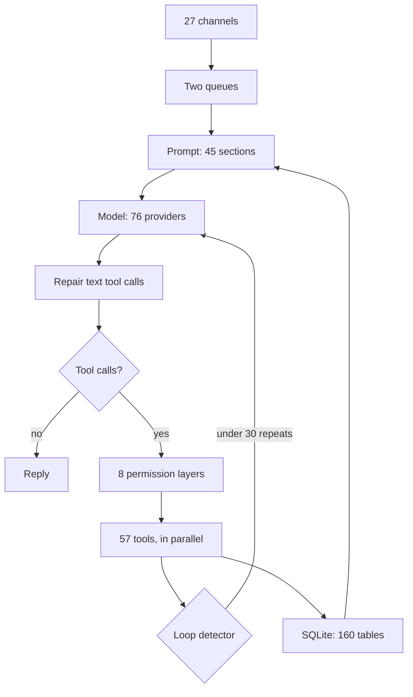
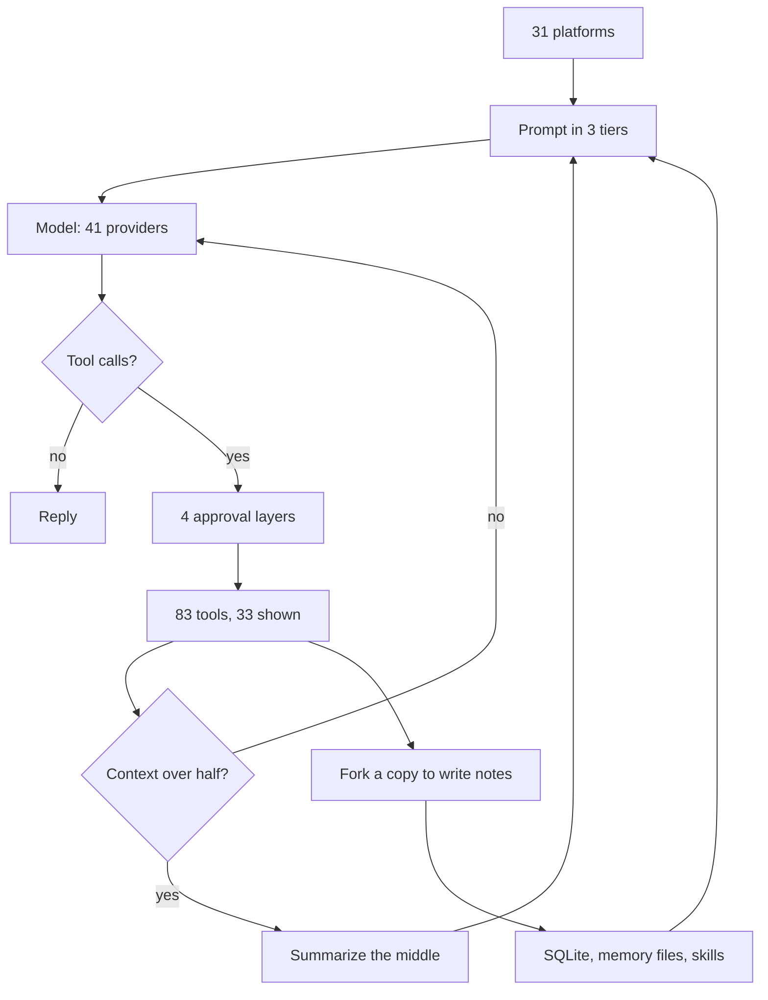
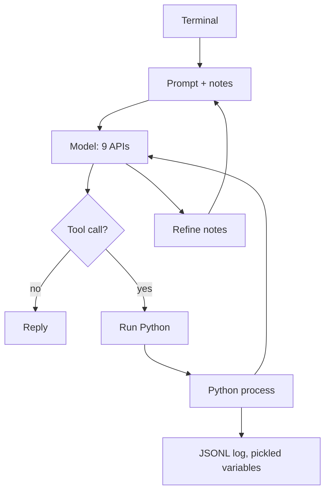
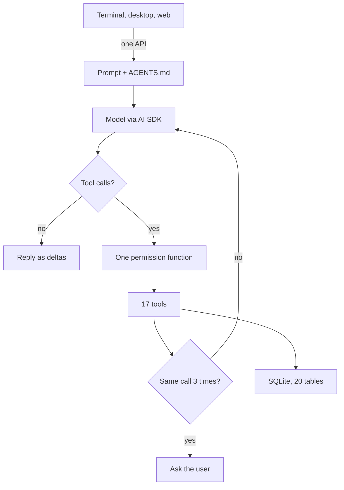
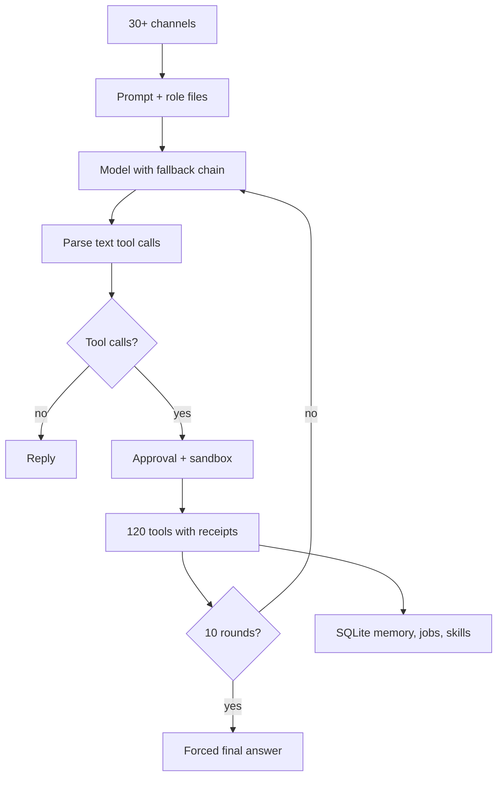
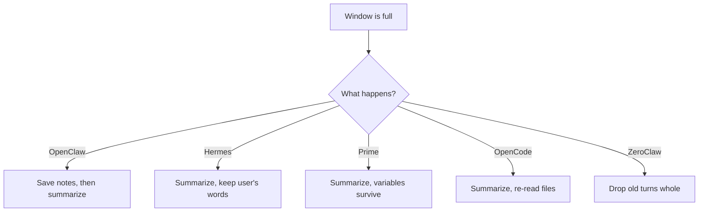
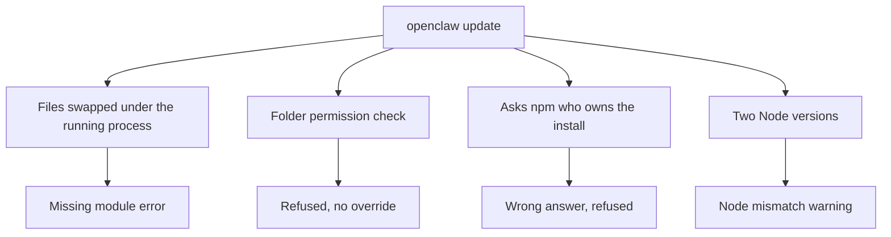

# HARNESS_V2.md

**Agent harnesses compared: OpenClaw 2.0, Hermes, Prime, OpenCode, Atomic, ZeroClaw, and what actually makes one work.**

This report was written on 2 September 2026. The method was the same as the August report. Research agents read the real source code of each project, measured a running Linux installation over SSH, and benchmarked candidate languages on a Mac. A second agent then re-checked every number against the studies and the repositories. Anything that could not be verified says so. The design that comes out of this comparison is in `COEUS_PLAN.md`.

---

# Part 0: The one-page version

## What a harness is

A language model is a function. Text goes in, text comes out, and the model has no memory and no hands. **The harness is the program wrapped around the model that gives it memory and hands.** The same models are available to everyone, so the harness is where the difference lies. This document is about the harnesses.

## The verdict

| Harness | Language | What it is | Verdict |
|---|---|---|---|
| **OpenClaw 2.0** | TypeScript | A daemon with 27 chat channels, 57 tools, and 160 database tables | A great loop, buried under install and update code that breaks on every release. **Not recommended.** |
| **Hermes** | Python | An always-on assistant with the best ideas about memory and reliability | Borrow its ideas. Its terminal interface is two processes joined by a pipe. **Not recommended.** |
| **Prime** | TypeScript and Python | An agent with one tool, which is a Python process the model types into | Good for data analysis. It has no safety gate at all. **Not recommended.** |
| **OpenCode** | TypeScript on Bun | A coding agent with the best interface in the field | Copy the interface design. It has no memory, no Signal, and no sandbox. |
| **Atomic** | TypeScript | A developer preview that supports Telegram only | Too early to judge. |
| **ZeroClaw** | Rust | Signal, scheduled jobs, a web interface, and local models in one binary, if you build it from source | The closest existing project to the goal, at 775,000 lines. Port five of its designs; do not fork it. |
| **Codex and Claude Code** | Rust, and a compiled binary | Coding agents from the model labs | Reference designs for sandboxing and permissions. |

## The five things that decide whether a harness works

1. **How big the wrapper is.** Every agent loop is small, between one and seven thousand lines. The code wrapped around it is fifty to seventy-five times bigger, and that wrapper is where things break.
2. **Whether there is a cap.** OpenClaw has no maximum number of turns. Its only brakes are a 48-hour timeout, a loop detector, and a retry budget, and none of those is a cap. That is what "it got stuck" means.
3. **Where the conversation goes when the window fills.** A harness can summarize the conversation and lose things, or it can keep its state in files that get re-read. The second approach works.
4. **Whether learning has a read path.** Writing notes that nobody reads back is logging, not learning.
5. **Whether the screen owns any state.** If the user interface holds state and talks to the core over a pipe, it glitches. If it is a dumb client of one core, it works.

## The one number

OpenClaw merged **10,574 commits in the last 30 days, and 63 percent of them came from one person at a rate of 223 a day.** Nobody reviews code at that pace. That is why it breaks when you update.

---

# Part 1: Seven harnesses, one diagram each

Every diagram has the same shape, so you can flip between them and see what changed. Input is at the top, then the prompt, then the model, then the tools, then what happens when the window fills, then storage at the bottom. **Where a box is missing, that is the point.**

## 1. OpenClaw 2.0

> **A daemon that does everything, surrounded by more install code than agent code.**

Messages arrive from 27 channels, scheduled jobs, a web interface, and native apps. They enter one of two queues: a message can steer the current turn or wait until it finishes. The prompt has about 45 sections, and it includes six role files that can total 60,000 characters. The model can be any of 76 providers and can be swapped in the middle of a run. A repair layer turns tool calls that weak models write as plain text into real tool calls. Eight permission layers are checked, and the turn is labeled if it read anything from the network. The 57 tools run in parallel. A loop detector warns after 10 identical calls, blocks after 20, and stops after 30, but there is no cap on turns otherwise. Everything is stored in SQLite across 160 tables, and memory is indexed with full-text search and vectors.

| | |
|---|---|
| Language and speed | TypeScript on Node. On the machine we measured, it idles at **504 MB**, plus 288 MB of Java for Signal, plus 195 MB of helper processes. Starting the gateway imports 41 percent of the 8,703 source files, which is about 1.9 million lines. |
| The good | The purest loop in the field, with hooks around it. A message that arrives mid-turn steers the next step. A repair layer for models that print tool calls as text. Scheduled jobs with backoff and automatic disabling. Pairing by default on Signal. A cache boundary in the prompt. A delivery queue that survives restarts. |
| The bad | 317,000 lines of operations code, meaning commands, infrastructure, service installation, and the updater, around a 67,000-line loop. No turn cap. Five separate liveness timers, none of which can kill a running tool. 10,175 configuration options. And the update failure in Part 4. |

## 2. Hermes

> **An assistant that assumes the conversation never ends, so it spends its effort on shrinking context and writing down what it learned.**

Messages arrive from a command line and 31 chat platforms. The prompt is built in three tiers: a stable tier, a project tier, and a volatile tier that holds a memory file capped at 2,200 characters and a user file capped at 1,375. The model can be any of 41 providers. Four approval layers check each tool call, and twelve patterns can never be approved by anyone. Of the 83 tools, about 33 are always shown and 18 sit behind a search tool. When the context passes half its size, old tool output is pruned, the middle is summarized, and the user's own messages are kept word for word. After ten tool calls with no notes written, a copy of the agent is forked that can only write memory and skills. Everything is stored in SQLite with full-text search, plus memory and skill files.

| | |
|---|---|
| Language and speed | Python, with 1.5 million hand-written lines, of which 1.06 million are Python. Idle memory was not measured, because the gateway was not running on the machine we checked; the dashboard alone used 88 MB. On disk it needs a 678 MB virtual environment plus a 204 MB bundled copy of Node just for the terminal interface. The main conversation function is 7,245 lines long. |
| The good | The best compaction rule in the field: the user's words survive word for word. A learning fork with a budget. A watchdog on a plain thread, added after a 30-hour deadlock. A delivery ledger that admits when a message may be a duplicate. One lease per session. A masked password prompt for sudo. |
| The bad | The terminal interface is a Node screen and a Python brain joined by a pipe that child processes can break, with a recovery hack that gives up after ten tries a minute, plus an optional third process to work around the Python interpreter lock. 120 interface bugs were opened in one month. Of 6,440 commits in 28 days, 57 percent were fixes. |

## 3. Prime

> **One tool. The model types Python into a process that outlives the chat.**

A terminal attaches to a daemon. The prompt is the base prompt, a project file, and notes the agent wrote for itself. The model can use one of nine real API implementations. There is exactly one tool, which runs Python in a persistent process. Variables, shell handles, and child agents all live in that process. After each turn, a refine step writes notes into a state file, with history and rollback, and the next prompt reads them. Transcripts are a JSONL tree, and the Python variables are pickled to disk.

| | |
|---|---|
| Language and speed | A TypeScript host plus one Python child per session, in 171,000 lines. A 33,000-line daemon exists just to keep sessions attachable. |
| The good | Work lives in variables, not in the chat. Notes with history and rollback that the next prompt actually reads. Scheduled jobs as a heartbeat. Budgets with a checker at the end. |
| The bad | **There is no permission gate anywhere.** Approving "run Python" means approving everything. There are three processes per session. It still ships Claude Code's OAuth client id so that it can log into your subscription. |

## 4. OpenCode

> **One process with an HTTP API inside it. Every screen is a client. It never makes you wait.**

The terminal, the desktop app, and the web app all talk to one API and one event stream, and the same interface can attach to a remote server. The prompt includes an `AGENTS.md` file that is re-read from disk on every step. The model is called through the Vercel AI SDK. One permission function decides ask, allow, or deny, and the last matching rule wins. Seventeen tools are defined, of which 13 or 14 are visible, each with a plain-text description and a 50 KB output cap. If the same call appears three times in one response, the user is asked. Storage is SQLite with 20 tables. There is no memory system at all.

| | |
|---|---|
| Language and speed | TypeScript on Bun, shipped as a 137 MB single binary. It starts in 0.26 seconds and **idles at 380 to 400 MB**. |
| The good | The five decisions that make the interface feel good: one core owns all state, every screen subscribes to one event stream, streaming arrives as small deltas, permissions are inline questions with the choices once, always, and reject, and one command table drives everything. Files are re-read every step so compaction cannot lose them. Malformed tool calls become fixable errors instead of crashes. |
| The bad | No memory, no scheduling, no Signal, no sandbox. By code reading, not by running it, the loop detector only sees three identical calls inside one model response, so one bad call per step slips past it. It is not light: 341,000 lines and 3,233 packages. |

## 5. Atomic Agent

> **A TypeScript developer preview that constrains local-model tool calls with a grammar.**

There is no diagram because it is the standard loop. It supports Telegram only, with no Signal and no web interface. Support for local models through Ollama and LM Studio landed between 7 and 31 August, and its own README says that small models emit malformed calls more often. Two memory-leak crashes in the terminal interface are still open. It is worth a look in a few months, not now.

## 6. ZeroClaw, and Moltis

> **A Rust binary that already does Signal, scheduled jobs, a web interface, and local models. It is not small.**

Messages arrive from more than 30 channels, including Signal through the signal-cli daemon. The prompt includes role files for the agent, the user, and memory, plus recalled memories. The model comes from a fallback chain set in one line of configuration. A parser recovers tool calls that models write as text, with two retries. Each call passes an approval gate and runs under a Landlock or Seatbelt sandbox. About 120 tools run in parallel, and every result carries a cryptographic receipt so the model cannot fake one. After ten rounds, the model is forced to give a final answer. Storage is SQLite with full-text memory, scheduled jobs with claim locks, and skills the agent can write itself.

| | |
|---|---|
| Language and speed | Rust, with 775,000 lines, of which 394,000 are outside tests, in 20 crates, including a 43,000-line configuration schema source file. The release is a 27 MB tarball, but the prebuilt binary **leaves out Signal and the sandbox**. Moltis is a similar project in Rust, with 407,000 lines, one maintainer, a nightly toolchain, and a 63 MB download. |
| The good | A ten-round cap with a bounded final answer. Receipts so the model cannot fake a tool result. A standalone parser for messy tool calls. A job store where two processes cannot run the same job. A skill creator that turns a successful run into a skill. An updater with rollback. Moltis has a browser with a persistent profile turned on by default. |
| The bad | 506 open issues, a memory subsystem being redesigned in three proposals, and no release in a month. Too big to fork. Five designs are worth porting. |

## 7. Codex CLI and Claude Code

These two settle questions that the others argue about.

**Codex** treats the kernel as the sandbox. File access goes only through "run a command" and "apply a patch." There are about twenty tool specifications in all, most of them for planning, images, asking the user, and multi-agent work. Commands run under Seatbelt on macOS or Landlock plus seccomp on Linux by default. Escalation is a field on the tool call with a written justification.

**Claude Code** enforces its permission rules in the harness, not in the model, and its documentation says so plainly. Tool schemas and skills are loaded on demand so the prompt stays small. Hooks can rewrite a tool's arguments before the tool runs.

---

# Part 2: The nine things that actually differ

## 1. Language, and what it costs

| | OpenClaw | Hermes | Prime | OpenCode | ZeroClaw |
|---|---|---|---|---|---|
| Language | TypeScript | Python | TypeScript and Python | TypeScript on Bun | Rust |
| Hand-written lines | 2,937,809 | 1,485,870 | 171,389 | 341,520 | about 394,000 |
| Idle memory | about 990 MB in total | not measured; the dashboard alone uses 88 MB | not measured | 380 to 400 MB | not verified |
| Commits in the last 30 days | 10,574 | 6,718 | 191 | 354 | 373 |
| Open issues | 3,683 | 12,965 | 78 | about 5,600, including pull requests | 506 |

**What works better:** small and slow-changing. OpenCode shipped ten small releases in three weeks and nothing broke. For a new daemon, Go starts in 8 milliseconds and idles at 19 MB with every library it needs, Rust saves 10 MB but costs extra fix rounds, and Bun is fine until you import Playwright, which adds 85 MB. The measurements are in Part 6.

## 2. How a turn ends

| | Turn cap | What stops a loop |
|---|---|---|
| OpenClaw | **None** | A 48-hour timeout, a detector that warns at 10 identical calls, blocks at 20, and stops at 30, and up to 160 outer retries |
| Hermes | None by default | A wall-clock budget. There is no identical-call detector, only a guard for repeated text |
| Prime | None | A token budget on a goal |
| OpenCode | Optional | Three identical calls in one response become a question to the user |
| ZeroClaw | **10 rounds** | Then a forced final answer. It nudges at 3 identical calls, blocks at 4, and stops at 5 |

**What works better:** a hard cap with a bounded final answer, as ZeroClaw does, plus an identical-call detector that counts across steps and never asks the user.

## 3. What happens when you message it mid-turn

| | Default behavior |
|---|---|
| OpenClaw | **Steer.** The message is injected at the next tool boundary, and tools that have not started are skipped |
| Hermes gateway | **Interrupt** |
| Prime | Steer while streaming, otherwise queue |
| OpenCode | Re-reads the message list on each step |

**What works better:** steering. Interrupting throws away work, and queuing makes you wait.

## 4. Where the conversation goes when the window fills

OpenClaw runs a silent "save your notes" turn, then summarizes and keeps the most recent 20,000 tokens. Hermes acts at 50 percent of the window: it prunes old tool output, summarizes the middle, and keeps the user's messages word for word. Prime summarizes but its Python variables survive untouched. OpenCode summarizes but re-reads its project file from disk on every step, so that file cannot be lost. ZeroClaw never summarizes; it drops whole old turns that do not fit.

**What works better:** anything that lives in a file survives, and anything that lives only in the chat is at risk. The Hermes rule that the user's own words are never summarized is the sharpest single idea here.

## 5. How it learns

| | What it writes | How it is read back | On by default |
|---|---|---|---|
| OpenClaw | Six role files, a memory index, a scheduled rewrite of the memory file, and recall injected before every prompt | Into the next prompt, and through a search tool | Yes, all four |
| Hermes | A memory file capped at 2,200 characters, a user file capped at 1,375, and skills, written by a review fork | Into the next prompt, and through a search tool | Yes |
| Prime | Notes with history and rollback | Appended to every prompt | Yes, gated by a review |
| OpenCode | Nothing | | |
| ZeroClaw | A memory database, and skills written from successful runs | Recalled into the prompt | Skills are off by default |

**What works better:** small capped files that the model curates, a background review with a budget, and a search tool over the past. OpenClaw's memory index rebuild caused two of its worst bugs in the week we looked, a 19 GB temporary-file leak and a reindex that pegged a CPU core, and its every-turn recall and scheduled rewrites are on by default on top of that index.

## 6. How tools are gated

| | Gate | Sandbox |
|---|---|---|
| OpenClaw | Eight intersected allowlists, plus a taint label that blocks nothing | Docker, off by default |
| Hermes | Four in-process layers; unattended runs fail closed | None in the process. Its own documentation says the operating system is the only real boundary |
| Prime | **None** | None |
| OpenCode | One rule list, last match wins, default ask | **None** |
| ZeroClaw | An approval gate | Landlock, Seatbelt, and bubblewrap, but not in the prebuilt binaries |
| Codex | An approval policy | **A kernel sandbox by default.** Escalation is a field on the call |

**What works better:** OpenCode's gate design combined with Codex's sandbox. Nobody ships both.

## 7. How the screen attaches

| | Design | Result |
|---|---|---|
| OpenCode | The interface is a client of an in-process API, and the same interface can attach remotely | Fast, with few glitches |
| OpenClaw | The interface talks to the gateway over one WebSocket | Fine, but the web app is 338,000 lines |
| Hermes | A Node screen and a Python brain over standard input and output, with an optional third process | 120 interface bugs in a month |
| Prime | The terminal attaches to a supervisor, which attaches to a worker, which attaches to Python | 33,000 lines of attach code |

**What works better:** the screen never owns state.

## 8. How it updates

| | Method | Rollback |
|---|---|---|
| OpenClaw | npm swaps thousands of files under a running process, and the updater inspects the host and refuses if it is unsure | Git checkouts only |
| Hermes | Git pull plus pip, with a pre-update backup and git rescue references | Binary-level rollback not verified |
| ZeroClaw | Download one binary, verify the checksum, back up the old one, swap, and run a smoke test | Yes |
| Moltis | The same, plus a signature check | Not verified |

**What works better:** one static file, versioned folders, a symlink flip, a health check, and automatic rollback. Nobody does all of it. Part 4 shows the cost of not doing it.

## 9. How they drive a browser

| | OpenClaw | Hermes | browser-use | Stagehand | agent-browser |
|---|---|---|---|---|---|
| Engine | Playwright over the DevTools protocol, attached to a real Chrome that it launches | Vercel's agent-browser command-line tool. It uses its own Chromium by default and a real Chrome only with a consent flag | The raw DevTools protocol, with its own Chrome or yours | The raw DevTools protocol | A Rust command-line tool over the raw DevTools protocol |
| What the model sees | An accessibility tree with reference tags and marks on new elements, with an 8,000-character efficient mode | The same tree through agent-browser, cut at 15,000 characters and stored | DOM text with an index number on each element, marks on new elements, hints about pages below, and an optional screenshot with boxes | Candidate actions with selectors from its observe step, and an optional screenshot | An accessibility tree with reference tags |
| Waits after an action | A 250 millisecond grace period after navigation | None of its own | A 0.25 second minimum, network idle for 0.5 seconds, and a pending-request check | Not verified | Scroll into view, and dialogs |
| Checks that it worked | No | No | **Yes.** The model must grade its last action on every step, the finish step must say whether it succeeded, and a judge model grades the run | It caches the action that worked, with no verification | No |
| Stale references | A friendly error | An error | Re-index each step | Re-observe | An error |
| Own profile | Yes, managed | It copies your login files into its own directory | A user data directory, kept alive between runs | Through application code | A profile flag |
| Human pacing | Optional typing at 75 milliseconds per key, with no mouse pacing | No, since filling a field is instant | A 50 to 80 millisecond press and 10 milliseconds per key | No | No |
| Captchas and two-factor prompts | Stop and ask | It warns and points at a cloud stealth service, offers a vision tool for captchas, and has no two-factor handling | Its cloud service | | |

**What works better:** the top scorers on live-site benchmarks, at 90 percent and above on Online-Mind2Web, share six things: a frontier model with thinking turned on, text for targeting plus a screenshot for checking, an explicit "did that work?" step, a different strategy on retry, a plan for long tasks, and cloud browsers with captcha solving. Coeus keeps the first five in the harness and gives up the sixth on purpose, because the goal is your accounts, on your machine, at human volume.

---

# Part 3: What makes some work better than others

1. **Small wrappers survive updates.** OpenCode's wrapper is 75 times the size of its loop, and it still ships boring releases, because the wrapper is a thin API rather than install machinery.
2. **Caps beat timeouts.** Ten rounds and a forced answer beat a 48-hour timeout every time.
3. **Files beat summaries.** State that lives on disk and is re-read each step cannot be lost to compaction.
4. **The user's words are sacred.** Summarize what the agent did. Never summarize what the user said.
5. **Learning needs a reader.** Capped files that the prompt includes, and a search tool that the model calls, are the only two things that count.
6. **Expect the model to be wrong.** Repair malformed tool calls, feed back the allowed alternatives, and never crash the loop. With small local models, this is the difference between working and not working.
7. **The screen is a client.** One core, one event stream, thin screens.
8. **One file to install.** Everything that touches Node versions, package managers, and hashed file chunks is a failure waiting to happen.

---

# Part 4: One failed update, in one diagram

This is what happened when a user ran `openclaw update` on a Linux desktop. Every line of the error output has a cause in the source code.

Four things went wrong at once. The updater swapped thousands of files under a process that was still running, so the old code asked for a file chunk that no longer existed. It checked the permissions of the systemd folder and refused because the folder was group-writable, which is the default on Ubuntu-family systems, and there is no flag to override the check. It asked npm which package manager owned the installation, using the user's shell path, and got an answer that did not match, so it refused again. And the service was running one version of Node while the user's shell ran another.

The four root causes are code swapped under a running process, host checks that a user-space tool cannot prove, new refusals shipped without an escape hatch (the update installed the rule that refused the next update), and 317,000 lines of operations code that changes every day. The fix is not better checks. It is one static binary with nothing to install.

---

# Part 5: The scoreboard

| | OpenClaw | Hermes | Prime | OpenCode | ZeroClaw |
|---|---|---|---|---|---|
| Loop lines versus wrapper lines | 6,944 versus 404,920 | One 7,245-line function | 2,326 versus 123,871 | About 1,000 versus 75,929 | About 30,000 across the turn module and a 17,898-line loop file |
| Tools | 57 | 83, with 18 hidden behind search | 1 | 17 defined, 13 or 14 visible | About 120 |
| Chat channels | 27 | 31 | 0 | 0 | More than 30 |
| Model providers | 76 | 41 | 9 real implementations | 32 | About 20 |
| Database tables | 160 | Not measured | 0 | 20 | Not counted |
| Configuration options | 10,175 | About 406 | Unknown | About 90 | A 43,000-line schema |
| Turn cap | None | None | None | Optional | 10 |
| Sandbox on by default | No | No | No | None exists | Not in the prebuilt binary |
| Signal | Yes | Yes | No | No | Yes, from a source build |
| Learns by itself | Yes | Yes | Yes | No | Optional |
| Installed size | 898 MB in 35,979 files | 1.4 GB | | 430 MB | |

---

# Part 6: Local models and languages

## Local models

| Model | Tool-use score on the τ²-bench airline test, 2 September |
|---|---|
| Qwen3.5 9B | **67.5** |
| Qwen3 32B | 42.0 |
| Llama 3.1 8B | 30.9 |
| Qwen2.5 7B | 16.7 |

One model generation beats three times the parameter count. For a local machine with a GPU, Qwen3.5 at 9B or 4B is the best choice, Gemma 4 at 12B is the backup, and Gemma 3 should never be used for tool calling because it has no native tool format. A Raspberry Pi cannot host a model, because it reads prompts at about 9 tokens a second.

When a model cannot call tools natively, the fixes go in this order: fix the chat template, then try JSON-schema mode, then a prompted text protocol with JSON bodies, then repair loops that feed back the allowed options, which gave a 44-point gain in the published study. Grammar-forced output comes last, because it makes calls valid and wrong at the same time: on one task it dropped accuracy from 91 percent to 48 percent.

## Languages, measured

| | Rust | Go | Bun |
|---|---|---|---|
| Time to start the daemon | 2.9 ms | 8.2 ms | 11 ms |
| Idle memory with real dependencies | 9.7 MB | 19 MB | 22 MB, or **107 MB if Playwright is imported** |
| Static Linux binary | 6 MB | 23 MB | 103 MB |
| Clean build | 25 s | 10 s | 0.3 s |
| Rebuild on a Raspberry Pi 5 | 5 to 12 minutes | 1 to 2 minutes | None needed |
| Friction we hit | An old compiler and crate API drift | None | None |

Go is the right choice for the daemon. The browser needs a separate spawned worker in any language, because Playwright must not be loaded inside the daemon.

---

# Appendix: Method, sources, and corrections

**Method.** Eighteen research agents ran in three waves and used roughly four million tokens by their own usage reports. They read the source directly at the current commit on 2 September for OpenClaw, Hermes, Prime, OpenCode, and ZeroClaw, and cloned Moltis, Codex, Atomic Agent, and browser-use read-only. A running Linux installation was measured over SSH without changing anything. The language benchmarks were built and timed on a Mac. Line counts used tokei and wc. The papers cited are arXiv 2605.26128, 2607.14167, 2608.06370, and 2608.23552. The tool-use benchmark is τ²-bench as run on OpenRouter. Seventeen detailed study files with line-level citations back every claim here, and a separate fact-check pass re-verified about 415 claims in this document against those studies and against the repositories.

**Corrections.** Three things I believed at the start turned out to be wrong. OpenCode's interface is not written in Go with Bubble Tea; that code was deleted in November 2025, and the interface is now TypeScript on OpenTUI. OpenClaw's pure loop is 6,944 lines, not 1,600. And OpenCode's loop detector is not what makes it work with small models. One recommendation I made and then withdrew was to cut the browser from the first version; it is now the centerpiece of `COEUS_PLAN.md`. The fact-check pass found and fixed 44 further slips in an earlier draft, most of them overstated wording. The worst were Hermes' tool deferral stated backwards, a disk figure labeled as memory, and Codex described as having two tools.

**Not verified.** The internals of Claude Code and Codex, because one is compiled and the other was read only from its tool specifications. OpenClaw's startup time, because it was not built here. Hermes' idle memory, because its gateway was not running. The binary size claims made by ZeroClaw and Moltis. The Raspberry Pi build times, which are estimates. And the OpenCode loop-detector gap, which comes from reading the code rather than running it.
