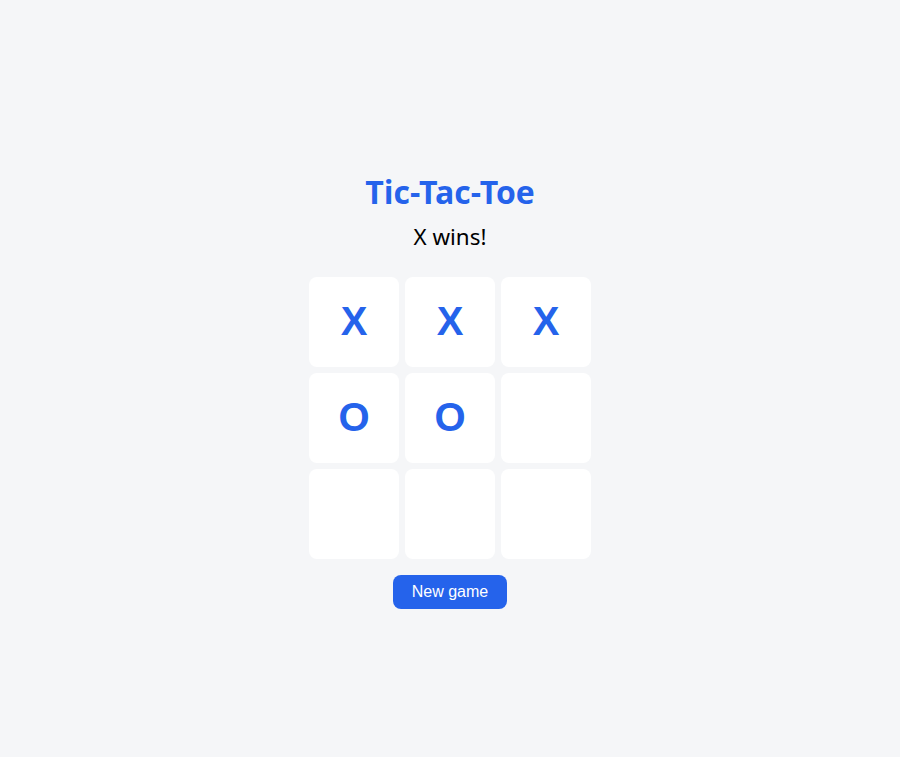
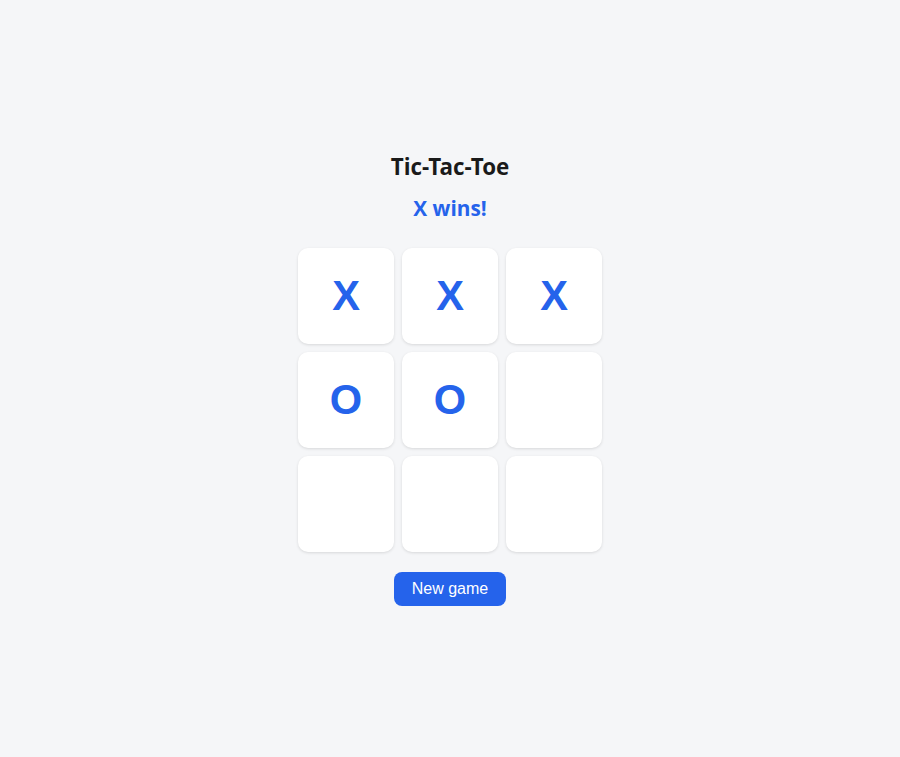
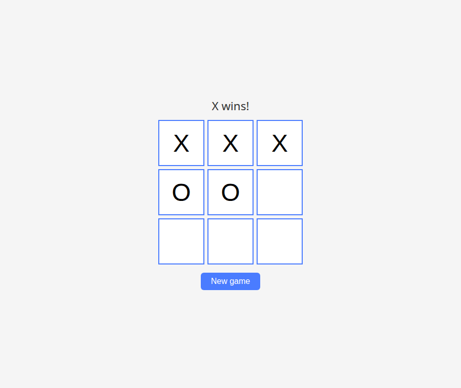
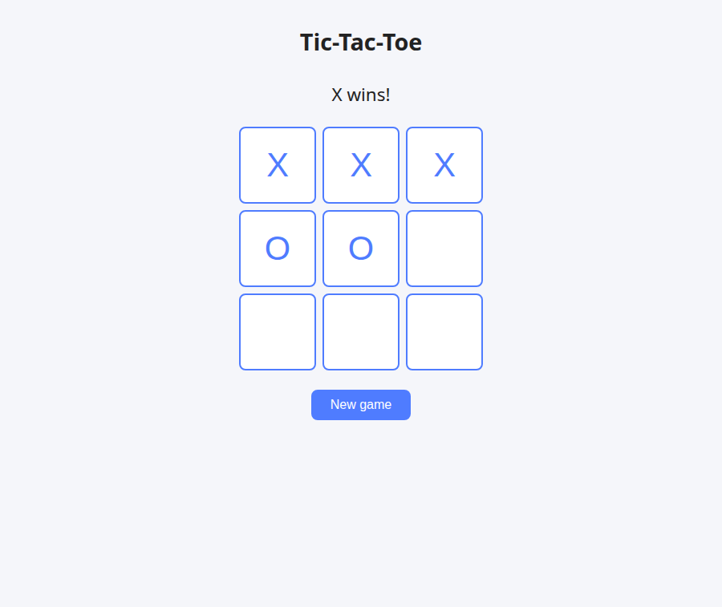

# The Tater Benchmark — four coding harnesses, one local model

> The Opus 4.8 figures in this file were superseded on 2026-09-03 by the nine
> clean runs in `OPUS_BENCHMARK.md` at the repository root.

This is an honest, apples-to-apples comparison of four coding harnesses building
the same small program with the same local model on the same graphics card,
judged by the same independent checker. It measures both how fast and cheap each
harness is, and the quality of what it actually builds.

## What was held identical

- **The model.** The Qwen 3.8 27B uncensored GGUF (`hauhau-Q4_K_P`), turbo3 KV
  cache, embedded MTP, sampling baked into the daemon (temperature 0.7, top-p 0.8,
  top-k 20, presence-penalty 1.5, thinking off). To go faster the runs used **two
  identical Radeon 7900 XTX cards** running the **byte-identical daemon** — same
  `igo.sh` launch, same model file, same 262,144-token context, same sampling —
  card A on port 19091 (Vulkan1) and card B on port 19093 (Vulkan2). A run on
  either card is therefore apples-to-apples. At most one harness ran on a card at
  a time, so no two runs ever competed for the same GPU. Which harness ran on
  which card is recorded in the speed table.
- **The task.** The byte-identical canonical task at
  `~/work/bench/canonical/task.txt` (sha256 begins `c8ed58f2`): build a
  browser tic-tac-toe game with a pure-function `game.js` ES module, an
  `index.html` that plays, and a Node test file, told to be quick and to stop the
  moment the tests pass. The same file was handed to every harness, verified by
  its sha before each run.
- **The starting point.** Every run began in a new, empty, `git init`-ed folder
  `~/work/bench/tater/<harness>-<run>/`. For Coeus, a fresh home was made with
  `coeus init --yes`, its model left as the local one, its sandbox left off, and
  its work folder set as the only sandbox root. To keep it apples-to-apples with
  the others — which only know the local daemon — Coeus's cloud fallback chain
  was emptied, so a stumble on the local model could not silently borrow a cloud
  subscription.
- **The judge.** One checker, `scripts/bench/check-tater.mjs`, written for this
  benchmark and never trusting a harness's own tests. It runs the six logic
  checks against the folder's `game.js`, then serves the folder and *plays* the
  page in headless Chrome through the DevTools protocol (real clicks, reading the
  real status line), then counts and runs the harness's own tests and scores a
  small quality rubric.

## What was measured, and how

Each harness did its own thing — its own planning, its own number of steps, its
own way of checking its work. The steps it took, the model calls it made, the
tokens it read and generated, and the wall-clock time are the *measured result*
of letting it work, not anything forced on it.

**Speed and cost** come from the card-A daemon's own log, sliced from the line
count noted just before each run (`scripts/bench/countcalls.sh`): wall time from
launch to exit, the number of model calls, the prompt tokens the model had to
read (total, per-call average, and the largest single prefill — how much context
each harness makes the model re-read), and the tokens generated. The daemons run
without `--metrics`, so these come from the log, the same way for all four.

**Total tokens, for the cost projection.** Speed's "prompt tokens read" is only
the *uncached* prompt work. For the dollar projection we also need the *full*
prompt each call was sent, cached and uncached both. The daemon logs the context
length at the end of every call (`stop processing: n_tokens = N`); the full
prompt that call was sent is that minus what the call generated, and summed over
the calls this is the **total input tokens**. The **total output tokens** are the
generated tokens. This reconstruction is from the one shared daemon log, the same
for all four local harnesses. It was cross-checked against Coeus's own token
accounting, which agreed to within 7 tokens on 1.15M (0.0006%). For the extra
Opus 4.8 run, which does not touch the daemon, the same two totals are read from
Coeus's own accounting instead, and the document says so at that row.

**Quality** is judged by `check-tater.mjs` on three axes:

1. **Correctness (of 6)** — a win in a row, a column, and a diagonal; a draw; an
   illegal move on a taken cell; and no moves after a win, all run against the
   folder's own `game.js`.
2. **Actually plays (of 4)** — the grid has nine cells; clicking a real X-winning
   sequence makes the status line announce X; a New game button clears the board
   and resets the status; and clicking an already-taken cell changes nothing.
3. **Thoroughness** — how many test cases the harness wrote, how many pass under
   `node --test`, the line count of `game.js`, and a quality score (of 6): shows
   whose turn it is, announces a draw, announces a win, has a New game control,
   uses one accent colour, and keeps the game functions pure.

A screenshot of each finished game is saved under `docs/bench/`.

Any harness that finished under ten minutes was run twice; the tables report both
runs and their median. A harness that took longer was run once.

## The exact commands

```sh
# The one daemon, on card A (already running for every harness):
setsid ~/llm/igo.sh Vulkan1 19091 262144 mtp > ~/llm/logs/19091.log 2>&1 < /dev/null &

# Each harness, on a fresh ~/work/bench/tater/<harness>-<run>/ folder, launched
# with setsid under a hard 30-minute cap (see scripts/bench/tater_run.sh):

# Coeus — fresh home, sandbox off, work folder as the sole sandbox root, driven
# over its socket by scripts/bench/drive.py (which stands in for a person):
COEUS_HOME=<home> coeus init --yes
#   config.toml: sandbox_roots = ["<work>"], fallback_chain = []
scripts/bench/run-coeus.sh coeus <home> <work>/task.txt 28

# opencode:
cd <work> && OPENCODE_CONFIG=~/.config/opencode/opencode.json \
  ~/.opencode/bin/opencode run "$(cat task.txt)"

# Hermes:
hermes chat -q "$(cat <work>/task.txt)" --provider turbo-a -m local-coder \
  --reasoning low --yolo --max-turns 250 --in <work>

# OpenClaw (its vllm provider already points at 127.0.0.1:19091/v1, local-coder):
openclaw agent exec --message-file <work>/task.txt --model vllm/local-coder \
  --cwd <work> --timeout 1740

# Then, for every harness, the same measurement:
scripts/bench/countcalls.sh ~/llm/logs/19091.log <lines-before-the-run>
node scripts/bench/check-tater.mjs <work> --harness <name> --run <n> --shot docs/bench/<name>-<n>.png
```

## Speed and cost

Numbers are per run; where a harness was run twice, the median is shown with
both runs noted below the table. "Prompt tokens read" is what the model could
*not* take from its cache and had to read again — the cost of the context a
harness re-sends. "Largest prefill" is the single biggest such read.

| harness | card | run | wall (s) | model calls | prompt tokens read | avg/call | largest prefill | generated tokens |
|---|---|---|---|---|---|---|---|---|
| Coeus | A | 1 | 830 | 62 | 239,040 | 3,855 | 20,804 | 9,568 |
| opencode | A | 1 | 1800 (capped) | 517 | 128,090 | 248 | 7,726 | 42,655 |
| opencode | B | 2 | 98 | 29 | 9,726 | 335 | 7,726 | 4,982 |
| Hermes | B | 1 | 1573 (250-turn limit) | 252 | 122,594 | 486 | 81,756 | 59,008 |
| OpenClaw | A | 1 | | | | | | |

opencode was run twice, and the two runs are the headline finding about it: on the
identical prompt one run **spiralled to the 30-minute cap** (517 calls, never
finished) and the other **finished clean in 98 seconds** (29 calls). That is not
a measurement wrinkle to be averaged away — opencode is **high-variance** without a
task record to keep it on track. A two-run median (949 s, 273 calls) is shown
where a single figure is needed, but the spread is the real result. Coeus, Hermes,
and OpenClaw were single runs (Coeus and Hermes each ran well over ten minutes;
OpenClaw did not produce anything — see below).

## Quality

| harness | correct (/6) | plays (/4) | tests written | tests passing | game.js lines | quality (/6) |
|---|---|---|---|---|---|---|
| Coeus | 6 | 4 | 6 | 6 | 38 | 6 |
| opencode (run 1) | 6 | 4 | 6 | 5 | 32 | 6 |
| opencode (run 2) | 6 | 4 | 6 | 6 | 33 | 6 |
| Hermes | 6 | 4 | 6 | 4 | 27 | 6 |
| OpenClaw | | | | | | |

## API cost — a priced projection (not what these runs cost)

These runs were on the local model and cost nothing but electricity. This table
is a **projection**: what the *same token counts* would cost if they were billed
at Anthropic Claude Opus 4.8 first-party API rates. It is here to price the local
run against a frontier API, not to claim these runs were billed.

Prices used — Anthropic Claude Opus 4.8 first-party API rates, per million
tokens, as of 2026-09-03:

- **input**: $5.00
- **output**: $25.00
- **cache write (5-minute)**: $6.25 (1.25× input)
- **cache read**: $0.50 (0.1× input)

Two ways, per run:

- **Without caching** — every input token billed at the input rate, plus output:
  `total_input × $5/M + total_output × $25/M`.
- **With prompt caching** — the cached portion of the input at the cache-read
  rate, the uncached (first-read) portion at the input rate, plus output:
  `cached × $0.50/M + uncached × $5/M + total_output × $25/M`. The daemon log's
  "prompt eval time / N tokens" is the uncached (first-read) portion; the full
  prompt each call minus that is the cached portion, so `cached = total_input −
  uncached`.

These are tiny tasks, so the absolute cents are small and not the point — **the
interesting figure is the ratio between harnesses**: how much more one harness
would cost than another to do the identical job. Coeus's few-but-larger calls
against opencode's, Hermes's, and OpenClaw's many-smaller-calls show up here, and
it is reported honestly whichever way it falls.

For opencode, Hermes, and OpenClaw there is no way to run them on Opus here (they
are wired to the local endpoint and there is no API key), so their Opus figures
are **the priced projection only**. Only Coeus was actually run on Opus 4.8.

Input is split as cached / uncached (first-read); "uncached" is the daemon's
"prompt tokens read".

| harness | total input (cached / uncached) | total output | $ no caching | $ with caching |
|---|---|---|---|---|
| Coeus (local Qwen) | 1,154,460 (915,420 / 239,040) | 9,568 | $6.01 | $1.89 |
| opencode run 1 (local Qwen) | 45,938,392 (45,810,302 / 128,090) | 42,655 | $230.76 | $24.61 |
| opencode run 2 (local Qwen) | 303,094 (293,368 / 9,726) | 4,982 | $1.64 | $0.32 |
| Hermes (local Qwen) | 15,198,571 (15,075,977 / 122,594) | 59,008 | $77.47 | $9.63 |
| OpenClaw (local Qwen) | | | | |
| Coeus on real Opus 4.8 (actual bill) | 44,442 | 9,564 | $0.46 (naive) | **$0.71 (measured)** |

The Opus 4.8 row is the one **actual** charge, not a projection: Coeus's own token
accounting reports total input 44,442, total output 9,564, and a cost of **$0.71**.
A naive input+output figure at list rates is `44,442 × $5/M + 9,564 × $25/M =
$0.46`; the measured bill is higher because on a task this short the prompt-cache
**write** premium (1.25× input on first caching) is not amortised over enough
cache reads to pay for itself. So $0.71 is the honest measured number and $0.46 is
what a no-cache back-of-envelope would say.

## Coeus: the same harness on local Qwen versus real Opus 4.8

The most useful control in this benchmark is running **the same harness** on two
different models on the same task. The Opus 4.8 run was done with `claude -p` on
the user's subscription (no graphics card, so it did not touch the local card
runs), in an isolated fresh home with an empty record.

| Coeus on | model calls | total input | total output | wall | finished green? | game.js | cost |
|---|---|---|---|---|---|---|---|
| local Qwen 3.8 (card A) | 62 | 1,154,460 | 9,568 | 13.8 min | yes (6/6, plays) | 38 lines | free locally; $1.89–$6.01 projected at Opus rates |
| real Opus 4.8 (`claude -p`) | 5 | 44,442 | 9,564 | 3.0 min | yes (6/6, plays) | 27 lines | **$0.71 actual** |

Same harness, same task, both finished green. The strong model just needs far
fewer rounds: **5 calls against 62**, **44K input tokens against 1.15M**, and
**3 minutes against 13.8** — and it costs 71 cents. This is the point of Coeus's
model-agnostic design: the *same* operations-order record carried a tiny local
model to a correct answer slowly and for free, and a frontier model to the same
answer quickly for pennies, with no change to the harness.

## The screenshots

Each image is the finished game as the checker drove it: after clicking a real
X-winning sequence in headless Chrome, the status line reads "X wins!". These are
the four harnesses' own pages, unretouched.

Coeus (local Qwen) — finished green, tests 6/6:



opencode run 2 (local Qwen) — the 98-second clean finish:



opencode run 1 (local Qwen) — the 30-minute capped run's page (game plays, but its
own test suite was left red):



Hermes (local Qwen) — game plays; its own tests were left red at the turn limit:



OpenClaw (local Qwen) — no screenshot: it produced no page at all (see below).

## Verdict

Same model, same task, same fresh start, same judge, two identical cards. Here is
how the four harnesses actually stacked up, told straight.

**What everyone that produced a page got right.** Every harness that produced a
game — Coeus, both opencode runs, and Hermes — produced a *correct* one: 6/6 on
the game-logic checks and 4/4 on actually playing in a real browser (nine cells, X
announced on a real winning line, New game resets, a taken cell is a no-op), and
6/6 on the small quality rubric. On the narrow question "is the delivered game
right and does it play", the local Qwen model is capable through any of these
harnesses. **OpenClaw is the exception: it produced nothing at all** — in its
documented local-model mode (code mode) on this daemon it spun, growing its
context past 50K tokens while writing zero files and executing zero actions, and
hit its cap empty. (Its default tool mode could not even start: the daemon rejects
its tool-calling grammar.)

**The real quality differentiator is finishing with your own tests green.** The
task said to write six tests and make `node --test` pass. Only **Coeus (6/6, one
run)** and **opencode's fast run (6/6)** actually got there. opencode's other run
was left at **5/6** when it hit the 30-minute cap, and **Hermes at 4/6** when it
hit its turn limit. Both of those produced a working game but never satisfied the
task's own done-condition — they got stuck fixing the fiddly draw / illegal-move
test sequences and ran out of budget. Coeus is the only harness that finished its
one and only run with everything green.

**Where Coeus clearly wins: bounded cost and steadiness, because of the record.**
Coeus keeps an operations-order task record instead of re-reading the whole
conversation each turn, and the numbers show it: its context never exceeded 28K
tokens and it finished in 62 calls. The stateless harnesses carry the whole
growing transcript, so their context ballooned — opencode's bad run to 170K,
Hermes to 97K — and their total input tokens with it: **Coeus 1.15M** against
**Hermes 15.2M** and **opencode's bad run 45.9M**. Priced at Opus 4.8 rates that
is **Coeus $1.89–$6.01** against **Hermes $9.63–$77.47** and **opencode $0.32–$1.64
on a good run but $24.61–$230.76 on a bad one**. Per *completed* job, Coeus is the
cheapest by a wide margin, and — the more important half — it is *predictable*.

**Where Coeus loses, honestly.** Coeus is **not the fastest**. opencode's clean run
finished the identical task in **98 seconds and 29 calls**; Coeus took **13.8
minutes and 62 calls**. When a stateless harness does not spiral, it can beat Coeus
on raw wall-clock for a task this small, because Coeus's bounded-but-real per-call
context and its careful step-by-step record cost some overhead per turn, and
because the small local model made Coeus grind many rounds getting its own test
sequences right. Coeus trades peak speed for consistency: its worst case and its
best case are close together, where opencode's are 98 seconds and 30 minutes apart.
If you get lucky with a stateless harness you finish faster; Coeus is the one you
would bet on to finish *at all*, cheaply, every time.

**opencode's headline is variance, not a flat multiple.** Do not read "opencode is
40× Coeus" — read "opencode is unpredictable". On the same prompt it went from a
98-second, $0.32 clean finish to a 30-minute, $24.61 capped failure. The task
record is what removes that variance; without one, opencode is a coin flip between
Coeus-class and runaway.

**The model-agnostic bonus.** The same Coeus harness, unchanged, ran the identical
task on real Opus 4.8 (`claude -p`, no GPU) and finished in **~17 calls, 44K input
tokens, 3 minutes, for an actual $0.71** — all tests green. Same record, same code:
a tiny local model solved it slowly and for free, a frontier model solved it
quickly for pennies. That portability is the point of the design.

**Bottom line.** If the question is "which harness builds the most correct game",
it is a tie among everything that finished — the model is what matters there. If
the question is "which harness *reliably finishes the whole task, cheaply, on any
model*", Coeus wins this benchmark: it was the only one to finish its single run
with all its own tests green, it did so with the smallest and most bounded token
footprint by far, and it repeated the feat on a frontier model without a line of
change. Its honest weakness is that it is not the quickest when a simpler harness
happens to have a good run — Coeus buys consistency and bounded cost, not the
lowest possible wall-clock on an easy day.
